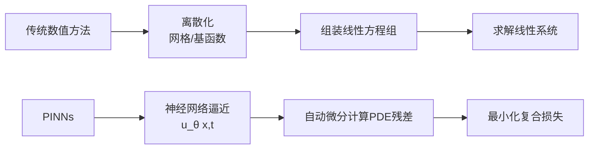
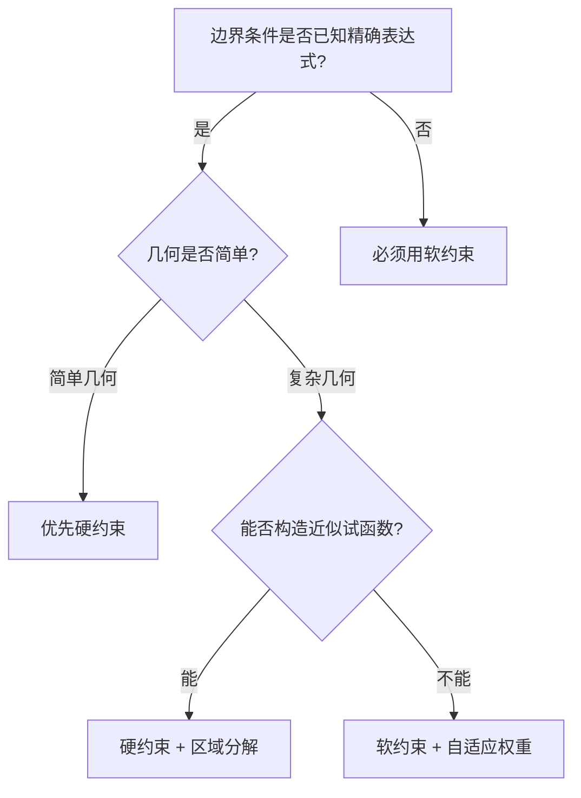

@[toc]

# 用PINNs求解一维Burgers方程：从方程离散化到损失函数设计

> 做流体力学的研究者想在网上找到“如何把Navier-Stokes方程嵌入PINNs损失函数”的教程，结果往往是零。这篇文章尝试填补这个缺口——以经典的一维Burgers方程为例，把自动微分的链式法则推导、边界/初始条件的硬约束与软约束对比、训练过程中的梯度病态问题全部拆开来讲。每个环节都配有可直接运行的PyTorch代码。

---

## 一、为什么从Burgers方程开始？

Burgers方程是一维非线性偏微分方程中的“Hello World”：

$$u_t + u \cdot u_x = \nu \cdot u_{xx}, \quad x \in [-1, 1], \quad t \in [0, 1]$$

它同时包含**非线性对流项**（$u \cdot u_x$）和**扩散项**（$\nu \cdot u_{xx}$），当粘性系数 $\nu$ 较小时，解会在 $x=0$ 附近形成陡峭的激波结构。这个特征让它成为检验PINNs能否处理**陡梯度问题**的标准测试用例。

选择Burgers方程而非热传导方程作为第一个实战案例，原因是它同时包含了PINNs工程落地中的三个核心难点：

| 难点 | Burgers方程的体现 | 工程影响 |
| :--- | :--- | :--- |
| **非线性自动微分** | $u \cdot u_x$ 需要计算一阶导后做乘法 | 计算图中断或梯度计算错误的高发区 |
| **陡梯度区** | 激波附近梯度极大，网络难以拟合 | 训练不收敛或收敛到平凡解 |
| **多目标冲突** | PDE残差、初始条件、边界条件梯度方向冲突 | 优化器在多个目标间“左右为难” |

如果你能把这篇文章的代码跑通并理解每一行，迁移到Navier-Stokes方程或反应扩散方程时，核心改动只是**损失函数中残差项的表达形式**，其余工程框架完全复用。

---

## 二、PINNs的核心思想：把物理方程变成损失函数

### 2.1 从“离散求解”到“连续逼近”

传统数值方法（有限差分、有限元）的思路是：把连续域离散成网格，在每个网格点上近似求解PDE。PINNs的思路完全不同——它用一个神经网络 $u_\theta(x, t)$ 直接逼近连续解，物理方程不是被“离散求解”的，而是被“嵌入损失函数”的。



两种路线的核心差异在于：传统方法把“物理”编码在**离散格式**中（如差分算子），PINNs把“物理”编码在**损失函数**中。

### 2.2 PINNs的复合损失函数

PINNs的损失函数由三部分组成：

$$\mathcal{L}_{total} = \lambda_{PDE} \cdot \mathcal{L}_{PDE} + \lambda_{IC} \cdot \mathcal{L}_{IC} + \lambda_{BC} \cdot \mathcal{L}_{BC}$$

其中：

- $\mathcal{L}_{PDE}$：在域内**配点**（collocation points）上计算PDE残差的均方值
- $\mathcal{L}_{IC}$：在初始时刻 $t=0$ 上计算预测值与初始条件的偏差
- $\mathcal{L}_{BC}$：在边界 $x=\pm 1$ 上计算预测值与边界条件的偏差

**核心问题**：$\lambda_{PDE}$、$\lambda_{IC}$、$\lambda_{BC}$ 三个权重怎么设？这是PINNs工程落地中最棘手的问题，也是本文第三节要重点讨论的内容。

---

## 三、手撕自动微分：PDE残差是怎么算出来的

### 3.1 网络结构定义

先定义一个标准MLP网络。输入是 $(x, t)$ 两个标量，输出是 $u(x, t)$ 一个标量[reference:0]：

```python
import torch
import torch.nn as nn
import numpy as np

class PINN(nn.Module):
    """用于求解Burgers方程的物理信息神经网络"""
    def __init__(self, layers=[2, 64, 64, 64, 1]):
        super().__init__()
        # 构建全连接层
        self.layers = nn.ModuleList()
        for i in range(len(layers) - 1):
            self.layers.append(nn.Linear(layers[i], layers[i+1]))
        # 自适应Tanh激活函数：可学习的斜率参数
        # 比固定斜率收敛更快
        self.alpha = nn.Parameter(torch.ones(1) * 1.0)

    def forward(self, x, t):
        """输入: x, t 都是 (N, 1) 的张量; 输出: u (N, 1)"""
        inputs = torch.cat([x, t], dim=1)  # (N, 2)
        for i, layer in enumerate(self.layers[:-1]):
            inputs = layer(inputs)
            inputs = torch.tanh(self.alpha * inputs)  # 自适应激活
        # 最后一层不加激活
        u = self.layers[-1](inputs)
        return u
```

**关键设计决策**：

- **为什么用Tanh而非ReLU？** PDE残差需要计算二阶导数。ReLU的二阶导数为零，会导致 $\mathcal{L}_{PDE}$ 中的 $u_{xx}$ 项恒为零，网络无法学习扩散效应。Tanh处处光滑可导，是PINNs的标配激活函数。
- **为什么加自适应斜率 $\alpha$？** 固定斜率的Tanh在陡梯度区域梯度饱和严重，自适应斜率让网络在训练中自行调整激活函数的“灵敏度”[reference:1]。

### 3.2 自动微分计算PDE残差

这是整篇文章最核心的代码段。给定一批配点 $(x, t)$，我们需要计算：

$$f = u_t + u \cdot u_x - \nu \cdot u_{xx}$$

然后用 $f^2$ 的均值作为 $\mathcal{L}_{PDE}$。

```python
def compute_pde_residual(model, x, t, nu=0.01):
    """
    计算Burgers方程残差: f = u_t + u*u_x - nu*u_xx
    x: (N, 1), t: (N, 1)
    """
    x.requires_grad_(True)
    t.requires_grad_(True)

    u = model(x, t)  # (N, 1)

    # 一阶导数: u_t 和 u_x
    u_t = torch.autograd.grad(
        u, t,
        grad_outputs=torch.ones_like(u),
        create_graph=True  # 关键: 保留计算图用于二阶导
    )[0]  # (N, 1)

    u_x = torch.autograd.grad(
        u, x,
        grad_outputs=torch.ones_like(u),
        create_graph=True
    )[0]  # (N, 1)

    # 二阶导数: u_xx (对u_x再求一次x的导)
    u_xx = torch.autograd.grad(
        u_x, x,
        grad_outputs=torch.ones_like(u_x),
        create_graph=True
    )[0]  # (N, 1)

    # PDE残差
    f = u_t + u * u_x - nu * u_xx
    return f
```

**代码中的三个关键点**：

**关键点一：`create_graph=True`**。这个参数告诉PyTorch在计算一阶导时保留计算图，否则后面无法对 $u_x$ 再求一次导得到 $u_{xx}$。这是PINNs实现中最容易犯的错误——忘记设置这个参数会导致 `RuntimeError: element 0 of tensors does not require grad`。

**关键点二：`grad_outputs=torch.ones_like(u)`**。当被求导的函数是向量时，需要提供一个“种子梯度”。这里因为每个输出都对同一个标量求导，种子全设为1即可。

**关键点三：链式法则的数值行为**。$u_{xx}$ 的计算实际上是在计算 $\frac{\partial}{\partial x}\left(\frac{\partial u}{\partial x}\right)$。当网络用Tanh激活时，$\frac{\partial u}{\partial x}$ 中包含 $\text{sech}^2$ 项，再求一次导会引入 $\text{sech}^2 \cdot \tanh$ 项。**当 $|x|$ 较大时，$\text{sech}^2$ 迅速趋近于零**，导致 $u_{xx}$ 的梯度信号消失——这就是PINNs梯度病态问题的数学根源。

### 3.3 完整的损失函数

```python
def compute_loss(model, x_col, t_col, x_ic, t_ic, u_ic, x_bc, t_bc, nu=0.01):
    """
    x_col, t_col: 配点（域内采样）
    x_ic, t_ic, u_ic: 初始条件点
    x_bc, t_bc: 边界点（x=-1 和 x=1）
    """
    # 1. PDE残差损失
    f = compute_pde_residual(model, x_col, t_col, nu)
    loss_pde = torch.mean(f ** 2)

    # 2. 初始条件损失: u(x, 0) = -sin(pi*x)
    u_ic_pred = model(x_ic, t_ic)
    loss_ic = torch.mean((u_ic_pred - u_ic) ** 2)

    # 3. 边界条件损失: u(-1, t) = 0, u(1, t) = 0
    u_bc_pred = model(x_bc, t_bc)
    loss_bc = torch.mean(u_bc_pred ** 2)

    # 4. 复合损失（权重可调）
    loss = loss_pde + 10.0 * loss_ic + 10.0 * loss_bc
    return loss, loss_pde, loss_ic, loss_bc
```

**为什么IC和BC的权重设得比PDE大？** 因为初始条件和边界条件是“硬信息”——$u(x, 0) = -\sin(\pi x)$ 是精确已知的，而PDE残差是“软约束”。如果IC/BC权重太小，网络会优先拟合PDE但在边界处产生偏差。但具体权重怎么设，下面第四节的软硬约束对比会给出更系统的答案。


## 四、边界条件的硬约束 vs 软约束

### 4.1 软约束：把边界条件写进损失函数

上面的代码就是软约束方案——边界条件以惩罚项的形式加入损失函数。优点是实现简单、对任意几何形状都适用；缺点是**不保证精确满足**，边界处的误差取决于权重 $\lambda_{BC}$ 的设定。

软约束的核心问题是一个**多目标优化困境**：PDE残差要求网络在域内满足方程，边界条件要求网络在边界处取特定值，两者的梯度方向经常冲突[reference:2]。Adam优化器容易找到“投机取巧”的路径——比如拼命降低PDE残差，但边界误差始终压不下去[reference:3]。

### 4.2 硬约束：把边界条件“钉”进网络结构

硬约束的思路完全不同：不把边界条件放在损失函数里，而是**直接嵌入网络的结构**，使得网络输出天然满足边界条件[reference:4]。

对于Burgers方程，我们可以构造一个“试函数”：

$$u_\theta(x, t) = g(x) \cdot N_\theta(x, t) + h(x)$$

其中 $N_\theta$ 是神经网络的原始输出，$g(x)$ 和 $h(x)$ 是预先设计的函数，使得 $u_\theta$ 自动满足边界条件。

以边界条件 $u(-1, t) = 0$ 和 $u(1, t) = 0$ 为例，取 $g(x) = (1-x^2)$，$h(x) = 0$，则：

$$u_\theta(x, t) = (1-x^2) \cdot N_\theta(x, t)$$

当 $x = \pm 1$ 时，$(1-x^2) = 0$，所以 $u_\theta(\pm 1, t) = 0$ 自动满足，不需要任何边界损失项。

```python
class HardConstraintPINN(nn.Module):
    """硬约束PINN: 边界条件嵌入网络结构"""
    def __init__(self, layers=[2, 64, 64, 64, 1]):
        super().__init__()
        self.net = PINN(layers)

    def forward(self, x, t):
        raw = self.net(x, t)
        # 边界条件: u(-1,t)=0, u(1,t)=0
        # 试函数: u = (1 - x^2) * raw
        u = (1 - x**2) * raw
        return u
```

硬约束的**理论优势**很明确。基于Neural Tangent Kernel（NTK）的分析表明，硬约束的边界函数 $B$ 充当“乘法空间调制器”，从根本上重塑了核特征谱——这与软约束的加法惩罚项有本质区别[reference:5]。**有效秩（effective rank）$r_{eff}$ 被证明是训练收敛性的可靠预测指标**，优于传统的条件数[reference:6]。糟糕的边界函数选择会导致**谱崩塌**（spectral collapse）——特征值谱向零集中——即使边界条件精确满足，训练也会停滞[reference:7]。

### 4.3 硬约束 vs 软约束：定量对比

| 对比维度 | 软约束 | 硬约束 |
| :--- | :--- | :--- |
| **边界满足精度** | 近似满足，取决于权重 | 精确满足（机器精度） |
| **实现复杂度** | 低（只需加损失项） | 中（需设计试函数） |
| **梯度冲突风险** | 高（PDE与BC梯度经常对立） | 低（BC不参与损失函数） |
| **适用几何** | 任意复杂几何 | 简单几何（需显式构造试函数） |
| **训练稳定性** | 依赖权重调参 | 更稳定，但受边界函数频谱特性影响 |
| **多物理场耦合** | 天然支持 | 需为每个场分别设计试函数 |

定量数据方面，在一项含水层渗透系数场反演研究中，硬约束PINNs的反演平均相对误差相比软约束降低了**75%**，且相较于仅考虑定水头边界的硬约束方案，误差进一步减少了**60%**[reference:8]。

### 4.4 什么时候用哪个？

选择策略可以用一棵决策树概括：



**实战建议**：对于Burgers方程这类一维问题，硬约束是更好的起点。对于多物理场耦合问题（如热-力耦合），由于每个物理场可能有不同的边界条件类型，软约束配合自适应权重方案更灵活。


## 五、训练中的梯度病态问题与解决方案

### 5.1 梯度病态的根源

PINNs训练困难的根本原因在于**损失函数中各项的梯度量级差异巨大**。在Burgers方程中，PDE残差的梯度可能比边界条件损失小几个数量级，导致优化器实际只在优化边界条件，PDE残差“纹丝不动”。

ICML 2026发表的一项研究系统分析了这个问题：**PDE残差和边界约束的梯度方向相互对立，将模型困在局部极小值中**[reference:9]。现有的自适应加权或硬约束方案要么无法从根本上解决病态条件，要么局限于简单几何[reference:10]。

### 5.2 解决方案一：CAML方法——对齐约束

该研究提出了Constraint-Aligned loss with Manifold Lifting（CAML），核心思想是**将所有零阶项重写为对齐约束**，从而缓解梯度冲突[reference:11]。此外，引入**延迟因子**帮助优化器跳过初期的高曲率区域[reference:12]。

实验证明，CAML在高度复杂的PINN问题中显著增强了数值稳定性和效率[reference:13]。代码已在GitHub开源。

### 5.3 解决方案二：自适应损失权重

一个更实用的工程方案是实现自适应权重调整。核心思路是**监控各项损失梯度范数的比值，动态调整权重**：

```python
class AdaptiveWeightPINN:
    """自适应损失权重"""
    def __init__(self, model, lr=1e-3):
        self.model = model
        self.optimizer = torch.optim.Adam(model.parameters(), lr=lr)
        # 初始权重
        self.lambda_pde = 1.0
        self.lambda_ic = 10.0
        self.lambda_bc = 10.0
        self.alpha = 0.1  # 权重更新步长

    def train_step(self, batch):
        self.optimizer.zero_grad()
        loss_pde, loss_ic, loss_bc = self._compute_losses(batch)

        # 计算各项对网络参数的梯度范数
        grad_pde = self._grad_norm(loss_pde)
        grad_ic = self._grad_norm(loss_ic)
        grad_bc = self._grad_norm(loss_bc)

        # 自适应调整: 让各项梯度范数趋向均衡
        mean_grad = (grad_pde + grad_ic + grad_bc) / 3
        self.lambda_pde = self.lambda_pde + self.alpha * (mean_grad - grad_pde)
        self.lambda_ic = self.lambda_ic + self.alpha * (mean_grad - grad_ic)
        self.lambda_bc = self.lambda_bc + self.alpha * (mean_grad - grad_bc)

        # 加权总损失
        loss = (self.lambda_pde * loss_pde +
                self.lambda_ic * loss_ic +
                self.lambda_bc * loss_bc)
        loss.backward()
        self.optimizer.step()
        return loss.item()

    def _grad_norm(self, loss):
        """计算loss对网络参数的梯度范数"""
        grads = torch.autograd.grad(
            loss, self.model.parameters(),
            retain_graph=True, allow_unused=True
        )
        total_norm = 0.0
        for g in grads:
            if g is not None:
                total_norm += g.norm().item() ** 2
        return total_norm ** 0.5
```

### 5.4 解决方案三：延迟PDE损失引入

CAML中的“延迟因子”思想在工程上非常实用。训练初期，网络还在学习初始条件和边界条件的基本形状，此时如果PDE残差的梯度开始“捣乱”，网络很容易陷入局部最优。

```python
def get_lambda_pde(epoch, total_epochs, delay_ratio=0.3):
    """PDE损失权重的延迟调度"""
    delay_epochs = int(total_epochs * delay_ratio)
    if epoch < delay_epochs:
        # 前30%的epoch不引入PDE损失
        return 0.0
    else:
        # 线性增加
        progress = (epoch - delay_epochs) / (total_epochs - delay_epochs)
        return min(progress * 2.0, 1.0)
```

### 5.5 解决方案四：优化器选择的工程经验

一个容易被忽视但影响巨大的选择是**优化器**。实践表明，**LBFGS优化器显著优于Adam**。原因是LBFGS利用二阶信息，能更好地处理PINNs损失函数的病态条件。

但LBFGS的问题是**无法处理大批量数据**（需要全批量计算）。一个实用的策略是：

| 训练阶段 | 优化器 | 目的 | 典型epoch |
| :--- | :--- | :--- | :--- |
| 预热阶段 | Adam | 快速下降，找到大致解 | 5000-10000 |
| 精调阶段 | LBFGS | 精细收敛，提高精度 | 1000-2000 |

```python
# 两阶段训练
def train_pinn(model, train_data, total_epochs=15000):
    # 阶段一: Adam预热
    optimizer_adam = torch.optim.Adam(model.parameters(), lr=1e-3)
    for epoch in range(total_epochs // 2):
        loss = train_step_adam(model, optimizer_adam, train_data)
        if epoch % 1000 == 0:
            print(f"Adam Epoch {epoch}, Loss: {loss:.6f}")

    # 阶段二: LBFGS精调
    optimizer_lbfgs = torch.optim.LBFGS(
        model.parameters(), lr=0.1,
        max_iter=20, history_size=50
    )
    for epoch in range(total_epochs // 2):
        def closure():
            optimizer_lbfgs.zero_grad()
            loss = compute_total_loss(model, train_data)
            loss.backward()
            return loss
        optimizer_lbfgs.step(closure)
```


## 六、完整可运行示例

将以上所有组件组装成一个完整的训练脚本：

```python
import torch
import numpy as np
import matplotlib.pyplot as plt

torch.manual_seed(42)
np.random.seed(42)

# ============ 1. 配置 ============
NU = 0.01 / np.pi  # 粘性系数
DOMAIN_X = (-1.0, 1.0)
DOMAIN_T = (0.0, 1.0)
N_COL = 10000      # 配点数
N_IC = 200         # 初始条件点数
N_BC = 200         # 边界条件点数

# ============ 2. 生成训练数据 ============
def generate_data():
    # 配点: 域内均匀随机采样
    x_col = torch.FloatTensor(N_COL, 1).uniform_(*DOMAIN_X)
    t_col = torch.FloatTensor(N_COL, 1).uniform_(*DOMAIN_T)

    # 初始条件: t=0, u=-sin(pi*x)
    x_ic = torch.FloatTensor(N_IC, 1).uniform_(*DOMAIN_X)
    t_ic = torch.zeros(N_IC, 1)
    u_ic = -torch.sin(np.pi * x_ic)

    # 边界条件: x=-1 和 x=1, u=0
    t_bc = torch.FloatTensor(N_BC, 1).uniform_(*DOMAIN_T)
    x_bc = torch.cat([
        -torch.ones(N_BC // 2, 1),
        torch.ones(N_BC // 2, 1)
    ], dim=0)

    return x_col, t_col, x_ic, t_ic, u_ic, x_bc, t_bc

# ============ 3. 训练循环 ============
def train(model, n_epochs=15000, lr=1e-3):
    x_col, t_col, x_ic, t_ic, u_ic, x_bc, t_bc = generate_data()

    optimizer = torch.optim.Adam(model.parameters(), lr=lr)
    scheduler = torch.optim.lr_scheduler.StepLR(
        optimizer, step_size=5000, gamma=0.5
    )

    losses = []
    for epoch in range(n_epochs):
        model.train()
        optimizer.zero_grad()

        # 计算损失
        loss, l_pde, l_ic, l_bc = compute_loss(
            model, x_col, t_col,
            x_ic, t_ic, u_ic,
            x_bc, t_bc, nu=NU
        )

        loss.backward()
        optimizer.step()
        scheduler.step()
        losses.append(loss.item())

        if epoch % 1000 == 0:
            print(f"Epoch {epoch:5d} | "
                  f"Total: {loss.item():.6f} | "
                  f"PDE: {l_pde.item():.6f} | "
                  f"IC: {l_ic.item():.6f} | "
                  f"BC: {l_bc.item():.6f}")

    return losses

# ============ 4. 运行训练 ============
if __name__ == "__main__":
    model = PINN(layers=[2, 64, 64, 64, 1])
    losses = train(model, n_epochs=15000, lr=1e-3)

    # 绘制损失曲线
    plt.figure(figsize=(10, 4))
    plt.semilogy(losses)
    plt.xlabel("Epoch")
    plt.ylabel("Loss (log scale)")
    plt.title("PINNs Training Loss — 1D Burgers Equation")
    plt.grid(True, alpha=0.3)
    plt.tight_layout()
    plt.savefig("training_loss.png", dpi=150)
```

---

## 七、扩展到参数反演：未知粘性系数的推断

Burgers方程的**正问题**是已知 $\nu$ 求解 $u(x, t)$，**反问题**是已知部分观测数据反推 $\nu$。PINNs在这两个问题上天然统一——只需把 $\nu$ 也设为可训练参数[reference:15]。

```python
class InversePINN(nn.Module):
    """参数反演PINN: 同时学习u(x,t)和未知参数nu"""
    def __init__(self, layers=[2, 64, 64, 64, 1]):
        super().__init__()
        self.net = PINN(layers)
        # 未知参数nu, 用log参数化保证正值
        self.log_nu = nn.Parameter(torch.tensor(0.0))

    @property
    def nu(self):
        return torch.exp(self.log_nu)

    def forward(self, x, t):
        return self.net(x, t)
```

在反问题设置中，损失函数增加一项**数据拟合损失**：

$$\mathcal{L}_{data} = \frac{1}{N_d}\sum_{i=1}^{N_d} |u_\theta(x_i, t_i) - u_{obs}(x_i, t_i)|^2$$

其中 $(x_i, t_i, u_{obs})$ 是稀疏观测数据（通常带有噪声）。$\nu$ 通过标准反向传播与网络权重联合优化[reference:16]。

训练完成后，`model.nu.item()` 就是反演出的粘性系数。一个实用的验证方法是：用Cole-Hopf变换或有限差分法生成“真值”，比较反演结果。

---

## 八、工程落地的五个关键经验

| 经验 | 具体做法 | 原因 |
| :--- | :--- | :--- |
| **配点数量不是越多越好** | 10K配点通常够用，过多反而增加梯度冲突 | 配点增多→PDE损失项梯度量级增大→与IC/BC的冲突加剧 |
| **优先硬约束处理边界** | 简单几何用试函数嵌入，复杂几何用软约束+自适应权重 | 硬约束消除BC项的梯度冲突，但试函数设计需要经验 |
| **优化器两阶段策略** | Adam预热5000步 → LBFGS精调 | LBFGS精度更高但需要全批量，Adam适合初期快速下降 |
| **延迟引入PDE损失** | 前30%epoch只训练IC/BC，之后逐步增加PDE权重 | 避免网络在还没学会基本形状时就被PDE残差“带偏” |
| **监控分项损失** | 分别打印PDE/IC/BC损失，而非只看总损失 | 总损失下降可能是某一项“霸占”了优化目标 |

---

## 九、接下来可以做什么

这篇文章覆盖了PINNs求解一维Burgers方程的完整工程链路。如果想继续深入，以下方向可以直接基于本文的代码扩展：

**扩展到二维问题**：将输入从 $(x, t)$ 改为 $(x, y, t)$，网络输入维度加一，PDE残差中增加 $u_y$ 项。核心改动不超过10行代码。

**多物理场耦合**：例如热-力耦合问题，网络输出从标量 $u$ 变为向量 $(u, T)$，PDE残差需要为每个物理场分别计算，损失函数中增加耦合项。

**逆问题进阶**：从单参数反演扩展到多参数联合反演（如同时反演 $\nu$ 和初始条件参数），利用多目标优化框架处理参数间的相关性[reference:17]。

**算子学习**：将PINNs扩展为DeepONet或FNO，学习从初始条件到解的映射，而非单次求解。

> **思考题**：如果你要解决的实际问题是Navier-Stokes方程，当前代码中哪些部分需要修改？哪些可以直接复用？欢迎在评论区讨论。

---

## 参考资料

1. Raissi M, Perdikaris P, Karniadakis G E. Physics-informed neural networks: A deep learning framework for solving forward and inverse problems involving nonlinear partial differential equations. Journal of Computational Physics, 2019, 378: 686-707.
2. Sumanth107. PINN-PyTorch: Implementation of PINNs using PyTorch. GitHub. https://github.com/sumanth107/PINN-Pytorch
3. 用PyTorch实战PINN：手把手教你解决Burger方程参数反演问题. CSDN博客, 2026-03-14.
4. Spectral analysis of hard-constraint PINNs: The spatial modulation mechanism of boundary functions. Neural Networks, 2026.
5. Luo Y, Zhu P, Hu D, et al. Mitigating Gradient Pathology in PINNs through Aligned Constraint. ICML 2026.
6. 基于硬约束物理信息神经网络的含水层渗透系数场反演. 地学前缘, 2025.
7. desdb6. pinn-dho-burgers: PINNs for Damped Harmonic Oscillator and Burgers Equation. GitHub. https://github.com/desdb6/pinn-dho-burgers
8. Bensalem14. PINNs-for-Heat-Burgers-Equations. GitHub. https://github.com/bensalem14/PINNs-for-Heat-Burgers-Equations