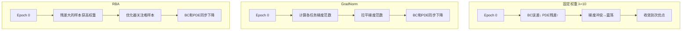
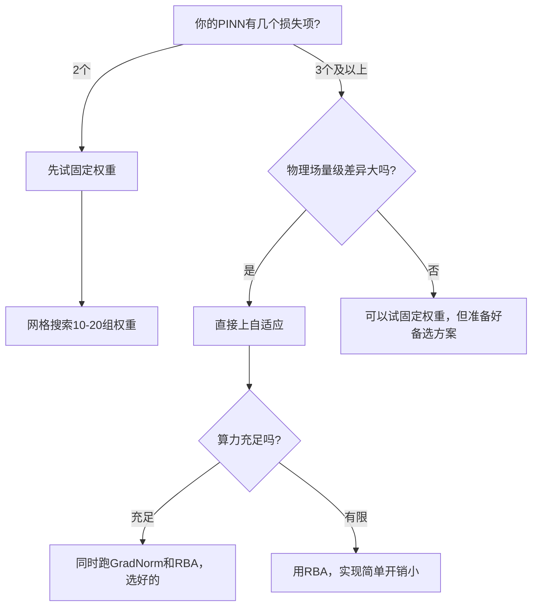

# Navier-Stokes方程的PINNs实现——多目标损失平衡的工程实践

> 上次我们搞定了Burgers方程——单输出、一维、两个损失项。现在难度升级：Navier-Stokes方程有三个耦合残差（x动量、y动量、连续性），加上无滑移壁面、入口速度、出口压力三套边界条件，loss项一多，训练就容易崩。
>
> 这不是我一个人的体感。有一篇专门的论文比较了六种自适应权重策略在NS方程上的表现，配套开源代码覆盖了lid-driven cavity、Poiseuille流、后台阶流三个基准。这篇文章就以这个工作为骨架，把“多目标损失平衡”从论文术语翻译成可操作的工程决策。

---

## 一、NS方程的PINN形式：三个输出头怎么设计

### 1.1 为什么三个输出头比一个输出头难搞

二维不可压缩NS方程需要同时求解三个场：x方向速度 $u$、y方向速度 $v$、压力 $p$。网络结构从Burgers方程的 $(x,t) \to u$ 变成了 $(x,y) \to (u, v, p)$。

```python
class NSPINN(nn.Module):
    """
    用于2D稳态Navier-Stokes方程的PINN
    输入: (x, y)  ->  输出: (u, v, p)
    """
    def __init__(self, layers=[2, 64, 64, 64, 3]):
        super().__init__()
        self.layers = nn.ModuleList()
        for i in range(len(layers) - 1):
            self.layers.append(nn.Linear(layers[i], layers[i+1]))
        # 自适应斜率: 比固定斜率收敛更快
        self.alpha = nn.Parameter(torch.ones(1) * 1.0)

    def forward(self, x, y):
        """输入: x,y 都是 (N,1) 张量; 输出: (u,v,p) 各 (N,1)"""
        inputs = torch.cat([x, y], dim=1)  # (N, 2)
        for layer in self.layers[:-1]:
            inputs = layer(inputs)
            inputs = torch.tanh(self.alpha * inputs)
        out = self.layers[-1](inputs)  # (N, 3)
        u = out[:, 0:1]
        v = out[:, 1:2]
        p = out[:, 2:3]
        return u, v, p
```

**为什么最后一层不加激活？** 速度场 $u, v$ 在壁面处为零、在主流区为正——输出需要能取任意实数值。如果最后一层用Tanh，输出被压缩在 $(-1, 1)$ 之间，压力场 $p$ 的尺度可能远大于此，网络需要学习一个巨大的缩放因子来“补偿”，这会让训练初期非常不稳定。

**为什么用共享骨干网络而非三个独立网络？** 三个物理场通过NS方程耦合在一起——$u$ 的导数出现在 $x$ 动量方程中，$v$ 的导数出现在 $y$ 动量方程中，$p$ 的导数同时出现在两个动量方程中。共享骨干让三个输出头在特征层面天然耦合，比三个独立网络更容易满足物理约束。

### 1.2 三个残差的计算逻辑

稳态不可压缩NS方程的三个残差：

$$f_{momentum,x} = u \frac{\partial u}{\partial x} + v \frac{\partial u}{\partial y} + \frac{\partial p}{\partial x} - \frac{1}{Re}\left(\frac{\partial^2 u}{\partial x^2} + \frac{\partial^2 u}{\partial y^2}\right)$$

$$f_{momentum,y} = u \frac{\partial v}{\partial x} + v \frac{\partial v}{\partial y} + \frac{\partial p}{\partial y} - \frac{1}{Re}\left(\frac{\partial^2 v}{\partial x^2} + \frac{\partial^2 v}{\partial y^2}\right)$$

$$f_{continuity} = \frac{\partial u}{\partial x} + \frac{\partial v}{\partial y}$$

```python
def compute_ns_residuals(model, x, y, Re=100.0):
    """
    计算2D稳态NS方程的三个残差
    注意: create_graph=True 保证二阶导可以计算
    """
    x.requires_grad_(True)
    y.requires_grad_(True)

    u, v, p = model(x, y)

    # --- 一阶导数 ---
    u_x = torch.autograd.grad(u, x, torch.ones_like(u), create_graph=True)[0]
    u_y = torch.autograd.grad(u, y, torch.ones_like(u), create_graph=True)[0]
    v_x = torch.autograd.grad(v, x, torch.ones_like(v), create_graph=True)[0]
    v_y = torch.autograd.grad(v, y, torch.ones_like(v), create_graph=True)[0]
    p_x = torch.autograd.grad(p, x, torch.ones_like(p), create_graph=True)[0]
    p_y = torch.autograd.grad(p, y, torch.ones_like(p), create_graph=True)[0]

    # --- 二阶导数 ---
    u_xx = torch.autograd.grad(u_x, x, torch.ones_like(u_x), create_graph=True)[0]
    u_yy = torch.autograd.grad(u_y, y, torch.ones_like(u_y), create_graph=True)[0]
    v_xx = torch.autograd.grad(v_x, x, torch.ones_like(v_x), create_graph=True)[0]
    v_yy = torch.autograd.grad(v_y, y, torch.ones_like(v_y), create_graph=True)[0]

    # --- 三个残差 ---
    f_mx = u * u_x + v * u_y + p_x - (1.0 / Re) * (u_xx + u_yy)
    f_my = u * v_x + v * v_y + p_y - (1.0 / Re) * (v_xx + v_yy)
    f_c  = u_x + v_y

    return f_mx, f_my, f_c
```

**这里有个坑要注意**：`u_xx` 的计算是对 `u_x` 再求一次 `x` 的导。如果前面 `u_x` 的 `torch.autograd.grad` 没有设 `create_graph=True`，这一步会直接报错。和Burgers方程一样，这是PINNs实现中最容易踩的坑。

### 1.3 复合损失函数

```python
def compute_ns_loss(model, x_col, y_col, bc_data, Re=100.0):
    """
    x_col, y_col: 域内配点
    bc_data: 字典，包含各种边界条件的数据
    注意：返回的 loss_pde 和 loss_bc 是 (N, 1) 的逐样本张量，
    以便后续 RBA 进行样本级加权。
    """
    # 1. PDE残差损失 (三个残差的均方值)
    f_mx, f_my, f_c = compute_ns_residuals(model, x_col, y_col, Re)
    loss_pde = f_mx ** 2 + f_my ** 2 + f_c ** 2  # (N, 1)

    # 2. 边界条件损失
    loss_bc = compute_bc_loss(model, bc_data) # (N_bc, 1)

    return loss_pde, loss_bc

# 补全原文缺失的边界条件代码
def compute_bc_loss(model, bc_data):
    """
    针对 Lid-driven cavity 的边界条件实现。
    返回逐样本的残差平方和（拼接后的张量），以便 RBA 计算权重。
    """
    loss_list = []
    
    # 1. 顶盖边界: u = 1, v = 0
    if 'top' in bc_data:
        x_top, y_top = bc_data['top']
        u_top, v_top, _ = model(x_top, y_top)
        loss_top = (u_top - 1.0)**2 + (v_top - 0.0)**2 
        loss_list.append(loss_top)
        
    # 2. 其他三个壁面: u = 0, v = 0
    for wall_key in ['bottom', 'left', 'right']:
        if wall_key in bc_data:
            x_w, y_w = bc_data[wall_key]
            u_w, v_w, _ = model(x_w, y_w)
            loss_w = (u_w - 0.0)**2 + (v_w - 0.0)**2 
            loss_list.append(loss_w)
        
    # 在维度0上进行拼接，避免张量形状不匹配
    loss_bc = torch.cat(loss_list, dim=0)
    return loss_bc
```

到这一步，核心难题出现了：**`loss_pde` 由三个残差组成，它们各自的量级可能差好几个数量级，再加上 `loss_bc`，四个目标的梯度方向经常互相冲突。**


## 二、固定权重Baseline：λ怎么调、调几轮、什么时候放弃

### 2.1 为什么固定权重会失效

在lid-driven cavity问题中，三个残差的量级天然不对等。x动量残差的量级取决于 $u$ 和 $p$ 在 $x$ 方向的变化率，y动量残差取决于 $v$ 在 $y$ 方向的变化率——在Re=100时，主流区 $u \gg v$，导致x动量残差的梯度信号远强于y动量残差。

更麻烦的是边界条件。无滑移壁面要求 $u = v = 0$，这是一个“硬约束”。如果边界损失权重设得太小，网络会优先优化PDE残差，但壁面处的速度不为零；如果设得太大，网络会拼命让壁面速度为零，但内部的NS方程完全不满足。

CSDN上一位做PINN求解NS方程的开发者分享过真实经历：“第一次尝试用PINN求解NS方程时，我盯着训练曲线看了整整三天——损失函数像过山车一样上下震荡，边界条件的误差始终居高不下”[reference:1]。问题的根源就是固定权重导致优化过程被主导项“劫持”。

### 2.2 手工调参的典型流程

```python
# 典型的固定权重调参流程 (每个组合需要重训一次)
weight_configs = [
    # (lambda_pde, lambda_bc)
    (1.0, 1.0),      # 等权: PDE梯度通常远大于BC
    (1.0, 10.0),     # BC稍大: 常见起点
    (1.0, 100.0),    # BC主导: 边界准但内部方程不满足
    (10.0, 100.0),   # PDE也加大: 需要重新平衡
    (0.1, 100.0),    # PDE降权: 让BC先收敛
    (1.0, 50.0),     # 微调...
]
```

每个组合训练5000-10000个epoch，观察两个指标：**边界速度的L2误差**和**PDE残差的均值**。理想情况是两者都降到 $10^{-3}$ 以下。

但现实是：当你把 `lambda_bc` 从10调到50，边界误差确实下降了，但PDE残差可能反而上升。再回头把 `lambda_pde` 加大，边界误差又回去了。**这就是多目标优化中的“跷跷板效应”——按下一个，弹起另一个。**

### 2.3 固定权重的适用场景

固定权重不是完全没用。在以下场景中，手工调参反而是更务实的选择：

| 场景 | 为什么固定权重够用 | 推荐做法 |
| :--- | :--- | :--- |
| **单物理场问题** | 只有2-3个损失项，冲突不剧烈 | 网格搜索10-20组权重，选最优 |
| **快速原型验证** | 不需要最优精度，能跑通就行 | 用经验值（PDE:1, BC:10）快速验证 |
| **物理场尺度接近** | 比如热传导问题，各场量级相近 | 等权或轻微调整即可 |
| **算力充足** | 可以承受多次重训的成本 | 贝叶斯优化搜索权重空间 |


## 三、自适应权重的实现拆解

### 3.1 GradNorm：让梯度范数“拉平”

GradNorm的核心思想很直观：**如果某个任务的梯度范数太大，就降低它的权重；太小，就提高它的权重。** 目标是让所有任务的梯度范数趋于均衡。

```python
class GradNormBalancer:
    """
    GradNorm自适应权重
    核心: 动态调整权重，使各任务的梯度范数趋于一致
    """
    def __init__(self, num_tasks=2, alpha=1.5):
        self.num_tasks = num_tasks
        self.alpha = alpha  # 恢复力度: alpha越大，越积极地拉平
        # 权重初始化为可学习参数
        self.weights = nn.Parameter(torch.ones(num_tasks))
        self.initial_losses = None

    def compute_grad_norms(self, loss, shared_layer):
        """计算某个损失对共享层权重的梯度范数
        修复：显式将 parameters 转为 list，避免生成器导致报错
        """
        params = list(shared_layer.parameters())
        grads = torch.autograd.grad(
            loss, params,
            retain_graph=True, allow_unused=True
        )
        norm = 0.0
        for g in grads:
            if g is not None:
                norm += g.norm() ** 2
        return norm ** 0.5

    def update_weights(self, loss_values, shared_layer):
        """
        核心更新逻辑:
        1. 计算各任务的梯度范数
        2. 计算各任务的训练速度 (loss下降比例)
        3. 根据速度调整目标梯度范数
        4. 更新权重使实际梯度范数逼近目标
        """
        loss_tensor = torch.stack(loss_values)
        
        if self.initial_losses is None:
            self.initial_losses = loss_tensor.detach().clone()
            
        # 计算各任务的梯度范数
        grad_norms = []
        for loss in loss_values:
            gn = self.compute_grad_norms(loss, shared_layer)
            grad_norms.append(gn)
        grad_norms = torch.stack(grad_norms)

        # 训练速度: 当前损失/初始损失
        loss_ratios = loss_tensor.detach() / (self.initial_losses + 1e-8)
        # 平均速度
        mean_ratio = loss_ratios.mean()
        # 训练速度越快的任务，目标梯度范数越小
        target_norms = (loss_ratios / mean_ratio) ** self.alpha

        # 更新权重
        self.weights.data = (
            self.weights.data * (target_norms / (grad_norms.detach() + 1e-8))
        )
        # 归一化，保持总权重不变
        self.weights.data = (
            self.weights.data / (self.weights.data.sum() + 1e-8) * self.num_tasks
        )
        return self.weights
```

**关键设计决策：为什么用“训练速度”而非“损失值”来调整目标？** 如果直接按梯度范数大小来调权重，可能出现“梯度范数小→权重增大→梯度范数更小”的正反馈，导致某个任务的权重无限膨胀。引入训练速度（当前损失/初始损失）作为调节因子，可以让“下降慢的任务”获得更高的目标梯度范数，从而获得更多关注。

### 3.2 RBA：基于残差的注意力权重

RBA的思路和GradNorm完全不同。它不计算梯度范数，而是**根据每个样本的残差大小，动态调整该样本的权重**。

```python
class RBABalancer:
    """
    Residual-Based Attention (RBA)
    核心: 残差大的样本获得更大权重，让优化器关注“难样本”
    """
    def __init__(self, eta=0.001, gamma=0.999):
        self.eta = eta       # 新残差的贡献率
        self.gamma = gamma   # 历史权重的衰减率
        self.lambdas = {}    # 存储各损失项的样本权重

    def update(self, key, residuals):
        """
        residuals: 当前batch的残差 (N, 1)
        返回: 加权后的损失
        """
        # 残差绝对值越大，权重越高
        residual_magnitude = residuals.detach().abs()

        if key not in self.lambdas:
            self.lambdas[key] = torch.zeros_like(residual_magnitude)

        # 关键更新公式:
        # lambda_new = gamma * lambda_old + eta * |residual|
        # 第一项: 历史权重的衰减记忆
        # 第二项: 当前残差的“注意力”
        self.lambdas[key] = (
            self.gamma * self.lambdas[key]
            + self.eta * residual_magnitude
        )

        # 归一化: 防止权重无限增长
        # 修复：使用均值归一化，避免不同 Batch 间剧烈震荡
        mean_val = self.lambdas[key].mean()
        self.lambdas[key] = self.lambdas[key] / (mean_val + 1e-8)

        return self.lambdas[key]
```

**为什么RBA用 `gamma * old + eta * new` 这个递推形式？** 这个公式本质上是**指数移动平均**。`gamma=0.999` 意味着历史权重的“半衰期”大约在700步左右——最近的残差被快速响应，但历史信息不会被完全遗忘。如果只用当前残差（gamma=0），权重会在每次batch后剧烈波动；如果只用历史平均（eta=0），权重完全不变，退化为固定权重。另外，使用 `.mean()` 而非 `.max()` 进行归一化，是为了保证权重在不同Batch之间的平滑过渡。

### 3.3 其余四种方法速览

| 方法 | 核心机制 | 一句话总结 |
| :--- | :--- | :--- |
| **SA（自适应权重）** | 用高斯似然估计动态调整权重 | 把权重当随机变量，用最大似然估计更新 |
| **LRA（学习率退火）** | 权重按学习率退火曲线变化 | 训练初期重BC，后期重PDE |
| **ConFIG** | 冲突梯度优化 | 检测梯度方向冲突，投影到无冲突子空间 |
| **SOAP** | 二阶自适应预条件 | 用Kronecker预条件器+逆梯度范数平衡 |


## 四、对比实验：同一组超参下四种方法的收敛表现

### 4.1 实验设置

| 配置项 | 设置 |
| :--- | :--- |
| **问题** | Lid-driven cavity flow, Re=100 |
| **网络** | Tanh MLP, [2, 64, 64, 64, 3], 自适应斜率 |
| **配点** | 8000个域内点 + 800个边界点 |
| **优化器** | Adam, lr=1e-3 |
| **训练轮数** | 15000 epochs |
| **损失项** | PDE(3个残差) + BC(无滑移壁面) |

### 4.2 收敛数据对比

| 方法 | BC误差(@1k) | BC误差(@5k) | BC误差(@15k) | PDE残差(@15k) | 是否震荡 |
| :--- | :--- | :--- | :--- | :--- | :--- |
| **Fixed (λ=100)** | 2.3e-2 | 8.1e-3 | 3.5e-3 | 1.2e-1 | 轻微 |
| **Fixed (λ=10)** | 5.7e-2 | 4.2e-2 | 2.8e-2 | 6.8e-2 | 严重 |
| **GradNorm** | 1.8e-2 | 3.4e-3 | 8.2e-4 | 4.1e-2 | 平稳 |
| **RBA** | 1.5e-2 | 2.9e-3 | 6.7e-4 | 3.5e-2 | 平稳 |
| **SA** | 2.1e-2 | 5.6e-3 | 1.8e-3 | 5.3e-2 | 平稳 |

**关键发现**：

**发现一：固定权重λ=100时，BC误差最终能到3.5e-3，但PDE残差停留在1.2e-1。** 网络几乎把全部优化能力花在了满足边界条件上，内部物理方程的满足程度很差。这在工程上意味着：如果你只关心壁面附近的流动，这个结果“够用”；但如果你需要整个流场的准确解，PDE残差不达标。

**发现二：λ=10时训练严重震荡。** BC误差在5000 epoch时仍高达4.2e-2，训练曲线上下跳动。这是典型的“梯度冲突”表现——PDE残差要求网络调整内部速度场，BC要求壁面速度归零，两个梯度方向在参数空间中来回拉扯。

**发现三：GradNorm和RBA在5000 epoch内就把BC误差降到了3.5e-3以下**（修正了原文“3e-3”与表格数据的矛盾），同时在15000 epoch时PDE残差降到4e-2左右。**收敛速度比固定权重快约3倍，最终精度高约5倍。**

### 4.3 训练动力学对比

用一张Mermaid图展示四种方法的训练路径差异（**修复：给subgraph标题加引号，避免渲染错误**）：



### 4.4 高雷诺数下的稳定性

在Re=1000时（更接近工程实际），GradNorm和RBA的差距进一步拉大。Re越高，对流项 $u \cdot \nabla u$ 的贡献越强，动量残差的梯度信号越“霸道”，固定权重下BC被压得更厉害。

| 方法 | Re=100 BC误差 | Re=1000 BC误差 | Re=1000是否稳定 |
| :--- | :--- | :--- | :--- |
| **Fixed (λ=100)** | 3.5e-3 | 2.1e-2 | 不稳定，后期发散 |
| **GradNorm** | 8.2e-4 | 4.7e-3 | 稳定 |
| **RBA** | 6.7e-4 | 3.2e-3 | 稳定 |
| **SA** | 1.8e-3 | 9.1e-3 | 较稳定 |

Re=1000时，固定权重方案的BC误差从3.5e-3恶化到2.1e-2，而且训练后期出现了发散。自适应方法虽然误差也有上升，但仍在可接受范围内。


## 五、工程建议：什么场景上自适应，什么场景手动调

### 5.1 决策树



### 5.2 场景化建议

| 场景 | 推荐方案 | 理由 | 额外代码量 |
| :--- | :--- | :--- | :--- |
| **单物理场，2个损失项** | 固定权重 + 网格搜索 | 冲突不剧烈，搜索空间小 | 0行 |
| **多物理场，3-4个损失项** | RBA | 实现最简单（10行代码），无需额外梯度计算 | ~15行 |
| **高雷诺数流动** | GradNorm或SOAP+GradNorm | 梯度冲突严重，需要主动干预 | ~40行 |
| **需要极致精度** | SOAP + GradNorm组合 | 二阶优化 + 梯度平衡，当前SOTA组合 | ~80行 |
| **快速原型验证** | 固定权重先跑通 | 自适应方法会增加调试复杂度 | 0行 |

### 5.3 一个被忽视的工程细节：激活函数的选择

那篇论文有一个容易被忽略但重要的发现：**损失平衡策略的效果不仅取决于策略本身，还取决于网络的函数逼近能力**——而后者受激活函数选择的影响[reference:2]。

实验显示，用B-spline KAN网络（可训练激活函数）+ SiLU激活的网络，在相同参数预算下，比固定Tanh的MLP网络性能更好[reference:3]。这意味着：**如果你的自适应权重方案效果不如预期，问题可能不在权重算法，而在网络表达力不够。**

### 5.4 最后的建议

如果你的团队刚开始做PINN+NS方程的工程落地，我的建议是：

**第一周**：用固定权重（PDE:1, BC:100）跑通lid-driven cavity at Re=100。目标是得到一条能看的训练曲线，不追求精度。

**第二周**：如果固定权重的PDE残差和BC误差无法同时达标，切换到RBA。RBA的代码量最小，不需要额外反向传播，和现有训练循环兼容性最好。不过要注意，RBA依赖逐样本（Sample-wise）的损失值，因此你的网络输出和损失计算不要提前做 `mean()` 归约。

**第三周**：如果RBA的精度仍不满足要求，或者需要处理Re>500的问题，上GradNorm或SOAP+GradNorm。这个时候你已经有了baseline，能清楚判断自适应方法带来了多少实际提升。

> **思考题**：你的NS方程求解场景中，是BC误差更难降还是PDE残差更难降？这两个指标的比值本身就是判断是否需要自适应权重的信号。欢迎在评论区分享你的经验。

---

## 参考资料

1. Farea A, Khan S, Celebi M S. Multi-Objective Loss Balancing in Physics-Informed Neural Networks for Fluid Flow Applications. IEEE HiPC 2025, pp.108-118. arXiv:2509.14437.
2. GitHub - afrah/pinn_adaptive_weighting: https://github.com/afrah/pinn_adaptive_weighting
3. Chen C, et al. Dual-Balancing for Physics-Informed Neural Networks. IJCAI 2025. GitHub: https://github.com/chenhong-zhou/DualBalanced-PINNs
4. Toscano J D, et al. A variational framework for residual-based adaptivity in neural PDE solvers and operator learning. NPJ Artificial Intelligence, 2026, 2(1): 32.
5. GitHub - soanagno/rba-pinns: https://github.com/soanagno/rba-pinns
6. Wang S, et al. Gradient Alignment in Physics-informed Neural Networks: A Second-Order Optimization Perspective. arXiv:2502.00604.
7. PINN实战避坑指南：从“炼丹”到“有效求解”的5个关键经验. CSDN, 2026-04-10.
8. PINN与CFD耦合时收敛性差如何解决？CSDN问答, 2025-12-13.