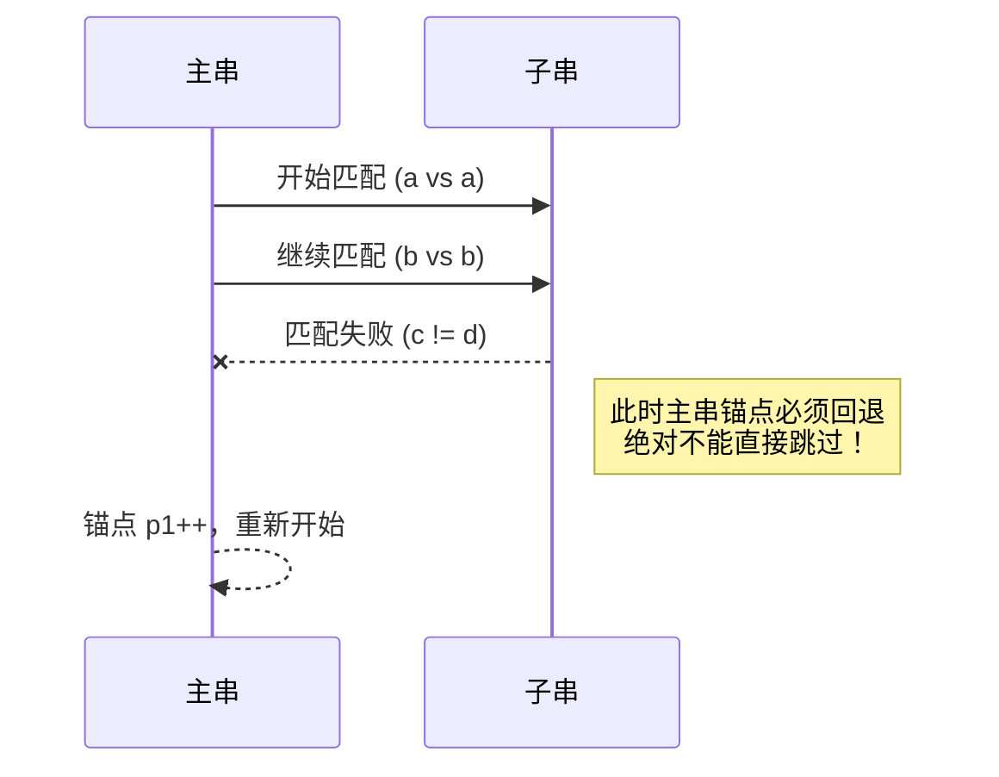

@[TOC](C语言造轮子实录：手撕标准库函数)

# 欢迎来到我的 C 语言踩坑实录

你好！这是一篇硬核的 C 语言源码剖析指南。在 C 语言的学习路线中，**手写标准库函数**是一项必经的修炼。很多时候我们以为自己懂了指针，但只有真正去实现这些底层函数时，各种 ==段错误== 才会狠狠打脸。

这篇文章不仅收录了我**最终优化后的源码**，更记录了我**从“理所当然”到“恍然大悟”的思维复盘**。

## 核心函数速查表与危险指数

你可以使用 <kbd>Ctrl/Command</kbd> + <kbd>F</kbd> 快速查找你感兴趣的函数。下面是各个函数的危险指数与核心特征：

| 函数名称       | 核心功能         | 危险指数       | 我的致命翻车点记录 |
| :-----------: | :------------- | :------------ | :---------------- |
| **`strcpy`** | 字符串拷贝       | ⭐            | 忘了保存目标的首地址并返回 |
| **`strcmp`** | 字符串比较       | ⭐⭐           | 没考虑扩展 ASCII 码，导致负数比较错乱 |
| **`strcat`** | 字符串追加       | ⭐⭐           | 随手给 `dest` 乱加 `const` 导致段错误 |
| **`strstr`** | 字符串查找       | ⭐⭐⭐         | 匹配失败时主指针回溯逻辑算错，漏掉子串 |
| **`strncpy`** | 安全拷贝         | ⭐⭐⭐⭐       | 补齐 `\0` 时忘了移动目标指针，导致死循环 |
| **`strncat`** | 安全追加         | ⭐⭐⭐⭐       | 错误使用嵌套循环，让长度限制彻底失效 |
| **`memcpy`** | 内存拷贝         | ⭐⭐⭐         | 直接用 `char*` 而不是 `unsigned char*` |
| **`memmove`** | 内存移动         | ⭐⭐⭐⭐⭐      | 从后往前拷时，因为索引没算对，直接越界 |

---

## 一、基础字符串操作：看似简单，实则暗藏杀机

### 1. `strcpy`：千万别弄丢了你的“家”

字符串拷贝逻辑很简单，逐个字符赋值即可。以下是我的实现代码：

```c
//******************strcpy********************//
char* my_strcpy(char* dest, char* src)
{
	char* p1 = src;
	while (*p1)
	{
		*dest = *p1;
		p1++;
		dest++;
	}
	*dest = *p1;
	return dest; // 注意：这里返回的 dest 已经不是初始地址了，有瑕疵！
}
```

> ==💡 踩坑反思：==
> 在我最早的版本中，我直接在循环里用 `dest++`，最后写了一句 `return dest;`。这导致链式调用[^1]时直接读到了字符串末尾的空字符！**任何修改字符串并返回指针的函数，开局必须用一个指针把老家地址记下来。**

[^1]: 链式调用：例如 `puts(my_strcpy(str1, str2));`，函数返回值直接作为另一个函数的参数。

### 2. `strstr`：暴力匹配的指针迷宫

字符串查找的难点在于：匹配失败时，主串的指针怎么回退？我们可以用一个 UML 序列图来看看错误的匹配过程会发生什么：



---

## 二、带 n 的安全版本：规则不同，陷阱连连

这部分是踩坑的重灾区。`strncpy` 和 `strncat` 名字看起来像兄弟，但底层的脾气完全不一样。我们可以通过设定格式的表格来看清区别：

| 函数名称       | 核心行为         | 长度不足补 `\0` | 结束必须封口 `\0` |
|:-----------:| -------------:|:-------------| :-------------|
| `strncpy` | 覆盖拷贝 | ==是== (必须填满) | ==否== |
| `strncat` | 尾部追加 | ==否== (拷完即走) | ==是== |

### 1. `strncpy`：原地打转的“补零陷阱”

在这里，我们可以引入 **KaTeX数学公式** 来表示指针地址的推移关系，如果你忘了让目标指针自增，地址偏移量 $\Delta x$ 将始终为 0：

$$
Addr(dest_n) = Addr(dest_0) + \sum_{i=1}^{n} \Delta x_i
$$

```c
//&*&*&*&*&*&*&*&*&*&*&*strncpy*&*&*&*&*&*&*&*&*&*&*&//
char* my_strncpy(char* dest, const char* src, size_t num)
{
	char* tem = dest;
	while (num--)
	{
		if(*src!='\0')
			*tem++ = *src++;
		else
			*tem++ = '\0';
	}
	return dest;
}
```

> ==💡 踩坑反思：==
> 我当时的潜意识是：“源字符串到头了，那就在目标位置写个 `\0` 吧”。但我完全忽略了这在一个 `while(num--)` 循环里！因为如果 `dest` 没有自增，下一次循环它还在原来的位置，程序就这样在同一个内存地址上疯狂写入 `\0`，导致死循环。**上面的代码让源指针停滞，目标指针前进，极其优雅地解决了补零问题。**

### 2. `strncat`：嵌套循环带来的降维打击

我们可以使用 **FLowchart流程图** 来清晰地展示 `strncat` 正确的合并维度逻辑：

```mermaid
flowchat
st=>start: 开始追加
op1=>operation: p 指针跑到 dest 尾部
cond=>condition: num-- 且 *src!='\0'
op2=>operation: *p = *src
e=>end: 结尾打上 '\0' 返回

st->op1->cond
cond(yes)->op2->cond
cond(no)->e
```

> ==💡 踩坑反思：==
> 第一次写的时候，我用了嵌套循环。结果内层的 `while(*src != '\0')` 就会被**一口气执行到底**！这意味着不管传入的 `num` 是多少，整个源字符串在第一次循环时就被全部拷完了。真正高级的写法，必须是如流程图所示，把限制条件拍扁到同一个维度。

---

## 三、内存操作篇：泛型指针与重叠灾难

从字符串跨越到纯内存操作，我们需要驾驭 `void*`，这是一切泛型编程的起点。我们用**自定义列表**来梳理这两个核心函数：

`memcpy`
:  简单粗暴的内存拷贝工具，按字节逐一复制。
:  **致命弱点**：无法处理内存重叠。

`memmove`
:  进阶版内存移动工具，内部带有重叠判断逻辑。
:  **核心优势**：即使源地址和目标地址重叠，也能保证数据完整性。

### 1. `memcpy`：打破类型的偏见

```c
//&*&*&*&*&*&*&*&*&*memcpy*&*&*&*&*&*&*&*&*&*&//
void* my_memcpy(void* dest, const void* src, size_t num)
{
	unsigned char* p1 = (unsigned char*)dest;
	unsigned char* p2 = (unsigned char*)src;
	while (num--)
	{
		*p1++ = *p2++;
	}
	return dest;
}
```

> ==💡 踩坑反思：==
> 纯内存拷贝，我们不在乎里面的数据是字符、整数还是结构体，我们只看底层的**二进制字节（Byte）**。如果用有符号的 `char*`，在某些极端硬件上，负数值可能会引发符号位扩展的怪异现象。~~千万别为了省事用 char*~~，老老实实用 `unsigned char*` 才是对底层内存最起码的尊重。它的最大拷贝上限通常可以达到 2^32^ 或 2^64^ 字节。

### 2. `memmove`：中高级 C 程序员的分水岭

解决 `memmove` 是一个极其折磨的过程，这里用**甘特图**记录一下我当时解决内存重叠 Bug 的心路历程：


```c
//&*&*&*&*&*&*&*&*&*memmove*&*&*&*&*&*&*&*&*&*&
void* my_memmove(void* dest, const void* src, size_t num)
{
	unsigned char* p1 = (unsigned char*)dest;
	unsigned char* p2 = (unsigned char*)src;
	if (p1 < p2)
	{
		while (num--)
		{
			*p1++ = *p2++;
		}
	}
	else if (p1 > p2)
	{
		while (num--)
		{
			*(p1 + num) = *(p2 + num);
		}
	}
	return dest;
}
```

> ==💡 踩坑反思：==
> 在写“从后往前拷”的时候，我犯了一个非常经典的 **Off-by-one（差一）** 错误。与其去算 `p1 += num - 1` 这种容易导致下溢出的边界值，不如直接利用 `while(num--)` 本身的特性。此时的 `num` 已经自减过了，恰好对应真实的偏移索引！这一刻，我真正感受到了指针和边界配合时的那种极致的对称美。

---

## 总结清单与扩展阅读

经过这次从出错到破局的洗礼，我算是把 C 语言底层的这几根刺给彻底拔了：

- [x] **别被表面意图骗了**：传参前先问问自己，这块内存到底是要被读，还是要被写？
- [x] **指针跑远了记得要回家**：但凡需要返回首地址的函数，开局必须有个小本本（临时指针）把老家地址记下来。
- [x] **循环与边界的博弈**：每次写 `while` 和指针偏移时，在脑子里跑一遍最后一次循环的画面，90% 的 Bug 都在最后那一下。

*[Bug]: 程序缺陷或漏洞
如果你对底层的标准实现感兴趣，可以去查阅 [C标准库文档](https://en.cppreference.com/w/c/string) 进一步学习。
