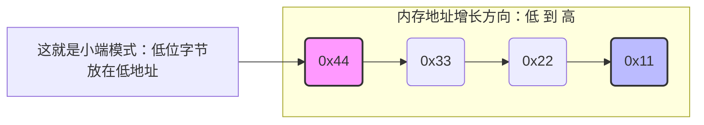

@[TOC](文章目录)

# C语言硬核内功：数据在内存中的“底裤”——整数与浮点数大揭秘

你好！欢迎再次来到我的硬核 C 语言频道。之前我们一起手撕了 C 语言的字符串和内存操作函数，算是把“操作内存”的兵器用熟了。但如果你不知道**内存里到底存的是什么**，就好像练武只练招式不练内功，一遇到稍微底层的 Bug 就会走火入魔。

今天，我们就来扒一扒 C 语言中两座最基础也最容易坑人的大山：**整数（Integer）** 和 **浮点数（Float）** 在内存中到底是怎么存储的。

搞懂了这篇文章，你就能彻底明白诸如“为什么 `0.1 + 0.2 != 0.3`”、“为什么无符号数容易引发死循环”等一系列让新手抓狂的诡异现象。

---

## 核心速查表

你可以使用 <kbd>Ctrl/Command</kbd> + <kbd>F</kbd> 快速定位本篇文章的核心知识点：

| 数据类型 | 核心存储机制 | 关键要点 | 危险陷阱 |
| :---: | :--- | :--- | :--- |
| **有符号整数** | **补码**  | 正数原反补相同，负数反码加一 | 溢出变成极小负数 |
| **无符号整数** | 纯二进制 | 没有符号位，永远非负 | 倒序循环时由于下溢导致死循环 |
| **单精度浮点数** | **IEEE 754** (32位) | 1位符号 + 8位指数 + 23位尾数 | 精度丢失、无法精确比较相等 |
| **双精度浮点数** | **IEEE 754** (64位) | 1位符号 + 11位指数 + 52位尾数 | 精度丢失 |

---

## 一、 整数在内存中的存储：补码的艺术

### 1. 机器数的三种形态：原码、反码、补码

计算机底层只认识 `0` 和 `1`，整数在内存中都是以**二进制**的形式存在的。对于有符号整数（Signed Integer），最高位被划分为**符号位**（`0`代表正，`1`代表负）。

为了让计算机的加法器能够无脑处理减法（减法等于加上一个负数），伟大的先驱们发明了三种编码方式[^1]：

自定义名词解释：
**原码 
: 直接将数值翻译成二进制，最高位加符号。人类看着最直观，但计算机**没法直接算减法**，且存在 `+0` 和 `-0` 两个零。

反码 
: 符号位不变，其余位**按位取反**。仅仅是原码到补码的过渡产物，实际应用极少。

补码
: 反码的基础上 **+1**。==**计算机底层的最终形态**==！完美统一了加减法，且整个系统只有一个 `0`。

> ==💡 核心铁律：==
> **正数的原码、反码、补码完全相同。**
> **负数在内存中，一律按【补码】的形式存储！**

**举个栗子（以 8-bit 为例）：**
* `5` 的原/反/补码都是：`0000 0101`
* `-5` 的原码：`1000 0101`
* `-5` 的反码：`1111 1010`（符号位不变，其它取反）
* `-5` 的补码：`1111 1011`（反码加 1，**这就是内存中真实的 `-5`！**）

### 2. 大小端字节序：内存的“阅读习惯”

当一个数据超过一个字节（比如 `int` 占 4 个字节）时，就产生了一个问题：这 4 个字节在内存中是按什么顺序排的？

假设我们有一个十六进制数字 `0x11223344`。`11` 是高位字节，`44` 是低位字节。



不同的 CPU 架构有着不同的“脾气”：

* **大端模式**：高位字节存放在低地址。人类最习惯的阅读方式，先看大头。
* **小端模式**：**低位字节存放在低地址**。==X86 架构和咱们平常大多用的电脑/手机都是小端！==

**如何用代码测试你的机器是大小端？**这是一道极其经典的面试题，用一个指针强转就能看破底裤：

```c
#include <stdio.h>

int main() {
    int a = 1; // 16进制为 0x00 00 00 01
    char *p = (char *)&a; // 只取第一个字节（最低地址处）
    
    if (*p == 1) 
        printf("小端模式（低地址拿到了低位的 1）\n");
    else 
        printf("大端模式（低地址拿到了高位的 0）\n");
        
    return 0;
}
```

---

## 二、 浮点数在内存中的存储：IEEE 754 标准

如果说整数的存储是简单粗暴，那浮点数（小数）的存储绝对是计算机科学史上一次伟大的“精打细算”。全世界都在遵循 **IEEE 754** 标准。

### 1. 浮点数的“科学计数法”底座

任意一个二进制浮点数 $V$ 都可以使用 **KaTeX数学公式** 表示成下面的标准形式：

$$
V = (-1)^S \times M \times 2^E
$$

其实这和十进制的科学计数法（比如 $-3.14 \times 10^3$）是一个道理，只不过换成了二进制：
* **$S$ (Sign)**：符号位。`0` 表示正，`1` 表示负。
* **$M$ (Mantissa)**：尾数。一个大于等于 1、小于 2 的小数。
* **$E$ (Exponent)**：指数。用来控制小数点的移动。

### 2. 内存模型：怎么把 S, M, E 塞进 32 位？

IEEE 754 规定了 `float`（单精度，32位）的内存布局，我们可以用甘特图的样式来直观感受一下位数的分配：

```mermaid
gantt
    title float (32-bit) 内存布局分配
    dateFormat  X
    axisFormat %s
    
    section 符号位 (1 bit)
    S (0或1) : 0, 1
    
    section 指数位 (8 bit)
    E (偏移后) : 1, 9
    
    section 尾数位 (23 bit)
    M (隐藏首位1) : 9, 32
```



#### ⚠️ 惊天陷阱：被隐藏的尾数和偏移的指数

为了极致榨干每一寸内存空间，IEEE 754 定了两个非常“鸡贼”的规则：

1. **省略尾数的 `1`**：因为 $M$ 总是写成 `1.xxxxxx` 的形式，既然小数点前面永远是 `1`，那存进内存时干脆~~把这个 1 丢掉~~！只存小数部分 `xxxxxx`。等读出来的时候再把 `1.` 补回去。这就白嫖了 1 bit 的精度！
2. **指数的偏移量**：指数 $E$ 是可能有负数的（比如 $2^{-3}$ 代表极小的数）。但 IEEE 754 决定不给 $E$ 设置符号位，而是硬性规定存入内存时必须加上一个**中间值（127）**。
   * *例如：真实的指数 $E = 3$，存入 `float` 内存时，存的是 $3 + 127 = 130$（二进制 `10000010`）。*

---

## 三、 避坑指南：那些年我们踩过的雷

了解了底层存储，我们就能看懂平时写代码时遇到的各种“灵异事件”了。

### 🚨 坑王之王 1：无符号数的死亡倒计时

看看下面这段代码，你觉得它会输出什么？

```c
#include <stdio.h>
int main() {
    unsigned int i;
    for (i = 9; i >= 0; i--) {
        printf("%u\n", i);
    }
    return 0;
}
```

> ==💡 破案分析：无限死循环！==
> `i` 是无符号数（`unsigned`）。当 `i` 从 `0` 减 `1` 时，它**绝对不会变成 `-1`**。因为没有符号位，内存中原本属于 `-1` 的补码 `11111111 11111111 11111111 11111111` 会被强行当作无符号数解析，瞬间下溢变成了一个极其巨大的正数（$4294967295$）。于是条件 `i >= 0` 永远成立。

### 🚨 坑王之王 2：薛定谔的浮点数相等

```c
float a = 0.1f;
float b = 0.2f;
if (a + b == 0.3f) {
    printf("相等\n");
} else {
    printf("不相等？！\n"); // 最终输出这个！
}
```

> ==💡 破案分析：精度丢失！==
> 就像十进制里 $\frac{1}{3} = 0.33333...$ 永远除不尽一样，二进制表示 `0.1` 也是个无限循环小数。由于 `float` 的尾数 $M$ 只有 23 位，装不下只能被强制截断，产生**精度丢失**。`0.1` 和 `0.2` 在内存中本身就是近似值，加起来当然不等于干净的 `0.3`。
> **正解做法：** 永远不要对浮点数用 `==`！而是判断它们的差值是否在一个极小的范围内：`if (fabs((a + b) - 0.3) < 1e-6)`。

---

## 总结

修炼 C 语言的内功，就是从“盲目信任变量类型”到“看透内存二进制本质”的蜕变。一旦你掌握了补码的规则和 IEEE 754 的底层密码，那些莫名其妙的死循环、溢出和精度丢失，都会变成你眼中的透明人。

从字符串指针到数据的二进制存储，你已经逐步打通了 C 语言底层的任督二脉。接下来，还有一个把数据打包起来放在内存里的大骨头需要啃：结构体（Struct）。

你有没有遇到过计算结构体大小时，发现实际占用的字节数比里面所有成员加起来还要大的诡异情况？想不想接着盘一盘**“结构体内存对齐”**的底层逻辑？我们下期再见！

[^1]: 关于原反补码的历史，最早是为了简化计算机 ALU（算术逻辑单元）的硬件设计，使得加法器可以直接处理减法逻辑。
