
@[TOC](欢迎来到C语言硬核修炼营：结构体的“潜规则”)

# C语言硬核内功：被编译器“偷走”的内存？结构体对齐踩坑实录

你好！又见面了。欢迎再次来到 C 语言的硬核修炼频道。

在前几期文章中，我们一起经历了手写 `strcat`、`memmove` 时的“段错误”踩坑实录，又扒光了整数和浮点数在内存中存储的“底裤”。今天，我们要啃下 C 语言底层进阶的另一块硬骨头：**结构体（Struct）与内存对齐**。

你是否有过这样的迷思：一个 `char` 占 1 字节，一个 `int` 占 4 字节，把它们塞进一个结构体里，用 `sizeof` 一测——**结果居然是 8 字节？！** 那些凭空消失的字节去哪了？是被编译器“偷吃”了吗？今天，我们就来复盘这场结构体内存布局的“悬案”，带你用破局的思维，彻底打通内存对齐的任督二脉。

---

## 核心速查表

你可以使用 <kbd>Ctrl/Command</kbd> + <kbd>F</kbd> 快速定位本篇文章的核心知识点：

| 绝招名称 | 核心机制 / 语法 | 踩坑陷阱 & 破局思维 |
| :---: | :--- | :--- |
| **C99指定初始化** | `.成员名 = 值` | **陷阱**：依赖顺序极易张冠李戴。<br>**破局**：乱序赋值，防呆防错。 |
| **内存对齐的本质** | 拿空间换 CPU 访存时间 | **陷阱**：盲目以为大小=成员大小之和。<br>**破局**：理解底层 CPU 按块读取的规律。 |
| **对齐四大铁律** | 偏移量必须是对齐数的倍数 | **陷阱**：排版随意导致大量内存碎片。<br>**破局**：小字节类型集中放置。 |
| **强行接管内存** | `#pragma pack(n)` | **陷阱**：滥用导致跨平台读取崩溃。<br>**破局**：仅在底层通信/协议包中使用。 |

---

## 一、 踩坑前传：结构体的“打包”艺术

在底层开发中，单一的 `int` 往往无法描述复杂的现实对象。结构体就像一张“图纸”，帮我们把零散的数据打包成一个高内聚的整体。

### 1. 类型的声明与变量的诞生

```c
#include <stdio.h>

// 1. 绘制图纸：声明一个结构体类型
struct ProtocolHeader {
    char flag;     // 状态标志
    int packet_id; // 数据包ID
    float version; // 协议版本
}; // 🚨踩坑警告：这里的结尾分号绝不能漏，无数新手曾在这里被编译报错折磨！

int main() {
    // 2. 施工建房：创建结构体变量
    struct ProtocolHeader header; 
    return 0;
}
```

### 2. 破局：从“按部就班”到“指名道姓”的初始化

老一辈的 C 程序员习惯按顺序初始化：
```c
struct ProtocolHeader h1 = {'A', 1001, 1.0f};
```
> **❌ 致命陷阱**：一旦有一天你需要重构代码，把 `packet_id` 和 `flag` 的位置对调，你所有用到 `h1` 的初始化代码都不会报错，但数据全串味了！这在大型工程中是灾难性的。

**✅ 破局之道：C99 指定初始化器**
跳出顺序的束缚，直接指名道姓，代码可读性瞬间拉满：

```c
struct ProtocolHeader h2 = {
    .version = 2.0f,
    .flag = 'B',
    .packet_id = 1002
    // 思考：即使未来结构体成员顺序被打乱，这段初始化代码依然坚如磐石！
};
```

---

## 二、 悬案现场：薛定谔的结构体大小

基础夯实后，我们来到今天的重头戏。请看下面这两个极具戏剧性的结构体，它们的成员**完 全 一 样**，仅仅是排列顺序不同：

```c
// 案发结构体 A
struct S1 {
    char c1; // 1字节
    int i;   // 4字节
    char c2; // 1字节
};

// 案发结构体 B
struct S2 {
    char c1; 
    char c2; 
    int i;   
};
```

我在脑海里理所当然地推演：`1 + 4 + 1 = 6`。
但当你把它们扔进 `printf("%zu", sizeof(struct S1));` 时，输出结果会狠狠打你的脸：
**`S1` 是 12 字节！而 `S2` 是 8 字节！**

这就好比你用同样的砖头盖房子，换了个顺序，占地面积居然差了 50%！为什么编译器非要往里面塞“空白废料”？

### 破案线索：CPU 的“懒惰”与妥协
其实，编译器不是蠢，而是为了照顾 CPU 的性能。
CPU 读取内存不是一字节一字节抠的，而是“按块”抓取（比如每次抓 4 字节）。如果你的 `int i` 横跨了两个 4 字节的块，CPU 就被迫抓取两次，再拼接起来。这在底层被称为**访存错位惩罚**。

为了让 CPU 每次都能一巴掌精准抓出一个完整的数据，编译器会在数据之间填入无效的空白字节，强行把数据的内存地址推到对齐边界上。**这就是典型的“拿空间换时间”！**

---

## 三、 深度推演：内存对齐四大铁律

在纸上画过无数次内存图后，我总结出了对齐的 4 步法则（以主流 VS 编译器为例，默认对齐数为 8）：

> 📝 **前置概念**：每个成员都有自己的**对齐数** = `min(编译器默认对齐数, 该成员自身大小)`。
> 比如 `int` 大小为 4，默认是 8，所以 `int` 的对齐数是 4。

1. **头等舱待遇**：第一个成员，永远放在相对偏移量为 `0` 的地址处。
2. **各找各妈**：其他成员的起始偏移量，必须是**它自身对齐数的整数倍**。不够？用空白填！
3. **整体拔高**：结构体的**总大小**，必须是所有成员中**最大对齐数的整数倍**。
4. **俄罗斯套娃（嵌套）**：如果嵌套了子结构体，子结构体要对齐到它内部最大对齐数的整数倍。

### 现场还原 1：手撕 `S1` (12字节的悲剧)

最大对齐数是 `int` 的 `4`。

1. `c1` 放偏移量 `0`。
2. `i` 的对齐数是 4，只能放在偏移量 `4`。中间的 `1, 2, 3` 沦为**废弃碎片**。
3. `c2` 紧随其后放在偏移量 `8`。
4. 当前总占用 9 字节（0~8）。根据铁律三，总大小必须是 4 的倍数，离 9 最近的是 12。末尾的 `9, 10, 11` 再次沦为**废弃碎片**！

```mermaid
gantt
    title struct S1 内存字节剖析 (大量浪费)
    dateFormat X
    axisFormat %s
    
    section 内存块 1 (0-3)
    c1 (有效数据) : 0, 1
    🈳 浪费填充    : 1, 4
    
    section 内存块 2 (4-7)
    i (有效数据)  : 4, 8
    
    section 内存块 3 (8-11)
    c2 (有效数据) : 8, 9
    🈳 浪费填充    : 9, 12
```



### 现场还原 2：手撕 `S2` (8字节的破局)

最大对齐数依然是 `4`。

1. `c1` 放在 `0`。
2. `c2` 对齐数是 1，紧贴放在 `1`。
3. `i` 对齐数是 4，放在偏移量 `4`。中间的 `2, 3` 废弃。
4. 总体占据 0~7 共 8 字节，刚好是 4 的倍数。完美！

```mermaid
gantt
    title struct S2 内存字节剖析 (紧凑排布)
    dateFormat X
    axisFormat %s
    
    section 内存块 1 (0-3)
    c1 (有效数据) : 0, 1
    c2 (有效数据) : 1, 2
    🈳 浪费填充    : 2, 4
    
    section 内存块 2 (4-7)
    i (有效数据)  : 4, 8
```



> 💡 **顿悟时刻：** > 经过这次推演，我养成了一个极度强迫症的编程习惯——**声明结构体时，永远把空间占用小的数据类型挨着写！** 这个习惯能在不知不觉中为你省下惊人的内存占用。

---

## 四、 终极杀器：剥夺编译器的“对齐权”

如果你在写网络协议包解析，或者单片机的寄存器映射，两端硬件的对齐规则根本不一样，任由编译器填空白会导致致命的“错位”。

这时候，我们需要像手写 `memmove` 那样，夺回底层的控制权。祭出 `#pragma pack()`：

```c
// 思考：在网络封包前，强行关闭内存对齐，实现 100% 紧凑！
#pragma pack(1) // 告诉编译器：默认对齐数给我改成 1（即不对齐）

struct S_Packed {
    char c1; 
    int i;   
    char c2; 
};

#pragma pack() // 封包结束，立刻恢复默认设定，避免拖累后续程序的性能

int main() {
    printf("%zu\n", sizeof(struct S_Packed)); // 完美输出：6 (1+4+1)
    return 0;
}
```
## 五、 榨干最后一滴内存：结构体的终极杀器——位段

如果你觉得学会了 `#pragma pack(1)` 就已经把内存压榨到极致了，那在真正的底层老炮眼里，这还远远不够。

在嵌入式开发（配置单片机寄存器）或者网络底层开发（解析 TCP/IP 协议报文）时，有些数据连 1 个字节（8 个 Bit）都用不到。比如：
* 记录一个开关的状态：只需要 `0` 或 `1`，也就是 **1 个 Bit**。
* 记录一年四季：只需要 `00` 到 `11`，也就是 **2 个 Bit**。

如果用一个完整的 `int`（32 个 Bit）去存一个开关状态，整整浪费了 31 个 Bit！为了解决这种极端的空间浪费，C 语言祭出了终极杀器——**位段**。

### 1. 位段的专属语法

位段的声明和普通结构体极其相似，但有两条严苛的“潜规则”：
1. **类型限制**：位段的成员必须是整型家族，通常是 `int`、`unsigned int`、`signed int` 或 `char`。
2. **冒号语法**：成员名后面必须跟一个冒号 `:` 和一个数字（代表该成员实际占用的 Bit 位数）。

```c
// 声明一个位段结构体
struct Pack {
    unsigned char a : 3; // a 极其娇小，只占 3 个 bit
    unsigned char b : 4; // b 只占 4 个 bit
    unsigned char c : 5; // c 占 5 个 bit
    unsigned char d : 4; // d 占 4 个 bit
};
```

### 2. 步步惊心：位段的内存分配图解

把数据压缩成这样，它在内存里到底是怎么塞进去的？

> ⚠️ **高能预警**：位段的内存分配规则在 C 语言标准中是**未定义**的，全看编译器的“脾气”。我们这里以最常见的 **VS 编译器（Windows 环境）**的规则来推演：
> *从低位向高位分配。如果剩下的 Bit 不够装下一个成员，则**直接废弃**剩余空间，重新开辟一个新的字节！*

我们来剖析上面那个 `struct Pack` 的大小：

1. **第 1 块内存 (`char`，8 bit)**：分给 `a` 3 位，分给 `b` 4 位。还剩 1 位。
2. **第 2 块内存 (`char`，8 bit)**：轮到 `c` 了，它需要 5 位。但刚才第一字节只剩 1 位了，不够塞牙缝的！于是 VS 编译器会**直接废弃那 1 位**，新开辟第二个字节装下 `c`。此时第二字节剩 3 位。
3. **第 3 块内存 (`char`，8 bit)**：同理，第二字节剩 3 位，不够装 4 位的 `d`，继续废弃，开辟第三个字节存 `d`。

**最终结果：这个位段总共占用了 3 个字节（24 bit)。** 如果不使用位段，4 个普通 `char` 需要 4 个字节，这里硬生生抠出了 1 个字节。

用一张全彩甘特图，看透这 3 个字节内部的 Bit 分布：

```mermaid
gantt
    title struct Pack 位段内存分配 (1格 = 1 bit，基于 VS 编译器)
    dateFormat X
    axisFormat %s

    section 第 1 字节 (8 bit)
    a (占 3 bit) :done, des1, 0, 3
    b (占 4 bit) :active, des2, 3, 7
    废弃浪费 (1 bit) : des3, 7, 8

    section 第 2 字节 (8 bit)
    c (占 5 bit) :done, des4, 8, 13
    废弃浪费 (3 bit) : des5, 13, 16

    section 第 3 字节 (8 bit)
    d (占 4 bit) :active, des6, 16, 20
    废弃浪费 (4 bit) : des7, 20, 24
```



### 3. 避坑指南：为什么大佬劝你少用位段？

既然位段这么省空间，为什么在平时的业务代码里很少见？因为它在 C 语言界是出了名的**跨平台刺客**。

1. **符号之谜**：`int a : 3;` 到底被当成有符号还是无符号？标准没规定，换个编译器可能直接报错。
2. **方向之谜**：在一个字节内部，到底是从左向右分配 bit，还是从右向左分配？标准没规定。
3. **截断之谜**：像刚才那个例子，装不下时到底是像 VS 一样舍弃剩余位，还是像 GCC 某些版本一样跨字节强行连起来存储？标准依然没规定！

> 💡 **破局思维：**
> 位段是一把极其锋利的双刃剑。**只有当你的代码确定只运行在单一的硬件和编译器平台上**（比如写某款特定单片机的底层驱动），或者用于解析严格定义好 bit 位的网络数据包时，才能安全地使用位段。对于跨平台的通用程序，请尽量远离它，老老实实用位操作符（`&`, `|`, `<<`, `>>`）来代替。
## 结语

从疑惑于“编译器偷走内存”，到手动画图算对齐，再到用 `#pragma pack` 强行破局。我们在底层摸爬滚打，终于又看透了 C 语言的一条底裤。

懂了对齐，你的脑海中就不再只有抽象的变量名，而是像黑客帝国一样，看到的是一块块排列得严丝合缝的二进制网格。

下一篇，我们要挑战 C 语言的终极 Boss——**指针与动态内存管理（malloc/free 踩坑大赏）**。你准备好了吗？
