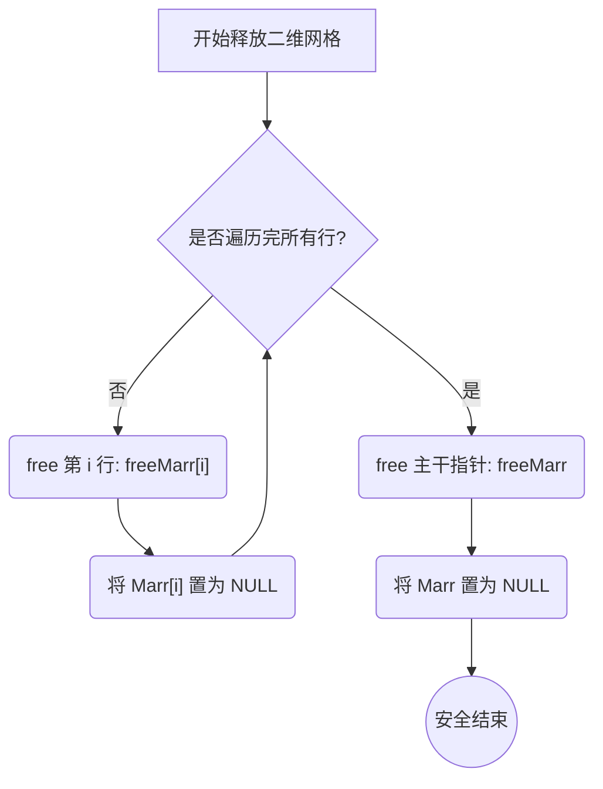
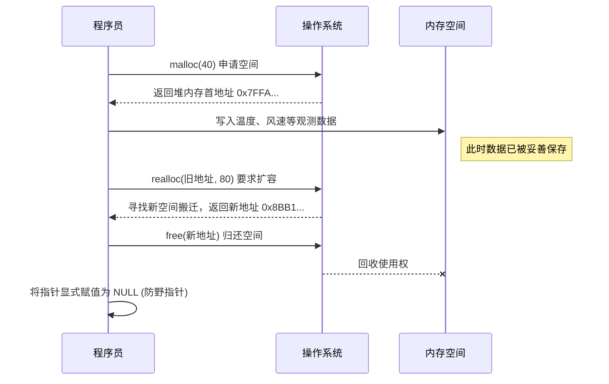

@[TOC](指针与动态内存管理：从“野指针”到“内存大师”的踩坑实录)

# 欢迎来到堆内存的“无主之地”

你好！欢迎再次来到我的 C 语言踩坑频道。前几期文章中，我们一起经历了手写 `strcat`、`memmove` 时的“段错误”历险，又扒光了数据在内存中存储的“底裤”，算是把基础兵器用熟了。

但如果你只能在编译器划定好的地盘里玩耍，一遇到需要动态记录未知大小的数据就束手无策，这就好像练武只练招式不练内功。今天，我们要啃下 C 语言底层进阶的另一块硬骨头：动态内存管理（`malloc`/`calloc`/`realloc`/`free`）。如果你想彻底搞懂怎样自己掌控内存，可以仔细阅读这篇文章。

## C 语言内存五大区：你的数据到底住在哪？

在真正调用动态分配函数之前，我们必须先建立宏观的内存视角。C 语言程序在运行时，操作系统会给它分配一块内存空间，这块空间被严格划分为了五个区域。搞懂它们，你就能明白为什么有些变量会莫名其妙消失，有些却能一直存活。

1. **代码段 (Text Segment)**：
   这里存放着程序编译后的机器指令（也就是你的代码逻辑）。这个区域是**只读**的，为了防止程序在运行中意外篡改自己的指令。
2. **数据段 (Data Segment)**：
   专门用来存放**已初始化**的全局变量和静态变量（`static`）。程序运行期间它们一直都在。
3. **BSS 段 (BSS Segment)**：
   用来存放**未初始化**的全局变量和静态变量。这里的特别之处在于，程序在执行前，操作系统会自动把这里的内存全部清零。
4. **栈区 (Stack)**：
   这是编译器给你“包办婚姻”的地方。我们平时写的局部变量（比如 `int a = 10;` 或者 `float arr[100];`）和函数的形参都存在这里。
   * **特点**：全自动。进入函数时系统自动分配，函数结束时自动销毁。
   * **缺点**：空间有限（通常只有几 MB），且大小必须在编译时固定，不能随意扩展。
5. **堆区 (Heap)**：
   这是内存中的“无主之地”，也是今天的主战场。
   * **特点**：全手动。你需要多大空间，就在程序运行时向操作系统申请多大。空间非常大，可以用来存储海量数据。
   * **代价**：操作系统不会帮你自动打扫，你申请的内存必须由你亲自归还（`free`），否则就会造成**内存泄漏**。

## 核心函数大比拼：谁才是堆区王者？

针对堆区的操作，标准库 `<stdlib.h>` 为我们提供了四个核心函数。它们的对比如下：

| 函数名 | 参数特点 | 初始内容 | 核心使命 |
|--------|-----|-----|-----|
| `malloc` | 仅需总字节数 | ==垃圾值== | 纯粹的开辟空间 |
| `calloc` | 元素个数, 元素大小 | **全零(0)** | 开辟并清零（适合数值统计） |
| `realloc`| 原指针, 新总字节数 | 保留原数据 | 动态伸缩数组容量 |
| `free`   | 目标指针 | 不适用 | 归还使用权，防止内存泄漏 |

---

## 踩坑实录：那些令程序瞬间爆炸的 Bug

理论听着很简单，但实操起来简直是步步惊心。以下是我在处理实际数据（比如连续风速录入、二维降水网格）时，亲身踩过并修复的坑。

### 坑位一：realloc 的参数迷局

在写风速数据的动态扩容时，我曾写出过这样的“绝命”代码：

~~`float* ptr = (float*)realloc(N, sizeof(float));`~~

**翻车原因**：`realloc` 的机制要求传入两个参数：**原内存块的首地址**以及**扩容后的总字节大小**。我错误地把代表元素个数的整数 `N` 当作地址传了进去，程序当场报出段错误（Segmentation fault）并崩溃。

**正确姿势**：

```c
// 假设每次发现空间不够时，增加 3 个观测数据容量
N += 3;

// 必须是：原指针，新的总字节数
float* ptr = (float*)realloc(arr, N * sizeof(float));
if (ptr != NULL) {
    arr = ptr; // 只有扩容成功了，才把新地址赋值给原指针
}
```

### 坑位二：scanf 的求值顺序陷阱 (极其隐蔽)

在构建二维降水网格时，为了偷懒少写几行代码，我把坐标的输入和网格的赋值揉在了一起写在 `while` 循环条件里：

~~`scanf("%d %d %d", &i, &j, &Marr[i-1][j-1])`~~

看似完美，实则==大错特错==！C语言中，函数参数的地址是在函数调用**之前**就被计算好的。编译器会先拿着**上一次**遗留的 `i` 和 `j` 去计算 `Marr` 的地址，然后再等待你输入新的行列坐标。结果就是：你输入的数据永远存到了错误的格子里，甚至导致严重的数组越界。

**正确解法**：老老实实分步走。

```c
int row, col, value;
scanf("%d %d %d", &row, &col, &value);

// 加上越界保护，安全第一
if (row > 0 && row <= M && col > 0 && col <= N) {
    Marr[row-1][col-1] = value; 
}
```

### 坑位三：二维网格的“多级释放”法则

在堆区分配了一个 `M` 行 `N` 列的动态二维数组后，释放时绝不能只写一句 `free(Marr)`。因为此时的 `Marr` 本质上是一个存储了多个行指针的数组。必须遵循**“先里后外”**的原则，否则内层行指针指向的具体数据块将永远游荡在内存中无法回收。



---

## 动态内存的“生死轮回” (UML序列图)

让我们来看看一块堆内存从诞生到消亡的标准一生：



## 总结与预告

拿到了堆内存的钥匙，我们现在已经可以自由地在内存里开辟空间了，再也不用受制于编译器固定大小的数组限制。但这还不够，目前我们的数据（比如温度、湿度、风速）都还是零散存储的单一类型。

如何将属于同一个站点的各种不同类型的数据完美打包在一起？如何给不同状态的数据打上易读的标签？在下一篇文章中，我们将正式推开**自定义类型**的大门——**结构体 (Struct)、联合体 (Union) 与 枚举 (Enum)**，敬请期待！
