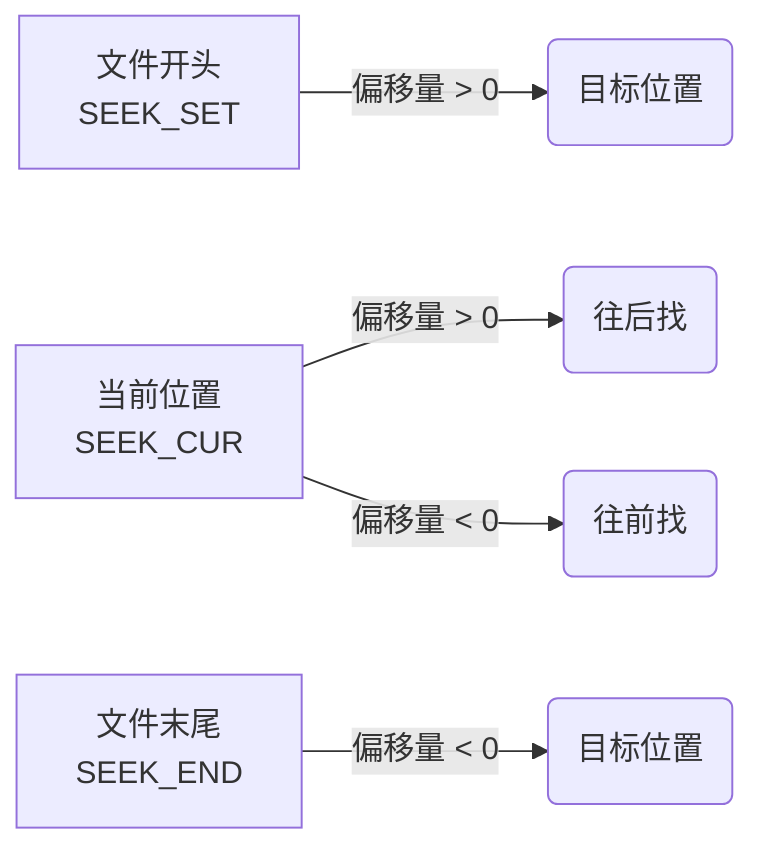

@[TOC](C语言文件操作（后篇）：二进制读写与文件指针的高级跳跃)

# 欢迎来到数据存储的“深水区”

你好！填坑来了。

在上一篇文章《[文件操作（前篇）](https://blog.csdn.net/ysu_0314/article/details/161463947?fromshare=blogdetail&sharetype=blogdetail&sharerId=161463947&sharerefer=PC&sharesource=ysu_0314&sharefrom=from_link)》中，我们学会了用 `fprintf`、`fgets` 等函数把数据转换成我们肉眼能看懂的字符，存进普通的文本文件中。这种方法简单直观，但如果你在做气象观测项目，每天有成千上万条风速、温度数据需要高频存取，一行行写字符串不仅速度慢，而且浪费硬盘空间。

今天我们就来点硬核的：跳过字符转换，直接把内存里的原始二进制数据“砸”进硬盘；并且学会如何像操作数组下标一样，在文件里自由跳转。

准备好，我们要开始 C 语言文件操作的进阶之旅了。

---

## 1. 文本 vs 二进制：到底存哪个？

在讲具体的函数前，先搞明白两种存储方式的区别：

* **文本文件**：把数据转换成 ASCII 码存进去。比如整数 `10000`，会变成 `'1'`, `'0'`, `'0'`, `'0'`, `'0'` 这 5 个字符，占 5 个字节。用记事本打开看得懂。
* **二进制文件**：内存里长什么样，硬盘上就原封不动存成什么样。整数 `10000` 在内存里直接以 4 个字节的二进制形式（`0x2710`）存进去。用记事本打开是一堆乱码，但程序读写极快。

对于海量数据和复杂的结构体，**强烈推荐二进制读写**。

---

## 2. 暴力美学：`fwrite` 与 `fread`

这对兄弟专门用来处理二进制数据，特别是**数组**和**结构体**。

假设我们定义了一个气象观测数据的结构体：

```c
struct WeatherData {
    int day;          // 观测天数
    float temp;       // 温度
    float wind_speed; // 风速
};
```

### 2.1 批量写入：`fwrite`

把结构体数组直接倒进文件里。注意，打开文件的模式要加上 `b`（代表 binary），比如 `"wb"`。

```c
#include <stdio.h>

int main() {
    struct WeatherData data[3] = {
        {1, 14.5, 2.5},
        {2, 18.2, 4.1},
        {3, 12.3, 3.8}
    };

    FILE *pf = fopen("weather.dat", "wb"); // wb: 只写二进制
    if (pf == NULL) return 1;

    // 参数：数据源地址, 每个元素大小, 元素个数, 文件指针
    size_t written = fwrite(data, sizeof(struct WeatherData), 3, pf);
    
    printf("成功写入了 %zu 条观测数据。\n", written);
    
    fclose(pf);
    pf = NULL;
    return 0;
}
```

### 2.2 批量读取：`fread`

怎么存的，就怎么读出来。把 `"weather.dat"` 里的原始字节直接按块搬回内存。

```c
#include <stdio.h>

int main() {
    struct WeatherData read_data[3]; // 准备一个空数组接数据

    FILE *pf = fopen("weather.dat", "rb"); // rb: 只读二进制
    if (pf == NULL) return 1;

    // 读出的数据直接填充到 read_data 中
    size_t read_count = fread(read_data, sizeof(struct WeatherData), 3, pf);
    
    printf("成功读取了 %zu 条数据。第一天风速：%.2f\n", read_count, read_data[0].wind_speed);

    fclose(pf);
    pf = NULL;
    return 0;
}
```

> **踩坑预警：** `fread` 和 `fwrite` 的返回值是**成功读写的元素个数**，而不是字节数！如果文件里只剩下 2 条数据，你非要读 3 条，`fread` 会返回 2。

---

## 3. 内存刷新：`fflush` 的救场

有时候你会遇到一个诡异的现象：代码明明执行了 `fprintf` 或 `fwrite`，程序也没报错，但打开文件一看，大小是 0 KB！

这是因为 C 语言为了效率，数据不会立刻写进硬盘，而是先暂存在**内存缓冲区**里。只有等缓冲区满了，或者调用 `fclose` 正常关闭文件时，数据才会被真正“刷”到硬盘上。

如果你程序中途崩溃了（比如死循环或者野指针报错），缓冲区里的数据就会丢失。

想立刻保存怎么办？用 `fflush` 强制刷新：

```c
fprintf(pf, "这是一条重要日志\n");
fflush(pf); // 不管缓冲区满没满，立刻写进硬盘！
```

---

## 4. 文件指针的“凌波微步”

默认情况下，文件都是从头开始读写的，读完一个字节，内部指针自动往后挪一个字节。但如果我们想直接读取第 100 个字节，或者从末尾往前读，就需要手动操作文件指针。

### 4.1 定位函数：`fseek`
用来把内部读写指针移动到指定位置。

```c
// fseek(文件指针, 偏移量, 起始位置);
fseek(pf, 100, SEEK_SET); // 从文件开头往后走 100 个字节
```

**三个核心基准点：**
* `SEEK_SET`：文件开头
* `SEEK_CUR`：当前指针位置
* `SEEK_END`：文件末尾（配合负数偏移量可以往前走）



### 4.2 报点函数：`ftell`
告诉你当前指针距离文件开头有多少个字节。

**经典神技：求文件总字节数**
```c
fseek(pf, 0, SEEK_END); // 1. 先一脚踹到文件末尾
long size = ftell(pf);  // 2. 问问现在距离开头有多远
printf("这个文件的大小是 %ld 字节\n", size);
```

### 4.3 瞬间回城：`rewind`
就是字面意思，让指针瞬间回到文件开头。等价于 `fseek(pf, 0, SEEK_SET);`。

---

## 5. 灵魂拷问：到底读完没有？

很多人在写 `while` 循环读文件时，经常会多读出一次乱码。这是因为对 `EOF`（End Of File）和错误检测理解不深。

读文件失败，其实有两种可能：
1. **真读完了**（遇到文件尾）
2. **读出错了**（比如硬盘坏道、格式不对）

为了区分这两种情况，C 语言提供了两个判定函数：

### `feof` 与 `ferror`

* `feof(pf)`：如果**已经读到了文件末尾**，返回非零值。
* `ferror(pf)`：如果在**读写过程中发生了错误**，返回非零值。

**正确的使用姿势：**
（注意：`feof` 必须在一次读取操作**之后**调用才有效，不能把它放在 `while` 条件里提前判断。）

```c
#include <stdio.h>

int main() {
    FILE *pf = fopen("data.txt", "r");
    if (!pf) return 1;

    int ch;
    // 每次先读，如果读到 EOF 就退出循环
    while ((ch = fgetc(pf)) != EOF) {
        putchar(ch);
    }

    // 退出循环后，再来追责：到底是为什么退出的？
    if (ferror(pf)) {
        puts("\n读取过程中发生了错误！");
    } else if (feof(pf)) {
        puts("\n文件已经安全读取完毕。");
    }

    fclose(pf);
    return 0;
}
```

### `perror`：错误翻译官
如果 `fopen` 或者读取出错了，我们怎么知道具体是什么错（权限不够？找不到文件？）
直接调用 `perror("自定义提示")`，它会自动帮你打印出系统底层的真实错误原因。

```c
FILE *pf = fopen("not_exist.txt", "r");
if (pf == NULL) {
    perror("打开文件报错了"); 
    // 输出示例：打开文件报错了: No such file or directory
}
```

---

## 总结

到这里，C 语言的基础与进阶操作我们就全部盘完了。从内存里的指针乱飞，到硬盘上的二进制读写，现在你已经具备了独立开发一个小型本地管理系统（比如把你的气象观测数据持久化、或者写一个带存档功能的控制台小游戏）的能力。

多敲代码，多造轮子。如果在开发中遇到奇怪的 `Segmentation fault`，别慌，回头看看那些曾经踩过的坑。祝你写代码永无 BUG！
