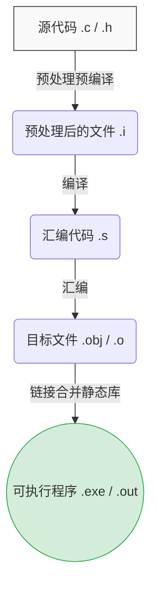

@[TOC](┭┮﹏┭┮)

# 终于到了告别的时刻

你好！欢迎来到 C 语言硬核剖析系列的最终篇。

回首之前的旅程，我们手撕了[指针迷宫](https://blog.csdn.net/ysu_0314/article/details/160601302?fromshare=blogdetail&sharetype=blogdetail&sharerId=160601302&sharerefer=PC&sharesource=ysu_0314&sharefrom=from_link)，扒光了[内存五大区](https://blog.csdn.net/ysu_0314/article/details/161265186?fromshare=blogdetail&sharetype=blogdetail&sharerId=161265186&sharerefer=PC&sharesource=ysu_0314&sharefrom=from_link)，把[结构体按在地上对齐](https://blog.csdn.net/ysu_0314/article/details/161146397?fromshare=blogdetail&sharetype=blogdetail&sharerId=161146397&sharerefer=PC&sharesource=ysu_0314&sharefrom=from_link)，还顺手把[数据持久化到了硬盘](https://blog.csdn.net/ysu_0314/article/details/161463947?fromshare=blogdetail&sharetype=blogdetail&sharerId=161463947&sharerefer=PC&sharesource=ysu_0314&sharefrom=from_link)。你现在写出的 C 代码，已经足够优雅。

但你有没有想过一个问题：**机器只认识 0 和 1，那我们写的这些英文字母和标点符号，到底是怎么变成能在电脑上活蹦乱跳的程序的？**

很多初学者只知道点一下 IDE 里的“运行”按钮，程序就跑起来了。但这背后的魔法一旦被黑盒化，当你遇到链接报错（LNK2019）或者诡异的宏替换 Bug 时，就会彻底抓瞎。

今天，作为本系列的收官之作，我们将掀开 C 语言的底层引擎盖。彻底搞懂程序的编译与预处理逻辑。

---

## 1. 翻译环境和运行环境总览

在 ANSI C 的标准中，任何一种 C 语言的实现，都存在两个截然不同的环境：

1. **翻译环境 (Translation Environment)**：在这个环境里，你写的文本代码（源代码）被转换为机器能读懂的机器指令（可执行程序）。
2. **执行环境 (Execution Environment)**：在这个环境里，操作系统接管你的可执行程序，真正开始执行代码。

说白了，前者是“厨房做菜”，后者是“上桌吃饭”。我们重点要端掉的，是这个错综复杂的“厨房”。

---

## 2. 深度剖析翻译环境

翻译环境并不是一蹴而就的，它是一条严密的流水线。我们平时常说的“编译”，其实包含了四个相对独立的步骤：**预处理**、**编译**、**汇编**、**链接**。

来看看这条流水线的全貌：



### 2.1 预处理（预编译）：它到底干了什么？

这一步其实是个“无脑的文本搬运工”。

在 Linux 下，你可以用 `gcc -E test.c -o test.i` 观察预处理后的文件。它主要干了三件事：
* **展开头文件**：把你写的 `#include <stdio.h>` 删掉，然后把真实的 `stdio.h` 文件里的几千行代码直接复制粘贴到这里。
* **宏替换**：把你写的 `#define MAX 100` 全部替换成 `100`，然后删掉 `#define` 指令。
* **去掉注释**：把你写的那些长篇大论的注释全部替换成一个空格。机器不需要看注释。

**重点记住：预处理阶段完全不涉及任何语法检查，它只做纯粹的文本替换。**

### 2.2 编译：翻译的核心战场

这一步是编译器最核心、最复杂的工作。它将预处理后的 `.i` 文件翻译成汇编代码 `.s` 文件。这期间经历了三大战役：


* **词法分析**：把代码拆成一个个极小的单元（Token）。就像英语里的切分单词。比如 `int a = 10;` 会被无情地切解为关键字 `int`、标识符 `a`、赋值号 `=`、数字 `10`、分号 `;`。
* **语法分析**：把拆好的 Token 组装成一棵“抽象语法树（AST）”。就像检查英语句子的主谓宾。如果你写了 `a = * 10;`，语法分析器就会立刻报错：“嘿，表达式不合法！”
* **语义分析**：检查代码的逻辑意义。比如你把一个指针加到了一个结构体上，虽然语法上可能拼得出来，但语义分析器会告诉你：“类型不匹配，这操作毫无意义。”

### 2.3 汇编：降维打击

这一步把汇编代码转换为机器指令，生成目标文件（Windows下的 `.obj`，Linux下的 `.o`）。
汇编代码和机器指令几乎是一一对应的，汇编器不需要动脑子思考逻辑，照着字典把汇编指令翻译成二进制的 0 和 1 即可。

### 2.4 链接：失散多年的符号重聚

这是翻译环境的最后一步。假设你有 `main.c` 和 `add.c` 两个文件。它们被单独编译成了 `main.obj` 和 `add.obj`。

在 `main.c` 里你调用了 `add` 函数，但汇编器并不知道 `add` 函数的具体内存地址在哪，只能暂时留个假的地址（比如 `0x00000000`）。
**链接器的任务就是“合并符号表与重定位”。** 它会把所有的 `.obj` 文件和标准库文件揉在一起，找到真正的 `add` 函数地址，然后把 `main.obj` 里那个假的地址替换成真的。

> 踩坑提醒：这就是为什么你经常遇到 `LNK2019: 无法解析的外部符号`。这说明代码编译完全没问题，但在最后链接的时候，链接器翻遍了所有的文件，也没找到你调用的那个函数到底在哪。

---

## 3. 运行环境的执行过程

当 `.exe` 生成后，双击运行，执行环境就开始接管：

1. **载入内存**：操作系统把你躺在硬盘上的程序拉到内存里。
2. **寻找入口**：操作系统精准找到 `main` 函数，开始执行。
3. **分配运行时堆栈**：为函数的局部变量开辟栈帧（Stack Frame），在堆区响应你的 `malloc`。
4. **清理现场**：`main` 函数 `return`，或者调用 `exit()` 终止程序，操作系统回收所有分配的内存资源。

---

## 4. 预处理指令进阶指南（重头戏）

搞懂了底层流水线，我们来专门拆解预处理这个阶段。宏定义（Macro）绝对是 C 语言里让人又爱又恨的特性。

### 4.1 预定义符号的使用场景

C 语言内置了几个极其好用的预定义符号：

* `__FILE__`：当前编译的源文件名字
* `__LINE__`：当前代码所在的行号
* `__DATE__`：文件被编译的日期
* `__TIME__`：文件被编译的时间

**实战场景**：写一个霸气的日志报错定位系统。
```c
// 哪里出错调哪里，精确到行号
printf("Error: File %s, Line %d\n", __FILE__, __LINE__);
```

### 4.2 `#define` 常量 vs 定义宏

**定义常量：**
```c
#define MAX 100
```
千万不要在末尾加分号！如果写成 `#define MAX 100;`，当你写 `int arr[MAX];` 时，预处理器会把它无脑替换成 `int arr[100;];`，编译器当场崩溃。

**定义宏：**
宏和函数很像，但它只是文本替换。
```c
#define SQUARE(x) x * x
```
看起来没问题？如果你传个 `SQUARE(5 + 1)` 进去，替换后会变成 `5 + 1 * 5 + 1`，结果是 `11` 而不是 `36`。
**保命法则：宏定义的参数和整体，必须全部加上括号！**
正确写法：`#define SQUARE(x) ((x) * (x))`

### 4.3 警惕：带有副作用的宏参数

这是宏定义里最恐怖的连环坑。看看这段代码：

```c
#define MAX(a, b) ((a) > (b) ? (a) : (b))

int x = 5;
int y = 8;
int z = MAX(x++, y++);
```
你以为 `z` 是 8，`x` 变成 6，`y` 变成 9？
错！预处理替换后，代码长这样：
`int z = ((x++) > (y++) ? (x++) : (y++));`

判断时 `y++` 执行了一次，返回结果时 `y++` **又执行了一次**！
宏是没有参数传递概念的，它会把带自增自减的参数在代码里复制多份，导致变量被莫名其妙地多次修改。这也是为什么现代 C++ 疯狂推荐你用 `inline` 函数替代宏的原因。

### 4.4 宏替换的完整规则

1. 预处理器在扫描时，如果发现遇到了宏，先对宏参数进行检查。如果参数本身也是个宏，就先替换参数。
2. 将参数的文本替换到宏定义内部对应的位置。
3. 再次扫描整个文本，如果还有宏，继续展开。
**注意：宏可以嵌套，但宏不能递归（宏定义里不能调用自己）。**

### 4.5 宏与函数的硬核对比

平时写代码，到底用宏还是用函数？

| 维度 | 宏 (Macro) | 函数 (Function) |
| :--- | :--- | :--- |
| **执行速度** | **极快**。纯文本替换，无调用开销。 | 较慢。需要压栈、分配栈帧、跳转执行、返回。 |
| **类型安全** | **无**。不检查参数类型，传啥都行。 | 严格。类型不匹配直接报编译错误。 |
| **代码体积** | 易膨胀。调用 100 次，代码就复制 100 份。 | 紧凑。无论调用多少次，核心代码只有一份。 |
| **调试体验** | **地狱级**。预处理时就被替换了，无法单步调试。 | 舒适。可以按 F11 步入逐行跟踪。 |

**经验之谈**：逻辑极简、要求极致性能的短小操作（比如求个最大值），用宏。包含两行以上逻辑的，老老实实写函数。

### 4.6 奇技淫巧：`#` 和 `##` 操作符

这两个操作符在底层源码（如 Linux 内核）里满天飞。

* **`#`（字符串化操作符）**：把宏参数变成一个字符串字面量。
```c
#define PRINT_VAL(val) printf("The value of " #val " is %d\n", val)
int score = 100;
PRINT_VAL(score); 
// 替换后：printf("The value of " "score" " is %d\n", score);
// 打印出：The value of score is 100
```

* **`##`（记号粘合操作符）**：把两个 Token 强行粘在一起变成一个全新的标识符。
```c
#define CREATE_VAR(name, num) int name##num = 100
CREATE_VAR(age, 1); 
// 替换后直接变成了一句定义：int age1 = 100;
```

### 4.7 命名约定与 `#undef`

为了防止和普通变量混淆，业界有个铁律：**宏名必须全部大写，普通变量名尽量小写。**
如果你觉得某个宏的作用域太长了，想半路杀掉它，使用 `#undef`：
```c
#define MAX 100
// MAX 在这里有效
#undef MAX
// 从这里开始，MAX 彻底失效，编译器不再认识它
```

### 4.8 命令行定义与条件编译

有时候我们一份代码既想在 Windows 上跑，又想在 Linux 上编译，怎么办？靠条件编译。

```c
#ifdef _WIN32
    // 如果定义了 Windows 平台的宏，编译这段代码
    #include <windows.h>
#elif defined(__linux__)
    // 如果是 Linux 平台，编译这段代码
    #include <unistd.h>
#else
    #error "Unsupported platform!"
#endif
```
条件编译的强大之处在于，不满足条件的代码，**在预处理阶段就会被直接删除，根本不会进入后续的编译环节**，真正做到了跨平台时的零多余开销。

### 4.9 头文件的包含与防雷技巧

`#include <stdio.h>` 和 `#include "my_math.h"` 有什么区别？
* `< >`：编译器直接去系统标准库路径下找头文件。
* `" "`：编译器先在当前代码所在的本地目录下找，找不到再去系统路径下找。自己的写的头文件必须用引号。

**头文件重复包含防雷：**
如果你在 `a.h` 里包含 `c.h`，在 `b.h` 里包含 `c.h`，然后在 `main.c` 里同时包含了 `a.h` 和 `b.h`。完蛋了，`c.h` 的代码被原封不动复制了两次，会导致“结构体重复定义”等致命错误。

解决方案有两个：
```c
// 现代简写流派（绝大多数编译器都支持）
#pragma once

// 经典老炮流派（兼容上古时期的编译器）
#ifndef __MY_HEADER_H__
#define __MY_HEADER_H__
// 你的头文件内容...
#endif
```

### 4.10 其他预处理指令简述

最后再顺带提两嘴：
* `#error`：一旦编译器读到这条指令，直接停止编译并打印后面的错误信息。通常配合条件编译使用。
* `#pragma pack()`：我们前几篇讲[结构体内存对齐](https://blog.csdn.net/ysu_0314/article/details/161146397?fromshare=blogdetail&sharetype=blogdetail&sharerId=161146397&sharerefer=PC&sharesource=ysu_0314&sharefrom=from_link)时用过，用来强制修改编译器的默认对齐数。

---

## 结语

从[手写指针](https://blog.csdn.net/ysu_0314/article/details/160601302?fromshare=blogdetail&sharetype=blogdetail&sharerId=160601302&sharerefer=PC&sharesource=ysu_0314&sharefrom=from_link)到[拆解堆栈](https://blog.csdn.net/ysu_0314/article/details/161265186?fromshare=blogdetail&sharetype=blogdetail&sharerId=161265186&sharerefer=PC&sharesource=ysu_0314&sharefrom=from_link)，从[自定义类型](https://blog.csdn.net/ysu_0314/article/details/161426517?fromshare=blogdetail&sharetype=blogdetail&sharerId=161426517&sharerefer=PC&sharesource=ysu_0314&sharefrom=from_link)到[落盘文件](https://blog.csdn.net/ysu_0314/article/details/161463947?fromshare=blogdetail&sharetype=blogdetail&sharerId=161463947&sharerefer=PC&sharesource=ysu_0314&sharefrom=from_link)，再到今天看透了从文本到二进制的翻译流水线。

C 语言的探索之旅，到这篇博客就算是暂时画上了一个句号。但这并非结束，当你搞懂了 C 语言这套贴地飞行的底层逻辑后，未来无论是去啃 C++、深入操作系统内核，还是研究网络协议栈，你都会发现：这片底层大陆的底层法则，从未改变。

代码还在继续，我们江湖再见！
