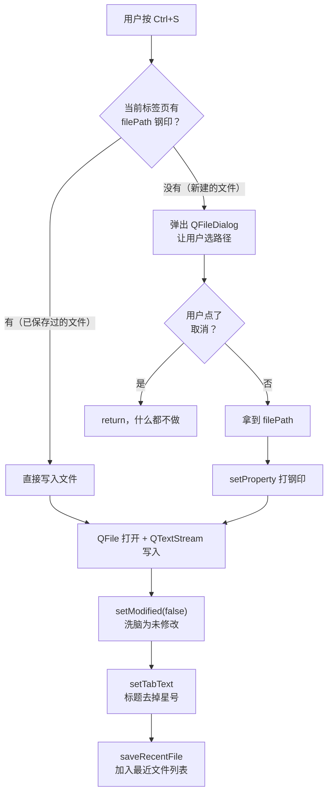
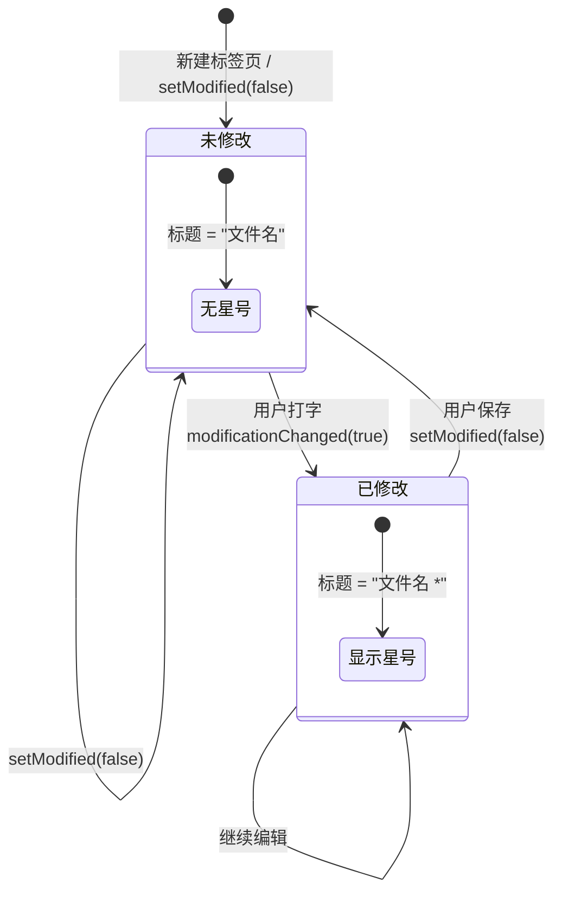
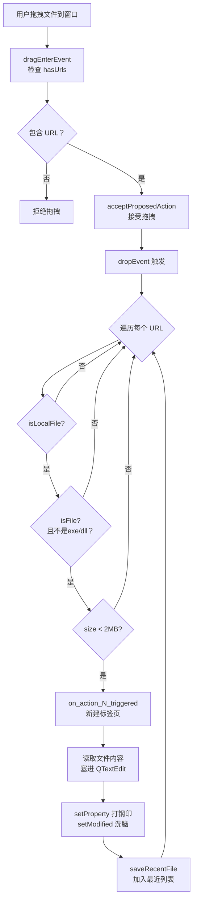
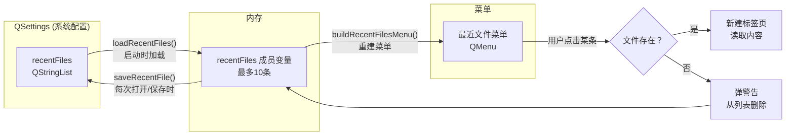
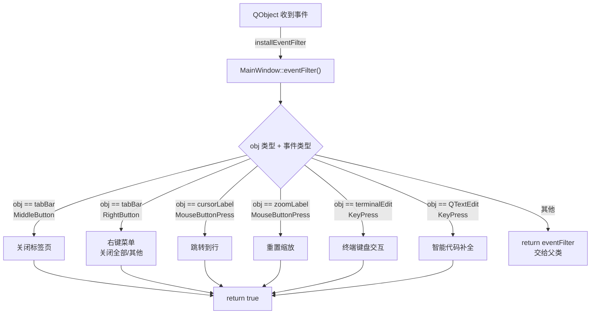

@[TOC](开启跨平台 UI 之旅)

# 前言

上一篇我们搭好了编辑器的"骨架"——无边框窗口、自定义标题栏、状态栏。但现在的窗口还是个空壳，连一个文本编辑区域都没有。

这篇开始往里面填内容。我们要实现的是编辑器最核心的功能——**多标签页 + 文件操作**。打开 VS Code，你可以同时编辑十几个文件，每个文件占一个标签页，点击切换，关闭时还会提醒你"文件还没保存"。这些功能背后的原理，今天全部拆解。

跟着写完这篇，你将收获：

- **多标签页编辑器**：`QTabWidget` 实现 VS Code 风格的多文件标签页
- **文件操作**：新建、打开、保存、另存为，完整的文件读写流程
- **未保存提示**：基于 `modificationChanged` 信号的星号驱动引擎
- **拖拽文件打开**：从资源管理器直接拖文件进编辑器
- **最近文件列表**：用 `QSettings` 持久化，重启软件还记得你打开过什么
- **标签栏右键菜单**：中键关闭、右键关闭全部/关闭其他

---

## 1 多标签页基础：QTabWidget 上手

### 1.1 启用标签页

上一篇的构造函数里，我们已经写了这行：

```cpp
ui->tabWidget->setTabsClosable(true); // 每个标签页显示关闭按钮（×）
ui->tabWidget->setMovable(true);      // 标签页支持拖拽排序
```

`QTabWidget` 是 Qt 自带的多标签容器。`setTabsClosable(true)` 让每个标签页右上角出现一个关闭按钮，`setMovable(true)` 让你可以拖拽标签页调整顺序——这两个属性一开，就有了 VS Code 标签栏的雏形。

<!-- 截图：标签页基础效果（带关闭按钮和拖拽） -->

### 1.2 新建标签页：on_action_N_triggered()

每次新建标签页，本质上是创建一个全新的 `QTextEdit` 编辑器，塞进 `QTabWidget`。这是整个编辑器最核心的"生产工厂"：

```cpp
void MainWindow::on_action_N_triggered()
{
    // 1. 创建 QTextEdit 编辑器
    QTextEdit *newTextEdit = new QTextEdit(this);

    // 2. 设置等宽字体（程序员必备）
    QFont codeFont("Consolas", 11);
    codeFont.setStyleHint(QFont::Monospace);
    newTextEdit->setFont(codeFont);
    newTextEdit->setTabStopDistance(QFontMetricsF(codeFont).horizontalAdvance(' ') * 4);

    // 3. 左右留白（给行号和缩略图腾位置）
    QTextDocument *doc = newTextEdit->document();
    QTextFrameFormat fmt = doc->rootFrame()->frameFormat();
    fmt.setLeftMargin(45);   // 左边 45px 留给行号
    fmt.setRightMargin(100); // 右边 100px 留给缩略图
    doc->rootFrame()->setFrameFormat(fmt);

    // 4. 创建行号组件并关联
    LineNumberWidget *lineWidget = new LineNumberWidget(newTextEdit);
    lineWidget->setObjectName("lineWidget");
    lineWidget->resize(45, newTextEdit->height());
    lineWidget->show();

    // 5. 添加到标签页，标题为"未命名"
    int newIndex = ui->tabWidget->addTab(newTextEdit, "未命名");
    ui->tabWidget->setCurrentIndex(newIndex);

    // ... 后续还有语法高亮、光标追踪等逻辑（下篇会详细讲）
}
```

<!-- 截图：新建标签页效果 -->

每次调用 `on_action_N_triggered()` 就会新增一个标签页。程序启动时也会自动调用一次，确保打开软件就有至少一个空白编辑区。

### 1.3 启动时自动创建

```cpp
// 构造函数末尾
on_action_N_triggered(); // 启动时自动新建一个空白标签页
```

这行保证了用户打开软件时不会面对一个空窗口。

---

## 2 文件操作：打开、保存、另存为

标签页有了，但还不能读写文件。这一节实现完整的文件读写流程。

### 2.1 打开文件（Ctrl+O）

核心流程：弹出文件选择对话框 -> 读取文件内容 -> 塞进当前标签页 -> 记录文件路径：

```cpp
void MainWindow::on_action_O_triggered()
{
    // 1. 防御：如果标签页全关了，自动新建一个
    QTextEdit *currentEdit = qobject_cast<QTextEdit*>(ui->tabWidget->currentWidget());
    if (!currentEdit) {
        on_action_N_triggered();
        currentEdit = qobject_cast<QTextEdit*>(ui->tabWidget->currentWidget());
    }

    // 2. 弹出系统文件选择对话框
    QString fileName = QFileDialog::getOpenFileName(
        this, "打开文件", "",
        "文本文件 (*.txt);;所有文件 (*)"
    );
    if (fileName.isEmpty()) return;

    // 3. 读取文件内容
    QFile file(fileName);
    if (!file.open(QIODevice::ReadOnly | QIODevice::Text)) {
        QMessageBox::warning(this, "警告", "抱歉，无法读取文件！");
        return;
    }

    // 4. 塞进编辑器（先 blockSignals 防止触发不必要的信号）
    QTextStream in(&file);
    currentEdit->blockSignals(true);
    currentEdit->setPlainText(in.readAll());
    currentEdit->blockSignals(false);

    // 5. 重新撑开左右留白
    QTextFrameFormat fmt2 = currentEdit->document()->rootFrame()->frameFormat();
    fmt2.setLeftMargin(45);
    fmt2.setRightMargin(100);
    currentEdit->document()->rootFrame()->setFrameFormat(fmt2);

    // 6. 核心：打钢印 + 洗脑状态
    currentEdit->setProperty("filePath", fileName);       // 记住文件路径
    currentEdit->document()->setModified(false);           // 标记为"未修改"
    currentEdit->document()->clearUndoRedoStacks();        // 清空撤销栈

    // 7. 更新标签页标题
    QString tabName = QFileInfo(fileName).fileName();
    ui->tabWidget->setTabText(ui->tabWidget->currentIndex(), tabName);

    // 8. 加入最近文件列表
    saveRecentFile(fileName);
}
```

<!-- 截图：打开文件对话框 + 标签页标题更新 -->

几个关键设计：

- **`blockSignals(true/false)`**：在设置文本内容前后屏蔽信号，防止 `modificationChanged` 误触发导致标题闪星号
- **`setProperty("filePath", fileName)`**：给每个 QTextEdit 打上"文件路径钢印"，后续保存时直接取这个值，不用每次都弹对话框问用户
- **`setModified(false)`**：读取完文件后手动重置修改状态，避免刚打开就显示星号

### 2.2 保存文件（Ctrl+S）

保存逻辑比打开更简单：取文件路径 -> 有路径直接写，没路径弹另存为对话框：

```cpp
void MainWindow::on_action_S_triggered()
{
    QTextEdit *currentEdit = qobject_cast<QTextEdit*>(ui->tabWidget->currentWidget());
    if (!currentEdit) return;

    QString filePath = currentEdit->property("filePath").toString();

    // 如果没有文件路径（新建的文件还没保存过），弹另存为对话框
    if (filePath.isEmpty()) {
        filePath = QFileDialog::getSaveFileName(
            this, "保存文件", "",
            "C/C++ 源代码 (*.c *.cpp);;文本文件 (*.txt);;所有文件 (*)"
        );
        if (filePath.isEmpty()) return;
        currentEdit->setProperty("filePath", filePath);
    }

    // 写入文件
    QFile file(filePath);
    if (!file.open(QIODevice::WriteOnly | QIODevice::Text)) {
        QMessageBox::warning(this, "警告", "抱歉，无法保存文件！");
        return;
    }
    QTextStream out(&file);
    out << currentEdit->toPlainText();
    file.close();

    // 核心防线：打钢印，再洗脑状态
    currentEdit->document()->setModified(false); // 标记为"已保存"

    // 更新标签页标题（去掉星号）
    QString tabName = QFileInfo(filePath).fileName();
    ui->tabWidget->setTabText(ui->tabWidget->currentIndex(), tabName);

    // 加入最近文件列表
    saveRecentFile(filePath);
}
```

### 2.3 另存为（Ctrl+Shift+S）

另存为的逻辑就是"无条件弹对话框让你选路径"：

```cpp
QAction *saveAsAction = new QAction("另存为...", this);
saveAsAction->setShortcut(QKeySequence("Ctrl+Shift+S"));
connect(saveAsAction, &QAction::triggered, this, [=]() {
    QTextEdit *currentEdit = qobject_cast<QTextEdit*>(ui->tabWidget->currentWidget());
    if (!currentEdit) return;

    QString filePath = QFileDialog::getSaveFileName(
        this, "另存为", "",
        "C++ 源文件 (*.cpp);;C 头文件 (*.h);;所有文件 (*.*)"
    );
    if (filePath.isEmpty()) return;

    QFile file(filePath);
    if (!file.open(QIODevice::WriteOnly | QIODevice::Text)) {
        QMessageBox::warning(this, "警告", "无法写入该文件，请检查权限。");
        return;
    }
    QTextStream out(&file);
    out << currentEdit->toPlainText();
    file.close();

    // 更新钢印和标题
    currentEdit->setProperty("filePath", filePath);
    currentEdit->document()->setModified(false);
    int curIndex = ui->tabWidget->currentIndex();
    if (curIndex >= 0) {
        ui->tabWidget->setTabText(curIndex, QFileInfo(filePath).fileName());
    }
    saveRecentFile(filePath);
});
```

### 2.4 保存流程总结

无论是保存还是另存为，最后都要做三件事：

1. **`setProperty("filePath", path)`** —— 打上文件路径钢印
2. **`setModified(false)`** —— 洗脑为"未修改"状态
3. **`saveRecentFile(path)`** —— 加入最近文件列表

保存操作的完整流程：



> 💡 **"钢印 + 洗脑"是我对这套机制的比喻。** `setProperty` 就像给编辑器打上了一个不可磨灭的钢印——"你属于哪个文件"。`setModified(false)` 就像给编辑器洗了个脑——"你现在是干净的，没有未保存的修改"。后面会看到，这两个操作是消灭星号 Bug 的关键。

---

## 3 未保存提示：星号驱动引擎

编辑器最烦人的 Bug 之一就是 **星号 Bug**——文件明明改了但标签页不显示星号，或者文件已经保存了星号还在。这里用一个极其优雅的方案彻底消灭它。

### 3.1 modificationChanged 信号驱动

核心思路：**不手动拼接星号，让 Qt 自己告诉我们什么时候该加星号、什么时候该去掉星号**。

每个 `QTextDocument` 都有一个 `modificationChanged` 信号——当你编辑内容时它发出 `true`，当你调用 `setModified(false)` 时它发出 `false`。我们在新建标签页时挂上监听器：

```cpp
// 在 on_action_N_triggered() 内部
connect(newTextEdit->document(), &QTextDocument::modificationChanged,
        this, [=](bool modified) {
    int index = ui->tabWidget->indexOf(newTextEdit);
    if (index == -1) return; // 标签页已被删除，直接忽略

    // 唯一的真理来源：先查绝对路径，再判脏数据
    QString path = newTextEdit->property("filePath").toString();
    QString cleanTitle = path.isEmpty() ? "未命名" : QFileInfo(path).fileName();

    // 一句话搞定：modified=true 加星号，modified=false 去星号
    ui->tabWidget->setTabText(index, modified ? (cleanTitle + " *") : cleanTitle);
});
```

<!-- 截图：标签页标题带星号效果 -->

### 3.2 工作流程

这套机制的工作流程是这样的：



完全 **状态驱动**，不依赖任何手动字符串操作。无论是打字、撤销、粘贴、删除，只要文档状态变了，标题就会自动更新。

### 3.3 关闭标签页时的未保存警告

关闭标签页时检查标题是否以 `*` 结尾：

```cpp
void MainWindow::on_tabWidget_tabCloseRequested(int index)
{
    // 1. 获取标签页标题
    QString tabTitle = ui->tabWidget->tabText(index);

    // 2. 如果标题以 * 结尾，说明有未保存的修改
    if (tabTitle.endsWith("*")) {
        QMessageBox::StandardButton reply;
        reply = QMessageBox::warning(
            this, "未保存提示",
            "当前标签页 [" + tabTitle + "] 还有未保存的修改！\n"
            "强行关闭将丢失这些数据，确定要关闭吗？",
            QMessageBox::Yes | QMessageBox::No
        );
        if (reply == QMessageBox::No) return; // 用户取消关闭
    }

    // 3. 执行销毁
    QWidget *tabToDelete = ui->tabWidget->widget(index);
    ui->tabWidget->removeTab(index);
    delete tabToDelete; // 释放内存，防止泄漏
}
```

> 💡 **为什么用 `tabTitle.endsWith("*")` 而不是 `document()->isModified()`？** 两者在逻辑上是等价的（星号就是 `modificationChanged` 驱动的），但用字符串判断更直观——"标题带星号就问，不带就不问"。而且即使未来星号逻辑被其他代码干扰，只要标题里有星号就一定会弹警告，双重保险。

### 3.4 窗口关闭时的全局检查

关闭整个软件时，要遍历所有标签页检查是否有未保存的修改：

```cpp
void MainWindow::closeEvent(QCloseEvent *event)
{
    bool hasUnsaved = false;
    for (int i = 0; i < ui->tabWidget->count(); ++i) {
        if (ui->tabWidget->tabText(i).endsWith("*")) {
            hasUnsaved = true;
            break;
        }
    }

    if (hasUnsaved) {
        QMessageBox::StandardButton reply;
        reply = QMessageBox::warning(
            this, "危险操作",
            "您还有未保存的文件！\n直接退出软件将永久丢失这些修改，确认要强行退出吗？",
            QMessageBox::Yes | QMessageBox::No
        );
        if (reply == QMessageBox::No) {
            event->ignore(); // 取消关闭
            return;
        }
    }
    event->accept(); // 允许关闭
}
```

### 3.5 标签栏右键菜单：关闭全部/关闭其他

在 `eventFilter` 中拦截标签栏的右键点击事件，弹出上下文菜单：

```cpp
if (me->button() == Qt::RightButton) {
    int index = ui->tabWidget->tabBar()->tabAt(me->pos());
    if (index >= 0) {
        QMenu contextMenu(this);
        QAction *closeAct = contextMenu.addAction("关闭当前标签页");
        QAction *closeOthersAct = contextMenu.addAction("关闭其他标签页");
        QAction *closeAllAct = contextMenu.addAction("关闭所有标签页");

        connect(closeAct, &QAction::triggered, this, [=]() {
            closeTabSafely(index);
        });
        connect(closeOthersAct, &QAction::triggered, this, [=]() {
            for (int i = ui->tabWidget->count() - 1; i >= 0; --i)
                if (i != index) closeTabSafely(i);
        });
        connect(closeAllAct, &QAction::triggered, this, [=]() {
            for (int i = ui->tabWidget->count() - 1; i >= 0; --i)
                closeTabSafely(i);
        });

        contextMenu.exec(me->globalPosition().toPoint());
        return true;
    }
}
```

<!-- 截图：标签栏右键菜单效果 -->

注意遍历顺序是 **从后往前**（`count()-1` 到 `0`），因为删除标签页后索引会变化，从后往前删不会影响尚未遍历的索引。

`closeTabSafely()` 是一个封装好的安全关闭函数，内部会检查星号并弹警告：

```cpp
void MainWindow::closeTabSafely(int index)
{
    if (index < 0 || index >= ui->tabWidget->count()) return;

    QString tabTitle = ui->tabWidget->tabText(index);
    if (tabTitle.endsWith("*")) {
        QMessageBox::StandardButton reply;
        reply = QMessageBox::warning(this, "未保存提示",
            "标签页 [" + tabTitle + "] 有未保存的修改！\n确定要关闭吗？",
            QMessageBox::Yes | QMessageBox::No);
        if (reply == QMessageBox::No) return;
    }
    QWidget *tabToDelete = ui->tabWidget->widget(index);
    ui->tabWidget->removeTab(index);
    delete tabToDelete;
}
```

> 💡 **为什么要封装成 `closeTabSafely()`？** 因为"关闭标签页并检查星号"这个逻辑在三个地方都要用——单个关闭、关闭其他、关闭全部。如果不封装，每个地方都要写一遍重复代码。封装后只需调用 `closeTabSafely(i)` 就行，DRY 原则[^1]。

---

## 4 拖拽文件打开 + 最近文件列表

### 4.1 拖拽打开文件

VS Code 支持直接把文件从资源管理器拖进去打开。这个功能实现起来比想象中简单——Qt 内置了完整的拖拽事件支持。

**第一步：启用拖拽接收**

```cpp
// 构造函数中
this->setAcceptDrops(true);
```

**第二步：处理拖入事件（决定是否接受拖拽）**

```cpp
void MainWindow::dragEnterEvent(QDragEnterEvent *event)
{
    // 只接受包含文件 URL 的拖拽
    if (event->mimeData()->hasUrls()) {
        event->acceptProposedAction(); // 接受拖拽
    }
}
```

**第三步：处理放下事件（真正读取文件）**

```cpp
void MainWindow::dropEvent(QDropEvent *event)
{
    const QList<QUrl> urls = event->mimeData()->urls();
    for (const QUrl &url : urls) {
        if (!url.isLocalFile()) continue;          // 跳过非本地文件（如网页链接）
        QString filePath = url.toLocalFile();
        QFileInfo fi(filePath);
        if (!fi.isFile()) continue;                 // 跳过文件夹

        // 安全拦截：拒绝可执行文件和超大文件
        QString ext = fi.suffix().toLower();
        if (ext == "exe" || ext == "o" || ext == "dll" || ext == "bin" || ext == "ico") continue;
        if (fi.size() > 2 * 1024 * 1024) continue; // 超过 2MB 的文件不自动打开

        // 读取文件内容（复用打开文件的逻辑）
        QFile file(filePath);
        if (!file.open(QIODevice::ReadOnly | QIODevice::Text)) continue;

        on_action_N_triggered(); // 新建一个标签页
        QTextEdit *currentEdit = qobject_cast<QTextEdit*>(ui->tabWidget->currentWidget());
        if (!currentEdit) { file.close(); continue; }

        QTextStream in(&file);
        currentEdit->blockSignals(true);
        currentEdit->setPlainText(in.readAll());
        currentEdit->blockSignals(false);

        // 重新撑开留白
        QTextFrameFormat fmt2 = currentEdit->document()->rootFrame()->frameFormat();
        fmt2.setLeftMargin(45);
        fmt2.setRightMargin(100);
        currentEdit->document()->rootFrame()->setFrameFormat(fmt2);

        currentEdit->document()->contentsChange(0, 0, currentEdit->toPlainText().length());

        // 打钢印 + 洗脑
        currentEdit->setProperty("filePath", filePath);
        currentEdit->document()->setModified(false);
        currentEdit->document()->clearUndoRedoStacks();

        file.close();
        saveRecentFile(filePath);
    }
}
```

<!-- 截图：拖拽文件打开效果 -->

这里做了几个安全防护：

| 防护 | 原因 |
|------|------|
| `!url.isLocalFile()` | 过滤网页链接、网络路径等非本地文件 |
| `!fi.isFile()` | 过滤文件夹，防止误操作 |
| `ext == "exe" \|\| ext == "dll" ...` | 拒绝可执行文件和二进制文件，防止乱码 |
| `fi.size() > 2MB` | 拒绝超大文件，防止卡死 |

拖拽打开的完整流程：



### 4.2 最近文件列表

"最近打开文件"是所有编辑器的标配。Qt 提供了 `QSettings` 类来存储用户偏好设置，非常适合保存这种小量数据。

#### 初始化与加载

```cpp
// 构造函数中
appSettings = new QSettings("CodeEditor", "MyNotepad_pro", this);
loadRecentFiles();
```

`QSettings` 会自动把数据存在系统注册表或配置文件中，重启软件也不会丢失。

#### 加载最近文件列表

```cpp
void MainWindow::loadRecentFiles()
{
    if (!appSettings) return;
    recentFiles = appSettings->value("recentFiles").toStringList();
    recentFiles.removeAll(""); // 清除空字符串

    // 去重（保留最新的一次）
    QSet<QString> seen;
    QStringList unique;
    for (const QString &f : std::as_const(recentFiles)) {
        if (!seen.contains(f)) {
            seen.insert(f);
            unique.append(f);
        }
    }
    recentFiles = unique.mid(0, 10); // 最多保留 10 个
}
```

#### 保存最近文件

每次打开或保存文件时调用：

```cpp
void MainWindow::saveRecentFile(const QString &filePath)
{
    if (!appSettings || filePath.isEmpty()) return;
    recentFiles.removeAll(filePath);    // 先移除旧记录（避免重复）
    recentFiles.prepend(filePath);      // 插到最前面（最新的在最上面）
    recentFiles = recentFiles.mid(0, 10); // 最多保留 10 个
    appSettings->setValue("recentFiles", recentFiles); // 写入配置
    buildRecentFilesMenu();             // 重建菜单
}
```

#### 构建最近文件菜单

```cpp
void MainWindow::buildRecentFilesMenu()
{
    if (!recentFilesMenu) return;
    recentFilesMenu->clear();

    if (recentFiles.isEmpty()) {
        QAction *empty = recentFilesMenu->addAction("（无最近文件）");
        empty->setEnabled(false); // 灰色不可点击
        return;
    }

    for (int i = 0; i < recentFiles.size(); ++i) {
        QString display = QFileInfo(recentFiles[i]).fileName() + "  " + recentFiles[i];
        QAction *act = recentFilesMenu->addAction(display);
        act->setData(recentFiles[i]); // 把完整路径藏在 data 里

        connect(act, &QAction::triggered, this, [=]() {
            QString path = act->data().toString();
            if (!QFile::exists(path)) {
                QMessageBox::warning(this, "文件不存在",
                    "该文件已被移动或删除：" + path);
                recentFiles.removeAll(path);
                appSettings->setValue("recentFiles", recentFiles);
                buildRecentFilesMenu(); // 重建菜单，去掉这条
                return;
            }
            // 复用打开文件的逻辑
            QFile file(path);
            if (file.open(QIODevice::ReadOnly | QIODevice::Text)) {
                on_action_N_triggered();
                QTextEdit *currentEdit = qobject_cast<QTextEdit*>(
                    ui->tabWidget->currentWidget());
                if (currentEdit) {
                    QTextStream in(&file);
                    currentEdit->blockSignals(true);
                    currentEdit->setPlainText(in.readAll());
                    currentEdit->blockSignals(false);
                    currentEdit->setProperty("filePath", path);
                    currentEdit->document()->setModified(false);
                }
                file.close();
            }
        });
    }

    recentFilesMenu->addSeparator();
    QAction *clearAct = recentFilesMenu->addAction("清除最近文件列表");
    connect(clearAct, &QAction::triggered, this, [=]() {
        recentFiles.clear();
        appSettings->setValue("recentFiles", recentFiles);
        buildRecentFilesMenu();
    });
}
```

<!-- 截图：最近文件菜单效果 -->

> 💡 **文件不存在时怎么办？** 用户可能把文件重命名或删除了，但最近文件列表里还留着。点击时先用 `QFile::exists()` 检查，不存在就弹提示并自动从列表中清除，避免用户反复踩坑。

最近文件列表的数据流：



---

## 5 eventFilter 实战：标签栏中键关闭

上一篇我们初步了解了 `eventFilter` 的用法。这一节用它来实现一个 VS Code 的经典交互——**鼠标中键点击标签页直接关闭**。

### 5.1 安装事件过滤器

在构造函数中，给标签栏安装事件过滤器：

```cpp
ui->tabWidget->tabBar()->installEventFilter(this);
```

### 5.2 拦截中键点击

在 `eventFilter()` 中添加拦截逻辑：

```cpp
// 拦截标签栏的鼠标点击事件
if (obj == ui->tabWidget->tabBar() && event->type() == QEvent::MouseButtonPress) {
    QMouseEvent *me = static_cast<QMouseEvent*>(event);

    // 中键点击：直接关闭标签页
    if (me->button() == Qt::MiddleButton) {
        int index = ui->tabWidget->tabBar()->tabAt(me->pos());
        if (index >= 0) {
            on_tabWidget_tabCloseRequested(index); // 复用关闭逻辑（含星号检查）
            return true;
        }
    }

    // 右键点击：弹出上下文菜单（第3节已讲）
    if (me->button() == Qt::RightButton) {
        // ... 右键菜单代码 ...
    }
}
```

<!-- 截图：中键关闭标签页效果 -->

这个功能完美复用了 `on_tabWidget_tabCloseRequested(index)`，所以星号检查、内存释放等逻辑一个都没少。

### 5.3 eventFilter 完整架构回顾

到目前为止，我们的 `eventFilter` 已经承担了多种职责：

```
eventFilter(obj, event)
├── obj == tabBar && MouseButtonPress
│   ├── MiddleButton → 关闭标签页
│   └── RightButton → 右键菜单（关闭全部/其他）
├── obj == cursorLabel && MouseButtonPress → 跳转到行
├── obj == zoomLabel && MouseButtonPress → 重置缩放
└── 其他 → 交给父类处理
```

后续还会加入更多拦截：

- 终端编辑器的键盘交互（Tab 补全、Ctrl+C 中断、历史命令回溯）
- 编辑器的智能代码补全（成对符号、缩进、代码片段展开）

> 💡 **为什么把所有交互都塞进 `eventFilter`？** 这是一种"中央事件路由器"的设计模式。与其让每个 widget 各自处理事件，不如统一在一个地方做分发。好处是逻辑集中、易于维护，坏处是函数会越来越长。对于单文件项目来说，这种取舍是值得的。

eventFilter 在本篇中的完整架构：



---

# 本篇总结

多标签页编辑器的完整功能已经实现。回顾一下：

| 功能 | 核心技术 | 关键 API |
|------|----------|----------|
| 多标签页 | QTabWidget | `addTab()`, `setCurrentIndex()` |
| 文件打开 | 文件对话框 + QTextStream | `QFileDialog::getOpenFileName()` |
| 文件保存 | 钢印 + 洗脑模式 | `setProperty()`, `setModified()` |
| 另存为 | 无条件弹对话框 | `QFileDialog::getSaveFileName()` |
| 未保存提示 | modificationChanged 信号驱动 | `endsWith("*")` |
| 标签页关闭 | 安全关闭封装 | `closeTabSafely()` |
| 拖拽打开 | MIME 数据解析 | `dragEnterEvent()`, `dropEvent()` |
| 最近文件 | QSettings 持久化 | `appSettings->setValue()` |
| 中键关闭 | eventFilter 拦截 | `Qt::MiddleButton` |

本篇核心代码量约 **400 行**，覆盖了编辑器 80% 的文件操作功能。

---

# 下一篇预告

编辑器能读写文件了，但还是个"纯文本显示器"——没有行号，没有语法高亮，没有缩略图。**第 4 篇**将实现编辑器的视觉增强：

- **行号显示**：QPainter 手绘行号面板，滚动同步
- **断点管理**：点击行号区域添加/移除红色断点（GDB 调试预留）
- **异步语法高亮**：QtConcurrent 后台线程解析 + 防抖 + VS Code Dark+ 配色
- **括号配对高亮**：光标移到括号处自动高亮匹配的另一个括号
- **当前行高亮**：浅灰色背景标记当前编辑行

敬请期待！

---

## 脚注

[^1]: DRY 原则（Don't Repeat Yourself）是软件工程的基本原则之一，意思是"不要重复自己"——同一段逻辑不应该在多处重复出现。封装成函数后，修改只需改一处，所有调用点自动生效。在 Qt 开发中，善用 lambda 和信号槽可以大幅减少重复代码。
