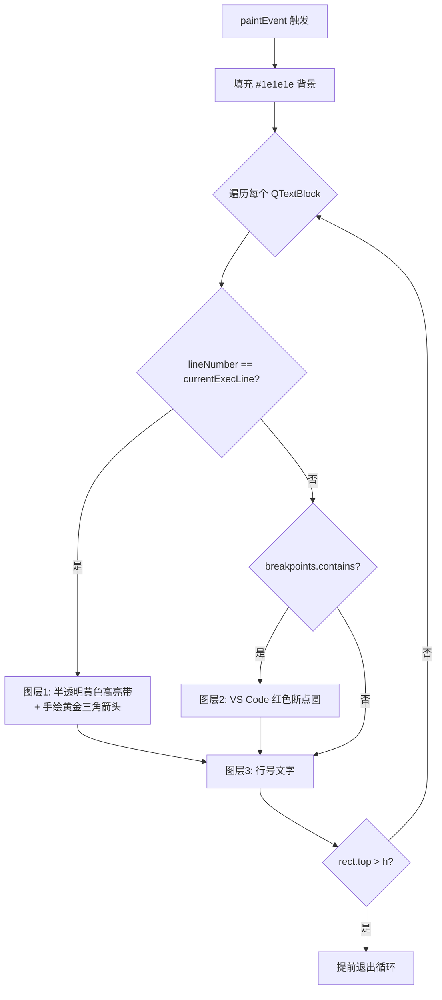
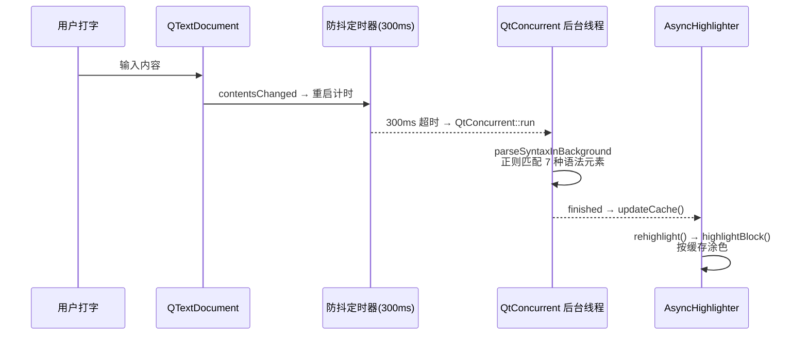
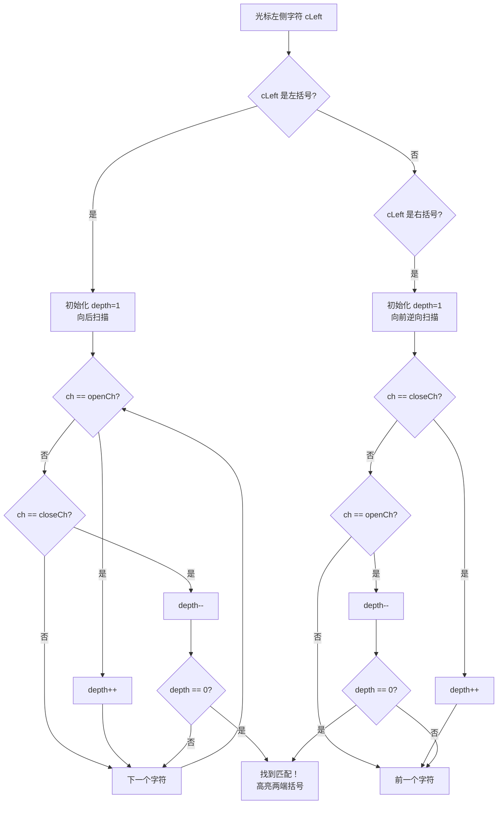
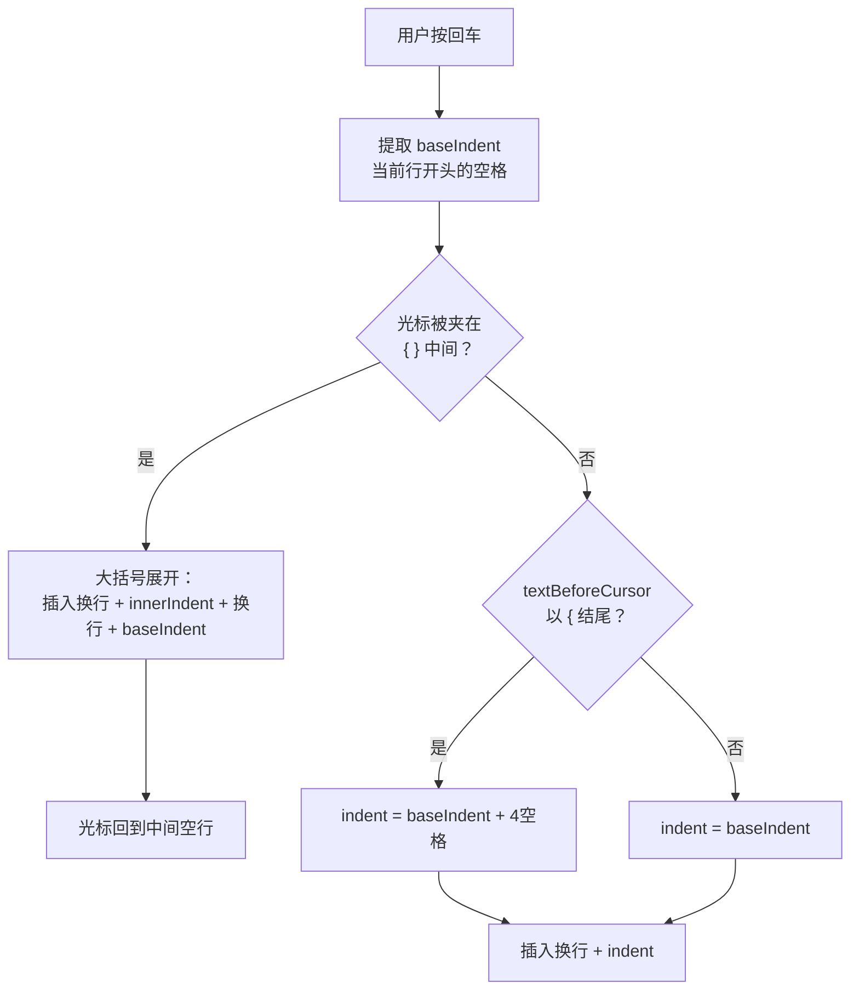

@[TOC](开启跨平台 UI 之旅)

# 前言

上一篇我们实现了多标签页编辑器和完整的文件操作流程——新建、打开、保存、拖拽打开、最近文件列表。但现在的编辑器还是个"纯文本显示器"——没有行号，代码全是同一个颜色，看起来跟记事本没什么区别。

这篇要给编辑器"化妆"。我们要实现的是让它从一个记事本蜕变为一个真正的代码编辑器：

- **行号显示**：QPainter 手绘行号面板，跟随滚动同步
- **断点管理**：点击行号区域添加/移除红色断点（GDB 调试预留）
- **异步语法高亮**：QtConcurrent 后台线程解析 + 300ms 防抖 + VS Code Dark+ 配色
- **括号配对高亮**：光标移到括号处自动高亮匹配的另一个括号
- **当前行高亮**：浅灰色背景标记当前编辑行
- **智能代码补全**：成对符号自动补全、回车智能缩进、Tab 展开代码片段

---

## 1 行号面板：QPainter 手绘的艺术

行号是代码编辑器最基础的视觉元素。Qt 没有现成的行号组件，但提供了强大的 `QPainter` 绘图 API，让我们可以用纯代码手绘一个。

### 1.1 为什么不用 QLabel 显示行号？

有人可能会想：用循环创建一堆 `QLabel` 显示行号不就行了？

问题在于：一个几百行的文件就要创建几百个 QLabel 对象，内存开销大，滚动时还要同步更新每个 label 的位置，性能灾难。而 QPainter 方案只需要 **一个 QWidget**，在 `paintEvent` 中逐行绘制，滚动时只需改一个 `scrollY` 偏移量，性能碾压 QLabel 方案。

### 1.2 LineNumberWidget 类结构

```cpp
class LineNumberWidget : public QWidget {
public:
    QTextEdit *editor;            // 关联的编辑器
    QSet<int> breakpoints;        // 存储断点行号
    int currentExecLine = -1;     // GDB 当前执行行 (-1=没在调试)

    LineNumberWidget(QTextEdit *parent) : QWidget(parent), editor(parent) {
        setMouseTracking(true);              // 开启鼠标追踪
        setCursor(Qt::PointingHandCursor);   // 鼠标变小手，暗示可点击
    }

    // GDB 预留接口：控制黄色箭头跳跃
    void setExecutionLine(int line) {
        currentExecLine = line;
        update(); // 触发重绘
    }
};
```

### 1.3 行号绘制：paintEvent 三图层渲染

行号面板的核心是 `paintEvent`，它用 QPainter 逐行绘制三种视觉元素：

```cpp
void paintEvent(QPaintEvent *) override {
    QPainter painter(this);
    painter.fillRect(rect(), QColor(0x1e, 0x1e, 0x1e)); // VS Code 极暗底色
    painter.setFont(editor->font());

    QTextBlock block = editor->document()->begin();
    int lineNumber = 1;
    int scrollY = editor->verticalScrollBar()->value(); // 滚动偏移量
    int h = height();

    while (block.isValid()) {
        QRectF bounds = editor->document()->documentLayout()->blockBoundingRect(block);
        QRectF rect = bounds.translated(0, -scrollY); // 平移到视口坐标

        if (rect.bottom() >= 0 && rect.top() <= h) {
            // 图层 1：GDB 当前执行行 —— 黄色箭头 + 高亮带
            if (lineNumber == currentExecLine) {
                painter.setPen(Qt::NoPen);
                painter.setBrush(QColor(255, 255, 0, 40)); // 半透明黄色高亮
                painter.drawRect(0, rect.top(), width(), rect.height());

                // 手绘经典黄金指针（三角形）
                QPolygonF arrow;
                int cx = 14, cy = rect.top() + rect.height() / 2;
                arrow << QPointF(cx - 5, cy - 4)
                      << QPointF(cx + 3, cy)
                      << QPointF(cx - 5, cy + 4);
                painter.setBrush(QColor(0xFF, 0xCC, 0x00));
                painter.drawPolygon(arrow);
            }
            // 图层 2：断点红圆
            else if (breakpoints.contains(lineNumber)) {
                painter.setPen(Qt::NoPen);
                painter.setBrush(QColor(0xE5, 0x14, 0x00)); // VS Code 错误红
                int radius = 10;
                int y = rect.top() + (rect.height() - radius) / 2;
                painter.drawEllipse(8, y, radius, radius);
            }

            // 图层 3：行号文字
            bool isHL = breakpoints.contains(lineNumber) || lineNumber == currentExecLine;
            painter.setPen(isHL ? QColor(0xCC, 0xCC, 0xCC) : QColor(0x85, 0x85, 0x85));
            painter.drawText(0, rect.top(), width() - 10, rect.height(),
                             Qt::AlignRight | Qt::AlignVCenter,
                             QString::number(lineNumber));
        }

        if (rect.top() > h) break; // 超出视口，提前退出（性能优化）
        block = block.next();
        lineNumber++;
    }
}
```


三个图层的渲染顺序：



### 1.4 断点管理：点击 Toggle

点击行号区域时，需要检测用户点中了哪一行，然后执行断点的添加/移除：

```cpp
void mousePressEvent(QMouseEvent *event) override {
    if (event->button() != Qt::LeftButton) return;

    // 换算绝对坐标：鼠标相对Y + 滚动偏移
    int scrollY = editor->verticalScrollBar()->value();
    int clickY = event->pos().y() + scrollY;

    QTextBlock block = editor->document()->begin();
    int lineNumber = 1;

    while (block.isValid()) {
        QRectF bounds = editor->document()->documentLayout()->blockBoundingRect(block);
        if (clickY >= bounds.top() && clickY <= bounds.bottom()) {
            // Toggle：有就删，没有就加
            if (breakpoints.contains(lineNumber))
                breakpoints.remove(lineNumber);
            else
                breakpoints.insert(lineNumber);

            // 写入编辑器属性，供 GDB 调试器读取
            QList<QVariant> bpList;
            for (int bp : std::as_const(breakpoints)) bpList.append(bp);
            editor->setProperty("breakpoints", bpList);

            update(); // 立刻重绘
            break;
        }
        block = block.next();
        lineNumber++;
    }
}
```


> 💡 **断点数据存在哪里？** 存在 QTextEdit 的 `property("breakpoints")` 里——一个 `QList<QVariant>`，存着所有断点行号。后续 GDB 调试器启动时，直接从这个属性里取出断点列表，用 `-break-insert` 指令批量设置。

---

## 2 异步语法高亮：后台线程 + 防抖 + VS Code Dark+ 配色

语法高亮是代码编辑器的灵魂。但直接在主线程做正则匹配，文件一大就会卡死 UI。这里用了一个 **生产者-消费者** 架构，通过 `QtConcurrent::run`[^2] 把耗时的解析工作扔到后台线程。

### 2.1 整体架构



### 2.2 数据结构：HighlightToken 和 HighlightCache

```cpp
struct HighlightToken {
    int start;          // 令牌在行内的起始位置
    int length;         // 令牌长度
    QTextCharFormat format; // 高亮格式（颜色、粗体等）
};

// 缓存：行号 -> 该行的所有令牌
typedef QHash<int, QVector<HighlightToken>> HighlightCache;
```

### 2.3 后台解析器：parseSyntaxInBackground

这个函数在 **后台线程** 执行，所以声明为 `static`。它逐行扫描文本，用正则表达式匹配 7 种语法元素：

```cpp
static HighlightCache parseSyntaxInBackground(const QString &fullText) {
    HighlightCache cache;
    QStringList lines = fullText.split('\n');

    // VS Code Dark+ 配色方案
    QTextCharFormat keywordFormat;    // 关键字 → 蓝色
    keywordFormat.setForeground(QColor(0x56, 0x9C, 0xD6));
    keywordFormat.setFontWeight(QFont::Bold);
    QRegularExpression keywordRegex(
        "\\b(int|float|double|char|void|if|else|for|while|return|"
        "struct|switch|case|break|continue|default)\\b"
    );

    QTextCharFormat preprocessorFormat; // 预处理器 → 品红色
    preprocessorFormat.setForeground(QColor(0xC5, 0x86, 0xC0));
    QRegularExpression preprocessorRegex("#[^\\\\n]*");

    QTextCharFormat numberFormat;      // 数字 → 绿色
    numberFormat.setForeground(QColor(0xB5, 0xCE, 0xA8));
    QRegularExpression numberRegex("\\b[0-9]+(\\.[0-9]+)?\\b");

    QTextCharFormat stringFormat;      // 字符串 → 橙色
    stringFormat.setForeground(QColor(0xCE, 0x91, 0x78));
    QRegularExpression stringRegex("\".*?\"");

    QTextCharFormat functionFormat;    // 函数名 → 黄色
    functionFormat.setForeground(QColor(0xDC, 0xDC, 0xAA));
    QRegularExpression functionRegex("\\b[A-Za-z0-9_]+(?=\\()");

    QTextCharFormat commentFormat;     // 注释 → 绿色
    commentFormat.setForeground(QColor(0x6A, 0x99, 0x55));
    QRegularExpression singleCommentRegex("//[^\\\\n]*");

    // 多行注释状态机
    bool inMultiLineComment = false;

    for (int i = 0; i < lines.size(); ++i) {
        QString text = lines[i];
        QVector<HighlightToken> blockTokens;

        // 快速匹配辅助函数
        auto matchRule = [&](const QRegularExpression &regex,
                             const QTextCharFormat &format) {
            QRegularExpressionMatchIterator it = regex.globalMatch(text);
            while (it.hasNext()) {
                QRegularExpressionMatch match = it.next();
                blockTokens.append({
                    static_cast<int>(match.capturedStart()),
                    static_cast<int>(match.capturedLength()),
                    format
                });
            }
        };

        if (!inMultiLineComment) {
            matchRule(keywordRegex, keywordFormat);
            matchRule(preprocessorRegex, preprocessorFormat);
            matchRule(numberRegex, numberFormat);
            matchRule(stringRegex, stringFormat);
            matchRule(functionRegex, functionFormat);
            matchRule(singleCommentRegex, commentFormat);
        }

        // 多行注释状态机（/* ... */ 跨行处理）
        int startIndex = inMultiLineComment ? 0 : text.indexOf("/*");
        while (startIndex >= 0) {
            QRegularExpressionMatch match = QRegularExpression("\\*/").match(text, startIndex);
            int endIndex = match.capturedStart();
            int commentLength = 0;

            if (endIndex == -1) {
                inMultiLineComment = true;
                commentLength = text.length() - startIndex;
            } else {
                inMultiLineComment = false;
                commentLength = endIndex - startIndex + match.capturedLength();
            }

            blockTokens.append({startIndex, commentLength, commentFormat});
            startIndex = text.indexOf("/*", startIndex + commentLength);
        }

        if (!blockTokens.isEmpty()) cache[i] = blockTokens;
    }
    return cache;
}
```


### 2.4 前端渲染器：AsyncHighlighter

`AsyncHighlighter` 是 `QSyntaxHighlighter`[^1] 的子类，它的工作很简单——从缓存中取令牌，涂色：

```cpp
class AsyncHighlighter : public QSyntaxHighlighter {
    Q_OBJECT
public:
    explicit AsyncHighlighter(QTextDocument *parent = nullptr)
        : QSyntaxHighlighter(parent) {}

    // 接收后台计算结果
    void updateCache(const HighlightCache &newCache) {
        tokenCache = newCache;
        rehighlight(); // 命令主线程瞬间重绘全文
    }

protected:
    // Qt 按 block（段落）回调，每个 block 就是一行
    void highlightBlock(const QString &text) override {
        int blockNum = currentBlock().blockNumber();
        if (tokenCache.contains(blockNum)) {
            const QVector<HighlightToken> &tokens = tokenCache[blockNum];
            for (const HighlightToken &token : tokens) {
                setFormat(token.start, token.length, token.format);
            }
        }
    }

private:
    HighlightCache tokenCache;
};
```

### 2.5 防抖 + 调度：在新建标签页时连接

```cpp
// 挂载高亮前端渲染器
AsyncHighlighter *highlighter = new AsyncHighlighter(newTextEdit->document());

// 防抖定时器 —— 300ms
QTimer *debounceTimer = new QTimer(newTextEdit);
debounceTimer->setSingleShot(true);
debounceTimer->setInterval(300);

// 后台线程监视器
QFutureWatcher<HighlightCache> *watcher = new QFutureWatcher<HighlightCache>(newTextEdit);

// 文字改变 → 重启防抖
connect(newTextEdit->document(), &QTextDocument::contentsChanged,
        debounceTimer, [=]() { debounceTimer->start(); });

// 300ms 超时 → 发送到后台
connect(debounceTimer, &QTimer::timeout, newTextEdit, [=]() {
    if (watcher->isRunning()) return; // 上一波还没算完就别催
    QFuture<HighlightCache> future = QtConcurrent::run(
        parseSyntaxInBackground, newTextEdit->toPlainText()
    );
    watcher->setFuture(future);
});

// 后台算完 → 交给前端瞬间涂色
connect(watcher, &QFutureWatcher<HighlightCache>::finished, newTextEdit, [=]() {
    highlighter->updateCache(watcher->result());
});
```

> 💡 **为什么要 300ms 防抖？** 因为用户打字速度很快，每敲一个字就触发一次全文解析会浪费大量 CPU。防抖[^3]的逻辑是：用户停止打字 300ms 后才开始解析，这样既保证了响应速度，又避免了频繁解析。

---

## 3 括号配对 + 当前行高亮

光标移动时，编辑器需要实时反馈"你现在在哪一行"和"光标旁边的括号对应哪个"。这两个功能通过 `QTextEdit::ExtraSelection` 机制实现。

### 3.1 ExtraSelection 是什么？

`ExtraSelection` 是 QTextEdit 提供的"额外高亮"机制——可以在不改变用户选区的前提下，在文本上叠加多层半透明高亮。所有高亮效果通过 `setExtraSelections()` 一次性提交。

### 3.2 当前行高亮

```cpp
connect(newTextEdit, &QTextEdit::cursorPositionChanged, this, [=]() {
    QList<QTextEdit::ExtraSelection> selections;

    // 当前行高亮：浅灰色背景，覆盖整行宽度
    QTextEdit::ExtraSelection lineSelection;
    QColor lineColor(128, 128, 128, 30); // 低透明度，不遮盖文字
    lineSelection.format.setBackground(lineColor);
    lineSelection.format.setProperty(QTextFormat::FullWidthSelection, true);
    lineSelection.cursor = newTextEdit->textCursor();
    lineSelection.cursor.clearSelection();
    selections.append(lineSelection);

    // ... 括号配对逻辑见下方 ...

    newTextEdit->setExtraSelections(selections); // 一次性提交所有高亮
});
```

关键属性：

| 属性 | 作用 |
|------|------|
| `FullWidthSelection = true` | 高亮覆盖整行宽度（包括空白区域） |
| `clearSelection()` | 只高亮光标所在行，不选中任何文字 |
| `QColor(128, 128, 128, 30)` | 低 alpha 值确保不遮盖文字颜色 |

### 3.3 括号配对高亮

当光标紧邻一个括号时，自动找到并高亮匹配的另一个括号：

```cpp
// 辅助 lambda：高亮指定位置的括号字符
auto highlightBracket = [&](int bracketPos) {
    QTextEdit::ExtraSelection bSel;
    bSel.cursor = newTextEdit->textCursor();
    bSel.cursor.setPosition(bracketPos);
    bSel.cursor.movePosition(QTextCursor::Right, QTextCursor::KeepAnchor, 1);
    bSel.format.setBackground(QColor(0, 122, 204, 80)); // 亮蓝色背景
    bSel.format.setFontWeight(QFont::Bold);
    selections.append(bSel);
};

QTextDocument *doc = newTextEdit->document();
int pos = newTextEdit->textCursor().position();

if (pos > 0 && pos <= doc->characterCount()) {
    QChar cLeft = doc->characterAt(pos - 1); // 光标左侧的字符

    // 情况 A：光标左侧是左括号 → 向后扫描找匹配的右括号
    if (cLeft == '(' || cLeft == '[' || cLeft == '{') {
        QChar openCh = cLeft;
        QChar closeCh = (openCh == '(') ? ')' : ((openCh == '[') ? ']' : '}');
        int depth = 1;

        for (int i = pos; i < doc->characterCount(); ++i) {
            QChar ch = doc->characterAt(i);
            if (ch == openCh) depth++;
            else if (ch == closeCh) depth--;
            if (depth == 0) {
                highlightBracket(pos - 1); // 点亮左括号
                highlightBracket(i);       // 点亮匹配的右括号
                break;
            }
        }
    }
    // 情况 B：光标左侧是右括号 → 向前逆向扫描找匹配的左括号
    else if (cLeft == ')' || cLeft == ']' || cLeft == '}') {
        QChar closeCh = cLeft;
        QChar openCh = (closeCh == ')') ? '(' : ((closeCh == ']') ? '[' : '{');
        int depth = 1;

        for (int i = pos - 2; i >= 0; --i) {
            QChar ch = doc->characterAt(i);
            if (ch == closeCh) depth++;
            else if (ch == openCh) depth--;
            if (depth == 0) {
                highlightBracket(pos - 1); // 点亮右括号
                highlightBracket(i);       // 点亮匹配的左括号
                break;
            }
        }
    }
}
```


配对检测的核心是 **深度计数法**：



---

## 4 智能代码补全与缩进

这一节实现三种提升编码效率的交互：成对符号自动补全、回车智能缩进、Tab 展开代码片段。全部在 `eventFilter` 的 `KeyPress` 事件中处理。

### 4.1 成对符号自动补全

输入左括号时，自动补上右括号，光标居中：

```cpp
if (event->type() == QEvent::KeyPress) {
    QKeyEvent *keyEvent = static_cast<QKeyEvent*>(event);
    QTextEdit *edit = qobject_cast<QTextEdit*>(obj);

    if (edit && edit->objectName() != "terminalEdit") {
        QString textToInsert;
        bool matched = false;

        if (keyEvent->key() == Qt::Key_ParenLeft)        { textToInsert = "()"; matched = true; }
        else if (keyEvent->key() == Qt::Key_BracketLeft) { textToInsert = "[]"; matched = true; }
        else if (keyEvent->key() == Qt::Key_BraceLeft)   { textToInsert = "{}"; matched = true; }
        else if (keyEvent->text() == "\"")               { textToInsert = "\"\""; matched = true; }
        else if (keyEvent->text() == "'")                { textToInsert = "''"; matched = true; }

        if (matched) {
            edit->insertPlainText(textToInsert);
            // 光标左移一位，落在两个符号中间
            QTextCursor cursor = edit->textCursor();
            cursor.movePosition(QTextCursor::Left, QTextCursor::MoveAnchor, 1);
            edit->setTextCursor(cursor);
            return true; // 告诉系统：按键已处理，不要再打字符了
        }
    }
}
```

效果：输入 `(` 会变成 `()`，光标在中间；输入 `{` 会变成 `{}`，光标在中间。


### 4.2 回车智能缩进

按回车时，自动继承当前行的缩进；如果光标在 `{}` 中间，还会多缩进 4 空格：

```cpp
if (keyEvent->key() == Qt::Key_Return || keyEvent->key() == Qt::Key_Enter) {
    QTextCursor cursor = edit->textCursor();
    QString currentLine = cursor.block().text();
    int posInBlock = cursor.positionInBlock();
    QString textBeforeCursor = currentLine.left(posInBlock);

    // 提取当前行的基础缩进（开头的空格）
    QString baseIndent = "";
    for (int i = 0; i < currentLine.length(); ++i) {
        if (currentLine[i].isSpace()) baseIndent += currentLine[i];
        else break;
    }

    // 智能感知：光标是否被夹在 { } 中间？
    int pos = cursor.position();
    QTextDocument *doc = edit->document();
    if (pos > 0 && pos < doc->characterCount()) {
        if (doc->characterAt(pos - 1) == '{' && doc->characterAt(pos) == '}') {
            // 大括号展开魔法！
            QString innerIndent = baseIndent + "    "; // 内部多缩进 4 空格
            edit->insertPlainText("\n" + innerIndent + "\n" + baseIndent);

            // 光标回到中间空行的末尾
            QTextCursor newCursor = edit->textCursor();
            newCursor.movePosition(QTextCursor::Up, QTextCursor::MoveAnchor, 1);
            newCursor.movePosition(QTextCursor::EndOfLine);
            edit->setTextCursor(newCursor);
            return true;
        }
    }

    // 常规缩进：继承基础缩进，如果光标左侧以 { 结尾则多缩进 4 空格
    QString indent = baseIndent;
    if (textBeforeCursor.trimmed().endsWith('{')) {
        indent += "    ";
    }
    edit->insertPlainText("\n" + indent);
    return true;
}
```

缩进流程：



### 4.3 Tab 展开代码片段

输入关键字后按 Tab，自动展开为完整的代码骨架：

```cpp
if (keyEvent->key() == Qt::Key_Tab) {
    QTextCursor cursor = edit->textCursor();

    // 提取当前行的基础缩进
    QString currentLine = cursor.block().text();
    QString baseIndent = "";
    for (int i = 0; i < currentLine.length(); ++i) {
        if (currentLine[i].isSpace()) baseIndent += currentLine[i];
        else break;
    }
    QString innerIndent = baseIndent + "    ";

    // 选中光标所在的单词
    cursor.select(QTextCursor::WordUnderCursor);
    QString currentWord = cursor.selectedText();

    if (currentWord == "main") {
        QString mainBody = "int main() {\n" +
                           innerIndent + "\n" +
                           innerIndent + "return 0;\n" +
                           baseIndent + "}";
        cursor.insertText(mainBody);
        // 光标回到函数体内部的空行
        cursor.movePosition(QTextCursor::Up, QTextCursor::MoveAnchor, 2);
        cursor.movePosition(QTextCursor::EndOfLine);
        edit->setTextCursor(cursor);
        return true;
    }
    else if (currentWord == "for") {
        cursor.insertText("for (int i = 0; i < ; i++) {\n" +
                          innerIndent + "\n" + baseIndent + "}");
        cursor.movePosition(QTextCursor::Up, QTextCursor::MoveAnchor, 2);
        cursor.movePosition(QTextCursor::EndOfLine);
        cursor.movePosition(QTextCursor::Left, QTextCursor::MoveAnchor, 8);
        edit->setTextCursor(cursor);
        return true;
    }
    else if (currentWord == "inc") {
        cursor.insertText("#include <stdio.h>\n");
        return true;
    }
    // ... 还有 while, switch 等更多片段
}
```

目前支持的代码片段：

| 关键词 | 展开内容 |
|--------|----------|
| `main` | 完整的 main 函数骨架（含 return 0） |
| `for` | for 循环模板（光标停在条件位置） |
| `inc` | `#include <stdio.h>` |
| `while` | while 循环模板 |
| `switch` | switch-case 模板 |


> 💡 **为什么 `return true` 很重要？** 在 `eventFilter` 中，返回 `true` 表示"这个事件我已经处理了，系统不要再做任何事情"。如果不返回 `true`，系统还会在编辑器里打出一个 Tab 字符或换行符，导致重复输入。

---

# 本篇总结

编辑器从一个记事本蜕变为真正的代码编辑器。回顾一下：

| 功能 | 核心技术 | 关键 API |
|------|----------|----------|
| 行号显示 | QPainter 手绘 + 滚动同步 | `paintEvent()`, `drawText()` |
| 断点管理 | 点击 Toggle + 属性存储 | `breakpoints` QSet, `setProperty()` |
| GDB 执行箭头 | 手绘多边形 | `drawPolygon()`, `setExecutionLine()` |
| 异步语法高亮 | QtConcurrent + 防抖 300ms | `QtConcurrent::run()`, `QFutureWatcher` |
| VS Code Dark+ 配色 | 7 种正则匹配规则 | `QRegularExpression`, `QTextCharFormat` |
| 当前行高亮 | ExtraSelection 整行高亮 | `FullWidthSelection` |
| 括号配对 | 深度计数法 | `ExtraSelection`, `characterAt()` |
| 成对符号补全 | eventFilter 拦截 | `insertPlainText()`, `return true` |
| 回车智能缩进 | 感知 { } 上下文 | `textBeforeCursor`, `baseIndent` |
| Tab 代码片段 | 关键词匹配 + 骨架展开 | `WordUnderCursor` |

本篇核心代码量约 **500 行**，实现了编辑器 80% 的视觉增强功能。

---

# 下一篇预告

编辑器的外观和编辑体验已经到位了。**第 5 篇**将让编辑器"活"起来——集成一个真正的终端：

- **集成 PowerShell 终端**：QProcess 启动真 PowerShell 进程
- **stdin/stdout 管道通信**：实时读写终端输出
- **只读边界保护**：防止用户修改历史输出
- **命令历史回溯**：上下键翻阅历史命令
- **Tab 路径自动补全**：循环切换匹配项
- **Ctrl+C 中断**：kill + 重启进程模拟 SIGINT
- **F5 一键编译运行**：gcc 编译 + 弹出独立控制台

敬请期待！

---

## 脚注

[^1]: `QSyntaxHighlighter` 是 Qt 提供的语法高亮基类，通常在 `highlightBlock()` 回调中逐行涂色。但传统用法是在主线程同步执行，文件一大就会卡顿。我们的 `AsyncHighlighter` 是一个变体——它不自己解析语法，而是从后台线程的缓存中取现成的令牌来涂色，实现了"后台解析 + 前端渲染"的分离。

[^2]: `QtConcurrent::run()` 是 Qt 提供的最简单的多线程 API，一行代码就能把函数扔到后台线程执行。底层使用全局线程池（QThreadPool），无需手动管理线程生命周期。配合 `QFutureWatcher` 可以异步获取结果，避免阻塞主线程。

[^3]: 防抖（Debounce）是前端开发中常用的性能优化策略：连续触发事件时，只在最后一次触发后等待一段时间才真正执行。这样可以将高频事件（如打字、滚动）合并为低频执行（每 300ms 一次），大幅降低 CPU 开销。

