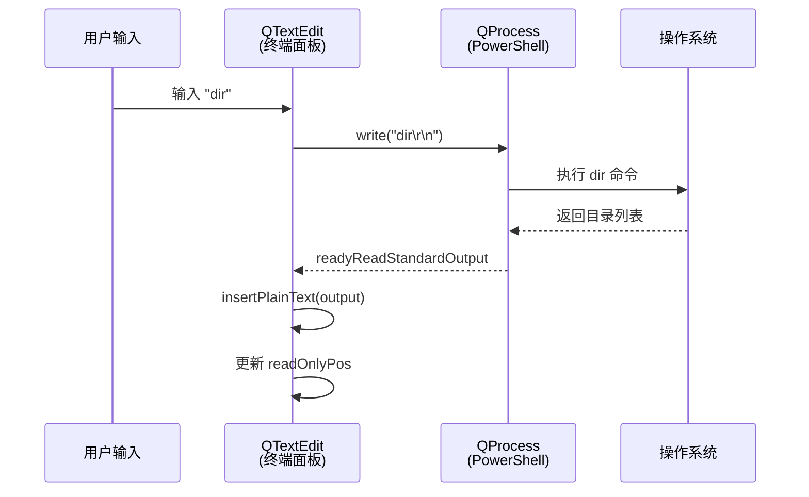
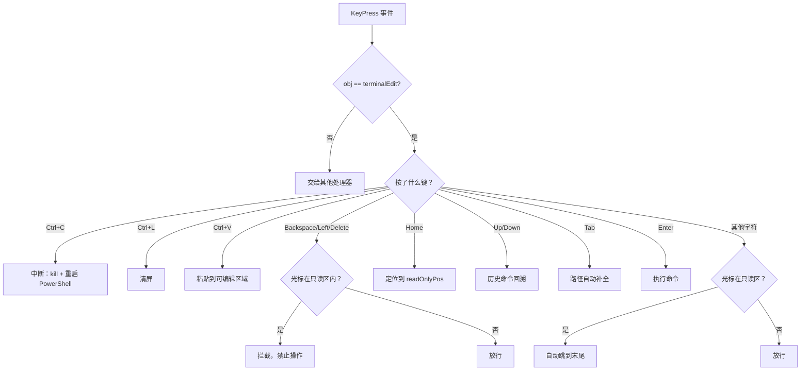
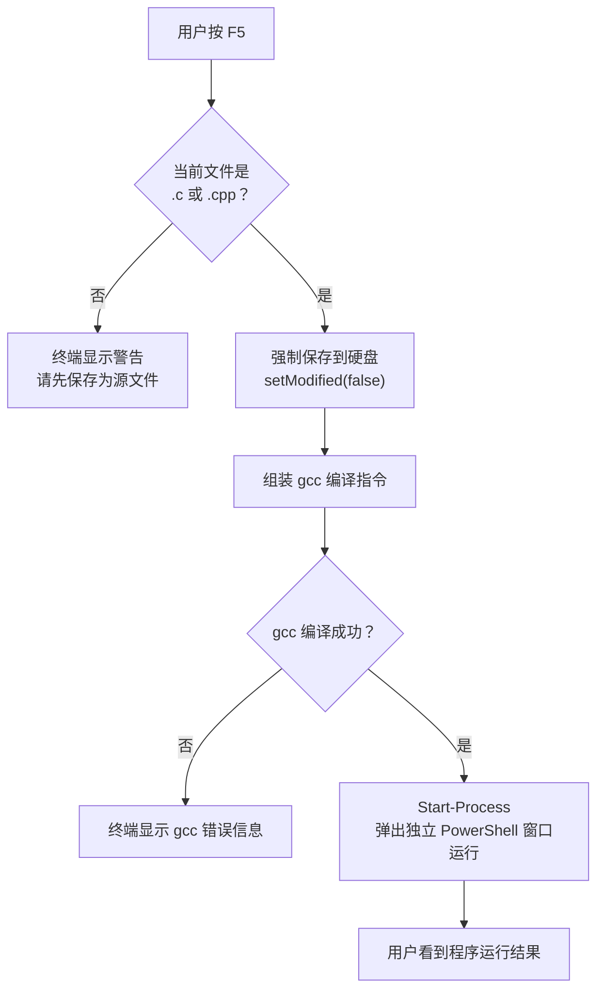
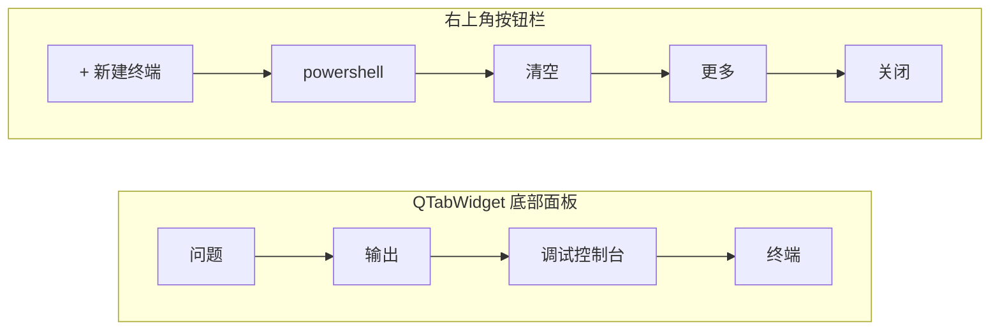

@[TOC](开启跨平台 UI 之旅)

# 前言

上一篇我们给编辑器做了"化妆"——行号、语法高亮、括号配对、代码补全。现在编辑器看起来已经很像 VS Code 了，但还缺一个关键能力：**执行命令**。

每次写完 C 代码，还得切到外面的终端手动 `gcc` 编译，太麻烦了。VS Code 底部那个集成终端，才是真正的生产力工具。

这篇要实现的是：

- **集成 PowerShell 终端**：QProcess 启动真 PowerShell 进程，stdin/stdout 管道通信
- **只读边界保护**：防止用户修改历史输出
- **命令历史回溯**：上下键翻阅历史命令
- **Tab 路径自动补全**：循环切换匹配项
- **Ctrl+C 中断**：kill + 重启进程模拟 SIGINT
- **F5 一键编译运行**：gcc 编译 + 弹出独立控制台运行
- **终端右键菜单**：复制/粘贴/全选/清空

---

## 1 终端基础：QProcess + PowerShell

### 1.1 整体架构

集成终端的本质是：用 `QProcess`[^1] 启动一个真实的 PowerShell 进程，通过 stdin/stdout 管道与它通信。用户在 QTextEdit 中输入命令 → 写入进程 stdin → 进程执行后输出到 stdout → 我们读取并显示在 QTextEdit 上。



### 1.2 创建终端编辑器

终端面板本质上是一个 `QTextEdit`，但通过 `readOnlyPos` 属性模拟"只读区域"——光标不能越过这个位置修改历史输出：

```cpp
QTextEdit *terminalEdit = new QTextEdit(this);
terminalEdit->setReadOnly(false);                    // 非只读（通过 readOnlyPos 模拟）
terminalEdit->setObjectName("terminalEdit");          // 命名以便 findChild 定位
terminalEdit->installEventFilter(this);               // 安装事件过滤器
terminalEdit->viewport()->installEventFilter(this);   // viewport 也要安装（右键菜单）
terminalEdit->setContextMenuPolicy(Qt::PreventContextMenu); // 阻止默认右键菜单

// 注入动态属性
terminalEdit->setProperty("history", QStringList());  // 命令历史栈
terminalEdit->setProperty("historyIdx", 0);           // 历史索引
terminalEdit->setProperty("isRunningChild", false);   // 是否在运行子进程
```

> 💡 **`readOnlyPos` 是什么？** 这是一个整数，记录了"只读边界"的位置。`readOnlyPos` 之前的文字是历史输出（不可编辑），之后的区域是用户输入区。每次 PowerShell 输出新内容后，`readOnlyPos` 就往后移。

### 1.3 创建 QProcess 并启动 PowerShell

```cpp
QProcess *cmdProcess = new QProcess(this);
cmdProcess->setObjectName("cmdProcess");
cmdProcess->setProcessChannelMode(QProcess::MergedChannels);

cmdProcess->start("powershell.exe", QStringList()
    << "-NoProfile"                              // 不加载用户配置文件
    << "-ExecutionPolicy" << "Bypass"            // 绕过执行策略
    << "-NoExit"                                 // 执行完不退出
    << "-Command" << "function prompt { 'PS ' + $pwd.Path + '> ' }"  // 自定义提示符
);
```

启动参数解释：

| 参数 | 作用 |
|------|------|
| `-NoProfile` | 跳过用户 PowerShell 配置文件，启动更快 |
| `-ExecutionPolicy Bypass` | 绕过脚本执行策略限制 |
| `-NoExit` | 保持进程常驻，不自动退出 |
| `-Command "function prompt {...}"`[^2] | 注入自定义提示符，消灭默认的代码回显 |

### 1.4 接收 PowerShell 输出

```cpp
connect(cmdProcess, &QProcess::readyReadStandardOutput, this, [=]() {
    QTextCursor cursor = terminalEdit->textCursor();
    cursor.movePosition(QTextCursor::End);
    terminalEdit->setTextCursor(cursor);

    // 读取 PowerShell 输出（本地编码）
    QString output = QString::fromLocal8Bit(cmdProcess->readAllStandardOutput());
    terminalEdit->insertPlainText(output);
    terminalEdit->ensureCursorVisible();

    // 延迟 50ms 后更新只读边界（等待数据碎片全部到达）
    QTimer::singleShot(50, this, [=]() {
        QTextCursor c = terminalEdit->textCursor();
        c.movePosition(QTextCursor::End);
        terminalEdit->setProperty("readOnlyPos", c.position());
    });
});
```


为什么要延迟 50ms 更新 `readOnlyPos`？因为 PowerShell 的输出可能分多个数据包到达，如果每次 `readyRead` 都立刻更新边界，可能会在数据还没完全到达时就锁定了边界，导致部分输出被标记为"不可编辑"。50ms 的缓冲确保所有碎片都到达后再锁定。

---

## 2 终端键盘交互：全键盘接管

终端的键盘交互是最复杂的部分——所有按键都要在 `eventFilter` 中拦截处理。因为 QTextEdit 默认的键盘行为（选区删除、光标移动等）会破坏终端的只读边界。

### 2.1 事件拦截架构



### 2.2 只读边界保护

终端的核心约束：**用户不能修改历史输出区域**。通过 `readOnlyPos` 属性实现：

```cpp
// Backspace / Left / Delete 只读边界保护
if (keyEvent->key() == Qt::Key_Backspace ||
    keyEvent->key() == Qt::Key_Left ||
    keyEvent->key() == Qt::Key_Delete) {
    // 光标在只读区内，且没有选区 → 拦截
    if (cursor.position() <= readOnlyPos && !cursor.hasSelection())
        return true;

    // 选区起点侵入只读区 → 拦截删除（但允许 Left 移动）
    if (cursor.hasSelection() && cursor.selectionStart() < readOnlyPos) {
        if (keyEvent->key() != Qt::Key_Left) return true;
    }
}

// Home 键：直接跳到只读边界（而不是行首）
if (keyEvent->key() == Qt::Key_Home) {
    cursor.setPosition(readOnlyPos);
    term->setTextCursor(cursor);
    return true;
}

// 如果光标在只读区且按了任意字符键 → 自动跳到末尾
if (cursor.position() < readOnlyPos && !keyEvent->text().isEmpty()) {
    cursor.movePosition(QTextCursor::End);
    term->setTextCursor(cursor);
}
```

### 2.3 Ctrl+C 中断

PowerShell 没有真正的 SIGINT 信号，我们用 kill + 重启来模拟：

```cpp
if (keyEvent->modifiers() & Qt::ControlModifier) {
    if (keyEvent->key() == Qt::Key_C) {
        // 如果用户选中了文字，就正常复制
        if (cursor.hasSelection()) return false;

        // 显示 ^C 提示
        term->moveCursor(QTextCursor::End);
        term->insertPlainText("^C\n");

        // 杀掉当前进程，重启 PowerShell
        cmd->kill();
        cmd->start("powershell.exe", QStringList()
            << "-NoProfile" << "-ExecutionPolicy" << "Bypass"
            << "-NoExit" << "-Command" << "-"
        );
        term->setProperty("isRunningChild", false);
        return true;
    }
}
```

> 💡 **为什么 `kill()` 后要重新 `start()`？** 因为 `QProcess::kill()` 会终止进程，进程状态变为 `NotRunning`。如果不再启动一个新的，后续所有命令都无法执行。重启后就是一个全新的 PowerShell 实例。

### 2.4 历史命令回溯

用 Up/Down 键翻阅历史命令，类似真实终端的体验：

```cpp
if (keyEvent->key() == Qt::Key_Up || keyEvent->key() == Qt::Key_Down) {
    QStringList history = term->property("history").toStringList();
    int historyIdx = term->property("historyIdx").toInt();

    if (history.isEmpty()) return true;

    if (keyEvent->key() == Qt::Key_Up)
        historyIdx = qMax(0, historyIdx - 1);
    else
        historyIdx = qMin(history.size(), historyIdx + 1);

    term->setProperty("historyIdx", historyIdx);

    // 删除当前输入行的内容
    cursor.setPosition(readOnlyPos);
    cursor.movePosition(QTextCursor::End, QTextCursor::KeepAnchor);
    cursor.removeSelectedText();

    // 替换为历史命令
    if (historyIdx < history.size())
        term->insertPlainText(history[historyIdx]);

    return true;
}
```

### 2.5 Tab 路径自动补全

Tab 补全的核心逻辑：提取光标前的路径前缀 → 用 PowerShell 解析匹配项 → 循环切换：

```cpp
if (keyEvent->key() == Qt::Key_Tab) {
    bool isTabbing = term->property("isTabbing").toBool();
    QStringList matches = term->property("tabMatches").toStringList();
    int tabIdx = term->property("tabIdx").toInt();
    int tabStartPos = term->property("tabStartPos").toInt();

    if (!isTabbing) {
        // 首次按 Tab：提取前缀，用 PowerShell Get-ChildItem 获取匹配项
        cursor.setPosition(readOnlyPos);
        cursor.movePosition(QTextCursor::End, QTextCursor::KeepAnchor);
        QString input = cursor.selectedText();
        int lastSpace = input.lastIndexOf(' ');
        QString prefix = (lastSpace >= 0) ? input.mid(lastSpace + 1) : input;

        // 如果是 cd 命令，只搜文件夹
        QString cmd = (input.trimmed().startsWith("cd "))
            ? QString("Get-ChildItem -Path '%1' -Directory -Name").arg(prefix)
            : QString("Get-ChildItem -Path '%1' -Name").arg(prefix);

        cmdProcess->write(("& { " + cmd + " }\r\n").toLocal8Bit());
        // ... 解析输出，存入 tabMatches ...
    } else {
        // 连按 Tab：循环切换匹配项
        tabIdx = (tabIdx + 1) % matches.size();
        cursor.setPosition(tabStartPos);
        cursor.movePosition(QTextCursor::End, QTextCursor::KeepAnchor);
        cursor.insertText(matches[tabIdx]);
    }
    return true;
}
```

### 2.6 回车执行命令

```cpp
if (keyEvent->key() == Qt::Key_Return || keyEvent->key() == Qt::Key_Enter) {
    cursor.setPosition(readOnlyPos);
    cursor.movePosition(QTextCursor::End, QTextCursor::KeepAnchor);
    QString input = cursor.selectedText().trimmed();

    // 加入历史记录
    if (!input.isEmpty()) {
        history.append(input);
        term->setProperty("history", history);
        term->setProperty("historyIdx", history.size());
    }

    // 发送给 PowerShell
    cursor.movePosition(QTextCursor::End);
    term->setTextCursor(cursor);
    term->insertPlainText("\n");
    term->setProperty("readOnlyPos", term->textCursor().position());

    if (cmd && cmd->state() == QProcess::Running) {
        QByteArray data = input.toLocal8Bit() + "\r\n";
        cmd->write(data);
    }
    return true;
}
```

---

## 3 F5 一键编译运行

写完代码按 F5 就能编译运行——这是最提升生产力的功能。

### 3.1 编译运行流程



### 3.2 核心代码

```cpp
QAction *runAction = new QAction("运行程序", this);
runAction->setShortcut(QKeySequence(Qt::Key_F5));
this->addAction(runAction);

connect(runAction, &QAction::triggered, this, [=]() {
    QTextEdit *currentEdit = qobject_cast<QTextEdit*>(ui->tabWidget->currentWidget());
    if (!currentEdit) return;

    // 检查文件类型
    QString filePath = currentEdit->property("filePath").toString();
    if (filePath.isEmpty() || (!filePath.endsWith(".c") && !filePath.endsWith(".cpp"))) {
        terminalDock->show();
        terminalEdit->insertPlainText(
            "\n⚠️ 警告：请先按 Ctrl+S 将当前代码保存为 .c 或 .cpp 文件！\n");
        return;
    }

    // 1. 强制保存到硬盘
    QFile saveFile(filePath);
    if (saveFile.open(QIODevice::WriteOnly | QIODevice::Text)) {
        QTextStream out(&saveFile);
        out << currentEdit->toPlainText();
        saveFile.close();
        currentEdit->document()->setModified(false);
        int idx = ui->tabWidget->indexOf(currentEdit);
        if (idx != -1)
            ui->tabWidget->setTabText(idx, QFileInfo(filePath).fileName());
    }

    // 2. 组装编译指令
    QFileInfo fileInfo(filePath);
    QString forwardDir = QDir::fromNativeSeparators(fileInfo.absolutePath());
    QString baseName = fileInfo.completeBaseName();
    QString exeName = baseName + ".exe";

    // 在 PowerShell 中编译，成功后弹出独立窗口运行
    QString command = QString(
        "cd '%1'; gcc '%2' -o '%3'; "
        "if ($?) { "
        "  Start-Process powershell -ArgumentList "
        "'-NoProfile -ExecutionPolicy Bypass -NoExit -Command \"& ''%1/%4''; Pause\"' "
        "}\r\n"
    ).arg(forwardDir, fileInfo.fileName(), exeName, exeName);

    // 3. 发送给终端的 PowerShell
    QProcess *cmd = this->findChild<QProcess*>("cmdProcess");
    if (cmd && cmd->state() == QProcess::Running) {
        cmd->write(command.toLocal8Bit());
    }

    terminalDock->show();
    terminalEdit->setFocus();
});
```

### 3.3 为什么要弹出独立窗口？

你可能会问：为什么不在集成终端里直接运行？因为集成终端的 QTextEdit 是我们自己模拟的，`scanf` 等需要真实 stdin 的函数会卡死。

解决方案是用 `Start-Process`[^3] 弹出一个 **原生 PowerShell 窗口**，在这个真正的终端中运行程序。这样 `scanf` 就能正常接收输入了。

> 💡 **`Start-Process` 的妙用**：`Start-Process powershell -ArgumentList '...'` 会启动一个新的 PowerShell 窗口。参数中的 `-Command "& ''path/exe''; Pause"` 会在运行完后暂停（`Pause`），让用户看到输出结果。

---

## 4 终端 UI 与右键菜单

### 4.1 底部面板布局

终端面板嵌入在 `QDockWidget` 中，放在窗口底部。标签栏右上角有一排控制按钮：



按钮使用 SVG 图标（通过 `QSvgRenderer` 渲染内联 SVG 字符串）：

```cpp
// 新建终端按钮（带下拉菜单：PowerShell / CMD）
QToolButton *btnNewTerm = new QToolButton(cornerWidget);
btnNewTerm->setIcon(iconPlus);
btnNewTerm->setPopupMode(QToolButton::MenuButtonPopup);
QMenu *termMenu = new QMenu(btnNewTerm);
termMenu->addAction("PowerShell");
termMenu->addAction("CMD");
btnNewTerm->setMenu(termMenu);

// 清空终端按钮
QToolButton *btnClear = new QToolButton(cornerWidget);
btnClear->setIcon(iconTrash);
btnClear->setToolTip("清空终端");
```


### 4.2 终端右键菜单

终端的右键菜单需要自己实现（因为 QTextEdit 的默认右键菜单会干扰终端操作）：

```cpp
if (termObj && event->type() == QEvent::ContextMenu) {
    QMenu contextMenu(this);
    QAction *copyAct = contextMenu.addAction("复制 (Ctrl+C)");
    QAction *pasteAct = contextMenu.addAction("粘贴 (Ctrl+V)");
    QAction *selectAllAct = contextMenu.addAction("全选 (Ctrl+A)");
    contextMenu.addSeparator();
    QAction *clearAct = contextMenu.addAction("清空终端");
    QAction *clearHostAct = contextMenu.addAction("Clear-Host");

    connect(copyAct, &QAction::triggered, this, [=]() {
        if (term && term->textCursor().hasSelection())
            QGuiApplication::clipboard()->setText(term->textCursor().selectedText());
    });
    connect(pasteAct, &QAction::triggered, this, [=]() {
        if (term && cmd && cmd->state() == QProcess::Running) {
            QString text = QGuiApplication::clipboard()->text();
            text.replace(QChar(0x2029), '\n');
            cmd->write(text.toLocal8Bit() + "\r\n");
            term->moveCursor(QTextCursor::End);
            term->insertPlainText(text);
        }
    });
    connect(clearHostAct, &QAction::triggered, this, [=]() {
        if (cmd && cmd->state() == QProcess::Running)
            cmd->write("Clear-Host\r\n");
    });

    contextMenu.exec(cme->globalPos());
    return true;
}
```


### 4.3 在资源管理器中"在终端打开"

在文件树右键菜单中，点击"在集成终端中打开"会自动 cd 到该目录：

```cpp
QAction *actTerminal = menu.addAction("在集成终端中打开");

// 点击后
QString targetDir = isDir ? filePath : fileInfo.absolutePath();
QString command = QString("cd '%1'; Clear-Host\r\n").arg(targetDir);
cmd->write(command.toLocal8Bit());

// 自动弹出终端面板并聚焦
term->parentWidget()->show(); // 递归找到 QDockWidget 并 show
term->setFocus();
```

---

# 本篇总结

编辑器现在有了一个真正的终端。回顾一下：

| 功能 | 核心技术 | 关键 API |
|------|----------|----------|
| PowerShell 集成 | QProcess 管道通信 | `start()`, `write()`, `readyReadStandardOutput` |
| 只读边界保护 | readOnlyPos 属性 | `position() <= readOnlyPos` |
| Ctrl+C 中断 | kill + 重启进程 | `cmd->kill()`, `cmd->start()` |
| 历史命令回溯 | QStringList + 索引 | `property("history")`, `property("historyIdx")` |
| Tab 路径补全 | PowerShell Get-ChildItem | 循环切换 tabMatches |
| F5 编译运行 | gcc + Start-Process | `cmd->write(command)` |
| 底部面板 UI | QDockWidget + QTabWidget | CornerWidget 按钮栏 |
| 右键菜单 | ContextMenu 事件 | `QMenu::exec()` |
| 在终端打开 | 资源管理器右键 | `cd + Clear-Host` |

本篇核心代码量约 **500 行**，实现了编辑器的终端和编译能力。

---

# 下一篇预告

编辑器的功能已经非常完整了。**第 6 篇**将实现最后的杀手级功能——**GDB 调试器集成**：

- **GDB/MI 协议交互**：通过 QProcess 启动 GDB，使用 MI 协议通信
- **断点管理**：行号区域点击设置断点，-break-insert 指令
- **调试控制**：F8 开始、F9 继续、F10 单步跳过、F11 单步潜入
- **黄色执行箭头**：GDB 暂停时显示当前执行行
- **悬停查值**：鼠标悬停变量 400ms 弹出 Tooltip
- **变量监视窗口**：-var-create/update/assign 协议
- **内存透视窗口**：-data-read-memory-bytes 协议

敬请期待！

---

## 脚注

[^1]: `QProcess` 是 Qt 提供的进程管理类，可以启动外部程序并通过 stdin/stdout 管道通信。`setProcessChannelMode(QProcess::MergedChannels)` 会将 stdout 和 stderr 合并输出，简化处理逻辑。如果需要分别处理 stdout 和 stderr，可以用 `QProcess::SeparateChannels` 模式。

[^2]: PowerShell 的 `-Command "function prompt {...}"` 参数可以在启动时注入自定义代码。我们用它设置了简洁的提示符格式 `PS C:\path> `，避免了默认提示符的冗长代码回显，让终端更干净。

[^3]: `Start-Process` 是 PowerShell 的 cmdlet，用于启动新进程。与直接在终端运行程序不同，`Start-Process` 会创建一个独立的窗口，这样程序的 stdin 就绑定到真实终端，`scanf`/`cin` 等输入函数可以正常工作。
