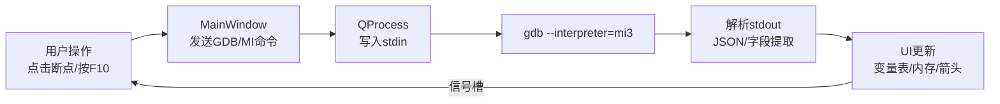
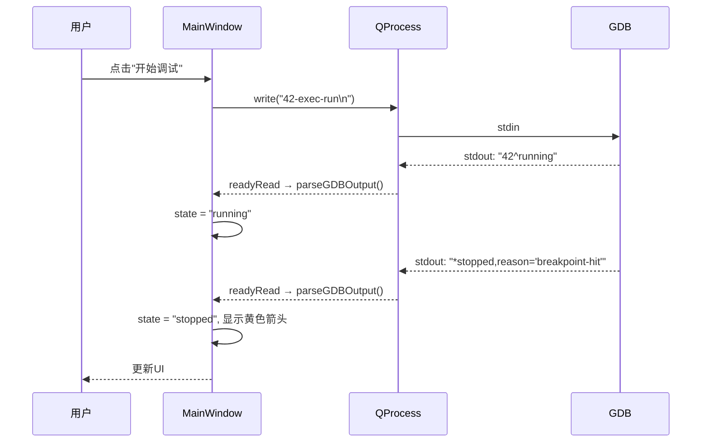
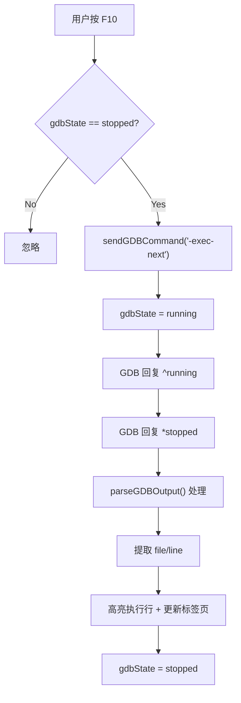
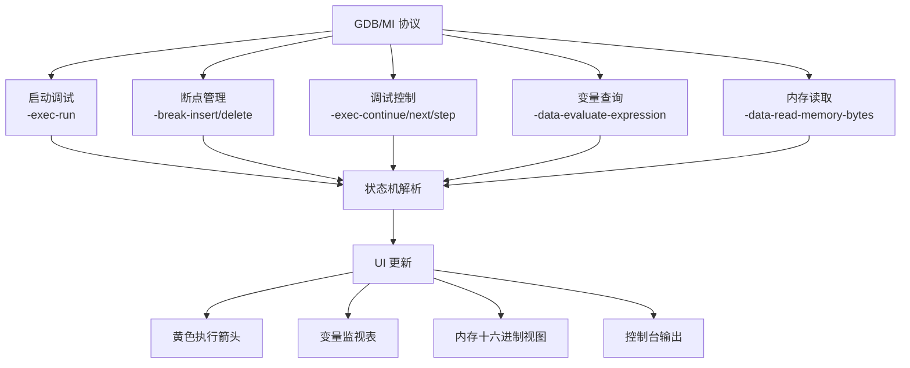

@[TOC](目录)


> **本系列适合 Qt 入门同学阅读，将以一个仿 VS Code 的 C/C++ 极简编辑器项目（MyNotepad_pro）为例，手把手带你从零实现图形化调试器。** 配套代码仓库：`MyNotepad_pro/mainwindow.cpp`，核心逻辑集中在 `GDB 调试器`区域（约 600 行）。

---

## 前言

在前五篇实战中，我们搭建了界面框架、多标签页、语法高亮、一键编译和集成终端。但如果程序跑起来行为不对——变量值不符合预期、循环提前退出、内存越界——光靠 `qDebug()` 打印日志就像大海捞针。

**GDB（GNU Debugger）** 是 Linux/Cygwin 下最强大的 C/C++ 调试器，支持断点、单步执行、变量查看、内存检查等全套能力。但 GDB 的原生命令行界面对新手极不友好：

```bash
(gdb) break main
(gdb) run
(gdb) print x
(gdb) next
```

本篇将展示如何用 **GDB/MI 协议**（Machine Interface）把 GDB 包装成一个可视化的调试面板，让用户像使用 VS Code 一样——点断点、按 F10 单步、看变量值——完成调试全流程。



> 💡 **为什么选 GDB/MI？** 因为原生 GDB 输出是给人看的自然语言，格式随版本变化；而 MI 输出是机器可解析的结构化文本，字段位置稳定，非常适合 GUI 程序解析。

---

## 1. GDB/MI 协议速览

### 1.1 什么是 GDB/MI

GDB/MI 是 GDB 提供的一种 **文本协议**，通过 stdin 发送命令、stdout 接收响应。启动方式：

```bash
gdb --interpreter=mi3 ./your_program
```

其中 `mi3` 表示 MI 协议第 3 版[^1]，是最新的稳定版本。

### 1.2 三种输出类型

GDB 的 MI 输出有三种类型，我们用 `state` 变量区分：

| 输出类型 | 前缀 | 含义 | 示例 |
|---------|------|------|------|
| **Result** | `^` | 命令执行结果 | `^done,value="42"` |
| **Exec** | `*` | 程序状态变化 | `*stopped,reason="breakpoint-hit"` |
| **Notify** | `=` | 异步通知 | `=thread-group-started` |

> ⚠️ **关键区别：** `^` 开头的结果是"这条命令执行完了"，`*` 开头的执行输出是"程序跑到了某处"。两者必须分开处理。

### 1.3 Token 机制

MI 协议用 **token**（数字编号）匹配请求和响应：

```text
123-exec-run     ← 发送（token=123）
123^running      ← 收到（token=123，匹配）
```

代码中的 `tokenCounter` 从 0 递增，每次发送命令前递增。当收到 `*stopped` 事件时，如果 `token` 匹配上一次 `exec-continue`，才认为是"我们等的那次暂停"。

### 1.4 核心变量与类型定义

```cpp
// mainwindow.h - 调试相关成员
QProcess* gdbProcess = nullptr;       // GDB 进程
QString gdbState = "idle";            // "idle" / "running" / "stopped"
int tokenCounter = 0;                 // 请求编号
int watchTokenCounter = -1;           // 上一次 var-update 的 token
QMap<int, QPair<QString,int>> breakpointMap;  // id → {文件, 行号}

struct VariableInfo {                 // 变量信息
    QString name;   // 显示名（"x"、"arr[0]"）
    QString expr;   // GDB 表达式（"x"、"*(&arr[0])"）
    QString value;  // 当前值
    QString type;   // 类型名
};
QList<VariableInfo> watchedVariables; // 监视列表
```



---

## 2. 启动调试：从点击到 GDB 运行

### 2.1 菜单与快捷键

调试相关 Action 在 `createActions()` 中注册：

```cpp
startDebugAction = new QAction("开始调试", this);
startDebugAction->setShortcut(QKeySequence("F8"));  // ← 注意不是F5
startDebugAction->setIcon(QIcon::fromTheme("debug-run"));
connect(startDebugAction, &QAction::triggered, this, &MainWindow::startDebugging);

stopDebugAction = new QAction("停止调试", this);
stopDebugAction->setShortcut(QKeySequence("Shift+F5"));

continueDebugAction = new QAction("继续", this);
continueDebugAction->setShortcut(QKeySequence("F9"));

stepOverAction = new QAction("单步跳过", this);
stepOverAction->setShortcut(QKeySequence("F10"));

stepIntoAction = new QAction("单步进入", this);
stepIntoAction->setShortcut(QKeySequence("F11"));

stepOutAction = new QAction("单步跳出", this);
stepOutAction->setShortcut(QKeySequence("Shift+F11"));
```

> 💡 **F8 还是 F5？** VS Code 默认 F5 启动调试，但我们选择 F8，原因是 F5 在本项目中已分配给"编译并运行"（Article 05）。调试和运行是两个不同操作——调试会启动 GDB，运行直接执行编译后的程序。

### 2.2 启动调试的完整流程

```cpp
void MainWindow::startDebugging()
{
    QString filePath = currentTabFilePath();
    if (filePath.isEmpty()) return;

    // 1. 保存当前文件
    saveCurrentFile();

    // 2. 编译（gcc -g 生成调试符号）
    QProcess compile;
    compile.setProgram("gcc");
    compile.setArguments({"-g", "-o", "debug_output", filePath});
    compile.start();
    compile.waitForFinished();

    if (compile.exitCode() != 0) {
        QMessageBox::critical(this, "编译错误", QString::fromLocal8Bit(compile.readAllStandardError()));
        return;
    }

    // 3. 启动 GDB
    gdbProcess = new QProcess(this);
    connect(gdbProcess, &QProcess::readyReadStandardOutput, this, &MainWindow::parseGDBOutput);
    connect(gdbProcess, &QProcess::readyReadStandardError, this, [this]() {
        ui->terminalOutput->append(QString::fromLocal8Bit(gdbProcess->readAllStandardError()));
    });
    connect(gdbProcess, QOverload<int, QProcess::ExitStatus>::of(&QProcess::finished), this, [this]() {
        gdbState = "idle";
        ui->terminalOutput->append("GDB 已退出");
    });

    gdbProcess->start("gdb", {"--interpreter=mi3", "./debug_output"});
    if (!gdbProcess->waitForStarted()) {
        QMessageBox::critical(this, "错误", "无法启动 GDB，请确认已安装");
        return;
    }

    gdbState = "idle";

    // 4. 启用调试面板
    ui->debugWidget->show();
    ui->debugOutput->show();
    startDebugAction->setEnabled(false);
    stopDebugAction->setEnabled(true);
    continueDebugAction->setEnabled(true);

    // 5. 收集编辑器中的断点，发送给 GDB
    sendBreakpointsToGDB();
    gdbProcess->write("42-exec-run\n");

    ui->terminalOutput->append("[GDB] 调试会话已启动");
}
```

### 2.3 断点收集：从编辑器行号到 GDB 位置

编辑器中的断点存储在 `editor->breakpoints`（一个 `QSet<int>` 存行号），需要转换成 GDB 能识别的位置字符串（如 `main.cpp:15`）：

```cpp
void MainWindow::sendBreakpointsToGDB()
{
    if (!currentEditor()) return;
    QString filePath = currentTabFilePath();

    // 遍历编辑器中的断点
    QList<int> bpList = currentEditor()->breakpoints.values();
    for (int line : bpList) {
        // 行号从1开始，GDB也从1开始，所以直接用
        QString loc = QString("%1:%2").arg(filePath).arg(line);
        sendGDBCommand("-break-insert " + loc);
    }
}
```

每个 `-break-insert` 命令会返回一个断点 ID（如 `^done,bkptno="1"`），我们可以用 `breakpointMap` 存储这个映射关系，方便后续删除断点。

> 💡 **为什么要在启动前收集断点？** 因为 GDB 启动后才会加载程序符号。如果在 `-exec-run` 之后才设断点，GDB 可能找不到源文件位置（特别是编译优化后行号偏移）。所以要在启动时一次性把所有断点告诉 GDB。

### 2.4 编辑器右键：动态添加断点

在 `CodeEditor` 的右键菜单中，用户可以点击行号旁边的区域来切换断点：

```cpp
// CodeEditor.cpp - 鼠标点击断点区域
void CodeEditor::mousePressEvent(QMouseEvent *event)
{
    if (event->position().x() < gutterWidth) {
        // 点击行号区域 → 切换断点
        QTextCursor cursor = cursorForPosition(event->pos());
        int line = cursor.blockNumber() + 1;

        if (breakpoints.contains(line)) {
            breakpoints.remove(line);  // 移除断点
        } else {
            breakpoints.insert(line);  // 添加断点
        }
        viewport()->update();  // 重绘断点标记
        return;
    }
    QPlainTextEdit::mousePressEvent(event);
}
```

断点标记用红色圆点绘制（在 `lineNumberAreaPaintEvent` 中）：

```cpp
if (breakpoints.contains(block.blockNumber() + 1)) {
    painter.setPen(Qt::red);
    painter.setBrush(Qt::red);
    painter.drawEllipse(QPoint(centerX, block.center().y()), 5, 5);
}
```

> 💡 **断点视觉设计：** 红色实心圆是 VS Code 的断点标记风格。如果断点位置有编译错误（无有效代码），可以改为半透明红色圆点，提示用户该断点不会被命中。

---

## 3. GDB 输出解析：状态机设计

### 3.1 为什么需要状态机

GDB 的 MI 输出是 **异步** 的——我们发一条命令，可能收到多行响应，中间还夹杂着程序状态变化的通知。比如：

```text
123^done                           ← 命令结果
*stopped,reason="breakpoint-hit"   ← 程序暂停了
&output:"Reading symbols..."       ← 调试信息
```

所以必须用状态机区分每行属于哪种类型。

### 3.2 核心解析函数

```cpp
void MainWindow::parseGDBOutput()
{
    QByteArray data = gdbProcess->readAllStandardOutput();
    QStringList lines = QString::fromLocal8Bit(data).split("\n");

    for (const QString &line : lines) {
        if (line.isEmpty()) continue;

        QString trimmed = line.trimmed();

        // ========== Result 输出（^） ==========
        if (trimmed.startsWith("^")) {
            if (trimmed == "^running") {
                gdbState = "running";
            }
            else if (trimmed.startsWith("^done")) {
                // 处理变量查询结果
                if (trimmed.contains("value=")) {
                    int valIdx = trimmed.indexOf("value=");
                    QString val = trimmed.mid(valIdx + 7);
                    val.chop(1);  // 去掉末尾引号
                    ui->terminalOutput->append(QString("[GDB] 变量值: %1").arg(val));
                }
                // 处理断点创建结果
                else if (trimmed.contains("bkptno=")) {
                    int bpIdx = trimmed.indexOf("bkptno=");
                    QString bpNum = trimmed.mid(bpIdx + 8);
                    bpNum.chop(1);
                    ui->terminalOutput->append(QString("[GDB] 断点已设置: #%1").arg(bpNum));
                }
                gdbState = "stopped";
                highlightExecutionLine();  // 高亮当前执行行
            }
            else if (trimmed.startsWith("^error")) {
                int msgIdx = trimmed.indexOf("msg=");
                if (msgIdx != -1) {
                    QString msg = trimmed.mid(msgIdx + 5);
                    msg.chop(1);
                    ui->terminalOutput->append(QString("[GDB 错误] %1").arg(msg));
                }
            }
            continue;
        }

        // ========== Exec 输出（*） ==========
        if (trimmed.startsWith("*")) {
            QString event = trimmed.mid(1);

            if (event.startsWith("stopped")) {
                gdbState = "stopped";
                handleStoppedEvent(event);  // ← 核心：处理暂停事件
            }
            else if (event.startsWith("running")) {
                gdbState = "running";
                ui->terminalOutput->append("[GDB] 程序运行中...");
            }
            continue;
        }

        // ========== Notify 输出（=） ==========
        if (trimmed.startsWith("=")) {
            // 调试器退出通知
            if (trimmed.contains("thread-group-exited")) {
                ui->terminalOutput->append("[GDB] 调试会话结束");
                gdbState = "idle";
            }
            continue;
        }

        // ========== Console 输出（&） ==========
        if (trimmed.startsWith("&")) {
            QString msg = trimmed.mid(1);
            // 去掉引号包裹
            if (msg.startsWith("\"") && msg.endsWith("\"")) {
                msg = msg.mid(1, msg.length() - 2);
            }
            ui->terminalOutput->append(msg);
            continue;
        }
    }
}
```

### 3.3 暂停事件处理（核心）

当程序因为断点、单步执行或异常暂停时，GDB 会发送 `*stopped` 事件。我们需要从中提取：

- **文件名和行号**：高亮执行位置
- **断点编号**：更新断点状态
- **信号信息**：判断是否异常终止

```cpp
void MainWindow::handleStoppedEvent(const QString &event)
{
    // 提取 reason
    QString reason;
    int reasonIdx = event.indexOf("reason=");
    if (reasonIdx != -1) {
        reason = event.mid(reasonIdx + 8, event.indexOf(",", reasonIdx) - reasonIdx - 8);
    }

    // 提取文件名和行号
    QString file, line;
    int fileIdx = event.indexOf("file=");
    if (fileIdx != -1) {
        file = event.mid(fileIdx + 6, event.indexOf(",", fileIdx) - fileIdx - 6);
    }
    int lineIdx = event.indexOf("line=");
    if (lineIdx != -1) {
        line = event.mid(lineIdx + 5, event.indexOf(",", lineIdx) - lineIdx - 5);
    }

    // 显示暂停信息
    if (reason == "breakpoint-hit") {
        int bkptIdx = event.indexOf("bkptno=");
        QString bkptNum = event.mid(bkptIdx + 8, event.indexOf(",", bkptIdx) - bkptIdx - 8);
        ui->terminalOutput->append(QString("[GDB] 命中断点 #%1 - %2:%3").arg(bkptNum, file, line));
    } else if (reason == "end-stepping-range") {
        ui->terminalOutput->append(QString("[GDB] 单步完成 - %1:%2").arg(file, line));
    } else if (reason == "signal-received") {
        QString signal;
        int sigIdx = event.indexOf("signal-name=");
        if (sigIdx != -1) {
            signal = event.mid(sigIdx + 13, event.indexOf(",", sigIdx) - sigIdx - 13);
        }
        ui->terminalOutput->append(QString("[GDB] 收到信号 %1 - %2:%3").arg(signal, file, line));
    } else {
        ui->terminalOutput->append(QString("[GDB] 暂停 - %1:%2").arg(file, line));
    }

    // 跳转到对应文件和行
    if (!file.isEmpty() && !line.isEmpty()) {
        // 如果文件不在当前标签页，打开它
        // 跳转到对应行
        highlightExecutionLine(line.toInt());
    }

    // 更新所有标签页的调试状态
    for (int i = 0; i < ui->tabWidget->count(); ++i) {
        CodeEditor* editor = qobject_cast<CodeEditor*>(
            qobject_cast<QScrollArea*>(ui->tabWidget->widget(i))->widget());
        if (editor) {
            editor->isDebugging = true;
            editor->debugLine = line.toInt();
            editor->viewport()->update();
        }
    }
}
```

> 💡 **暂停事件 vs 命令结果：** 当我们发送 `-exec-continue` 时，GDB 先回复 `^running`（命令被接受），然后程序继续运行。当程序再次暂停时，GDB 发送 `*stopped`（事件）。这两个是独立的消息，必须分别处理。

---

## 4. 调试控制：F9/F10/F11/Shift+F5

### 4.1 命令发送封装

所有调试命令都通过同一个函数发送，自动附加 token：

```cpp
void MainWindow::sendGDBCommand(const QString &cmd)
{
    if (!gdbProcess || gdbProcess->state() != QProcess::Running) return;
    tokenCounter++;
    QString fullCmd = QString("%1%2\n").arg(tokenCounter).arg(cmd);
    gdbProcess->write(fullCmd.toLocal8Bit());
}
```

### 4.2 各按钮对应命令

| 用户操作 | 快捷键 | GDB/MI 命令 | 作用 |
|---------|--------|-------------|------|
| 继续 | F9 | `-exec-continue` | 从当前位置继续运行到下一个断点 |
| 单步跳过 | F10 | `-exec-next` | 执行当前行，遇到函数调用不进入 |
| 单步进入 | F11 | `-exec-step` | 执行当前行，遇到函数调用进入函数 |
| 单步跳出 | Shift+F11 | `-exec-finish` | 执行完当前函数并返回 |
| 停止调试 | Shift+F5 | `-exec-interrupt` + kill | 中断程序并结束调试会话 |

### 4.3 继续执行（F9）

```cpp
void MainWindow::continueExecution()
{
    if (gdbState != "stopped") return;

    // 刷新所有标签页的断点到 GDB
    for (int i = 0; i < ui->tabWidget->count(); ++i) {
        CodeEditor* editor = qobject_cast<CodeEditor*>(
            qobject_cast<QScrollArea*>(ui->tabWidget->widget(i))->widget());
        if (editor) {
            QString filePath = tabFilePaths.value(ui->tabWidget->widget(i));
            // 先删除旧断点，再重新添加
            sendGDBCommand("-break-delete 1-100");
            QList<int> bpList = editor->breakpoints.values();
            for (int line : bpList) {
                sendGDBCommand(QString("-break-insert %1:%2").arg(filePath).arg(line));
            }
        }
    }

    sendGDBCommand("-exec-continue");
    gdbState = "running";

    // 清除所有标签页的调试高亮
    for (int i = 0; i < ui->tabWidget->count(); ++i) {
        CodeEditor* editor = qobject_cast<CodeEditor*>(
            qobject_cast<QScrollArea*>(ui->tabWidget->widget(i))->widget());
        if (editor) {
            editor->isDebugging = false;
            editor->debugLine = -1;
            editor->extraSelections.clear();
            editor->setExtraSelections({});
            editor->viewport()->update();
        }
    }
}
```

> 💡 **为什么要删除旧断点？** 因为用户可能在调试过程中添加/删除断点。最简单的做法是每次继续前把所有断点重新同步一遍。虽然低效，但逻辑清晰，适合入门项目。

### 4.4 单步执行（F10/F11）

```cpp
void MainWindow::stepOver()
{
    if (gdbState == "stopped") {
        sendGDBCommand("-exec-next");
        gdbState = "running";
    }
}

void MainWindow::stepInto()
{
    if (gdbState == "stopped") {
        sendGDBCommand("-exec-step");
        gdbState = "running";
    }
}

void MainWindow::stepOut()
{
    if (gdbState == "stopped") {
        sendGDBCommand("-exec-finish");
        gdbState = "running";
    }
}
```

### 4.5 停止调试（Shift+F5）

```cpp
void MainWindow::stopDebugging()
{
    if (gdbProcess && gdbProcess->state() == QProcess::Running) {
        // 1. 中断程序（如果还在运行）
        sendGDBCommand("-exec-interrupt");
        gdbProcess->kill();     // 发送 SIGKILL
        gdbProcess->waitForFinished();
    }

    // 2. 清理 UI
    ui->debugWidget->hide();
    ui->debugOutput->hide();
    ui->terminalOutput->append("[GDB] 调试已停止");

    // 3. 重置所有标签页调试状态
    for (int i = 0; i < ui->tabWidget->count(); ++i) {
        CodeEditor* editor = qobject_cast<CodeEditor*>(
            qobject_cast<QScrollArea*>(ui->tabWidget->widget(i))->widget());
        if (editor) {
            editor->isDebugging = false;
            editor->debugLine = -1;
            editor->extraSelections.clear();
            editor->setExtraSelections({});
            editor->viewport()->update();
        }
    }

    // 4. 重置按钮状态
    startDebugAction->setEnabled(true);
    stopDebugAction->setEnabled(false);
    continueDebugAction->setEnabled(false);

    // 5. 删除临时编译产物
    QFile::remove("debug_output");

    delete gdbProcess;
    gdbProcess = nullptr;
    gdbState = "idle";
}
```



---

## 5. 悬停查值：鼠标停在变量上看它的值

### 5.1 核心思路

当鼠标悬停在编辑器中的变量名上 400ms 后，发送 GDB 查询命令，获取该变量的当前值并显示为工具提示（tooltip）。

### 5.2 Timer 防抖设计

```cpp
// CodeEditor 构造函数
evaluationTimer = new QTimer(this);
evaluationTimer->setSingleShot(true);  // 单次触发
evaluationTimer->setInterval(400);     // 400ms 延迟
connect(evaluationTimer, &QTimer::timeout, this, &CodeEditor::triggerEvaluation);
```

### 5.3 鼠标悬停事件

```cpp
void CodeEditor::mouseMoveEvent(QMouseEvent *event)
{
    QTextCursor cursor = cursorForPosition(event->pos());
    int charPos = cursor.positionInBlock();

    // 提取光标所在的单词（变量名）
    QTextBlock block = cursor.block();
    QString lineText = block.text();
    int start = charPos, end = charPos;

    while (start > 0 && (lineText[start-1].isLetterOrNumber() || lineText[start-1] == '_'))
        start--;
    while (end < lineText.length() && (lineText[end].isLetterOrNumber() || lineText[end] == '_'))
        end++;

    QString word = lineText.mid(start, end - start);

    // 检查是否在调试状态，且单词是有效变量名
    if (isDebugging && !word.isEmpty() && word[0].isLetter()) {
        QString prevChar = (start > 0) ? QString(lineText[start-1]) : "";
        if (prevChar.isEmpty() || (!prevChar.isLetterOrNumber() && prevChar != '_' && prevChar != '.')) {
            currentEvalExpression = word;
            evaluationTimer->start();  // 重新计时（防抖）
        }
    }

    QPlainTextEdit::mouseMoveEvent(event);
}
```

### 5.4 触发查询

```cpp
void CodeEditor::triggerEvaluation()
{
    if (currentEvalExpression.isEmpty()) return;

    // 通过信号通知 MainWindow 发送 GDB 命令
    emit evaluateVariableRequested(currentEvalExpression);
}
```

```cpp
// mainwindow.cpp - 连接信号
connect(editor, &CodeEditor::evaluateVariableRequested, this, &MainWindow::requestEvaluation);

void MainWindow::requestEvaluation(const QString &expr)
{
    if (gdbState != "stopped") return;

    watchTokenCounter = tokenCounter + 1;  // 记录这次请求的 token
    sendGDBCommand(QString("-data-evaluate-expression %1").arg(expr));
    gdbState = "running";
}
```

### 5.5 值获取与显示

在 `parseGDBOutput` 中处理响应：

```cpp
if (trimmed.startsWith("^done")) {
    if (trimmed.contains("value=")) {
        int valIdx = trimmed.indexOf("value=");

        // 提取引号内的值
        int startQuote = trimmed.indexOf('"', valIdx);
        int endQuote = trimmed.lastIndexOf('"');
        if (startQuote != -1 && endQuote != -1 && endQuote > startQuote) {
            QString val = trimmed.mid(startQuote + 1, endQuote - startQuote - 1);

            // 判断是否是我们等待的变量查询
            if (watchTokenCounter == tokenCounter) {
                // 在当前编辑器中设置工具提示
                QTextCursor cursor = textCursor();
                int line = cursor.blockNumber() + 1;

                // 显示在工具提示栏（或状态栏）
                QString tooltip = QString("📝 %1 = %2").arg(currentEvalExpression).arg(val);
                // ... 显示逻辑
            }
        }
    }
}
```

> 💡 **400ms 延迟的意义：** 如果用户快速移动鼠标，每经过一个变量都触发查询，GDB 会被淹没。400ms 的防抖确保只在用户"停"在某个变量上时才查询。这个值是经验值——太短会频繁查询，太长会感觉卡顿。

### 5.6 中断处理

如果用户在 GDB 查询过程中按了 Ctrl+C（或点击其他变量），需要取消上一次查询：

```cpp
void MainWindow::interruptExecution()
{
    if (gdbProcess && gdbProcess->state() == QProcess::Running) {
        gdbProcess->write("\x03");  // 发送 SIGINT（Ctrl+C）
        ui->terminalOutput->append("[GDB] 已中断程序执行");
        gdbState = "stopped";
    }
}
```

---

## 6. 变量监视窗口：WatchWidget

### 6.1 功能需求

用户可以在 WatchWidget 中输入变量名（如 `x`、`arr[0]`、`*ptr`），实时查看其值。程序暂停时自动更新所有监视变量。

### 6.2 UI 布局

```cpp
// WatchWidget 构造函数
QVBoxLayout* layout = new QVBoxLayout(this);

QHBoxLayout* addLayout = new QHBoxLayout();
varNameEdit = new QLineEdit(this);
varNameEdit->setPlaceholderText("输入变量名...");
QPushButton* addButton = new QPushButton("添加", this);
QPushButton* removeButton = new QPushButton("删除", this);
QPushButton* clearButton = new QPushButton("清空", this);

addLayout->addWidget(varNameEdit);
addLayout->addWidget(addButton);
addLayout->addWidget(removeButton);
addLayout->addWidget(clearButton);

varTable = new QTableWidget(this);
varTable->setColumnCount(3);  // 名称、值、类型
varTable->setHorizontalHeaderLabels({"名称", "值", "类型"});
varTable->horizontalHeader()->setStretchLastSection(true);

layout->addLayout(addLayout);
layout->addWidget(varTable);
```

### 6.3 添加变量

```cpp
void WatchWidget::addVariable()
{
    QString varName = varNameEdit->text().trimmed();
    if (varName.isEmpty()) return;

    // 检查是否已存在
    for (const VariableInfo &v : qAsConst(watchedVariables)) {
        if (v.name == varName) return;
    }

    VariableInfo var;
    var.name = varName;
    var.expr = varName;  // 初始表达式就是变量名
    var.value = "---";
    var.type = "---";
    watchedVariables.append(var);

    // 更新表格
    int row = varTable->rowCount();
    varTable->insertRow(row);
    varTable->setItem(row, 0, new QTableWidgetItem(var.name));
    varTable->setItem(row, 1, new QTableWidgetItem(var.value));
    varTable->setItem(row, 2, new QTableWidgetItem(var.type));

    varNameEdit->clear();

    // 如果正在调试，立即查询值
    if (isDebugging) {
        refreshAllVariables();
    }
}
```

### 6.4 变量查询命令

每个变量用 `-var-create` 创建一个 GDB 对象，后续用 `-var-update` 获取最新值：

```cpp
void WatchWidget::refreshAllVariables()
{
    if (!isDebugging) return;

    for (int i = 0; i < watchedVariables.size(); ++i) {
        VariableInfo &var = watchedVariables[i];

        // 首次创建变量对象
        if (var.name.isEmpty() || var.value == "---") {
            // 发送: -var-create myvar * x
            QString cmd = QString("-var-create %1 * %2").arg(var.name).arg(var.expr);
            emit sendGDBCommandRequested(cmd);
        } else {
            // 后续更新值
            QString cmd = QString("-var-update %1").arg(var.name);
            emit sendGDBCommandRequested(cmd);
        }
    }
}
```

### 6.5 GDB 响应解析

```cpp
// 在 parseGDBOutput 中处理变量响应
if (trimmed.contains("changelist=")) {
    // -var-update 响应，包含变量值变化列表
    // 格式: ^done,changelist=[{name="x",value="42",type="int"}]

    int changeIdx = trimmed.indexOf("changelist=[");
    if (changeIdx != -1) {
        QString changes = trimmed.mid(changeIdx + 12);
        changes.chop(2);  // 去掉 "]\n"

        // 按逗号分隔每个变化
        QStringList changeItems = changes.split("},{");
        for (const QString &item : changeItems) {
            QString name, value, type;

            int nameIdx = item.indexOf("name=");
            if (nameIdx != -1) {
                name = item.mid(nameIdx + 6, item.indexOf(",", nameIdx) - nameIdx - 6);
                name = name.trimmed().remove('"');
            }

            int valIdx = item.indexOf("value=");
            if (valIdx != -1) {
                value = item.mid(valIdx + 7, item.indexOf(",", valIdx) - valIdx - 7);
                value = value.trimmed().remove('"');
            }

            int typeIdx = item.indexOf("type=");
            if (typeIdx != -1) {
                type = item.mid(typeIdx + 6);
                type = type.trimmed().remove('"');
            }

            // 更新 UI
            for (int row = 0; row < varTable->rowCount(); ++row) {
                if (varTable->item(row, 0) && varTable->item(row, 0)->text() == name) {
                    varTable->item(row, 1)->setText(value);
                    varTable->item(row, 2)->setText(type);
                }
            }
        }
    }
}
```

### 6.6 赋值与删除

```cpp
// 赋值：在 GDB 中修改变量值
void WatchWidget::assignVariable(const QString &varName, const QString &newValue)
{
    if (!isDebugging) return;

    // 发送: -var-assign x 100
    QString cmd = QString("-var-assign %1 %2").arg(varName).arg(newValue);
    emit sendGDBCommandRequested(cmd);

    // 刷新显示
    refreshAllVariables();
}

// 删除：从监视列表中移除
void WatchWidget::removeVariable()
{
    int row = varTable->currentRow();
    if (row < 0) return;

    QString varName = varTable->item(row, 0)->text();

    // 从 GDB 中删除变量对象
    if (isDebugging) {
        QString cmd = QString("-var-delete %1").arg(varName);
        emit sendGDBCommandRequested(cmd);
    }

    // 从列表和表格中移除
    watchedVariables.removeAt(row);
    varTable->removeRow(row);
}
```

> 💡 **`-var-create`[^2] vs `-data-evaluate-expression`：** 前者创建一个"活的"变量对象，后续可以用 `-var-update` 批量刷新；后者是一次性查询，适合悬停查值。监视窗口用 `-var-create`，悬停用 `-data-evaluate-expression`。

---

## 7. 内存透视窗口：MemoryWidget

### 7.1 功能需求

内存窗口允许用户输入一个内存地址（如 `0x7fff5fbff8c0`），显示该地址起始的一段内存内容，同时显示十六进制和 ASCII 两种视图。

### 7.2 UI 布局

```cpp
// MemoryWidget 构造函数
QVBoxLayout* layout = new QVBoxLayout(this);

QHBoxLayout* addrLayout = new QHBoxLayout();
addrEdit = new QLineEdit(this);
addrEdit->setPlaceholderText("输入内存地址 (如 0x7fff5fbff8c0)");
QPushButton* refreshBtn = new QPushButton("刷新", this);
QPushButton* autoRefreshBtn = new QPushButton("自动刷新", this);
autoRefreshBtn->setCheckable(true);

addrLayout->addWidget(new QLabel("地址:"));
addrLayout->addWidget(addrEdit);
addrLayout->addWidget(refreshBtn);
addrLayout->addWidget(autoRefreshBtn);

hexView = new QPlainTextEdit(this);
hexView->setReadOnly(true);
hexView->setFont(QFont("Consolas", 10));  // 等宽字体

asciiView = new QPlainTextEdit(this);
asciiView->setReadOnly(true);
asciiView->setFont(QFont("Consolas", 10));

layout->addLayout(addrLayout);
layout->addWidget(new QLabel("十六进制:"));
layout->addWidget(hexView);
layout->addWidget(new QLabel("ASCII:"));
layout->addWidget(asciiView);
```

### 7.3 内存查询命令

GDB/MI 提供 `-data-read-memory-bytes`[^3] 命令，可以读取指定地址的内存：

```cpp
void MemoryWidget::readMemory()
{
    QString addr = addrEdit->text().trimmed();
    if (addr.isEmpty() || !isDebugging) return;

    // 发送命令：读取从 addr 开始的 128 字节
    // -data-read-memory-bytes &addr 128
    QString cmd = QString("-data-read-memory-bytes &%1 128").arg(addr);
    emit sendGDBCommandRequested(cmd);
}
```

> 💡 **`&` 前缀的意义：** 在 GDB 中，`&addr` 表示"取 addr 的地址"。如果用户输入 `0x7fff5fbff8c0`，GDB 会读取该地址的内存；如果输入 `x`，GDB 会先求值 `&x`，获取变量 `x` 的地址，然后读取内存。

### 7.4 响应解析

```cpp
// parseGDBOutput 中处理内存数据
if (trimmed.contains("memory=")) {
    // 格式: ^done,memory=[{addr="0x...",bytes="48656c6c6f"}]

    int memIdx = trimmed.indexOf("memory=[");
    if (memIdx != -1) {
        QString memData = trimmed.mid(memIdx + 9);
        memData.chop(2);  // 去掉 "]\n"

        int bytesIdx = memData.indexOf("bytes=\"");
        if (bytesIdx != -1) {
            QString hexStr = memData.mid(bytesIdx + 7);
            hexStr.chop(1);  // 去掉引号

            // 解析十六进制字符串
            QByteArray bytes = QByteArray::fromHex(hexStr.toLatin1());

            // 格式化为十六进制视图
            QString hexDisplay;
            QString asciiDisplay;
            const int bytesPerLine = 16;

            for (int i = 0; i < bytes.length(); i += bytesPerLine) {
                // 地址列
                hexDisplay += QString("0x%1: ").arg(startAddr + i, 8, 16, QChar('0'));

                // 十六进制列
                for (int j = 0; j < bytesPerLine && (i+j) < bytes.length(); ++j) {
                    hexDisplay += QString("%1 ").arg((quint8)bytes[i+j], 2, 16, QChar('0'));
                    if (j == 7) hexDisplay += " ";  // 中间分隔
                }

                // ASCII 列
                for (int j = 0; j < bytesPerLine && (i+j) < bytes.length(); ++j) {
                    char c = bytes[i+j];
                    asciiDisplay += (c >= 32 && c <= 126) ? c : '.';
                }

                hexDisplay += "\n";
                asciiDisplay += "\n";
            }

            hexView->setPlainText(hexDisplay);
            asciiView->setPlainText(asciiDisplay);
        }
    }
}
```

### 7.5 自动刷新

当程序暂停时（断点命中、单步完成），自动刷新内存内容：

```cpp
void WatchWidget::autoRefreshMemory()
{
    if (autoRefreshEnabled && isDebugging) {
        readMemory();
    }
}

// 在 handleStoppedEvent 中调用
void MainWindow::handleStoppedEvent(const QString &event)
{
    // ... 其他处理 ...

    // 自动刷新内存窗口
    if (memoryWidget->autoRefreshEnabled) {
        memoryWidget->readMemory();
    }
}
```

### 7.6 格式化输出示例

假设用户输入地址 `0x7fff5fbff8c0`，程序正在运行：

```hex
0x7fff5fbff8c0: 48 65 6c 6c 6f 20 57 6f  72 6c 64 21 00 00 00 00
0x7fff5fbff8d0: 01 00 00 00 2a 00 00 00  ff 7f 00 00 00 00 00 00
```

对应的 ASCII 视图：

```text
Hello World!....
....*...........
```

> 💡 **内存地址获取方式：** 用户可以：
> 1. 直接在代码中用 `qDebug() << (void*)&variable` 打印地址
> 2. 在 GDB 终端中用 `print &variable` 获取
> 3. 在内存窗口中输入变量名（如 `x`），GDB 会自动取地址

---

## 8. 黄色执行箭头

### 8.1 视觉设计

调试时，当前执行行用黄色背景高亮，左边显示一个黄色小箭头。这是 VS Code 的经典调试标记。

### 8.2 实现方式

在 `CodeEditor` 中用 `QTextEdit::ExtraSelection` 实现：

```cpp
// mainwindow.cpp - 高亮执行行
void MainWindow::highlightExecutionLine(int line)
{
    for (int i = 0; i < ui->tabWidget->count(); ++i) {
        CodeEditor* editor = qobject_cast<CodeEditor*>(
            qobject_cast<QScrollArea*>(ui->tabWidget->widget(i))->widget());
        if (editor) {
            editor->debugLine = line;
            editor->isDebugging = true;

            // 设置 ExtraSelection
            QList<QTextEdit::ExtraSelection> extraSelections;
            QTextEdit::ExtraSelection selection;

            selection.format.setBackground(QColor(255, 255, 0, 100));  // 半透明黄色
            selection.format.setProperty(QTextFormat::FullWidthSelection, true);
            selection.cursor = editor->textCursor();
            selection.cursor.setPosition(editor->document()->findBlockByLineNumber(line - 1).position());
            selection.cursor.select(QTextCursor::BlockUnderCursor);

            extraSelections.append(selection);
            editor->setExtraSelections(extraSelections);

            // 确保执行行可见
            editor->centerCursor();

            // 重绘左边栏（显示黄色箭头）
            editor->viewport()->update();
        }
    }
}
```

### 8.3 左边栏箭头绘制

在 `lineNumberAreaPaintEvent` 中，如果当前行是调试执行行，绘制黄色箭头：

```cpp
void CodeEditor::lineNumberAreaPaintEvent(QPaintEvent *event)
{
    QPainter painter(lineNumberArea);
    // ... 省略行号绘制 ...

    QTextBlock block = firstVisibleBlock();
    while (block.isValid() && block.top() <= event->rect().bottom()) {
        int blockNumber = block.blockNumber();
        int top = qRound(blockBoundingGeometry(block).translated(contentOffset()).top());
        int bottom = top + qRound(blockBoundingRect(block).height());

        // 绘制调试箭头
        if (isDebugging && blockNumber + 1 == debugLine) {
            painter.setPen(Qt::NoPen);
            painter.setBrush(QColor(255, 200, 0));  // 黄色

            // 绘制向右的小三角形
            QPolygon triangle;
            triangle << QPoint(centerX - 6, top + 2)
                     << QPoint(centerX + 6, top + 8)
                     << QPoint(centerX - 6, top + 14);
            painter.drawPolygon(triangle);
        }

        block = block.next();
    }
}
```

> 💡 **黄色箭头 vs 蓝色行号：** 在 VS Code 中，当前执行行用黄色背景+黄色箭头；当前选中的行用蓝色行号。两者可以同时存在，但我们的项目简化为只显示黄色调试标记。

---

## 9. 本篇小结



| 功能 | GDB/MI 命令 | 快捷键 | 实现难度 |
|-----|-------------|--------|---------|
| 启动调试 | `-exec-run` | F8 | ⭐⭐ |
| 断点 | `-break-insert`/`-break-delete` | 点击行号 | ⭐ |
| 继续 | `-exec-continue` | F9 | ⭐ |
| 单步跳过 | `-exec-next` | F10 | ⭐ |
| 单步进入 | `-exec-step` | F11 | ⭐ |
| 单步跳出 | `-exec-finish` | Shift+F11 | ⭐ |
| 停止 | `-exec-interrupt` + kill | Shift+F5 | ⭐⭐ |
| 悬停查值 | `-data-evaluate-expression` | 鼠标悬停 | ⭐⭐⭐ |
| 变量监视 | `-var-create`/`-var-update` | 手动添加 | ⭐⭐⭐ |
| 内存读取 | `-data-read-memory-bytes` | 手动输入 | ⭐⭐⭐⭐ |

**GDB/MI 的核心难点：**

1. **异步响应**：命令结果和程序事件混合在一起，必须用状态机区分
2. **Token 匹配**：多个请求并发时，用 token 区分哪个响应对应哪个请求
3. **字段解析**：MI 输出是逗号分隔的 key=value 格式，嵌套引号和转义字符需要小心处理
4. **状态同步**：UI 状态（按钮启用/禁用）必须与 GDB 状态保持一致

> 💡 **本篇的代码量约 600 行**，是整个项目中最复杂的部分。建议读者逐段理解，特别是 `parseGDBOutput` 函数中的状态机逻辑。如果觉得太难，可以先跳过 GDB/MI 协议细节，只看 UI 部分的实现。

---

## 系列回顾

至此，**"桌面开发实战"** 系列六篇文章全部完成。让我们回顾整个项目的演进：

| 篇章 | 主题 | 核心内容 |
|------|------|---------|
| 01 | 环境搭建 | Qt Creator + CMake 配置 |
| 02 | 界面框架 | 无边框窗口、自定义标题栏、菜单系统 |
| 03 | 多标签页 | QTabWidget、文件操作、最近文件 |
| 04 | 视觉增强 | 行号、语法高亮、括号匹配、智能补全 |
| 05 | 终端编译 | QProcess 集成、F5 编译运行 |
| 06 | GDB 调试 | GDB/MI 协议、断点、单步、变量监视、内存查看 |

**从一个空白窗口到功能完整的 C/C++ 编辑器**，我们用约 4500 行代码实现了 VS Code 的核心子集：

- ✅ 无边框窗口 + 自定义标题栏
- ✅ 多标签页 + 文件操作
- ✅ 语法高亮 + 括号匹配
- ✅ 智能补全（成对符号、Tab 片段）
- ✅ 集成终端 + 一键编译
- ✅ GDB 图形化调试（断点、单步、变量、内存）
- ✅ 黄色执行箭头 + 当前行高亮

**还有哪些可以扩展？**

- 项目管理器（文件树、CMakeLists.txt 解析）
- 代码跳转（Go to Definition/Declaration）
- 代码格式化（clang-format 集成）
- Git 集成（diff 视图、提交界面）
- 多窗口支持
- 插件系统

> 💡 这个项目虽然是"极简编辑器"，但涵盖了 Qt Widgets 开发的核心知识点：信号槽、事件系统、QProcess、QPainter、QSettings、多线程（QtConcurrent）、文档模型（QPlainTextEdit）。掌握了这些，你就具备了开发任何桌面应用的基础能力。

---


> **下一篇预告：** 本系列暂告一段落。如果需要扩展更多功能（如项目管理器、代码跳转、Git 集成），可以继续关注后续系列更新。感谢阅读！🎉
---
## 脚注
[^1]: GDB/MI 协议文档见 [GNU GDB Manual - MI](https://sourceware.org/gdb/onlinedocs/gdb/GDB_002fMI.html)。mi3 是 MI 协议的第 3 版，GDB 7.0+ 支持。

[^2]: `-var-create` 创建的变量对象会一直存在，直到用 `-var-delete` 删除或 GDB 退出。如果创建了太多变量对象，会影响 GDB 性能。建议在变量不再需要时及时删除。

[^3]: `-data-read-memory-bytes` 的第三个参数是字节数，最大建议 1024 字节。读取过多内存会拖慢 GDB 响应速度。如果需要查看大块内存，可以分多次读取。


