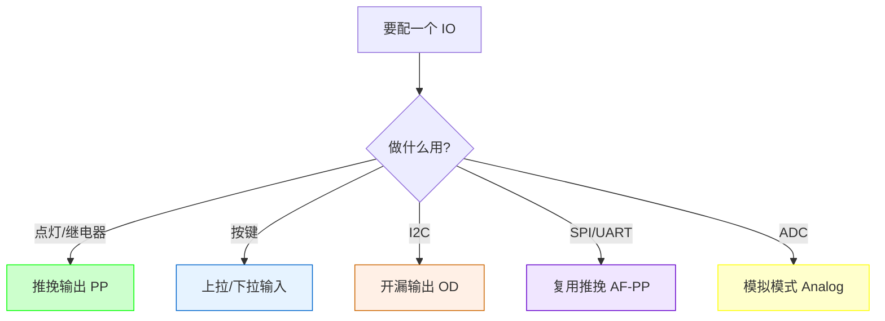
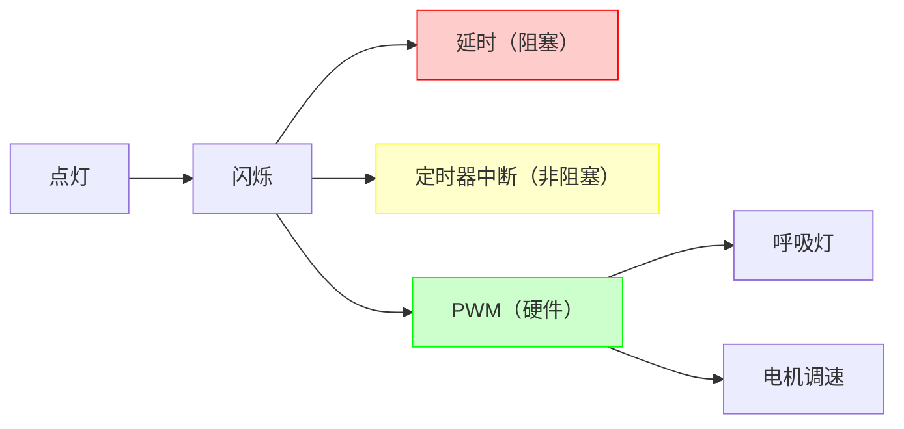

@[TOC](本文目录)

---

> 🎯 **硬件支线** · 承接 [《只要电平给得对，51蹦迪不是事！》](https://blog.csdn.net/ysu_0314/article/details/161901901)，从 51 跨入 STM32 的第一篇。
> 📖 **定位**：有 51 基础，第一次碰 STM32 的人。

---

# 💡 硬件支线：51 之后，STM32 第一盏灯 —— 从寄存器到 HAL 的认知跨越

---

> 51 蹦迪够野，STM32 第一次得讲规矩。
> 51 一个 P1 = 0x00 就亮了，STM32 点个灯要配时钟、配模式、配速度、配上下拉……
> "就点个灯，至于吗？"
> "至于。因为你在学的不是点灯，是 ARM 的游戏规则。"

**本文写给从 51 过渡到 STM32 的人：同一盏灯，两种思维。**

---

## ⚡ 1. 51 vs STM32：点灯对比

### 1.1 51 点灯（回忆）

```c
#include <reg52.h>

sbit LED = P1^0;     // P1.0 接 LED

void main() {
    LED = 0;          // 拉低，灯亮（共阳接法）
    while(1);
}
```

**就这么短。** 因为 51 的设计哲学是"简单直接"：
- 没有时钟配置（固定 11.0592MHz）
- 没有引脚模式（P1 就是准双向 IO，不用选）
- 没有复用选择（P1.0 就是 P1.0，不是 SPI 也不是 TIM）

### 1.2 STM32 点灯（HAL 库）

```c
#include "stm32f4xx_hal.h"

int main(void) {
    HAL_Init();                     // 1. 初始化 HAL 库
    SystemClock_Config();           // 2. 配置系统时钟（72MHz/168MHz）
    
    __HAL_RCC_GPIOA_CLK_ENABLE();   // 3. 开 GPIOA 时钟
    
    GPIO_InitTypeDef GPIO = {0};
    GPIO.Pin   = GPIO_PIN_5;        // 4. 选 PA5
    GPIO.Mode  = GPIO_MODE_OUTPUT_PP; // 5. 推挽输出
    GPIO.Speed = GPIO_SPEED_FREQ_LOW; // 6. 低速
    HAL_GPIO_Init(GPIOA, &GPIO);    // 7. 初始化
    
    HAL_GPIO_WritePin(GPIOA, GPIO_PIN_5, GPIO_PIN_SET);  // 8. 点灯
    while(1);
}
```

**8 步。** 51 只需 1 步。差异不在"难易"，而在"架构哲学"。

### 1.3 差异根源

| 维度 | 51 | STM32 |
|:-----|:---|:------|
| 时钟 | 固定频率 | 可配 1~168MHz，每条总线独立分频 |
| IO 模式 | 准双向一种 | 8 种（输入/输出/复用/模拟…） |
| 引脚复用 | 无 | 一个引脚可做 GPIO/TIM/SPI/UART… |
| 功耗管理 | 无 | 每个外设独立时钟开关 |
| 寄存器量 | ~20 个 | ~上千个 |

> 🎯 **STM32 的"复杂"是为了"灵活"。** 时钟可关 = 省电；IO 可配 = 适配各种外设；引脚复用 = 封装利用率高。代价就是点灯多了 7 步。

---

## 🔧 2. 从寄存器理解 HAL

### 2.1 为什么 HAL 库要开时钟？

51 的 IO 默认就是"通的"。STM32 的每个外设默认时钟是==关==的——为了省电。

```c
// HAL 写法
__HAL_RCC_GPIOA_CLK_ENABLE();

// 对应的寄存器操作（STM32F4）
RCC->AHB1ENR |= RCC_AHB1ENR_GPIOAEN;   // GPIOA 时钟使能
```

> 💡 **不开时钟 = 外设是死的。** 这是 51 转 STM32 第一个坑：代码写对了但外设不工作，因为忘了开时钟。

### 2.2 51 的"准双向" vs STM32 的 8 种模式

```
51 IO 模式（只有一种）：
  准双向：输出时自动拉高/拉低，输入时自动切为读
  ┌──────┐
  │  P1  │ ← 就这一种，不用选
  └──────┘

STM32 IO 模式（8 种）：
  ┌────────────────────────────────────────────┐
  │ 输入类                                      │
  │   浮空输入    Input Floating                │
  │   上拉输入    Input Pull-Up                 │
  │   下拉输入    Input Pull-Down               │
  ├────────────────────────────────────────────┤
  │ 输出类                                      │
  │   推挽输出    Output Push-Pull              │ ← 点灯用这个
  │   开漏输出    Output Open-Drain             │
  ├────────────────────────────────────────────┤
  │ 复用类                                      │
  │   复用推挽    AF Push-Pull                  │ ← SPI/I2C/UART 用
  │   复用开漏    AF Open-Drain                 │
  ├────────────────────────────────────────────┤
  │ 模拟类                                      │
  │   模拟模式    Analog                        │ ← ADC/DAC 用
  └────────────────────────────────────────────┘
```



### 2.3 寄存器层点灯（不用 HAL）

```c
// 纯寄存器点灯 PA5（STM32F4）
// 1. 开 GPIOA 时钟
RCC->AHB1ENR |= (1 << 0);            // bit0 = GPIOAEN

// 2. 配 PA5 为输出
GPIOA->MODER &= ~(3 << (5*2));       // 先清零
GPIOA->MODER |=  (1 << (5*2));       // 01 = 通用输出

// 3. 配推挽（默认就是推挽，省略 OTYPER 配置）
// 4. 点灯
GPIOA->ODR |= (1 << 5);              // PA5 输出高
```

| 层级 | 代码量 | 可读性 | 可移植性 |
|:-----|:------:|:------:|:--------:|
| 寄存器 | 4 行 | 差 | ❌ 换芯片全改 |
| HAL 库 | 8 行 | 好 | ✅ F1/F4/H7 通用 |
| LL 库 | 6 行 | 中 | ✅ 同系列通用 |

> 💡 **建议**：==初学用 HAL（看得懂），进阶学寄存器（知道原理），量产用 LL（性能+体积）。== 不要一上来就啃寄存器，会被劝退。

---

## 🛠️ 3. CubeMX：图形化配置第一盏灯

### 3.1 CubeMX 做了什么

CubeMX 是 STM32 的"图形化初始化工具"。你在界面上点鼠标配引脚，它自动生成上面的 HAL 代码。


### 3.2 CubeMX 生成的代码结构

```
Project/
├── Core/
│   ├── Inc/
│   │   ├── main.h
│   │   └── stm32f4xx_hal_conf.h    ← HAL 配置
│   └── Src/
│       ├── main.c                   ← 入口 + while(1)
│       ├── stm32f4xx_it.c           ← 中断处理
│       └── system_stm32f4xx.c       ← 时钟系统
├── Drivers/
│   ├── CMSIS/                       ← ARM 核心支持
│   └── STM32F4xx_HAL_Driver/        ← HAL 库源码
└── Project.ioc                      ← CubeMX 工程文件
```

> 🐛 **踩坑**：CubeMX 生成的代码里有 `/* USER CODE BEGIN */` 和 `/* USER CODE END */` 标记。==你的代码必须写在这两个标记之间==，否则下次用 CubeMX 重新生成时会被覆盖。

```c
/* USER CODE BEGIN 1 */
// 你的代码写这里，重新生成不会被删
HAL_GPIO_TogglePin(GPIOA, GPIO_PIN_5);
HAL_Delay(500);
/* USER CODE END 1 */
```

---

## 🔄 4. 让灯闪起来：三种方式

### 4.1 延时闪烁（最简单）

```c
while (1) {
    HAL_GPIO_TogglePin(GPIOA, GPIO_PIN_5);
    HAL_Delay(500);      // 阻塞 500ms
}
```

**问题**：`HAL_Delay` 是阻塞的。延时期间 CPU 什么都干不了。

### 4.2 定时器中断闪烁（非阻塞）

```c
// CubeMX 配 TIM2，500ms 中断
void HAL_TIM_PeriodElapsedCallback(TIM_HandleTypeDef *htim) {
    if (htim == &htim2) {
        HAL_GPIO_TogglePin(GPIOA, GPIO_PIN_5);
    }
}

// main 里
HAL_TIM_Base_Start_IT(&htim2);
while (1) {
    // CPU 空闲，可以做别的事
}
```

### 4.3 PWM 调光（无 CPU 干预）

```c
// CubeMX 配 PA5 为 TIM2_CH1 的 PWM 输出
// 频率 1kHz，占空比可调

TIM_OC_InitTypeDef pwm = {0};
pwm.OCMode     = TIM_OCMODE_PWM1;
pwm.Pulse      = 500;        // 占空比 50%（0~1000）
pwm.OCPolarity = TIM_OCPOLARITY_HIGH;
HAL_TIM_PWM_ConfigChannel(&htim2, &pwm, TIM_CHANNEL_1);
HAL_TIM_PWM_Start(&htim2, TIM_CHANNEL_1);

// 调亮度
__HAL_TIM_SET_COMPARE(&htim2, TIM_CHANNEL_1, 100);  // 10% 亮度
__HAL_TIM_SET_COMPARE(&htim2, TIM_CHANNEL_1, 900);  // 90% 亮度
```

| 方式 | CPU 占用 | 精度 | 适用场景 |
|:-----|:--------:|:----:|:---------|
| 延时 | 100% | 低 | 入门 demo |
| 定时器中断 | ~1% | 中 | 周期性任务 |
| PWM | 0% | 高 | 调光/电机调速 |



---

## 🧠 5. 51 到 STM32 的认知跨越总结

| 51 思维 | STM32 思维 | 跨越点 |
|:--------|:-----------|:-------|
| IO 直接用 | IO 先配模式再用 | "万物皆可配" |
| 时钟固定 | 时钟可配可关 | "默认是关的" |
| 一个引脚一种功能 | 引脚可复用 | "先选复用功能" |
| 中断手动设 EA | NVIC 优先级 + 中断使能 | "中断也有等级" |
| 串口一个 SBUF | UART + DMA + FIFO | "可以不丢数据" |
| 看门狗一个 WDT | IWDG + WWDG | "两条命" |

> 🎯 **核心跨越**：从"直接操作"到"先配置再操作"。51 是开箱即用，STM32 是组装后使用。这个思维转变，是从玩具到工程的第一步。

---

## 💡 6. 给 51 转 STM32 的人 5 条建议

> **① 先用 HAL + CubeMX，别一上来啃寄存器**
> CubeMX 帮你处理 80% 的初始化，你只需关注业务逻辑。等熟了再回头看寄存器。

> **② 每个外设第一步：开时钟**
> 代码对了外设不工作？99% 是忘了开时钟。养成肌肉记忆。

> **③ USER CODE 区域是生命线**
> CubeMX 重新生成会覆盖标记外的代码。永远只在 `/* USER CODE BEGIN */` 和 `/* USER CODE END */` 之间写。

> **④ 善用 HAL 的回调函数**
> `HAL_TIM_PeriodElapsedCallback`、`HAL_UART_RxCpltCallback` 等。不要在 IRQHandler 里直接写逻辑。

> **⑤ 买一块带调试器的板子**
> ST-Link / J-Link + SWD 调试，可以打断点、看寄存器。没有调试器写 STM32 = 蒙眼走路。

---

## 🔜 下篇预告

> 硬件支线下一篇：**STM32 串口 + DMA：和 51 串口到底差在哪**（不定期更新）
>
> 回到主线：[工具链通关 02：CMake 进阶](https://blog.csdn.net/ysu_0314/article/details/164325411?spm=1001.2014.3001.5501)

---

> 👍 **如果你觉得有帮助，点赞 + 收藏 + 关注，三连支持作者继续写下去 🚀**
