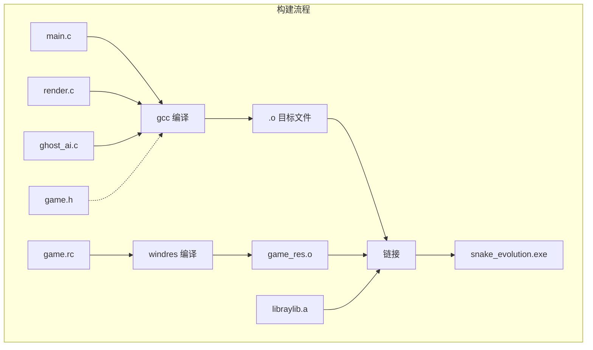
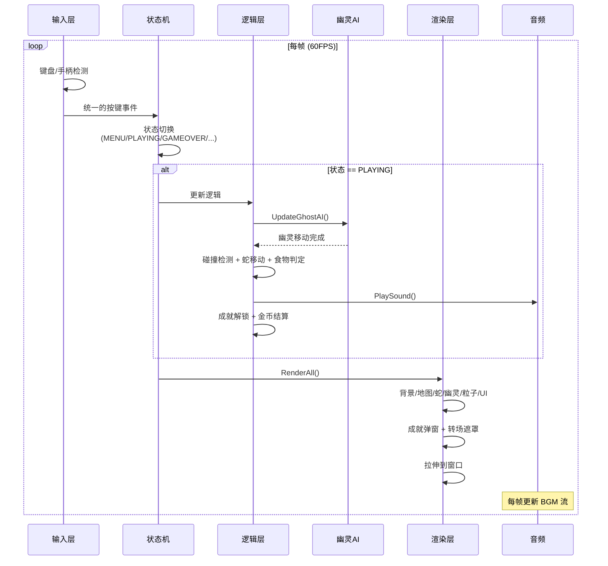
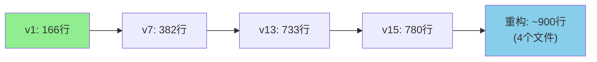


@[TOC](从 166 行到 900 行，一个 C 语言游戏的完整进化实录)

---

# 基于 raylib + C99 的游戏开发全记录

> **一句话总结**：用 Vibe Coding 的方式，从零开始写一个贪吃蛇游戏。经历了 15 次迭代、从 166 行膨胀到 780 行再重构为多文件工程，最终成品是一个带音效、贴图、AI 幽灵、皮肤商店、成就系统的完整游戏。

---

## 1️⃣、什么是 Vibe Coding？🤔

Vibe Coding 是一种新兴的 AI 驱动编程范式——开发者不再逐行手写代码，而是通过自然语言描述需求，让 AI 生成代码，自己则扮演 ==产品经理 + 架构师 + QA== 的角色。

```
┌─────────────────────────────────────────────────────────┐
│  核心流程：                                              │
│                                                         │
│   写 Prompt -> AI 生成代码 -> 编译/运行 -> 发现 Bug       │
│        ↑                                     │          │
│        └──────────── 写下一个 Prompt ←────────┘          │
└─────────────────────────────────────────────────────────┘
```

这篇文章完整记录了用 Vibe Coding 方式开发一个贪吃蛇游戏的 15 次迭代过程。从 ==166 行== 的基础版本，一路膨胀到 ==780 行== 的完整游戏，最终重构为多文件工程。对所有想尝试 Vibe Coding 的开发者来说，这是一个绝佳的参考案例。

---

## 2️⃣、技术栈概览 🛠️

> 本篇文章所有项目文件均已上传CSDN代码库，文中会对项目文件简单介绍

### 语言：C99

选择 C 语言本身就是一个有趣的决策——AI 在 C 语言上的表现相当稳定，且 C 没有复杂的构建工具链开销，编译出来就是一个 exe。

### 图形库：raylib

| 特性 | 说明 |
|:----|:-----|
| 依赖 | 零外部依赖，一个 `.h` + 一个 `.a` 即可编译 |
| API | 直观清晰：`InitWindow()` → `BeginDrawing()` → `DrawRectangle()` |
| 功能 | 内置 ==音频 / 字体 / 输入 / 纹理== 等完整游戏开发功能 |

### libraylib.a 

项目中包含的 `libraylib.a` 是一个 **静态链接库**。它将 raylib 的所有功能（OpenGL 渲染、音频流、字体光栅化、输入处理等）预先编译为机器码。

```makefile
# Makefile 中的链接配置
LDFLAGS = -L. -lraylib -lopengl32 -lgdi32 -lwinmm -mwindows -static
```

| 参数 | 作用 |
|:----|:-----|
| `-L.` | 在当前目录找库 |
| `-lraylib` | 链接 `libraylib.a` |
| `-lopengl32 -lgdi32 -lwinmm` | Windows 系统库 |
| `-mwindows` | 隐藏控制台黑框 |
| `-static` | 静态链接，生成单 exe 无需 DLL |

### 构建系统：Makefile + windres

```makefile
CC = gcc
WINDRES = windres
CFLAGS = -Wall -std=c99 -O2 -I. -finput-charset=UTF-8 -fexec-charset=UTF-8

TARGET = snake_evolution.exe
SRCS = main.c ghost_ai.c render.c
OBJS = $(SRCS:.c=.o) game_res.o

$(TARGET): $(OBJS)
	$(CC) $(OBJS) -o $(TARGET) $(LDFLAGS)
```

> **注意**：`game_res.o` 由 `game.rc` 编译而来，它将 `icon.ico` 嵌入 exe 作为程序图标。这是 Windows 桌面应用的常规做法。

---

## 3️⃣、15 代演进全纪录 📜

下面逐代分析代码的演进过程。每个版本都是一次完整的 Prompt → 代码 → 验证循环。
### 总览表

| 版本 | 行数 | 核心标签 | 一句话 |
|:---:|:---:|:--------|:-------|
| **v1** 🐍 | 166 | 基础蛇 + 音效 | 能玩就行 |
| **v2** 🎵 | 228 | BGM + 菜单 + 多食物 | 像个游戏了 |
| **v3** 🏆 | 253 | 排行榜持久化 | 分数能存了 |
| **v4** 💣 | 313 | 炸弹 + 冰冻果实 | 有道具了 |
| **v5** 🧱 | 376 | 关卡模式 + 传送门 | 有目标了 |
| **v6** 🎯 | 367 | 关卡选择界面 | UI 丰富了 |
| **v7** ✨ | 382 | 60FPS + 粒子 + 震动 | 丝滑了 |
| **v8** 🐛 | 426 | Bug 修复 | 稳了 |
| **v9** ⚙️ | 508 | 暂停 + 设置 + 三档难度 | 像个正经游戏了 |
| **v10** 🖥️ | 431 | HD + 拉伸 + 插帧 + 无敌 | 画面高级了 |
| **v11** 🛒 | 517 | 皮肤商店 + 金币经济 | 能氪金了（假的） |
| **v12** 👻 | 659 | AI 幽灵三态机 | 有对手了 |
| **v13** 🏅 | 733 | 成就系统 | 有追求了 |
| **v15** 🎮 | 780 | 手柄支持 | 能躺沙发上玩了 |
| **重构** 📦 | ~900 | main.c + render.c + ghost_ai.c + game.h | 能维护了 |

---

### v1：基础贪吃蛇 + 音效（166 行）

**核心新增**：raylib 窗口、链表蛇、WASD 控制、吃食物/撞墙音效

这是整个游戏的起点。用链表实现蛇身、raylib 实现图形化、音效增强反馈。

**蛇的数据结构**（经典链表）：

```c
typedef struct Node {
    int x;
    int y;
    struct Node* next;
} Node;
```

**游戏主循环**（raylib 标准模式）：

```c
while (!WindowShouldClose()) {
    // 输入处理
    if (IsKeyPressed(KEY_W) && dirY != 1)  { dirX = 0; dirY = -1; }
    if (IsKeyPressed(KEY_S) && dirY != -1) { dirX = 0; dirY = 1;  }
    if (IsKeyPressed(KEY_A) && dirX != 1)  { dirX = -1; dirY = 0; }
    if (IsKeyPressed(KEY_D) && dirX != -1) { dirX = 1; dirY = 0;  }

    // 蛇移动：头插法
    Node* newHead = (Node*)malloc(sizeof(Node));
    newHead->x = nextX;
    newHead->y = nextY;
    newHead->next = head;
    head = newHead;

    // 渲染
    BeginDrawing();
        ClearBackground(RAYWHITE);
        DrawRectangle(curr->x * CELL_SIZE, curr->y * CELL_SIZE,
                      CELL_SIZE, CELL_SIZE, DARKGREEN);
    EndDrawing();
}
```

**音效系统**（v1 就已引入！）：

```c
InitAudioDevice();
Sound eatSound = LoadSound("eat.mp3");
Sound crashSound = LoadSound("crash.mp3");
PlaySound(eatSound);    // 吃食物时
PlaySound(crashSound);  // 撞墙时
```

> Vibe Coding 的特色之一——AI 会在早期就加入"看起来高级"的功能，哪怕是最基础的版本也带着音效。

---

### v2：背景音乐 + 多食物 + 状态机（228 行）

**核心新增**：背景音乐流、地图上同时存在 3 个食物、MENU/PLAYING/GAMEOVER 三态切换、蛇身随食物变色

**背景音乐**（流式音频，不阻塞游戏循环）：

```c
Music bgm = LoadMusicStream("bgm.mp3");
PlayMusicStream(bgm);
// 每帧必须调用，保证音乐持续播放
UpdateMusicStream(bgm);
```

**状态机架构**（从此奠定了游戏的控制流模式）：

```c
typedef enum GameState {
    MENU,       // 主菜单
    PLAYING,    // 游戏中
    GAMEOVER    // 游戏结束
} GameState;

GameState currentState = MENU;

while (!WindowShouldClose()) {
    if (currentState == MENU) {
        if (IsKeyPressed(KEY_ENTER)) { InitSnake(); currentState = PLAYING; }
    } else if (currentState == PLAYING) {
        // 游戏逻辑...
    } else if (currentState == GAMEOVER) {
        if (IsKeyPressed(KEY_ENTER)) { currentState = MENU; }
    }

    BeginDrawing();
        if (currentState == MENU)     { /* 画菜单 */ }
        else if (currentState == PLAYING)  { /* 画游戏 */ }
        else if (currentState == GAMEOVER) { /* 画结束 */ }
    EndDrawing();
}
```

**蛇身变色**——吃掉有颜色的食物后蛇身变为该颜色：

```c
if (head->x == foods[i].x && head->y == foods[i].y) {
    score += 10;
    currentSnakeColor = foods[i].color; // 吸收颜色！
    GenerateSingleFood(i);
}
```

---

### v3：排行榜持久化（253 行）

**核心新增**：`leaderboard.txt` 文件读写、插入排序 Top5、生存时间统计

**文件 I/O 持久化**（C 标准库最朴素的实现）：

```c
void LoadLeaderboard() {
    FILE *file = fopen("leaderboard.txt", "r");
    if (file != NULL) {
        for (int i = 0; i < MAX_LEADERBOARD; i++) {
            fscanf(file, "%d,%lf", &leaderboard[i].score, &leaderboard[i].survivalTime);
        }
        fclose(file);
    }
}

void SaveLeaderboard() {
    FILE *file = fopen("leaderboard.txt", "w");
    if (file != NULL) {
        for (int i = 0; i < MAX_LEADERBOARD; i++) {
            fprintf(file, "%d,%f\n", leaderboard[i].score, leaderboard[i].survivalTime);
        }
        fclose(file);
    }
}
```

**插入排序更新排行榜**：

```c
void UpdateLeaderboard(int newScore, double newTime) {
    for (int i = 0; i < MAX_LEADERBOARD; i++) {
        if (newScore > leaderboard[i].score) {
            for (int j = MAX_LEADERBOARD - 1; j > i; j--)
                leaderboard[j] = leaderboard[j-1];
            leaderboard[i].score = newScore;
            leaderboard[i].survivalTime = newTime;
            break;
        }
    }
    SaveLeaderboard();
}
```

`savedata.txt` 文件内容示例：

```
Unlocked:1
Vol:0.500000,0.800000
Economy:30,0,0,1
Ach:0,0,1,1
E:150,13.400000
E:120,10.200000
L0:15.300000
```

---

### v4：炸弹 + 冰冻果实（313 行）

**核心新增**：炸弹系统（红叉渲染）、冰冻果实（5 秒减速）、玩法深度

```c
typedef struct { int x; int y; bool active; } Bomb;
Bomb bombs[MAX_BOMBS];
int currentBombCount = 0;
```

**炸弹渲染**——深灰色方块 + 红色对角线：

```c
if (bombs[i].active) {
    int bx = bombs[i].x * CELL_SIZE;
    int by = bombs[i].y * CELL_SIZE;
    DrawRectangle(bx, by, CELL_SIZE, CELL_SIZE, DARKGRAY);
    DrawLine(bx, by, bx + CELL_SIZE, by + CELL_SIZE, RED);
    DrawLine(bx + CELL_SIZE, by, bx, by + CELL_SIZE, RED);
}
```

**冰冻果实逻辑**（减速效果）：

```c
if (hasIceFruit && head->x == iceFruit.x && head->y == iceFruit.y) {
    hasIceFruit = false;
    isIceActive = true;
    iceEndTime = GetTime() + 5.0;       // 5 秒冰冻
    SetTargetFPS(SLOW_FPS);             // 10 FPS → 8 FPS
    score += 20;
}
```

**动态炸弹生成**（每 30 分触发一个炸弹）：

```c
if (score % 30 == 0 && currentBombCount < MAX_BOMBS) {
    bombs[currentBombCount].x = rand() % GRID_WIDTH;
    bombs[currentBombCount].y = rand() % GRID_HEIGHT;
    bombs[currentBombCount].active = true;
    currentBombCount++;
}
```

---

### v5：关卡模式 + 地图墙 + 传送门（376 行）

**核心新增**：战役关卡模式、墙壁地图二维数组、传送门、`GetSafeLocation()` 安全坐标算法

这是第一个真正改变游戏模式的版本——从"无尽乱吃"变成了"有目标的闯关"。

**地图墙壁系统**：

```c
int mapGrid[GRID_HEIGHT][GRID_WIDTH] = {0};

void LoadMap(int level) {
    memset(mapGrid, 0, sizeof(mapGrid));
    if (currentMode == MODE_ENDLESS) return;

    if (level == 1) {
        // 上下两条平行墙
        for(int x = 10; x < 30; x++) { mapGrid[5][x] = 1; mapGrid[14][x] = 1; }
    } else if (level == 2) {
        // L 型迷宫
        for(int x = 5; x < 25; x++) mapGrid[10][x] = 1;
        for(int y = 5; y < 15; y++) mapGrid[y][25] = 1;
    } else if (level == 3) {
        // 笼中斗
        for(int x = 5; x < 35; x++) { mapGrid[4][x] = 1; mapGrid[15][x] = 1; }
        for(int y = 4; y <= 15; y++) { mapGrid[y][5] = 1; mapGrid[y][34] = 1; }
        mapGrid[4][20] = 0; mapGrid[15][20] = 0; // 开两个缺口
    }
}
```

**安全坐标算法**——保证生成的实体不在墙里、不在蛇身上、不在传送门上：

```c
void GetSafeLocation(int* outX, int* outY) {
    while (1) {
        int rx = rand() % GRID_WIDTH;
        int ry = rand() % GRID_HEIGHT;

        if (mapGrid[ry][rx] == 1) continue;           // 不在墙上
        Node* curr = head;
        while (curr != NULL) {
            if (curr->x == rx && curr->y == ry) { safe = false; break; }
            curr = curr->next;
        }
        if (!safe) continue;
        if (portal.active && portal.x == rx && portal.y == ry) continue;

        *outX = rx; *outY = ry;
        break;
    }
}
```

**传送门进入下一关**：

```c
if (portal.active && head->x == portal.x && head->y == portal.y) {
    NextLevel();
    if (currentLevel > MAX_LEVELS) currentState = GAMEWIN;
}
// 关卡模式：目标分达到后生成传送门
if (currentMode == MODE_CAMPAIGN && !portal.active) {
    if (score >= currentLevel * 50) {
        GetSafeLocation(&portal.x, &portal.y);
        portal.active = true;
    }
}
```

---

### v6：关卡选择界面（367 行）

**核心新增**：`LEVEL_SELECT` 和 `LEVEL_CLEARED` 状态、关卡时间排行榜

```c
typedef enum GameState {
    MENU, LEVEL_SELECT, PLAYING, GAMEOVER, LEVEL_CLEARED
} GameState;
```

---

### v7：60FPS 架构革命（382 行）

**核心新增**：将游戏帧率从 10FPS 提升到 60FPS、逻辑帧/渲染帧分离、粒子系统、屏幕震动、自定义字体

> ⚠️ **这是最关键的架构升级**。之前的版本中游戏逻辑和渲染都跑在 10FPS，现在变成了分离模式。

```c
#define RENDER_FPS 60
double logicInterval = 1.0 / 15.0;    // 逻辑帧：每秒 15 次
double logicTimer = 0.0;

// 主循环
logicTimer += GetFrameTime();
while (logicTimer >= logicInterval) {
    logicTimer -= logicInterval;
    // 游戏逻辑（蛇移动、碰撞检测等）—— 15 次/秒
}

BeginDrawing();
    // 渲染 —— 60 次/秒，不受逻辑帧限制
EndDrawing();
```

**粒子系统**——撞击或吃食物时生成绚丽粒子：

```c
typedef struct {
    float x, y; float vx, vy;
    float life, maxLife;
    Color color; bool active;
} Particle;

void SpawnParticles(int gridX, int gridY, Color c) {
    for(int i = 0; i < MAX_PARTICLES; i++) {
        if (!particles[i].active) {
            particles[i].active = true;
            particles[i].x = gridX * CELL_SIZE + CELL_SIZE / 2;
            particles[i].y = gridY * CELL_SIZE + CELL_SIZE / 2;
            particles[i].vx = GetRandomValue(-250, 250) / 60.0f;
            particles[i].vy = GetRandomValue(-250, 250) / 60.0f;
            particles[i].life = GetRandomValue(3, 6) / 10.0f;
            particles[i].maxLife = particles[i].life;
            particles[i].color = c;
            break;
        }
    }
}
```

**屏幕震动**（撞击时摄像机抖动）：

```c
float shakeDuration = 0.0f;

if (shakeDuration > 0.0f) {
    camera.offset.x = GetRandomValue(-8, 8);
    camera.offset.y = GetRandomValue(-8, 8);
    shakeDuration -= GetFrameTime();
} else {
    camera.offset.x = 0; camera.offset.y = 0;
}
```

**自定义字体加载**：

```c
customFont = LoadFontEx("font4.ttf", 128, NULL, 0);
SetTextureFilter(customFont.texture, TEXTURE_FILTER_BILINEAR);
```

---

### v8：Bug 修复（426 行）

**核心新增**：修复画面显示问题和异常退出 bug。

```
[✓] 修复画面闪烁
[✓] 修复异常退出时内存泄漏
[✓] 修复某些边界条件下游戏崩溃
```

> 软件开发中真实的一环——不是每个版本都加新功能，有时就是纯修复。

---

### v9：暂停 + 设置 + 三档难度（508 行）

**核心新增**：暂停系统（<kbd>ESC</kbd>/<kbd>P</kbd>）、设置界面（BGM/SFX 音量滑块）、休闲/普通/地狱三档难度

**暂停系统**（不影响音乐，但降低音量营造氛围）：

```c
if (IsKeyPressed(KEY_P) || IsKeyPressed(KEY_ESCAPE)) {
    isPaused = !isPaused;
    if (isPaused) SetMusicVolume(bgm, bgmVolume * 0.3f);
    else SetMusicVolume(bgm, bgmVolume);
}
```

**难度系统**（动态调整逻辑帧率）：

```c
typedef enum Difficulty { DIFF_CASUAL, DIFF_NORMAL, DIFF_HELL } Difficulty;

if (diff == DIFF_CASUAL) {
    logicInterval = 1.0 / 10.0;   // 休闲：慢速
    scoreMultiplier = 1;
} else if (diff == DIFF_NORMAL) {
    logicInterval = 1.0 / 15.0;   // 普通：中速
    scoreMultiplier = 2;
} else if (diff == DIFF_HELL) {
    logicInterval = 1.0 / 25.0;   // 地狱：极速
    scoreMultiplier = 4;
}
```

**设置面板的音量控制**：

```c
if (menuLeft) {
    if (settingsSelection == 0) bgmVolume -= 0.1f;
    else sfxVolume -= 0.1f;
}
if (menuRight) {
    if (settingsSelection == 0) bgmVolume += 0.1f;
    else sfxVolume += 0.1f;
}
SetMusicVolume(bgm, bgmVolume);
SetSoundVolume(eatSound, sfxVolume);
SetSoundVolume(crashSound, sfxVolume);
```

| 难度 | 逻辑帧率 | 分数倍率 | 适合人群 |
|:---:|:-------:|:--------:|:--------|
| 休闲 | 10 FPS | x1 | 新手/放松 |
| 普通 | 15 FPS | x2 | 一般玩家 |
| 地狱 | 25 FPS | x4 | 硬核玩家 |

---

### v10：HD 架构 + 平滑插帧（431 行）

**核心新增**：1280×640 HD 窗口、Resizable 自由拉伸、全屏切换（<kbd>F</kbd> 键）、蛇身平滑插值、无敌金身

**HD 窗口 + 可拉伸**：

```c
SetConfigFlags(FLAG_WINDOW_RESIZABLE | FLAG_VSYNC_HINT);
InitWindow(1280, 640, "贪吃蛇：苏苏版");
```

**双缓冲渲染纹理**——固定分辨率绘制，再拉伸到窗口：

```c
targetRT = LoadRenderTexture(NATIVE_WIDTH, NATIVE_HEIGHT);

BeginTextureMode(targetRT);
    // 所有游戏画面渲染到 800×400 纹理
EndTextureMode();

// 拉伸到窗口
DrawTexturePro(targetRT.texture,
    (Rectangle){0, 0, targetRT.width, -targetRT.height},
    (Rectangle){0, 0, GetScreenWidth(), GetScreenHeight()},
    (Vector2){0, 0}, 0.0f, WHITE);
```

**蛇身平滑插值**（60FPS 下丝滑移动的关键）：

```c
Node->prevX = Node->x;
Node->prevY = Node->y;
Node->x = nextX;
Node->y = nextY;

// 渲染时线性插值
float t = logicTimer / logicInterval;  // 0.0 ~ 1.0
float renderX = curr->prevX + (curr->x - curr->prevX) * t;
float renderY = curr->prevY + (curr->y - curr->prevY) * t;
DrawRectangle(renderX * CELL_SIZE, renderY * CELL_SIZE, CELL_SIZE, CELL_SIZE, drawColor);
```

**无敌金身**——游戏前 3 秒穿墙 + 闪烁特效：

```c
if (invincibleTimeLeft > 0.0f) {
    // 穿墙
    if (nextX < 0) nextX += GRID_WIDTH;
    else if (nextX >= GRID_WIDTH) nextX -= GRID_WIDTH;
    if (nextY < 0) nextY += GRID_HEIGHT;
    else if (nextY >= GRID_HEIGHT) nextY -= GRID_HEIGHT;
}
// 闪烁
if (invincibleTimeLeft > 0.0f)
    return ((int)(GetTime() * 15) % 2 == 0) ? GOLD : WHITE;
```

---

### v11：皮肤商店 + 金币经济（517 行）

**核心新增**：金币经济系统、皮肤商店（经典翠绿 / 赛博亮橙 / 彩虹流光）、存档全面扩容

**金币结算**：

```c
int earnedCoins = score / 10;
myCoins += earnedCoins;
```

**彩虹流光皮肤**（利用正弦函数随时间变色）：

```c
if (activeSkin == 2) {
    float colorOffset = (float)nodeIndex * 0.3f - (float)GetTime() * 4.0f;
    unsigned char r = 128 + 127 * sinf(colorOffset);
    unsigned char g = 128 + 127 * sinf(colorOffset + 2.0f);
    unsigned char b = 128 + 127 * sinf(colorOffset + 4.0f);
    return (Color){ r, g, b, 255 };
}
```

**商店购买逻辑**：

```c
if (skinUnlocked[idx]) {
    activeSkin = idx;               // 已解锁，直接装备
} else {
    if (myCoins >= skinPrices[idx]) {
        myCoins -= skinPrices[idx];
        skinUnlocked[idx] = true;
        activeSkin = idx;
    }
}
```

| 皮肤 | 价格 | 效果 |
|:----|:---:|:-----|
| 经典翠绿 | 免费 | 默认 DARKGREEN |
| 赛博亮橙 | 50 金币 | 亮橙色 ORANGE |
| 彩虹流光 | 150 金币 | sin() 动态渐变 |

---

### v12：AI 幽灵（659 行）

**核心新增**：AI 幽灵——三态机（觅食/追击/游荡）、启发式曼哈顿追踪、ε-greedy 随机漫步、幽灵像素画渲染

> 这是**最复杂、最 impressive 的一个版本**。AI 幽灵的代码被提取到了 `ghost_ai.c` 中，是项目模块化的第一步。

**幽灵三态机**：

```c
typedef enum {
    GHOST_FORAGING,   // 觅食：找食物吃
    GHOST_HUNTING,    // 追击：追蛇头
    GHOST_WANDERING   // 游荡：随机散步
} GhostState;
```

**状态切换**（ε-greedy 策略）：

```c
ghostDecisionTimer--;
if (ghostDecisionTimer <= 0) {
    ghostDecisionTimer = GetRandomValue(15, 30);
    int r = GetRandomValue(0, 100);
    if (r < 45)      ghostState = GHOST_FORAGING;  // 45%
    else if (r < 85) ghostState = GHOST_HUNTING;   // 40%
    else             ghostState = GHOST_WANDERING;  // 15%
}
```

**启发式追踪**（曼哈顿距离最小化）：

```c
// 觅食：找到最近的食物
if (ghostState == GHOST_FORAGING) {
    float minDist = 99999.0f;
    for (int i = 0; i < FOOD_COUNT; i++) {
        float dist = sqrtf(powf(foods[i].x - ghostHead->x, 2)
                         + powf(foods[i].y - ghostHead->y, 2));
        if (dist < minDist) { minDist = dist; targetX = foods[i].x; targetY = foods[i].y; }
    }
}
// 朝目标移动（优先长轴）
int dx = targetX - ghostHead->x;
int dy = targetY - ghostHead->y;
if (abs(dx) > abs(dy) && dx != 0) { gDirX = (dx > 0) ? 1 : -1; gDirY = 0; }
else if (dy != 0)                   { gDirX = 0; gDirY = (dy > 0) ? 1 : -1; }
```

**幽灵像素画渲染**（纯代码绘制，带发光眼睛）：

```c
if (gIndex == 0) {  // 幽灵头
    Color eyeColor = RED;
    if (ghostState == GHOST_FORAGING) eyeColor = GREEN;
    else if (ghostState == GHOST_WANDERING) eyeColor = BLUE;

    DrawRectangleRec(gRect, PURPLE);
    DrawRectangleLinesEx(gRect, 1.5f, BLACK);
    // 白色眼白
    DrawRectangle(gRenderX * C_SIZE + 3, gRenderY * C_SIZE + 4, 4, 4, WHITE);
    DrawRectangle(gRenderX * C_SIZE + 13, gRenderY * C_SIZE + 4, 4, 4, WHITE);
    // 发光瞳孔
    DrawRectangle(gRenderX * C_SIZE + 4, gRenderY * C_SIZE + 5, 2, 2, eyeColor);
    DrawRectangle(gRenderX * C_SIZE + 14, gRenderY * C_SIZE + 5, 2, 2, eyeColor);
}
```

> 幽灵被蛇身碰到会死亡，掉落"幽灵肉"（地图上的紫色方块 + 白色内框），蛇吃到可以加分。

---

### v13：成就系统（733 行）

**核心新增**：成就系统——时间轴解耦弹窗、防堵塞环形队列

**成就定义**：

```c
typedef struct {
    int id;
    const char* title;
    const char* desc;
    bool unlocked;
} Achievement;

Achievement achievements[MAX_ACHIEVEMENTS] = {
    {0, "地狱生还者", "在地狱模式存活30秒", false},
    {1, "冰霜之王",   "单局吃下3个冰冻果实", false},
    {2, "幽灵猎手",   "单局反杀3次幽灵",     false},
    {3, "战役大师",   "通关任意战役关卡",     false}
};
```

**防堵塞队列**（环形缓冲区）：

```c
int achQueue[10];
int achQueueHead = 0, achQueueTail = 0;

void UnlockAchievement(int id) {
    if (!achievements[id].unlocked) {
        achievements[id].unlocked = true;
        achQueue[achQueueTail] = id;
        achQueueTail = (achQueueTail + 1) % 10;
        PlaySound(achieveSound);
        SaveData();
    }
}
```

**时间轴解耦渲染**（成就弹窗有自己的独立生命周期）：

```c
if (currentAchDisplay != -1) {
    achDisplayTimer -= GetFrameTime();
    // 三段式动画：滑入 → 停留 → 滑出
    if (achDisplayTimer > 4.5f)
        yOffset = -70 + (5.0 - achDisplayTimer) / 0.5 * 80;   // 滑入 0.5s
    else if (achDisplayTimer > 0.5f)
        yOffset = 10;                                           // 停留 4s
    else
        yOffset = -70 + achDisplayTimer / 0.5 * 80;            // 滑出 0.5s
}
```

**命中顿帧（Hitstop）**——增强打击感：

```c
float hitstopTimer = 0.0f;

// 吃炸弹时触发顿帧
hitstopTimer = 0.15f;
shakeDuration = 0.4f;

// 主循环
if (hitstopTimer > 0.0f) {
    hitstopTimer -= GetFrameTime();
    // 跳过逻辑更新——实现"卡肉"效果
} else {
    // 正常逻辑更新...
}
```

---

### v15：手柄支持（780 行）

**核心新增**：Xbox / PlayStation 手柄全面支持、界面全汉化

**统一的输入层**——键盘和手柄使用同一套按键变量：

```c
bool menuUp = IsKeyPressed(KEY_W) || IsKeyPressed(KEY_UP)
           || IsGamepadButtonPressed(0, GAMEPAD_BUTTON_LEFT_FACE_UP);
bool menuConfirm = IsKeyPressed(KEY_ENTER)
                || IsGamepadButtonPressed(0, GAMEPAD_BUTTON_RIGHT_FACE_DOWN);
bool menuCancel = IsKeyPressed(KEY_ESCAPE)
               || IsGamepadButtonPressed(0, GAMEPAD_BUTTON_RIGHT_FACE_RIGHT);

// 手柄摇杆
float axisX = GetGamepadAxisMovement(0, GAMEPAD_AXIS_LEFT_X);
float axisY = GetGamepadAxisMovement(0, GAMEPAD_AXIS_LEFT_Y);
if (fabs(axisX) > fabs(axisY)) {
    if (axisX < -0.5f) gameLeft = true;
    if (axisX >  0.5f) gameRight = true;
} else {
    if (axisY < -0.5f) gameUp = true;
    if (axisY >  0.5f) gameDown = true;
}
```

| 功能 | 键盘 | Xbox 手柄 | PlayStation 手柄 |
|:-----|:----|:---------|:----------------|
| 上/下/左/右 | <kbd>W</kbd>/<kbd>S</kbd>/<kbd>A</kbd>/<kbd>D</kbd> | 方向键 + 左摇杆 | 方向键 + 左摇杆 |
| 确认 | <kbd>Enter</kbd> | <kbd>A</kbd> | <kbd>✕</kbd> |
| 取消/暂停 | <kbd>ESC</kbd> | <kbd>B</kbd> | <kbd>○</kbd> |
| 暂停 | <kbd>P</kbd> / <kbd>ESC</kbd> | Start | Options |
| 退出到菜单 | <kbd>Q</kbd> | Back / Select | Share / TouchPad |
| 全屏 | <kbd>F</kbd> | — | — |

---

### 重构版：模块化工程

当单文件膨胀到 780 行后，代码已经难以维护。最终版本做了架构拆分：

```
snake_evolution.exe
├── main.c        (308 行) — 全局变量定义 + 游戏主循环 + 存读档
├── render.c      (343 行) — 所有渲染逻辑 + 全汉化 UI 绘制
├── ghost_ai.c    (144 行) — AI 幽灵三态机算法
├── game.h        (125 行) — 头文件：结构体 + 函数声明 + extern 共享变量
├── game.rc                 — Windows 资源文件（嵌入图标 + 版本信息）
└── Makefile                 — 构建脚本
```



`game.h` 通过 `extern` 关键字声明全局变量在文件间共享：

```c
// game.h — 声明
extern GameState currentState;
extern Node* head;
extern void RenderAll();
extern void UpdateGhostAI();

// main.c — 定义
GameState currentState = MENU;
Node* head = NULL;

// render.c — 引用（只在头文件中声明一次即可）
#include "game.h"
```

> **重构带来的好处**：
> - [x] 代码职责清晰：逻辑/渲染/AI 分离
> - [x] 编译速度快：改 `render.c` 只需重新编译它
> - [x] 多人协作：分工明确
> - [x] 可测试性：`ghost_ai.c` 的 AI 逻辑可以独立测试

---

## 4️⃣、音效与贴图系统 🎵🖼️

### 音频资源

| 文件 | 大小 | 用途 | 调用时机 |
|:----|:---:|:-----|:--------|
| `eat.mp3` | 14KB | 吃食物/冰冻果实/幽灵肉 | `PlaySound(eatSound)` |
| `crash.mp3` | 11KB | 撞墙/撞炸弹/幽灵死亡 | `PlaySound(crashSound)` |
| `achieve.mp3` | 12KB | 成就解锁 | `PlaySound(achieveSound)` |
| `bgm.mp3` | 3.3MB | 背景音乐 | `UpdateMusicStream(bgm)` |

> **Sound vs Music**：raylib 中 `Sound` 用于短音效（一次性播放），`Music` 用于背景音乐（流式循环播放）。

音量通过设置面板独立控制，并持久化到 `savedata.txt`：

```c
SetMusicVolume(bgm, bgmVolume);
SetSoundVolume(eatSound, sfxVolume);
SetSoundVolume(crashSound, sfxVolume);
SetSoundVolume(achieveSound, sfxVolume);
```

### 图形资源

| 文件 | 大小 | 用途 |
|:----|:---:|:-----|
| `background.png` | 689KB | 游戏场景背景图（DARKGRAY 滤镜叠加） |
| `icon.ico` | 575KB | 程序图标（通过 `game.rc` 编译嵌入） |

**背景贴图渲染流程**：

```c
bgTexture = LoadTexture("background.png");
targetRT = LoadRenderTexture(NATIVE_WIDTH, NATIVE_HEIGHT);

// 步骤 1：将背景绘制到渲染纹理
DrawTexturePro(bgTexture,
    (Rectangle){0, 0, bgTexture.width, bgTexture.height},
    (Rectangle){0, 0, NATIVE_WIDTH, NATIVE_HEIGHT},
    (Vector2){0, 0}, 0.0f, DARKGRAY);

// 步骤 2：在纹理上绘制所有游戏元素（蛇、食物、幽灵...）

// 步骤 3：将纹理拉伸到窗口
DrawTexturePro(targetRT.texture,
    (Rectangle){0, 0, targetRT.width, -targetRT.height},
    (Rectangle){0, 0, GetScreenWidth(), GetScreenHeight()},
    (Vector2){0, 0}, 0.0f, WHITE);
```

### 字体

项目中包含 4 个 `.ttf` 文件，最终版使用的是 `font2.ttf`（==2.1MB==），原因是它包含完整的中文字符集。

| 文件 | 大小 | 用途 |
|:----|:---:|:-----|
| `font.ttf` | 3.5MB | 早期版本用 |
| `font2.ttf` | 2.1MB | 早期，最终版本用 |
| `font3.ttf` | 2.6MB | 早期版本用 |
| `font4.ttf` | 25MB | 测试版，全量中文字符集 |

加载方式——96 号尺寸 + 双线性过滤确保清晰：

```c
    int fontCpCount = 0x9FFF - 0x4E00 + 1 + 0x007E - 0x0020 + 1 + 0xFFEF - 0xFF00 + 1;
    int *fontCodepoints = (int*)malloc(fontCpCount * sizeof(int));
    int idx = 0;
    for (int i = 0x0020; i <= 0x007E; i++) fontCodepoints[idx++] = i;
    for (int i = 0x4E00; i <= 0x9FFF; i++) fontCodepoints[idx++] = i;
    for (int i = 0xFF00; i <= 0xFFEF; i++) fontCodepoints[idx++] = i;
    customFont = LoadFontEx("font2.ttf", 96, fontCodepoints, fontCpCount);
    free(fontCodepoints);

    SetTextureFilter(customFont.texture, TEXTURE_FILTER_BILINEAR);
```

渲染辅助函数：

```c
// 左对齐文字
void DrawTextCustom(const char *text, float x, float y, float fontSize, Color color) {
    Vector2 pos = { x, y };
    DrawTextEx(customFont, text, pos, fontSize, 1.0f, color);
}

// 居中对齐文字（常用于菜单标题）
void DrawTextCentered(const char *text, float y, float fontSize, Color color) {
    Vector2 textSize = MeasureTextEx(customFont, text, fontSize, 1.0f);
    Vector2 pos = { (NATIVE_WIDTH - textSize.x) / 2.0f, y };
    DrawTextEx(customFont, text, pos, fontSize, 1.0f, color);
}
```

---

## 5️⃣、完整游戏架构图（最终版）🏗️

> 下图展示了 `main()` 函数中每一帧的执行流程：



### 核心数据流

```
                    ┌──────────────┐
                    │    输入处理   │
                    │  (键盘+手柄)  │
                    └──────┬───────┘
                           ▼
                    ┌──────────────┐
                    │    状态机     │
                    │  currentState│
                    └──────┬───────┘
                           ▼
              ┌────────────┴────────────┐
              │                         │
        ┌─────▼─────┐           ┌───────▼───────┐
        │   逻辑层   │           │    渲染层     │
        │  (15FPS)  │           │    (60FPS)    │
        │           │           │               │
        │ ┌───────┐ │           │ ┌───────────┐ │
        │ │幽灵 AI │ │           │ │ 背景贴图  │ │
        │ └───────┘ │           │ ├───────────┤ │
        │ ┌───────┐ │           │ │ 地图墙壁   │ │
        │ │碰撞检测│ │           │ ├───────────┤ │
        │ └───────┘ │           │ │ 蛇+幽灵插值│ │
        │ ┌───────┐ │           │ ├───────────┤ │
        │ │蛇移动  │ │           │ │ 粒子+震动  │ │
        │ └───────┘ │           │ ├───────────┤ │
        │ ┌───────┐ │           │ │ UI (全汉化)│ │
        │ │食物判定│ │           │ ├───────────┤ │
        │ └───────┘ │           │ │ 成就弹窗   │ │
        └─────┬─────┘           │ └───────────┘ │
              │                 └───────┬───────┘
              ▼                         ▼
        ┌───────────────────────────────────┐
        │          窗口输出                  │
        │  RenderTexture → 拉伸 → 显示器     │
        └───────────────────────────────────┘
```

---

## 6️⃣、Vibe Coding 心得与教训 💡

### ✅ 1. 迭代速度惊人

15 个版本 + 重构，总代码从 0 增长到约 900 行。每次迭代只需要写一个 Prompt，AI 就能生成几十到几百行可运行的代码。

> 整个开发周期如果纯人工写，至少需要几周；而 Vibe Coding 可以将这个过程压缩到**几天甚至几小时**。

### ✅ 2. AI 特别擅长"加料"

AI 特别擅长在现有代码上锦上添花：

| 功能 | 版本 | AI 贡献度 |
|:----|:---:|:---------:|
| 粒子系统 | v7 | ⭐⭐⭐⭐⭐ |
| 彩虹流光皮肤 (sin 插值) | v11 | ⭐⭐⭐⭐⭐ |
| 幽灵像素画渲染 | v12 | ⭐⭐⭐⭐⭐ |
| UI 圆角按钮 + 动画 | v10~v15 | ⭐⭐⭐⭐ |
| 平滑插值算法 | v10 | ⭐⭐⭐⭐ |

这些视觉"爽感"功能是 AI 的==强项==。

### ❌ 3. 架构瓶颈需要人工介入

游戏在 v1~v6 阶段一直是 10FPS，AI 似乎没有意识到这是一个问题：

```
v1~v6: 10FPS → ❌ 没人提，AI 就一直用
v7:    60FPS → ✅ 人工指出后，AI 重构了逻辑帧/渲染帧分离
v10:   HD    → ✅ 人工指出后，AI 实现了 Resizable + 插值
```

这说明 **Vibe Coding 中"架构师"的角色依然不可替代**——AI 擅长实现细节，但大的架构方向需要人来把握。

### ❌ 4. 代码膨胀到一定程度必须重构



从 v1 的 166 行到 v13 的 733 行，单文件越来越大。最终在 v15 之后才拆分为 `main.c` / `render.c` / `ghost_ai.c` / `game.h`。

### ❌ 5. Makefile + 资源文件的坑

AI 生成的构建配置有时会遗漏细节：

- `windres` 需要单独安装（MinGW 自带，但路径要配好）
- `-mwindows` 必须加，否则控制台黑框会一直显示
- UTF-8 编译参数 `-finput-charset=UTF-8 -fexec-charset=UTF-8` 不手动加就会乱码

> **教训**：工具链层面的细节 AI 经常搞不定，需要人工调试。

---

## 7️⃣、总结 🎯

这个项目完美展示了 Vibe Coding 的工作流：

| 阶段 | 成果 | 关键词 |
|:----|:-----|:-------|
| **快速原型** | v1 → 166 行可玩贪吃蛇 | 先跑起来再说 |
| **渐进迭代** | v2~v6 → 376 行，持续加功能 | 小步快跑 |
| **架构升级** | v7→60FPS、v10→HD、重构→多文件 | 该重构时就重构 |
| **打磨体验** | 粒子 / 震动 / 插值 / 手柄 | 追求细节 |
| **系统完善** | 设置 / 商店 / 成就 / AI | 像个完整产品了 |

> 如果你也想尝试 Vibe Coding，这个仓库是一个很好的参考——它证明了即使是用 C 语言这种"古老"的工具，配合 AI 和 raylib，也能做出画面精美、玩法丰富的游戏。

---

### 附录：文件清单 📁

```
Snake_gui/
├── *.c / *.h / *.o          ← 源码 + 编译产物
├── snake_gui_*.c / .exe     ← 15 代演进版本 (快照)
├── libraylib.a              ← raylib 静态链接库 (2.3MB)
├── Makefile                 ← 构建脚本
├── game.rc                  ← Windows 资源文件
├── *.mp3                    ← 音效 + BGM
├── background.png           ← 游戏背景贴图
├── icon.ico                 ← 程序图标
├── *.ttf                    ← 中文字体
├── savedata.txt             ← 存档文件
├── leaderboard.txt          ← 排行榜文件 (早期版本)
└── snake_evolution.exe      ← 最终成品
```

---

*[项目仓库（GitCode）](https://gitcode.com/ysu_0314/CSDN)*：`https://gitcode.com/ysu_0314/CSDN`  
*开发工具*：[Vibe Coding](https://blog.csdn.net/ysu_0314/category_13180582.html) + [GCC](https://blog.csdn.net/ysu_0314/article/details/161840732?spm=1011.2415.3001.5331) + raylib
*资源速取*：[Snake音效字体贴图](https://download.csdn.net/download/ysu_0314/93004965?spm=1001.2014.3001.5503)	，[Snake最终版以及程序文件](https://download.csdn.net/download/ysu_0314/93005028?spm=1001.2014.3001.5503) ， [raylib游戏开发库](https://download.csdn.net/download/ysu_0314/93004938)


