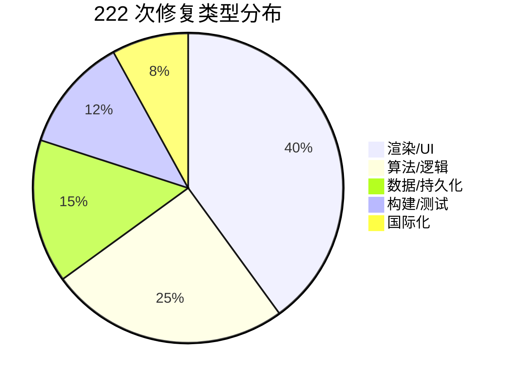

@[TOC](本文目录)

---

> 🎯 **系列第 3 篇** · 222 次修复中精选 15 个最有代表性的 Bug。每一个都是真实踩过、调试过、修复过的问题。  
> 📖 **上一篇**：[Raylib 渲染架构：Camera2D → RenderTexture2D](https://blog.csdn.net/ysu_0314/article/details/162362720?spm=1011.2415.3001.5331)

---

# 🐛  3  | 222 个 Bug 修复教会我的事

---

> 💬古人有言： "写了 10 年代码，踩过的坑 80% 都是类似的。"  
> 本文涵盖：算法 Bug · 框架陷阱 · 浮点 UB · 字体工程 · 数据完整 · 布局耦合。希望你看了会想 —— **"原来不只我一个人踩过这个坑。"**

---

## 🐛 Bug 1：点空白格只展开一小片

- ⭐ 难度：算法 · 4/5
- 🔧 修复：**Fix #15**

```c
// ❌ 错误写法：pop 时才标记
while (top > 0) {
    int r = stackR[top]; top--;
    board[r][c].isRevealed = true;   // ← 晚了！
    for (邻居) {
        if (!revealed && !flagged)
            stackR[top] = nr; top++;  // 重复入栈！
    }
}
```

**根因**：A 展开 B/C/D，B 又展开 A —— 因为 A 还没被 pop，`isRevealed == false`，又被 push 一次。480 个栈位置很快被重复项填满，后面的格子**静默丢弃**。

```c
// ✅ 正确写法：push 时立刻标记
board[nr][nc].isRevealed = true;  // ← push 时标记！
stackR[top] = nr; top++;
```

> 🎯 **教训**：BFS 的标准写法 —— `visited` 在 enqueue 时设置。

---

## 🐛 Bug 2：布雷时程序假死

- ⭐ 难度：算法 · 3/5
- 🔧 修复：**Fix #7, #17**

```c
// ❌ 随机碰撞法
while (placed < totalMines) {
    int r = rand(), c = rand();
    if (!board[r][c].isMine) { board[r][c].isMine = true; placed++; }
}
```

用户自定义 "16×30、450 个雷" —— 只剩 30 个空位，随机命中率 6%。循环数十万次都放不完。

**修复**：Fisher-Yates 洗牌。收集所有可用格索引 → 洗牌一次 → 取前 N 个。

> 🎯 **教训**：O(N) 能做的事，不要让计算机去"碰运气"。

---

## 🐛 Bug 3：ESC 一按游戏就关了

- ⭐ 难度：框架 · 2/5
- 🔧 修复：**Fix #99**

花了半天写了完整的 ESC 处理逻辑：菜单退出、游戏暂停、暂停恢复…… **全都没用**。按 ESC 窗口直接关闭。

翻文档才发现 —— **Raylib 默认把 ESC 映射为关闭窗口**。`WindowShouldClose()` 每帧检测 ESC 并设关闭标志，比你的逻辑更早执行。

```c
// ✅ 修复：在 InitWindow 后加一行
SetExitKey(KEY_NULL);
```

> 🎯 **教训**：总是先读框架的默认行为再写逻辑。==Raylib 的默认快捷键是第一个要检查的。==

---

## 🐛 Bug 4：第一次点击标旗的格子，游戏不动了

- ⭐ 难度：逻辑 · 3/5
- 🔧 修复：**Fix #29 → Fix #35**

进入新游戏 → 右键标了几个旗 → 左键点击标旗格想开始 —— **没反应**。因为 `isFlagged` 检查拦截了点击。

**第一次修复**：让首次点击跳过 flag 检查。结果另一个地方的 `isFlagged` 检查又拦截了。**同一策略在两个层级各有一份**。

```c
// 层级 1：点击处理器
if (!board[r][c].isFlagged || game.firstClick) { /* 允许点击 */ }

// 层级 2：RevealCell 内部
if (board[r][c].isFlagged) return;  // ← 再次拦截！
```

**最终修复**（Fix #35）：首次点击前自动清除旗子 + `flagCount--`。

> 🎯 **教训**：跨层级的安全策略要同步修改，或者集中到一处。

---

## 🐛 Bug 5："简体中文"变成 `??`

- ⭐ 难度：字体 · 2/5
- 🔧 修复：**Fix #217**

> 📋 **Bug 现象**：英文模式下，设置页语言选择按钮显示 `??`。
> ```
> ┌─────────────────────┐
> │ [ English ]  [ ?? ] │   ← "简体中文" 变成 ??
> └─────────────────────┘
> ```
> **根因**：`BuildCJKCodepoints()` 只扫描 i18n 翻译表，但 `"简体中文"` 是硬编码字符串。`简·体·文` 三字码点未包含 → 字体纹理无对应字形。[详情见第 4 篇](https://blog.csdn.net/ysu_0314/category_13180582.html?fromshare=blogcolumn&sharetype=blogcolumn&sharerId=13180582&sharerefer=PC&sharesource=ysu_0314&sharefrom=from_link)

设置页有 "English / 简体中文" 两个语言按钮。中文模式下正常；**英文模式**下中文按钮变成 `??`。

**根因**：`BuildCJKCodepoints()` 只扫描了 `I18N[LANG_ZH]` 翻译表，但按钮文字是硬编码的：

```c
const char* langNames[] = { "English", u8"简体中文" };  // 不在翻译表里
```

简(U+7B80) · 体(U+4F53) · 文(U+6587) 三个字从未出现在翻译表中，字体纹理没有包含它们的字形。

**修复**：`BuildCJKCodepoints` 增加第二趟扫描，处理硬编码字符串。

> 🎯 **教训**：你的字体码点集必须覆盖==所有屏幕上出现的字符==，包括不是从翻译表取的。

---

## 🐛 Bug 6：`%03d` 显示负数为 `-01`

- ⭐ 难度：UI · 1/5
- 🔧 修复：**Fix #1**

```c
int minesLeft = game.totalMines - game.flagCount;
DrawText("%03d", minesLeft);  // 旗子 > 雷数 → -01
```

负数 + `%03d` 格式 = `-01`，排版错位。后面演进为负数显示**红色** `-X`（那是 Feature 不是 Bug）。

---

## 🐛 Bug 7：最好成绩被自定义游戏污染

- ⭐ 难度：数据 · 3/5
- 🔧 修复：**Fix #40**

`InitCustomGame()` 把 `game.difficulty` 硬编码为 `DIFFICULTY_BEGINNER`。自定义赢了后，`UpdateStatsWin()` 把记录记到 Beginner 名下 —— Beginner 的最好成绩和统计数据全被污染。

**修复**：`Game` 结构体加 `bool isCustom`。所有持久化函数开头就 `if (isCustom) return;`。

---

## 🐛 Bug 8：字体加载失败就崩溃

- ⭐ 难度：健壮性 · 2/5
- 🔧 修复：**Fix #19**

```c
Font f = LoadFontEx("font.ttf", 96, ...);  // 失败 → glyphCount=0, glyphs=NULL
DrawTextEx(f, text, pos, size, spacing, color);  // 访问 NULL 指针 → 💥
```

**修复**：所有 `LoadFont` 失败后赋值为 `GetFontDefault()`（永远有效）。卸载时检查是否为默认字体（避免 double-free）。*Fix #30 继续补了 UnloadFont 的防护。*

---

## 🐛 Bug 9：写到一半断电，存档全丢

- ⭐ 难度：持久化 · 3/5
- 🔧 修复：**Fix #49, #84, #85**

```c
// ❌ 直接覆盖写
fopen("records.dat", "wb"); fwrite(...); fclose();
```

写入中途断电 → 文件是半截旧数据+半截垃圾 → 下次启动读入 NaN → 浮点 UB。

**修复**：Write-to-temp-then-rename + fflush + 校验和：

```c
// ✅ 原子写入模式
f = fopen("records.dat.tmp", "wb");
fwrite(&record, sizeof(record), 1, f);
fflush(f);     // Fix #85：刷入内核缓冲区
fclose(f);
remove("records.dat");
rename("records.dat.tmp", "records.dat");  // 原子操作
```

> 🖼️ **Write-to-temp-then-rename**：

```c
sequenceDiagram
参与者 游戏 as 🎮 游戏
参与者 临时 as 📝 .tmp
参与者 正式 as 📄 records.dat
游戏->>临时: fopen + fwrite + fflush + fclose
游戏->>正式: remove + rename（原子操作）
Note over 正式: ✅ 文件永远完整
```

> 

---

## 🐛 Bug 10：标对的旗子，输了就不见了

- ⭐ 难度：UI 逻辑 · 2/5
- 🔧 修复：**Fix #32**

踩雷后把所有雷格 `isRevealed = true`。绘制时 revealed 走"显示地雷"分支，不画旗子。

结果：**你猜对的旗子在游戏结束时不显示了**。你无法复盘自己哪些标对了。

**修复**：正确旗子保留旗子外观，错误旗子显示 ❌，未标雷显示地雷。

---

## 🐛 Bug 11：Win Rate = INFINITY

- ⭐ 难度：浮点 UB · 4/5
- 🔧 修复：**Fix #43, #44, #46**

```c
int minutes = (int)avgT / 60;  // avgT 来自 totalTime / won
```

如果存档被损坏，`totalTime` 可能是 `1e300`、`-1` 甚至 `NaN`。`(int)avgT` 超出 `INT_MAX` → **C 标准未定义行为**。

**三层防护**：
1. 读文件验证：`isnan()` + `isinf()` + `> 8640000` → 重置
2. 计算时截断：`if (avgT > 5999.0) avgT = 5999.0`
3. 写入校验和（Fix #84）

---

## 🐛 Bug 12：菜单按钮点了没反应

- ⭐ 难度：坐标系 · 2/5
- 🔧 修复：**Fix #88**

碰撞检测用 `windowWidth` 算按钮位置，鼠标坐标已经 `ScreenToCanvas` 转到 1280×720 画布空间。窗口缩放后完全错位。

**修复**：所有碰撞检测用 `CANVAS_WIDTH`。

> 🎯 **教训**：==一个坐标系走到底==。要么全屏画布，要么全窗口，不要混用。

---

## 🐛 Bug 13：标题差了 5 个像素

- ⭐ 难度：API 误用 · 1/5
- 🔧 修复：**Fix #69**

```c
DrawTextEx(font, title, pos, 52, 2);      // spacing=2
Vector2 size = MeasureTextEx(font, title, 52, 4); // spacing=4 ❌
```

差了 3 个像素的间距，标题偏左。找了 1 小时才发现。

---

## 🐛 Bug 14：难度标签和重启按钮叠在一起

- ⭐ 难度：布局耦合 · 4/5
- 🔧 修复：**Fix #135 → Fix #147 → Fix #210 → Fix #212**

**同一个问题修了 4 次。**

UI 面板就 80px 高，要塞进：雷数、难度标签、笑脸按钮、计时器。五个组件挤在一起。

| 版本 | 方案 | 效果 |
|:----:|------|:----:|
| Fix #135 | 难度标签放雷数右侧，流式布局 | 文本长了就向右挤 |
| Fix #147 | 改为垂直堆叠（雷数上、标签下） | 三区解耦 |
| Fix #210 | 用户发了屏幕录像确认重叠 | 再次分离 |
| Fix #212 | 标题固定 y=40，按钮起始 y=170 | 彻底断开 |

---

## 🐛 Bug 15：全屏中文模糊

- ⭐ 难度：渲染架构 · 5/5
- 🔧 修复：**Fix #221**

中文笔画 8-15 画，在 1080p 全屏下 1280×720 画布被放大 1.5 倍。`DrawTextEx` 绘制的字形经过双线性插值 → 密集笔画互相粘连。英文最多 3 画，完全没这个问题。

修复方案见[第 2 篇](https://blog.csdn.net/ysu_0314/article/details/162362720?spm=1011.2415.3001.5331)。

---

## 📊 总结



> 🎯 超过 1/3 的 Bug 是 **"修 A 引入 B"**（Fix #29 → Fix #35）。  
> 🎯 1/3 是 **API 边界/框架行为**（ESC 退出、坐标系混用、默认字体 NULL）。  
> 🎯 只有 1/3 是纯粹的"逻辑错误"。  
> 🎯 **最重要的经验**：写防御性代码（溢出检查、文件校验、边界 clamp），比 Debug 快得多。

---

## 🔜 下篇预告

> 第 4 篇：[**中英文双语的工程实现**](#)  
> 100+ 条翻译表、CJK 自动检测、分段缩放、字形码点采集的坑、"简体中文"乱码的 Debug 全过程。

---

## 📚 系列目录

| # | 标题 | 状态 |
|---|------|:----:|
| 1 | [项目概览与扫雷核心算法](https://blog.csdn.net/ysu_0314/article/details/162350482?sharetype=blogdetail&sharerId=162350482&sharerefer=PC&sharesource=ysu_0314&spm=1011.2480.3001.8118) | ✅ 已发布 |
| 2 | [Raylib 渲染架构](https://blog.csdn.net/ysu_0314/article/details/162362720?spm=1011.2415.3001.5331) | ✅ 已发布 |
| 3 | **222 个 Bug 修复教会我的事** ← 本文 | ✅ 已发布 |
| 4 | [中英文双语的工程实现](https://blog.csdn.net/ysu_0314/category_13180582.html?fromshare=blogcolumn&sharetype=blogcolumn&sharerId=13180582&sharerefer=PC&sharesource=ysu_0314&sharefrom=from_link) | 📝 待发布 |
| 5 | [持久化、撤销、提示：非核心功能](https://blog.csdn.net/ysu_0314/category_13180582.html?fromshare=blogcolumn&sharetype=blogcolumn&sharerId=13180582&sharerefer=PC&sharesource=ysu_0314&sharefrom=from_link) | 📝 待发布 |
| 6 | [200 个单元测试：C 项目也能 TDD](https://blog.csdn.net/ysu_0314/category_13180582.html?fromshare=blogcolumn&sharetype=blogcolumn&sharerId=13180582&sharerefer=PC&sharesource=ysu_0314&sharefrom=from_link) | 📝 待发布 |
| 7 | [960×640 → 1280×720：全局缩放重构实录](https://blog.csdn.net/ysu_0314/category_13180582.html?fromshare=blogcolumn&sharetype=blogcolumn&sharerId=13180582&sharerefer=PC&sharesource=ysu_0314&sharefrom=from_link) | 📝 待发布 |

---

> 👍 **如果你觉得有帮助，点赞 + 收藏 + 关注，三连支持作者继续写下去 🚀**
