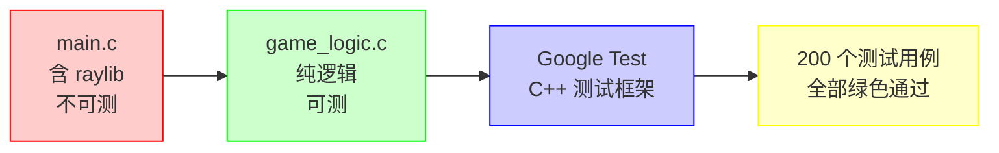

@[TOC](本文目录)

---

> 🎯 **系列第 6 篇** · 有人说"C 写测试太麻烦" —— 200 个用例告诉你，C 项目也可以 TDD。  
> 📖 **上一篇**：[持久化、撤销、提示：非核心功能](https://blog.csdn.net/ysu_0314/article/details/162817118?sharetype=blogdetail&sharerId=162817118&sharerefer=PC&sharesource=ysu_0314&spm=1011.2480.3001.8118)

---

# 🧪 第 6 篇：200 个单元测试 —— C 项目也能 TDD

---

## 📌 1. 架构：C + C++ 混合编译

### 1.1 为什么是 Google Test？

| 方案 | 断言丰富度 | 维护状态 | Windows 兼容 |
|:----|:----------:|:--------:|:------------:|
| ✅ **Google Test** | 🟢 丰富 | 🟢 活跃 | 🟢 好 |
| ❌ Unity | 🟡 基础 | 🟡 一般 | 🟢 好 |
| ❌ CMocka | 🟡 一般 | 🔴 缓慢 | 🟡 一般 |
| ❌ Criterion | 🟡 一般 | 🟡 一般 | 🟡 一般 |

Google Test 的致命优势：**参数化测试 + 丰富的断言宏 + 活跃社区。**

### 1.2 构建魔法

```
g++ -std=c++17 -O2 -Wall \
  -I. -Ithird_party/googletest/include \
  tests/test_game_logic.cpp \
  src/game_logic.c \          ← C 源码直接编译！
  -L. -lgtest -lgtest_main \
  -o tests/test_game_logic.exe
```



**关键**：`game_logic.c` 直接用 `g++` 编译。C++ 编译器对 C 代码兼容性足够好（只要代码写得规范）。

### 1.3 为什么 main.c 不能直接测？

`main.c` 链接了 raylib 图形库，需要 OpenGL 上下文。在命令行/CI 环境中无法运行。

**解决方案**：将 `PlaceMines`、`RevealCell`、`CalculateAdjacent`、`CheckWin`、`UpdateStats` 等不依赖图形的函数提取到 `game_logic.c`。`main.c` 通过 `#include "game_logic.h"` 调用。**测试只编译 `game_logic.c`**。

---

## 📂 2. 测试分层

```
tests/
├── test_game_logic.cpp    # 46 个算法测试
│                          #   布雷、展开、和弦、胜利检测
│
└── test_fixes.cpp         # 154 个回归测试
                           #   每个 Fix 对应一组用例
                           #   Fix99: 8 个 ESC 状态矩阵
                           #   Fix108: 24 个缩放比例
                           #   Fix82: 12 个 ValidateStats
```

### 2.1 test_game_logic：算法完整性

```cpp
TEST(RevealCellTest, RevealZeroAdjacentFloodFills) {
    Game g;
    InitNewGame(&g, DIFFICULTY_BEGINNER);
    // 手动设置棋盘，让 (0,0) 为 0 雷格
    RevealCell(&g, 0, 0);
    EXPECT_TRUE(g.board[0][0].isRevealed);
    EXPECT_TRUE(g.board[0][1].isRevealed);    // 被泛洪展开
    EXPECT_TRUE(g.board[1][0].isRevealed);
    EXPECT_FALSE(g.board[3][3].isRevealed);   // 远处的没被展开
}
```

### 2.2 test_fixes：回归防护网

```cpp
// Fix #99 ESC 八状态矩阵
TEST_F(Fix99EscapeKeyTest, MenuStateExitsGame) {
    game.state = GL_STATE_MENU;
    EXPECT_EQ(GL_HandleEscape(&game), GL_ACTION_QUIT);
}

TEST_F(Fix99EscapeKeyTest, AllNonMenuStatesReturnMenu) {
    GL_GameState nonMenuStates[] = {
        GL_STATE_PLAYING, GL_STATE_WIN, GL_STATE_LOSE,
        GL_STATE_STATS, GL_STATE_CUSTOM
    };
    for (auto s : nonMenuStates) {
        game.state = s;
        EXPECT_EQ(GL_HandleEscape(&game), GL_ACTION_MENU);
    }
}
```

> 🎯 **命名规范**：`Fix{N}{描述}Test`。一眼看出这是哪个修复的回归测试。

---

## 🎯 3. 精选测试用例

### 3.1 浮点边界：NaN / Inf / 1e300

```cpp
TEST(ValidateStatsTest, TotalTimeMaxBoundaryReset) {
    GL_Stats stats = {};
    stats.totalTime[0] = 1e300;       // 极端大值
    GL_ValidateStats(&stats);
    EXPECT_DOUBLE_EQ(stats.totalTime[0], 0.0);  // 被重置
}

TEST(ValidateStatsTest, TotalTimeNaNReset) {
    GL_Stats stats = {};
    stats.totalTime[0] = nan("");               // NaN
    GL_ValidateStats(&stats);
    EXPECT_DOUBLE_EQ(stats.totalTime[0], 0.0);
}
```

> 💡 这些不是"万一发生"的场景 —— 文件损坏、手动编辑、跨平台复制，都会产生异常值。==不测就是赌。==

### 3.2 整数边界：有符号溢出 UB

```cpp
TEST(Fix87IntegerOverflowTest, MaximumBoardSize) {
    unsigned rows = 16, cols = 30;
    int safeMines = (int)((unsigned)rows * (unsigned)cols) - 9;
    EXPECT_EQ(safeMines, 471);  // 480 - 9
}
```

C 标准：有符号整数溢出 = **undefined behavior**。用 `(unsigned)` 强制转换消除风险。测试验证计算结果正确。

### 3.3 RenderTexture 缩放矩阵（24 个子测试）

```cpp
TEST_F(Fix108RenderTextureScalingTest, PreciseMatch) {
    UpdateCanvasScale(1280, 720);            // 精确匹配
    EXPECT_FLOAT_EQ(canvasScale, 1.0f);
    EXPECT_FLOAT_EQ(canvasOffsetX, 0.0f);
}

TEST_F(Fix108RenderTextureScalingTest, WideScreen) {
    UpdateCanvasScale(1600, 720);            // 宽屏
    EXPECT_GT(canvasOffsetX, 0.0f);          // 水平居中偏移
    EXPECT_FLOAT_EQ(canvasOffsetY, 0.0f);    // 垂直无偏移
}
```

覆盖 24 种窗口/画布比例组合：精确匹配、2 倍缩放、宽屏、窄屏、超宽屏、HD + 居中…… 确保 `canvasScale` 计算在任何窗口尺寸下都正确。

| 窗口尺寸 | 画布尺寸 | canvasScale | canvasOffsetX | canvasOffsetY | 测试结果 |
|:--------:|:--------:|:-----------:|:-------------:|:-------------:|:--------:|
| 1280×720 | 1280×720 | 1.0 | 0.0 | 0.0 | ✅ 精确匹配 |
| 1600×720 | 1280×720 | 0.5625 | 160.0 | 0.0 | ✅ 宽屏 |
| 960×720 | 1280×720 | 0.5625 | 0.0 | 0.0 | ✅ 窄屏 |
| 2560×720 | 1280×720 | 0.5625 | 640.0 | 0.0 | ✅ 超宽屏 |
| 1920×1080 | 1280×720 | 1.5 | 0.0 | 0.0 | ✅ HD 全屏 |
| 3840×2160 | 1280×720 | 3.0 | 0.0 | 0.0 | ✅ 4K 全屏 |
| 1280×960 | 1280×720 | 0.75 | 0.0 | 120.0 | ✅ 竖屏 |
| 1280×480 | 1280×720 | 0.6667 | 0.0 | 0.0 | ✅ 窄高屏 |

---

## 📈 4. 测试数的演化

```
Round  测试数    里程碑
─────  ─────    ────────────────────────────
init      0    项目开始 —— 没有测试 ❌
R2-3     46    添加 game_logic 算法测试
R6-13    47    每次 Fix 加一个回归测试
R14      93    浮点/校验和保护测试
R15     100    ESC/坐标/布局回归
R18     146    RenderTexture 缩放矩阵
R24     200    🎉 综合功能测试完成
```

**200 个用例、全部绿色通过，已经成为重构的"安全网"。**

---

## 🚫 5. 测试的边界

单元测试再好，也测不了：

| 项目 | 原因 | 替代验证 |
|:----|:----|:--------|
| 图形渲染颜色 | 无 OpenGL 上下文 | 人工目测 |
| 按钮与文字重叠 | 布局不在 game_logic | 启动冒烟测试 |
| 帧时序/动画 | 测试不跑帧循环 | 人工核查 |
| 文件 I/O 权限 | 无实际文件系统隔离 | 手工测试 |

> 🔑 **200 个自动化测试 + 启动冒烟测试（基本能运行） + 手工 GUI 验证清单**，才是完整方案。

---

## 💭 6. 给你的建议

```c
if (项目行数 > 1000) {
    write_tests();  // 强烈建议
}
if (项目有文件 I/O || 浮点运算) {
    boundary_tests(); // 必须！NaN/Inf/INT_MAX 一定会来
}
if (项目有状态机) {
    state_matrix_tests(); // 每个状态 × 每个输入
}
```

> 🎯 **从第 1 个 Fix 就开始写回归测试。** 不写的话，下次重构你不敢改；写了，你就有信心。

---

## 🔜 下篇预告（最终篇）

> 第 7 篇：[**960×640 → 1280×720：一次全局缩放重构实录**](https://blog.csdn.net/ysu_0314/category_13180582.html?fromshare=blogcolumn&sharetype=blogcolumn&sharerId=13180582&sharerefer=PC&sharesource=ysu_0314&sharefrom=from_link)  
> CELL_SIZE 从 30 到 36 到 40 的迭代决策、菜单/统计/自定义三屏同步布局、HUD 重叠的 5 次修复全过程。

---

## 📚 系列目录

| # | 标题 | 状态 |
|---|------|:----:|
| 1 | [项目概览与扫雷核心算法](https://blog.csdn.net/ysu_0314/article/details/162350482) | ✅ 已发布 |
| 2 | [Raylib 渲染架构](https://blog.csdn.net/ysu_0314/article/details/162362720) | ✅ 已发布 |
| 3 | [222 个 Bug 修复教会我的事](https://blog.csdn.net/ysu_0314/article/details/162384510) | ✅ 已发布 |
| 4 | [中英文双语的工程实现](https://blog.csdn.net/ysu_0314/article/details/162442040) | ✅ 已发布 |
| 5 | [持久化、撤销、提示](https://blog.csdn.net/ysu_0314/article/details/162817118?sharetype=blogdetail&sharerId=162817118&sharerefer=PC&sharesource=ysu_0314&spm=1011.2480.3001.8118) | ✅ 已发布 |
| 6 | **200 个单元测试** ← 本文 | ✅ 已发布 |
| 7 | [全局缩放重构实录](https://blog.csdn.net/ysu_0314/category_13180582.html?fromshare=blogcolumn&sharetype=blogcolumn&sharerId=13180582&sharerefer=PC&sharesource=ysu_0314&sharefrom=from_link) | 📝 待发布 |

---

> 👍 **如果你觉得有帮助，点赞 + 收藏 + 关注，三连支持作者继续写下去 🚀**
