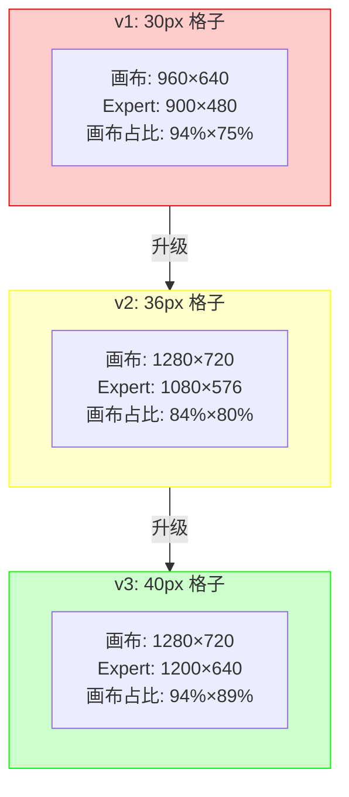
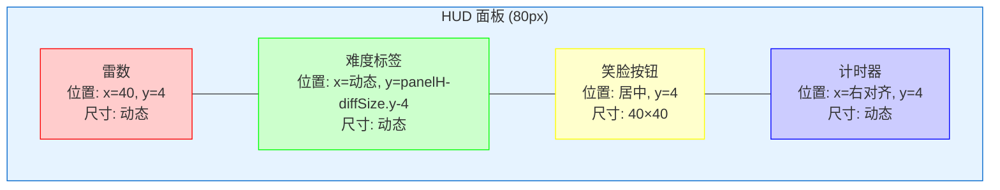
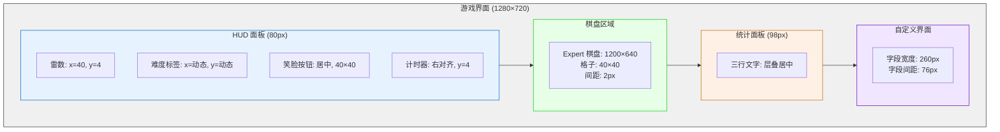
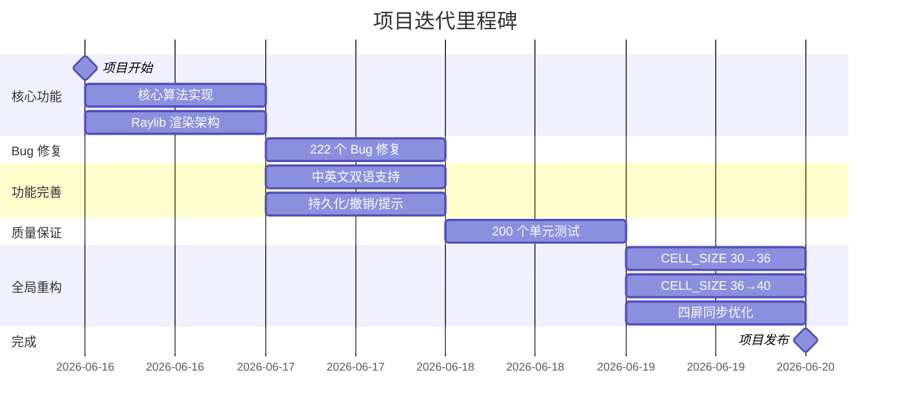

@[TOC](本文目录)

---

> 🎯 **系列最终篇** · CELL_SIZE 从 30 到 36 到 40，中间隔了 50 多次 Bug 修复。  
> 📖 **上一篇**：[200 个单元测试：C 项目也能 TDD](https://blog.csdn.net/ysu_0314/article/details/162817280?spm=1001.2014.3001.5501)

---

# 📐 第 7 篇：960×640 → 1280×720 —— 一次全局缩放重构实录

---

> "一个格子 30px 够了。"  
> "……不对，太小了。"  
> "那 36px。"  
> "……还是小。"  
> "40px。"  
> "这次对了。"

**一个格子的大小，牵动了全部布局参数。本文记录三次全局重构的全过程。**

---

## 📏 1. CELL_SIZE 的三次迭代

### 1.1 v1：30px（够用，但不够好用）

```
画布：960 × 640（3:2 比例）
格子：30px
Expert 棋盘：900 × 480  → 画布占 94% × 75%
Beginner 棋盘：270 × 270 → 画布占 28% × 42%
```

**问题**：
- 🟡 640px 高度下，HUD 70px + 棋盘 480px + 间距 = 只剩 40px
- 🟡 30px 格子太小，点击需要瞄准
- 🔴 3:2 画布在 16:9 显示器上左右黑边严重

### 1.2 v2：36px（好一点，但不够）

```
画布：1280 × 720（16:9！适配现代显示器）
格子：36px
Expert 棋盘：1080 × 576  → 画布占 84% × 80%
```

**动机**：用户反馈"棋盘太小，鼠标易误触"。而且画布从 3:2 改为 16:9 —— 这是个正确的决定。

**代价**：布局参数全部重调。HUD 70→80px，PADDING 20→30px。

### 1.3 v3：40px（最终的答案）

```
画布：1280 × 720（不变）
格子：40px
Expert 棋盘：1200 × 640  → 画布占 94% × 89%
Beginner 棋盘：360 × 360 → 画布占 28% × 50%
```



> 🎯 **一个教训**：一步到位比逐步升级**省 5 倍工作量。** 每次 CELL_SIZE 变化，都要改菜单、统计、自定义、HUD 四屏。

---

## 📊 2. 每次升级的影响范围

| 参数 | v1 (30px) | v2 (36px) | v3 (40px) |
|:----|:---------:|:---------:|:---------:|
| CANVAS_WIDTH | 960 | **1280** 🆕 | 1280 |
| CANVAS_HEIGHT | 640 | **720** 🆕 | 720 |
| CELL_SIZE | 30 | **36** | **40** |
| PADDING | 20 | 30 | **40** |
| 菜单标题字号 | 52 | 52 | **60** |
| 菜单按钮字号 | 18 | 18 | **22** |
| 菜单按钮宽度 | 280 | 280 | **340** |
| 菜单按钮高度 | 48 | 50 | **68** |
| 统计面板高度 | 70 | 70 | **98** |
| 统计行间距 | 80 | 80 | **114** |
| 自定义字段宽度 | 200 | 200 | **260** |
| 自定义字段间距 | 60 | 60 | **76** |

> ⚠️ **最痛苦的**：不是改参数本身，而是让 `DrawMenu`、`DrawGame`、`DrawStats`、`DrawCustom`、`UpdateGame` 五处的参数**完全一致**。

---

## 🔁 3. 同一个 HUD 重叠，修了 5 次

UI 面板顶部只有 80px，要塞进：雷数、难度标签、笑脸按钮、计时器。五个组件挤一块。



### Fix #65：雷数太靠左

**修复**：PADDING 10 → 40。

### Fix #135：难度标签和重启按钮叠了

难度标签在雷数右侧流式布局（`PADDING + mineSize.x + 20`），重启按钮居中。随着 "010" 变成 "-03" 宽度变化，向右挤到按钮。

**修复**：难度标签左移、重启按钮 160→200px。

### Fix #147：流式 vs 绝对定位的碰撞

Fix #135 后，难度标签与雷数水平排列。中文字符变长时仍会延伸到重启按钮区域。

**修复**：改为**垂直堆叠**。雷数上（`y=4`），难度标签下（`y = panelH - diffSize.y - 4`）。三区完全解耦。

### Fix #210：用户发了视频

用户录了屏幕录像发过来。第 015-060 帧，清楚地看到 `010` 和 `Beginner` 叠在一起。

**修复**：垂直分离间距加一倍。

### Fix #212：标题压住按钮

菜单标题在 `y=108`，第一个按钮起始 `y=86` —— 标题和按钮的视觉中心重叠了。

**修复**：标题固定 `y=40`，按钮起始 `y=170`。彻底断开。

---

## 📐 4. 居中公式的四代演进

### 4.1 第一代：硬编码

```c
y + (48 - 14) / 2   // 硬编码 14px，字号一变就歪
```

### 4.2 第二代：MeasureTextEx + roundf 🎯

```c
Vector2 size = MeasureTextEx(font, text, fontSize, spacing);
float posY = btn.y + (btn.height - size.y) / 2.0f;
DrawTextEx(font, text, (Vector2){roundf(posX), roundf(posY)}, ...);
```

> 💡 `roundf` 消除 `.5` 像素的亚像素模糊。如果不加，奇宽按钮的居中坐标有小数，DrawTextEx 在亚像素位置采样，小字号边缘发虚。

### 4.3 第三代：分组居中（Win/Lose Overlay）

两行文字作为一个整体居中：

```c
Vector2 titleSize = MeasureTextEx(font, title, 56, 2);
Vector2 msgSize   = MeasureTextEx(font, message, 24, 1);

float totalH = titleSize.y + 40 + msgSize.y;
float blockY = (CANVAS_HEIGHT - totalH) / 2.0f;

DrawTextEx(font, title,  (Vector2){cx, roundf(blockY)},                56, ...);
DrawTextEx(font, message, (Vector2){cx, roundf(blockY + titleSize.y + 40)}, 24, ...);
```

### 4.4 第四代：层叠居中（Stats 面板）

三行文字用累积 Y 偏移：

```c
float textY = panel.y + 8;
// 第 1 行
DrawTextEx(font, name, (Vector2){textX, roundf(textY)}, 20, ...);
textY += nameSize.y + 6;
// 第 2 行
DrawTextEx(font, line1, (Vector2){textX, roundf(textY)}, 16, ...);
textY += l1Size.y + 6;
// 第 3 行
DrawTextEx(font, line2, (Vector2){textX, roundf(textY)}, 16, ...);
```

> 🔑 **黄金法则**：永远不用 `y + 30`、`y + 50` 硬编码。测量上一行的高度，再算下一行的位置。

---

## 🔗 5. 四屏同步

| 函数 | 用途 | 需同步的参数 |
|:----|:----|:------------|
| `DrawMenu` | 渲染菜单按钮 | btnWidth, btnHeight, gap, startY |
| `UpdateGame` (Menu) | 检测菜单点击 | **同一份 btnWidth, btnHeight, gap, startY** |
| `DrawStats` | 渲染统计面板 | panelH, rowH, startY |
| `DrawCustom` | 渲染自定义界面 | fieldW, fieldH, gap |

> 🐛 **Fix #105**：`DrawMenu` 里的 btnWidth=320，但 `UpdateGame` 里是 280。玩家看到了按钮，但点不中右半部分。**一个表格把参数抄出来对比，发现 3 处不一致。**

---

## 🗺️ 6. 最终布局

```
┌─────────────────────────────────────────────────────────────┐ 
│  010             ┌──────────────┐                00:42      │  ← HUD (80px)
│  Beginner        │    😊        │                           │
│                  └──────────────┘                           │
├─────────────────────────────────────────────────────────────┤
│                                                             │
│    ┌────┬────┬────┬────┬────┬────┬────┬────┬────┬────┐      │
│    │  1 │  2 │    │  F │    │  3 │  1 │    │    │    │      │
│    ├────┼────┼────┼────┼────┼────┼────┼────┼────┼────┤      │
│    │    │    │    │    │  ? │    │    │    │    │    │      │
│    └────┴────┴────┴────┴────┴────┴────┴────┴────┴────┘      │
│                                                             │
└─────────────────────────────────────────────────────────────┘
```



---

## 💡 7. 五个核心教训

> **① 一步到位**  
> CELL_SIZE 30→36→40 三次迭代，每次都是全局大改。直接上 40 省去一次重构。

> **② 集中配置**  
> 所有布局参数放在一个地方，而不是散落在五个绘制函数里。搜 `PADDING` 看引用次数就知道耦合度。

> **③ 同一份数据**  
> 碰撞检测和绘制用同一组变量。各自算各自的 → 点击区域和绘制位置错位。

> **④ 不要硬编码**  
> `y + 30`、`y - 6`、`(height - 14) / 2` 是布局 Bug 的温床。`MeasureTextEx` 是你最好的朋友。

> **⑤ 截图对比**  
> 每次布局改动前后截一张全屏图。肉眼比代码更容易发现"标题偏了 3px"这种差异。

---

## 🏁 写在最后

这个项目从第一行代码到最终版本，经历了：

```
📦 222 个修复
🧪 200 个测试
🎨 18+ 个功能
📐 7 轮全局重构
🌏 2 种语言
```

如果你把代码看作一个产品，那么 90% 的时间花在了"让它看起来正确"。**扫雷很简单，但做一个好的扫雷很难。**



---

## 📚 全系列目录

| # | 标题 | 状态 |
|---|------|:----:|
| 1 | [项目概览与扫雷核心算法](https://blog.csdn.net/ysu_0314/article/details/162350482) | ✅ 已发布 |
| 2 | [Raylib 渲染架构](https://blog.csdn.net/ysu_0314/article/details/162362720) | ✅ 已发布 |
| 3 | [222 个 Bug 修复教会我的事](https://blog.csdn.net/ysu_0314/article/details/162384510) | ✅ 已发布 |
| 4 | [中英文双语的工程实现](https://blog.csdn.net/ysu_0314/article/details/162442040) | ✅ 已发布 |
| 5 | [持久化、撤销、提示](https://blog.csdn.net/ysu_0314/article/details/162817118) | ✅ 已发布 |
| 6 | [200 个单元测试：C 项目也能 TDD](https://blog.csdn.net/ysu_0314/article/details/162817280?spm=1001.2014.3001.5501) | ✅ 已发布 |
| 7 | **全局缩放重构实录** ← 本文 | ✅ **已发布（系列完结）** 🎉 |

---

> 🚀 **全系列完 · 感谢你的阅读**  
> 欢迎 Star / Fork / 提 Issue。如果你觉得这个系列对你有帮助，==点赞 + 收藏 + 关注==，后续会继续写更多 C / C++ 工程实践系列。

---

> 👍 **如果你觉得有帮助，点赞 + 收藏 + 关注，三连支持作者继续写下去 🚀**
