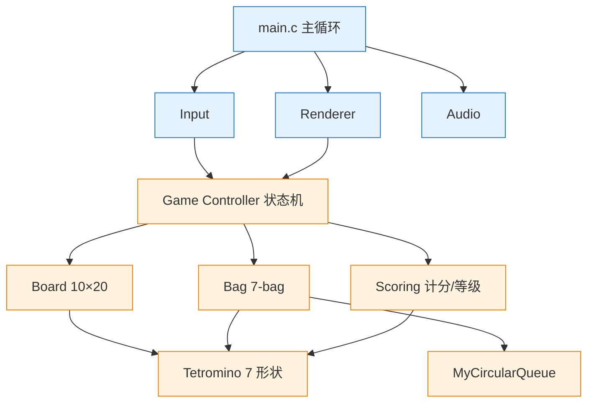

@[TOC](用 Vibe Coding 从零实现一个俄罗斯方块:C + raylib + GoogleTest 全流程实战)

> 本文记录用 **opencode** 作为 AI 代理工具,严格遵循 PDF《Vibe Coding 实现俄罗斯方块》
> 11 个 Phase 验收曲线,从需求访谈到双测试框架 + 构建日志系统 + 自合成 8-bit 音效,
> 一次性落地一个 ==可玩、可测、可维护== 的单机俄罗斯方块 PC 客户端的完整工程过程。
>
> 适合人群:对 Vibe Coding 工程化感兴趣的开发者、C 语言学习者、想看 raylib + GoogleTest 在 MinGW 下怎么玩的人。

## 一、为什么再用 Vibe Coding 做一遍俄罗斯方块?

俄罗斯方块是经典的"小而全"项目:

- **数据结构密度高**:循环队列(7-bag)、二维数组(棋盘)、状态机(游戏控制器)
- **算法点足够**:消行压缩、Fisher–Yates 洗牌、DAS 自动重复、NES 计分与速度曲线
- **UI 与逻辑可清晰分离**:逻辑层零依赖,可纯单元测试;UI 层薄、靠人眼验收

PDF 给出的提示词约束[^pdf]非常工程化,关键有三条:

1. 不要直接写代码,先做 ==Socratic 提问法== 的深度访谈
2. 每 Phase 完成后人工 review 代码与测试用例,跟 AI "碰撞拉扯"
3. UI Phase 手动验收,逻辑 Phase 跑 gtest 验收后再进下一 Phase

[^pdf]: PDF 原文提示词见仓库根目录 `4.Vibe Coding实现俄罗斯方块.pdf` 第 3.1 节。

这套流程本质是把 AI 当"高速打字员 + 第一稿思考者",==人保留所有决策权==。下文会展示几个"碰撞拉扯"的具体例子,看完你就知道为什么 AI 的第一稿不能直接用。

## 二、技术选型:为什么换掉了 VS2022 + gtest?

PDF 原方案是 VS2022 + 自带 gtest,我用的是 ==w64devkit + GCC 16 + GNU Make==,理由如下:

| 维度 | PDF 原方案 | 本项目方案 | 理由 |
| ---- | ---------- | ---------- | ---- |
| 工具链 | VS2022 + .sln + MSBuild | w64devkit + GCC 16 + Make | 体积小、跨命令行、不需要 IDE |
| gtest 来源 | VS 内置适配器 | 从 googletest v1.14.0 源码用 cmake 编出 `libgtest.a` | 不绑 VS,克隆即可用 |
| 测试入口 | VS Test Explorer | `make test` / `make gtest` | 命令行 CI 友好 |
| 日志化 | 无 | `make log` + PowerShell 脚本时间戳化 | 见第五节 |

==关键决策==:gtest 静态库 `libgtest.a` / `libgtest_main.a` **入库提交**,这意味着任何人 `git clone` 后无需联网、无需 VS、无需 cmake,直接 `make gtest` 就能跑。这正是教学项目该有的样子。

## 三、项目目录与架构总览

### 3.1 目录结构

```text
Tetris/
├── include/        # 9 个 .h(逻辑层接口)
├── src/            # 10 个 .c(含 main.c)
├── tests/          # 5 套 .c + 5 套 .cpp + 自制 test_framework.h
├── lib/
│   ├── raylib.h / libraylib.a
│   └── gtest/{include, lib}
├── resources/sounds/   # 7 个 8-bit 音效 wav(脚本生成)
├── docs/           # architecture / phases / testing
├── build/logs/     # 构建日志(make log 自动写入)
├── scripts/
│   ├── build_log.ps1   # 统一构建+日志封装
│   └── gen_sounds.py   # 8-bit 音效合成脚本
├── Makefile
├── README.md / CHANGELOG.md / AGENTS.md
└── .gitignore
```

### 3.2 架构图(Mermaid)



==蓝色== 是 UI 层(依赖 raylib,不做单元测试),==橙色== 是逻辑层(纯 C,不依赖 raylib,接受双测试框架覆盖)。这条边界从第一天就划清楚,后面所有 review 都围绕它做。

### 3.3 模块职责

| 模块 | 文件 | 职责 |
| ---- | ---- | ---- |
| `MyCircularQueue` | `include/MyCircularQueue.h` + `src/MyCircularQueue.c` | 通用循环队列(Bag 的底层依赖) |
| `tetromino` | `include/tetromino.h` + `src/tetromino.c` | 7 种方块 4×4 矩阵 + 4 旋转态 + NES 颜色 |
| `board` | `include/board.h` + `src/board.c` | 10×20 网格 / 碰撞 / 消行压缩算法 |
| `bag` | `include/bag.h` + `src/bag.c` | 7-bag randomizer |
| `scoring` | `include/scoring.h` + `src/scoring.c` | NES 计分 / 等级 / Combo / 速度 |
| `game` | `include/game.h` + `src/game.c` | 状态机 + 操作入口 |
| `renderer` / `input` / `audio` | `src/*.c` | raylib UI 层 |
| `main` | `src/main.c` | 主循环装配 |

## 四、11 个 Phase 的实施与"碰撞拉扯"

PDF 把 TODO 分成 11 个 Phase,UI 与逻辑交替。我只挑 ==真正有故事== 的几个讲,完整进度见仓库 `docs/phases.md`。

### 4.1 Phase 1:脚手架 + 循环队列

PDF 第 5 节直接给了 `MyCircularQueue` 的完整源码,这是项目唯一"原样照搬"的模块。

```c
// MyCircularQueue.h(节选)
typedef struct {
    int* a;     // 底层数组(容量为 k+1,多用一格解决假溢出)
    int head;   // 指向头
    int tail;   // 指向尾下一个
    int k;      // 队列容量
} MyCircularQueue;
```

==关键技巧==:`obj->a = malloc(sizeof(int) * (k + 1))`,**多开一格**用 `tail+1 % capacity == head` 判满,完美避开"假溢出"陷阱。后面 7-bag 就站在这个队列之上。

Makefile 接入 raylib 也在这步完成:

```makefile
CC      = gcc
CFLAGS  = -std=c11 -Wall -Wextra -O2 -Iinclude -Ilib -Isrc
LDFLAGS = -Llib -lraylib -lopengl32 -lgdi32 -lwinmm
```

> Windows 下链 raylib 静态库必须补 `lopengl32 lgdi32 lwinmm` 三个系统库,少了任一个链接报错。这是 GCC + raylib 在 Windows 的"标配"。

### 4.2 Phase 2:消行算法的"碰撞拉扯" ⭐

这是 PDF 第 5.1 节的核心案例。AI 第一稿给的消行是教科书式的"满行→上方整体下移":

```c
if (fullLine) {
    for (int r = row; r > 0; r--) {
        for (int col = 0; col < BOARD_WIDTH; col++) {
            board->grid[r][col] = board->grid[r - 1][col];  // 逐行下移
        }
    }
    // ...
}
```

review 后我提了两个问题:

> 1. 方块都是 ==重力堆叠== 出来的,遇到空行,上面就不可能再有方块了吧?
> 2. 那 `boardClearLines` 整体逻辑是不是也可以:当前行全空,就跳出循环?

AI 同意了,改成 ==压缩算法==,`writeRow` / `readRow` 双指针:

```c
// 消行:压缩算法
int boardClearLines(Board* board) {
    int cleared = 0;
    int writeRow = BOARD_HEIGHT - 1;

    for (int readRow = BOARD_HEIGHT - 1; readRow >= 0; readRow--) {
        // 遇到空行:上方不可能再有方块,提前结束
        if (boardIsRowEmpty(board, readRow)) {
            break;
        }
        if (boardIsRowFull(board, readRow)) {
            cleared++;              // 满行跳过,等效删除
        } else {
            if (writeRow != readRow) {   // 保留行复制到 writeRow
                for (int col = 0; col < BOARD_WIDTH; col++) {
                    board->grid[writeRow][col] = board->grid[readRow][col];
                }
            }
            writeRow--;
        }
    }
    // writeRow 之上的所有行全部清零
    for (int row = 0; row <= writeRow; row++) {
        for (int col = 0; col < BOARD_WIDTH; col++) {
            board->grid[row][col] = 0;
        }
    }
    return cleared;
}
```

==复杂度对比==:原版最坏 $O(N^2)$(每次满行都整体下移),压缩版 ==严格 $O(N)$==,因为每行最多被读一次、写一次。

> ⚠ 这个优化的前提是 ==重力场景==:棋盘上方不会"浮空方块"。所以单元测试不能构造"row 3 有方块、row 4~19 全空"的非法场景来验证它,否则算法会按"浮空被压缩"语义处理。我第一版测试就这么写,失败了一例,改成纯重力场景后通过。这就是 review 测试用例本身的价值。

### 4.3 Phase 4:7-bag 与"1000 轮验证"

7-bag 规则:**任意连续 7 个方块,7 种形状各出现一次,顺序随机**。实现非常薄:

```c
// Fisher-Yates 洗牌
static void shuffle(int* arr, int n) {
    for (int i = n - 1; i > 0; i--) {
        int j = rand() % (i + 1);
        int tmp = arr[i]; arr[i] = arr[j]; arr[j] = tmp;
    }
}

static void refillBag(Bag* bag) {
    int arr[PIECE_COUNT];
    for (int i = 0; i < PIECE_COUNT; i++) arr[i] = i;
    shuffle(arr, PIECE_COUNT);
    for (int i = 0; i < PIECE_COUNT; i++) {
        myCircularQueueEnQueue(bag->queue, arr[i]);
    }
}
```

==真正难的是测试==。PDF review 后补了一条:`bag.Reset_StillFollowsBagRule` 原版没验证 reset 后的预览,我补上了:

```cpp
TEST(BagTest, BagRuleEverySeven_HoldsFor1000Rounds) {
    Bag b; bagInit(&b);
    for (int round = 0; round < 1000; round++) {
        int out[PIECE_COUNT];
        for (int i = 0; i < PIECE_COUNT; i++) {
            out[i] = (int)bagNext(&b);
        }
        ASSERT_TRUE(permutationOfAll(out)) << "Round " << round << " violated";
    }
    bagFree(&b);
}
```

连续 1000 轮(7000 次 `bagNext`)每 7 个都是 `[0..6]` 的全排列,这个用例一旦失败会打印是第几轮违规,直接定位问题。

### 4.4 Phase 5:Ghost 与 Next 预览的视觉调整

AI 第一版的 Ghost Piece 用半透明方块,review 后发现 ==区分度不够==。改成白色虚线方框 + 4 段小白线模拟虚线:

```c
for (int k = 4; k < CELL_SIZE - 4; k += 8) {
    DrawLine(x + 2, y + k, x + 7, y + k, white);          // 左边
    DrawLine(x + CELL_SIZE - 8, y + k, x + CELL_SIZE - 3, y + k, white); // 右边
    DrawLine(x + k, y + 2, x + k, y + 7, white);          // 上边
    DrawLine(x + k, y + CELL_SIZE - 8, x + k, y + CELL_SIZE - 3, white); // 下边
}
```

Next 预览同理:第一版每个方块单独背景色 → 太花,改成一个 ==大外框内竖排 3 个== 方块,15 px 小格,无背景色。视觉立刻干净了。

> 这是 Vibe Coding 的典型场景:AI 能给你 80 分的方案,剩下 20 分的"美感/手感"得人眼来调。

### 4.5 Phase 7:DAS(Delayed Auto Shift)输入机制

DAS 是俄罗斯方块的 ==经典输入手感==:按住方向键,首次立即触发一格,然后延迟一段时间,之后以更高频率自动重复。

PDF 给的代码逻辑很清晰,我直接照搬到 `input.c`:

```c
int inputUpdateDAS(InputState* state) {
    bool leftDown = IsKeyDown(KEY_LEFT);
    bool rightDown = IsKeyDown(KEY_RIGHT);

    if (leftDown) {
        if (!state->moveLeftHeld) {                  // 首次按下
            state->moveLeftHeld = true;
            state->moveLeftTimer = DAS_INITIAL_DELAY; // 15 帧 ≈ 250ms
            if (!rightDown) return -1;
        } else {                                     // 持续按住
            state->moveLeftTimer--;
            if (state->moveLeftTimer <= 0) {
                state->moveLeftTimer = DAS_REPEAT_RATE; // 4 帧 ≈ 67ms
                if (!rightDown) return -1;
            }
        }
    } else {
        state->moveLeftHeld = false;
        state->moveLeftTimer = 0;
    }
    // 右键 DAS 对称,略...
}
```

==两个手感参数==:`DAS_INITIAL_DELAY = 15` 帧、`DAS_REPEAT_RATE = 4` 帧。这是经典手感,改成 10/2 会过灵敏,改成 30/8 会过迟钝。

==还有一个细节==:左右键 ==同时按住== 时,右键优先返回 1,左键"先检测但不返回"。避免左右同按时方块左右抖动。

### 4.6 Phase 8:NES 计分与速度曲线

NES 经典计分公式 + Combo 递增,一行代码也不多:

```c
int scoringOnClearLines(Scoring* sc, int cleared) {
    if (cleared <= 0) { sc->combo = 0; return 0; }   // 未消行重置 combo
    if (cleared > 4) cleared = 4;
    sc->combo++;
    int base  = scoringBaseScore(cleared);            // 100/300/500/800
    int bonus = 50 * sc->combo * sc->level;           // Combo 递增
    int gain  = base * sc->level + bonus;
    sc->score += gain;
    sc->lines += cleared;
    int newLevel = 1 + sc->lines / LINES_PER_LEVEL;   // 每 10 行升 1 级
    if (newLevel > MAX_LEVEL) newLevel = MAX_LEVEL;   // 20 级封顶
    sc->level = newLevel;
    return gain;
}
```

速度曲线用 ==`max(800 - (level-1) × 40, 80)` ms==:

| Level | 下落间隔 |
| ----- | -------- |
| 1     | 800 ms   |
| 2     | 760 ms   |
| 10    | 440 ms   |
| 19    | 80 ms    |
| 20    | 80 ms(封顶) |

测试覆盖到 ==level 20 用 level 20 计分==、越界封顶、Combo 累加 / 重置等 14 个用例,确保改 scoring 模块不会偷偷破坏等级曲线。

## 五、构建系统:Makefile + 一键 CI + 时间戳日志

### 5.1 Makefile 目标全景

```makefile
all: build
build: $(BIN)
run: build                # 编译并运行
test: tests/run_tests.exe      # assert 版
gtest: tests/run_gtest.exe     # gtest 版
test-all: test gtest
ci: clean build test gtest     # 一键 CI
log:                            # CI + 时间戳化日志
	powershell -NoProfile -ExecutionPolicy Bypass -File scripts/build_log.ps1 -Targets ci
clean:
	rm -f $(OBJ) $(LIB_OBJ) $(BIN) tests/run_tests.exe tests/run_gtest.exe
.PHONY: all build run test gtest test-all ci log clean
```

`make ci` 是开发主命令 — 干净构建 + 两套测试,任一失败立即非 0 退出。

### 5.2 时间戳化日志(`scripts/build_log.ps1`)

这是个对标 CI 系统的小封装,把 `make ci` 的所有 stdout/stderr 写入 `build/logs/build_<时间戳>.log`,默认保留最近 30 份:

```powershell
powershell -File scripts/build_log.ps1 -Targets ci         # 等价 make log
powershell -File scripts/build_log.ps1 -Targets test,gtest -Keep 10
```

每份日志尾部自动生成 ==Build Summary==,可以直接 grep 看哪一项目标失败:

```text
==================== Build Summary ====================
  [ci] exit=0 warnings=0 errors=0
  Elapsed: 00:00:13.7828996
  Overall exit code: 0
  Log: build\logs\build_20260729_184637.log
=======================================================
Kept 3 log(s) (limit 30).
```

> ==踩坑记录==:PowerShell 5.1 下 `Get-ChildItem` 单文件时返回 scalar 而非数组,`.Count` 会失效,导致"保留最近 N 份"的逻辑不生效。修复办法是外层套 `@()` 强制为数组:
> ```powershell
> $allLogs = @(Get-ChildItem -LiteralPath $LogRoot -Filter "build_*.log" |
>     Sort-Object LastWriteTime -Descending)
> ```
> 这种小坑在 Windows 命令行生态里很常见,日志系统必须自己扛过去。

## 六、双测试框架的工程价值

项目同时维护两套测试:

| 框架   | 文件                              | 入口           | 用例数 |
| ------ | --------------------------------- | -------------- | ------ |
| assert | `tests/test_*.c` + `test_main.c`  | 自制聚合入口   | 52     |
| gtest  | `tests/test_*.cpp` + `libgtest_main` | libgtest 自带 main | 52     |

==合计 104 用例==,分布在 5 个模块:`Tetromino 6 / Board 14 / Bag 6 / Game 12 / Scoring 14`。

### 6.1 为什么要两套?

- **PDF 原方案是 gtest**,保留它跟标准行为对齐
- **assert 版零依赖**:即使把 `lib/gtest/` 整个目录删掉,测试依然可跑。教学场景、CI 沙箱、最小化环境都能用
- **同份逻辑层被两套分别链接**:能即时发现编译器差别或 ABI 引发的潜在问题

### 6.2 gtest 版的写法

```cpp
#include <gtest/gtest.h>
extern "C" {                // ← 必须 extern "C",否则 C++ 会 name-mangle
#include "bag.h"
}

TEST(BagTest, BagRuleEverySeven_HoldsFor1000Rounds) {
    Bag b; bagInit(&b);
    for (int round = 0; round < 1000; round++) {
        int out[PIECE_COUNT];
        for (int i = 0; i < PIECE_COUNT; i++) out[i] = (int)bagNext(&b);
        ASSERT_TRUE(permutationOfAll(out)) << "Round " << round << " violated";
    }
    bagFree(&b);
}
```

> ==运行结果==:`[==========] 52 tests from 5 test suites ran. (0 ms total)` `[  PASSED  ] 52 tests.`

## 七、C/C++ 混编链接陷阱 ⭐

==这是整个项目最容易踩的坑==,单独拎出来讲。

**问题**:gtest 是 `.cpp`,被测代码是 `.c`。如果你让 `g++` 直接编译 `.c`:

```bash
g++ ... test_tetromino.cpp src/tetromino.c ...    # ❌ 错误做法
```

`g++` 会把 `.c` 当 C++ 处理,函数名被 ==name-mangling==(`tetrominoGetShape` → `_Z19tetrominoGetShapeii`)。
而 `.cpp` 里的 `extern "C"` 期望的是原始 C 符号 → 链接报几十个 `undefined reference`。

**正确做法**:用 ==gcc 预编译 .c 为 .o==,g++ 只编译 .cpp 并链接 .o:

```makefile
# 通用 .c -> .o 规则(用 gcc,保持 C ABI)
%.o: %.c
	$(CC) $(CFLAGS) -c -o $@ $<

# gtest 链接:先依赖 .o,再用 g++ 编译 .cpp 并链接
tests/run_gtest.exe: $(GTEST_SRC) $(LIB_OBJ)
	$(CXX) $(CXXFLAGS) -o $@ $(GTEST_SRC) $(LIB_OBJ) $(GTEST_LDFLAGS)
```

这样 `.o` 里是原始 C 符号,`.cpp` 里的 `extern "C"` 能正确解析,链接成功。

> ==经验法则==:**永远不要让 g++ 编译 .c**。在 MinGW + GoogleTest 的组合下,这是必须记住的一条铁律。我把它写进了 `AGENTS.md` 给后续的 AI 代理看。

## 八、音效自合成:纯 Python 标准库生成 8-bit wav

PDF 要求 7 个 8-bit 风格音效,但没说怎么弄到。我让AI写了个 ==纯标准库== 脚本 `scripts/gen_sounds.py`(`wave` + `math` + `random`),不依赖 numpy/scipy:

### 8.1 合成原语

```python
def square(freq, n, sr=SAMPLE_RATE, duty=0.5):
    """方波:占空比 duty(0~1),返回 ±1 序列。"""
    out = [0.0] * n
    period = sr / freq
    for i in range(n):
        phase = (i % period) / period
        out[i] = 1.0 if phase < duty else -1.0
    return out

def env_exp_decay(n, decay_ms, sr=SAMPLE_RATE):
    """指数衰减包络(用于撞击/爆炸)。"""
    tau = decay_ms / 1000.0
    return [math.exp(-i / sr / tau) for i in range(n)]
```

### 8.2 每个事件的"音色配方"

| 文件           | 时长    | 合成方案                                              |
| -------------- | ------- | ---------------------------------------------------- |
| `move.wav`     | 40 ms   | 660 Hz 方波 + ADSR,音量低                             |
| `rotate.wav`   | 80 ms   | 扫频 500→1000 Hz 方波                                 |
| `lock.wav`     | 120 ms  | 150 Hz 方波 + 白噪声,指数衰减(撞击感)              |
| `clear.wav`    | 150 ms  | 三音上升 C5-E5-G5 方波琶音                            |
| `tetris.wav`   | 300 ms  | 四音上升 C5-E5-G5-C6,叠加八度让声音更亮              |
| `levelup.wav`  | 200 ms  | 双音上升 G5→C6                                       |
| `gameover.wav` | 450 ms  | 三音下降 G4-E4-C4,指数衰减(哀悼感)                |

### 8.3 撞击声示例

```python
def gen_lock():
    # 撞击声:低频方波 150Hz + 衰减白噪声, ~120ms
    n = int(SAMPLE_RATE * 0.12)
    low = square(150, n, duty=0.5)
    nz  = noise(n, seed=42)
    body = mix(low, [v * 0.6 for v in nz])
    env  = env_exp_decay(n, decay_ms=80)
    return [v * 0.6 for v in apply_env(body, env)]
```

==运行==:

```bash
python scripts/gen_sounds.py
# Generating 8-bit sound effects into: resources/sounds
#   move.wav         40.0 ms    1808 bytes
#   rotate.wav       80.0 ms    3572 bytes
#   lock.wav        120.0 ms    5336 bytes
#   clear.wav       149.9 ms    6656 bytes
#   tetris.wav      299.9 ms   13268 bytes
#   levelup.wav     200.0 ms    8864 bytes
#   gameover.wav    449.9 ms   19886 bytes
# Done. 7 files generated.
```

7 个文件 ==共 ~70 KB==,16-bit PCM mono 22050 Hz,raylib `LoadSound` 直接吃。游戏代码侧对缺失文件 ==自动静默降级==(`audio.c:38 fileExists` 检测),所以即便不跑这个脚本,游戏也能正常跑,只是没声音。

> 想换音色就改 `gen_sounds.py` 里的频率/包络/波形,再跑一次,无需重编译 C 代码。

## 九、验收与最终结果

### 9.1 PDF 15 条验收标准

| #  | 验收标准                                                 | 测试方式          |
| -- | -------------------------------------------------------- | ----------------- |
| 1  | 窗口 + 主游戏区 10×20 + 格子 30px                        | 手动确认          |
| 2  | 7 种方块 NES 颜色 + 内凹 3D                              | 手动确认          |
| 3  | Ghost piece 正确显示落点                                 | 手动确认          |
| 4  | Next 预览显示下一个                                      | 手动确认          |
| 5  | 方向键 + 空格 + P 操作正确                               | 手动确认          |
| 6  | P 键暂停,画面冻结                                       | 手动确认          |
| 7  | 硬降到底,软降加速                                       | 手动确认          |
| 8  | 消行规则:满行消除 + 上方下落 + 多行同消                 | ==gtest + 手动==  |
| 9  | 7-bag 每 7 个含 7 形状各一次,1000 轮不违反              | ==gtest 确认==    |
| 10 | NES 计分 + Combo 递增                                    | ==gtest 确认==    |
| 11 | 等级上升加速,20 级封顶                                  | ==gtest + 手动==  |
| 12 | Game Over 触顶判定 + 任意键重玩                          | 手动确认          |
| 13 | 7 种音效对应事件播放                                     | 手动确认          |
| 14 | 界面布局完整:主区 + Next + HUD + 操作提示 + 标题        | 手动确认          |
| 15 | HUD 实时更新分数/等级/消行                               | 手动确认          |

### 9.2 一键 CI 输出

```text
$ make log
==================== [ make ci ] ====================
gcc -std=c11 -Wall -Wextra -O2 ... -o tetris.exe ...    # build OK
gcc ... -o tests/run_tests.exe ...                       # assert OK
./tests/run_tests.exe
========================
PASSED: 52
FAILED: 0
========================
g++ -std=c++17 ... -o tests/run_gtest.exe ...           # gtest OK
./tests/run_gtest.exe
[==========] 52 tests from 5 test suites ran. (0 ms total)
[  PASSED  ] 52 tests.

==================== Build Summary ====================
  [ci] exit=0 warnings=0 errors=0
  Elapsed: 00:00:13.7828996
  Overall exit code: 0
  Log: build\logs\build_20260729_184637.log
=======================================================
```

==104 用例全 PASS,编译零警告(`-Wall -Wextra`),`tetris.exe` 1.8 MB。==

## 十、Vibe Coding 的三条经验

走完 11 个 Phase,我对 Vibe Coding 的体会浓缩成三条:

1. **AI 第一稿永远是 80 分**。消行算法、Ghost 区分度、Next 预览样式、窗口尺寸… 全是 review 后才调到 90 分。==人必须保持决策权==。
2. **测试用例本身也要 review**。AI 写的 `bag.Reset` 测试漏了预览验证,我补上才完备;AI 写的"浮空方块"测试场景违反重力前提,改成纯重力场景才对。==测试代码是第一公民==。
3. **工程系统比单点功能更重要**。`Makefile` 的 8 个目标、`build_log.ps1` 的时间戳日志、`AGENTS.md` 的代理约定、`gen_sounds.py` 的可重生音效 — 这些"周边"决定了项目能不能 ==接力== 下去。

最后,所有产物都开源在仓库里:`Makefile` / `scripts/` / `docs/` / `tests/` / `resources/sounds/`,克隆即用,不依赖任何 IDE。

---

## 参考资料

- PDF 原始规格:`4.Vibe Coding实现俄罗斯方块.pdf`(项目根目录)
- 代码仓库(Gitee):[`https://gitee.com/suuus2749/project/tree/master/Tetris`](https://gitee.com/suuus2749/project/tree/master/Tetris)
- raylib 官网:[`https://www.raylib.com/`](https://www.raylib.com/)
- GoogleTest:[`https://google.github.io/googletest/`](https://google.github.io/googletest/)
- Mermaid 语法(本文架构图用):[`https://mermaid.js.org/intro/`](https://mermaid.js.org/intro/)

> 如果觉得这套"Vibe Coding + 双测试 + 构建日志 + 自合成音效"的工程化做法有启发,
> 欢迎点赞收藏。后续会继续写 ==C 语言数据结构项目== 系列文章。
