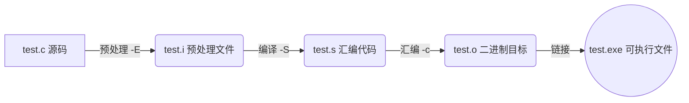

@[TOC](手把手教你 VS/VSCode 高级调试与键盘流开发) 
# 1️⃣拒绝找Bug找半天
还在满眼血丝地敲 `printf("运行到这里了111\n");` 徒手抓 Bug 吗？看着终端里幽灵般忽隐忽现的段错误（Segmentation fault），是不是感觉键盘都要被自己敲碎了？

别搁这儿浪费生命了。本文**拒绝长篇大论**，**绝不水环境配置**。只给你最纯粹的干货：**VS2026** 与 **VSCode** 极速**快捷键流**，外加能精准击杀野指针等幽灵的**高级条件断点技巧**。学会这些，你的双手甚至不需要去摸鼠标，复杂的内存状态也能在几步调试内原形毕露。

> **核心心法**：真正的顶级键盘侠，绝不把生命浪费在无脑按 F10 单步跳过上。

准备好埋葬你代码里那些隐藏的错误，彻底扔掉鼠标了吗？发车！
# 2️⃣沉浸式键盘流（满血版）

忘掉你的鼠标。在 C/C++ 的代码海里，手一旦离开键盘主键盘区，你的思维就已经断层了。这 14 组快捷键覆盖了从编码、导航到重构的 99% 场景，把它们刻进肌肉记忆，实现真正的人机合一。

| 核心分类 | 高频操作 | 核心应用场景 | VS2026 快捷键 | VSCode 快捷键 |
| :--- | :--- | :--- | :--- | :--- |
| **⚔️ 杀戮与重构** | **多光标编辑** | 批量给成堆的结构体成员添加同类前缀。 | `Shift`+`Alt`+`↑/↓` | `Ctrl`+`Alt`+`↑/↓` |
| | **批量重命名** | 符号级安全重构变量，拒绝无脑全文替换引发的血案。 | `Ctrl`+`R`, `Ctrl`+`R` | `F2` |
| | **行级绞杀** | 瞬间抹除或上下平移当前行，拒绝鼠标拖拽选中。 | 删行：`Ctrl`+`Shift`+`L`<br>移动：`Alt`+`↑/↓` | 删行：`Ctrl`+`Shift`+`K`<br>移动：`Alt`+`↑/↓` |
| | **词级吞噬** | 像吃豆人一样逐词删代码，而不是按住退格键傻等。 | `Ctrl`+`Backspace` | `Ctrl`+`Backspace` |
| **🧭 瞬移与侦查** | **全局代码导航** | 在百万行屎山源码中瞬移到函数定义处或目标文件。 | 跳转：`F12`<br>全局搜：`Ctrl`+`T` | 跳转：`F12`<br>文件搜：`Ctrl`+`P` |
| | **窥探定义** | 不切页面，原地弹窗“偷窥”底层逻辑，看完即走。 | `Alt`+`F12` | `Alt`+`F12` |
| | **头/源切换** | `.h` 与 `.cpp` 之间无缝横跳，C++开发专属刚需。 | `Alt`+`O` | `Alt`+`O` (需C/C++插件) |
| | **书签插眼** | 在深层调用链中“插眼”，随时一键飞回案发现场。 | 设：`Ctrl`+`K`, `K`<br>跳：`Ctrl`+`K`, `N` | 需安装 Bookmarks 插件 |
| | **精准空降** | 编译器报“Line 1145 错”，直接跃迁至目标行。 | `Ctrl`+`G` | `Ctrl`+`G` |
| **🛠️ 强迫症福音** | **参数/类型唤醒** | 忘记函数传啥参数、宏被推导成啥类型，瞬间唤醒弹窗。 | 参数：`Ctrl`+`Shift`+`Space`<br>类型：`Ctrl`+`K`, `I` | 参数：`Ctrl`+`Shift`+`Space`<br>类型：`Ctrl`+`K`, `Ctrl`+`I` |
| | **代码块折叠** | 一键收起无关逻辑，保持视觉极简，眼不见心不烦。 | 缩：`Ctrl`+`M`, `O`<br>展：`Ctrl`+`M`, `P` | 缩：`Ctrl`+`K`, `0`<br>展：`Ctrl`+`K`, `J` |
| | **一键格式化** | 一秒拯救由于复制粘贴毁掉的狗屎排版。 | `Ctrl`+`K`, `Ctrl`+`D` | `Shift`+`Alt`+`F` |
| | **快速注释** | 极速屏蔽/恢复大段正在做隔离测试的危险代码。 | 注：`Ctrl`+`K`, `C`<br>解：`Ctrl`+`K`, `U` | `Ctrl`+`/` (单行/块通用) |
| | **分屏切磋** | 左右互搏，同时核对调用方与实现方的参数逻辑。 | 垂直分屏：`Alt`+`W`, `V` | 分割编辑器：`Ctrl`+`\` |

> **进阶与避坑指南**：
> 1. **VS2026 的序列键逻辑**：带逗号的快捷键（如格式化 `Ctrl+K, Ctrl+D`），需要按住 `Ctrl` 不放，连敲 `K` 和 `D`。而代码折叠（`Ctrl+M, O`）则是先按 `Ctrl+M`，**彻底松开所有键**后再按 `O`。不要狂敲键盘把自己锁死。
> 2. **局部替换**：在 VSCode 中按 `Ctrl+H` 替换前，先选中目标代码块并按下 `Alt+L`（在选定内容中查找），否则你大概率会把整个工程的同名变量全部改爆。
> 3. **盲狙编译**：无论当前光标在哪，改完代码直接敲 `Ctrl+Shift+B` 触发构建，目光立刻锁定终端窗口抓 Error，别再去顶栏点那个破播放键了。

# 3️⃣Bug 粉碎机：降维打击的硬核调试

> 博主在学习高数时最喜欢像高斯公式，斯托克公式这类降维打击公式，同样的在我们的dev工具中也能实现对Bug的降维打击

快捷键只是外功，调试才是真正的内功。F9 设断点，F10 是“走马观花”单步跳过，F11 是“深入虎穴”跟进函数，记住这些就够了。接下来直接上真家伙。
## 1. 高级断点：循环与递归的急刹

在编写可视化递归算法时，面对动辄成百上千个节点的递归树，按 F10 单步调试纯属自虐。你需要掌握两种更高维的急刹车技巧：

**技巧 A：基于状态追踪的“条件断点”**
假设你为了在界面上绘制每一层递归的调用栈，在代码里引入了追踪树深度的变量 `depth`。如果渲染逻辑总是在下探到第 15 层时暴雷，直接右键红点设置 **条件断点 (Conditional Breakpoint)**，挂上表达式 `depth == 15`。
```c
int fib_visual(int n, int depth) {
    // 右键此处红点 -> 添加条件：depth == 15
    // 调试器将无视前 14 层，在触及第 15 层深度的瞬间强行挂起
    if (n <= 1) return n;
    return fib_visual(n - 1, depth + 1) + fib_visual(n - 2, depth + 1); 
}
```


**技巧 B：基于执行频率的“命中次数 (Hit Count)”**
如果你的逻辑崩溃不是因为特定的数据状态，而是纯粹的“在执行到第 1000 次时引发了野指针”。别傻乎乎地去源码里加什么 `int count = 0; if(++count == 1000)`。直接右键断点，选择 **命中次数 (Hit Count)**，设置为 `== 1000`。按下 F5 全速跑代码，调试器会在底层默默帮你计数，在第 1000 次经过该行时，把凶手直接按在案发现场。


## 2. 数据断点：野指针的捕捉器

排查 C 语言幽灵级 Bug（如内存越界）的终极杀器。假设你在处理一个气象降水数据的一维数组 `precip_data`，跑着跑着某个关键元素莫名其妙被篡改了。单步调试根本找不到凶手。直接查出该元素的内存地址（比如 `&precip_data[42]`），给它挂上 **数据断点**。程序全速跑，哪个越界的野指针敢碰这块内存，调试器立刻把它按在源码的对应行上摩擦。

```c
float precip_data[100] = {0}; // 核心气象降水数据

// ... 在成百上千行代码的某个角落 ...
void rogue_function() {
    float *rogue_ptr = &precip_data[0] + 42; // 计算出错的越界野指针
    
    // 只要全速运行，野指针在此处触碰目标内存的瞬间
    // 数据断点会立刻将程序强制挂起，把凶手按在这一行代码上摩擦
    *rogue_ptr = 999.9; 
}
```
### 实操指南：数据断点怎么挂？

**必须先让程序暂停（进入调试中断状态），你才能设置数据断点**。因为编译器需要当前的运行上下文来计算绝对物理地址。

**🗡️ VS2026 操作路径：**
1. 先随便打个普通断点（F9）让程序停下来。
2. 顶部菜单栏选择 **调试 (Debug)** -> **新建断点** -> **数据断点**。
3. 在“地址”栏输入你的目标地址（例如 `&precip_data[42]`），“字节计数”填入该类型的大小（例如 `float` 填 `4`）。敲击回车，F5 继续运行，坐等猎物上钩。

**🛡️ VSCode 操作路径（基于 GDB/LLDB）：**
* **妥协的鼠标流**：程序暂停时，在左侧“变量 (Variables)”面板，找到那个被你怀疑的变量，右键选择 **“在值更改时中断” (Break on Value Change)**。
* **极致的终端流**：既然追求键盘流，那就贯彻到底。按下 `Ctrl+Shift+Y` 呼出**调试控制台 (Debug Console)**，直接向底层的 GDB 砸入内存监视指令，看着变量被修改时瞬间急刹： 
```bash
-exec watch *(&precip_data[42])
```

## 3. 调用堆栈 ：段错误的黑匣子

遇到段错误（Segmentation Fault）程序直接暴毙？别盯着终端的报错发呆。立刻调出“调用堆栈”面板。这是程序死前的记忆回放，从最底层 libc 的报错点往上反向追溯，双击堆栈列表顺藤摸瓜，瞬间就能锁定是你自己写的哪行作死代码引发了这场崩溃。

```c
void process_weather_data(float* data) {
    *data = 10.5; // 致命一击：解引用 NULL 指针，当场触发段错误
}

void fetch_data() {
    process_weather_data(NULL); // 逻辑漏洞：传入了空指针
}

int main() {
    fetch_data(); 
    return 0;
}
```
### 实操指南：段错误怎么用堆栈回溯？

当终端蹦出 `Segmentation fault` 或者 IDE 强行弹窗提示 `Access violation`（访问冲突）时，**不要直接关闭程序**，按照以下路径精准揪出内鬼。

**🗡️ VS2026 操作路径：**
1. 程序崩溃时，VS 会弹窗提示异常，直接点击 **“中断” (Break)**。
2. 观察界面下方，默认会切换到 **调用堆栈 (Call Stack)** 窗口。如果没看到，快捷键 `Ctrl` + `Alt` + `C` 打开。
3. 堆栈列表最顶上的一行通常是系统的底层库（如 `ntdll.dll` 或 `msvcr*.dll`），这属于“他人领地”。**从上往下看，找到第一个你写的函数（带有你源码文件名和行号的那一行）**。
4. **双击这一行**，VS 会瞬移到对应的源码。此时配合 `Ctrl` + `K`, `I` 悬停查看该行指针变量的值，它大概率是个 `0x00000000` (NULL) 或者一串乱码。

**🛡️ VSCode 操作路径（基于 GDB/LLDB）：**
1. 崩溃发生时，VSCode 顶部的调试工具栏会变色，并在代码区用红线高亮断路的那一行。
2. 此时将目光移向左侧的 **“运行和调试” (Run and Debug)** 面板。
3. 找到最下方的 **“调用堆栈” (CALL STACK)** 侧边栏，这里清晰地展示了函数的死亡跃迁链（例如 `process_data` <- `fetch_data` <- `main`）。
4. 鼠标在堆栈列表里**由上至下切换点击**。每点一层，上方的 **“变量” (VARIABLES)** 面板就会实时刷新为那个函数死亡瞬间的局部变量快照。哪个指针越界、哪个数组爆了，一目了然。
---
# 4️⃣结尾彩蛋：gcc 终端指令

> g++类似，只需把gcc换成g++，改成对应文件后缀

一个 `.c` 源码文件要变成能运行的 `.exe`，必须经历以下四次残酷的蜕变。



> 关于编译，详细可以了解我的这篇文章：[点此跳转](https://blog.csdn.net/ysu_0314/article/details/161634695?fromshare=blogdetail&sharetype=blogdetail&sharerId=161634695&sharerefer=PC&sharesource=ysu_0314&sharefrom=from_link)

* **预处理（Preprocessing）**
    ```bash
    gcc -E test.c -o test.i
    ```
    生成的 `test.i` 文件

* **编译（Compilation）**
    ```bash
    gcc -S test.i -o test.s
    ```
    生成汇编语言文件

* **汇编（Assembly）**
    ```bash
    gcc -c test.s -o test.o
    ```
    生成纯二进制 `0101` 机器码目标文件。

* **链接（Linking）：最终缝合**
    ```bash
    gcc test.o -o test.exe
    ```
    link

---

**日常极速编译**：
```bash
gcc test.c -o test.exe
```

**显示所有的警告信息**：
```bash
gcc -Wall test.c -o test.exe
```

**生成带有调试信息的可执行文件**：
```bash
gcc -g test.c -o test.exe
```

**强制结束程序进程**：
```cmd
taskkill /F /IM test.exe
```
 

> GCC 高端局：压榨编译器


**性能暴走（开启代码优化）**：
```bash
gcc -O2 test.c -o test.exe
```

> `-O1`、`-O2`、`-O3` 代表不同的代码优化级别。`-O2`
> 是日常交付的黄金标准，编译器会背着你疯狂重排指令、内联函数、展开循环，让程序的执行速度起飞。
> **避坑指南**：Debug 时**绝对不能**开 `-O2` 或 `-O3`！极致的优化器会把你的变量和代码逻辑改得面目全非，导致断点乱跳、局部变量被直接优化没，调试时会把你逼疯。

**地狱难度（把警告当成报错）**：
```bash
gcc -Wall -Wextra -Werror test.c -o test.exe
```

> `-Wextra` 补充了 `-Wall` 漏掉的边缘警告，而 `-Werror`则是真正的狠人专属——**把所有警告强行升级为致命错误**。打造工业级代码的终极神药。

**指定标准（强制编译器标准）**：
```bash
gcc -std=c11 test.c -o test.exe
```

> 强制编译器使用 C11（或 C99，C++ 选手用 `-std=c++17`）标准解析代码。

**代替头文件（链接系统库）**：
```bash
gcc test.c -o test.exe -lm -pthread
```

> 你的代码里用了 `<math.h>` 里的 `pow()` 或 `sqrt()`？加上 `-lm`（强制链接数学库）可以代替#include<math.h>。同理，用到多线程加上 `-pthread`。

**终端宏定义**：
```bash
gcc -DDEBUG_MODE=1 test.c -o test.exe
```

> 直接从终端给 C 代码强行注入 `#define DEBUG_MODE 1`。完全不需要打开文件修改源码，就能在外部灵活控制条件编译（比如一键开启/关闭项目中所有的日志输出），写自动化脚本时的刚需。

---


键盘流决定效率下限，高级断点拉高能力上限。扔掉 `printf`，把脏活累活丢给调试器，修完 Bug 早点下班。


