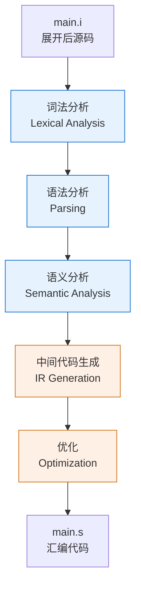
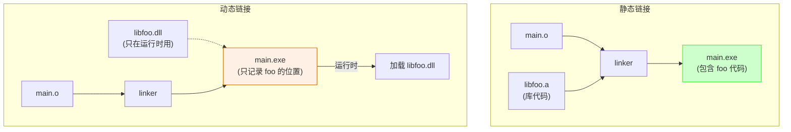
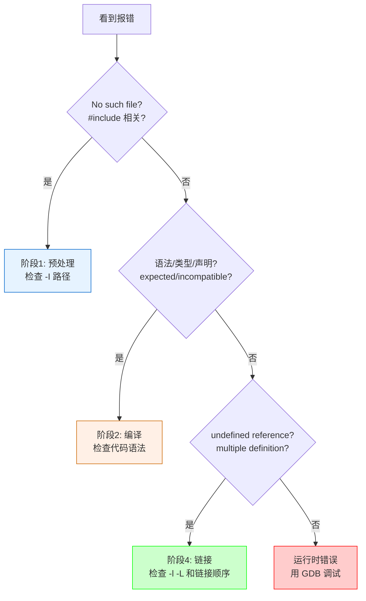

@[TOC](本文目录)

---

> 🎯 **工具链通关系列第 1 篇** · 把散落的 CMake、GDB、编译器知识收编成系列。本文是总览，后面分篇深挖。
> 📖 **相关文章**：[Qt Creator 极简安装与 CMake 配置指南](https://blog.csdn.net/ysu_0314/article/details/162047492?spm=1001.2014.3001.5501) · [GDB 调试器集成](https://blog.csdn.net/ysu_0314/article/details/162279823?spm=1001.2014.3001.5501)

---

# 🔧 工具链通关 01：一张图看懂 C/C++ 从源码到可执行

---

> "你用了三年 C++，知道 `#include` 之后发生了什么吗？"
> "……编译？"
> "编译是第几步？"
> "第一步？"
> "那是第三步。前两步叫预处理和词法分析。"

**写 C/C++ 不懂工具链，就像开车不懂引擎。代码能跑，但报错时你不知道该骂谁。本文用一张图 + 四阶段拆解，把从 .c 到 .exe 的全过程讲透。**

---

## 🗺️ 1. 全景图：从源码到可执行的四个阶段


| 阶段 | 输入 | 输出 | 工具 | 做了什么 |
|:----|:-----|:-----|:-----|:---------|
| 1. 预处理 | .c/.cpp | .i | 预处理器 (cpp) | 展开 #include、#define、条件编译 |
| 2. 编译 | .i | .s | 编译器 (cc1/cc1plus) | 语法分析 → 优化 → 生成汇编 |
| 3. 汇编 | .s | .o | 汇编器 (as) | 汇编指令 → 机器码 |
| 4. 链接 | .o (多个) | .exe/.out | 链接器 (ld) | 符号解析 + 地址重定位 |

> 💡 **平时敲的 `gcc main.c -o main` 一步到位，但背后跑了这四步。** 加 `-save-temps` 可以看到所有中间文件。

---

## 🔍 2. 阶段一：预处理（Preprocess）

### 2.1 做了什么

```c
// main.c
#include <stdio.h>
#define MAX 100
#ifdef DEBUG
    printf("debug mode");
#endif

int main() {
    int arr[MAX];
    return 0;
}
```

预处理后（`gcc -E main.c -o main.i`）：

```c
// main.i （展开后，stdio.h 的内容全插进来了）
// ... 2000 行 stdio.h 的内容 ...
extern int printf(const char *, ...);

int main() {
    int arr[100];           // MAX 被替换成 100
    return 0;
}
```

### 2.2 预处理做了四件事

| 操作 | 示例 | 结果 |
|:-----|:-----|:-----|
| 展开 #include | `#include <stdio.h>` | 把 stdio.h 全文插入 |
| 替换 #define | `#define MAX 100` | 所有 MAX → 100 |
| 条件编译 | `#ifdef DEBUG` | DEBUG 未定义则删除整块 |
| 删除注释 | `// 注释` / `/* */` | 全部移除 |

> 🐛 **常见报错定位**：`#include` 路径找不到 → 预处理阶段报错。`#define` 宏展开后语法错 → 也是预处理阶段。==看到 "error: No such file or directory" 就是预处理阶段挂了。==

### 2.3 预处理报错示例

```bash
$ gcc main.c -o main
main.c:3:10: fatal error: raylib.h: No such file or directory
    3 | #include "raylib.h"
      |          ^~~~~~~~~~~
compilation terminated.
```

```
阶段：预处理
原因：找不到 raylib.h
修复：gcc -I/path/to/raylib/include main.c -o main
      或 CMake: target_include_directories(main PRIVATE /path/to/raylib/include)
```

---

## ⚙️ 3. 阶段二：编译（Compile）

### 3.1 做了什么

这是最复杂的一步。编译器把展开后的 .i 文件变成汇编代码 .s：



| 子阶段 | 做什么 | 对应报错 |
|:-------|:-------|:---------|
| 词法分析 | 源码 → Token 流 | `error: stray '\343' in program`（中文标点） |
| 语法分析 | Token → AST 语法树 | `error: expected ';' before '}'` |
| 语义分析 | 类型检查、作用域 | `error: incompatible types` |
| IR 生成 | AST → 中间表示 | — |
| 优化 | 死代码消除、内联、循环展开 | — |

### 3.2 看看编译输出

```bash
$ gcc -S main.c -o main.s
```

```asm
main.s （x86-64 汇编）
_main:
    pushq   %rbp
    movq    %rsp, %rbp
    subq    $400, %rsp          ; int arr[100] → 400 字节
    movl    $0, %eax
    leave
    ret
```

> 💡 **加 -O2 看优化效果**：没优化时 `arr[100]` 会分配栈空间；优化后发现 `arr` 没被使用，直接删掉。

### 3.3 编译阶段常见报错

| 报错 | 原因 | 修复 |
|:-----|:-----|:-----|
| `expected ';'` | 少分号 | 检查报错行 |
| `undeclared identifier` | 变量/函数未声明 | #include 或前向声明 |
| `incompatible types` | 类型不匹配 | 检查函数签名 |
| `redefinition of struct` | 头文件被重复包含 | 加 #include guard |

---

## 🏗️ 4. 阶段三：汇编（Assemble）

### 4.1 做了什么

最简单的一步：汇编指令 → 机器码。一一对应，没有歧义。

```bash
$ gcc -c main.s -o main.o
# 或直接从 .c 到 .o（跳过看中间文件）
$ gcc -c main.c -o main.o
```

### 4.2 .o 文件内部结构

```
main.o （ELF 格式 / Windows 下 COFF 格式）

┌─────────────────────────┐
│  .text   代码段          │  ← 编译后的机器码
├─────────────────────────┤
│  .data   已初始化全局变量 │  ← int x = 42;
├─────────────────────────┤
│  .bss    未初始化全局变量 │  ← int y; （不占文件空间）
├─────────────────────────┤
│  .rodata 只读数据        │  ← 字符串常量
├─────────────────────────┤
│  符号表                  │  ← main、printf 等
├─────────────────────────┤
│  重定位表                │  ← 哪些地址需要链接器修
└─────────────────────────┘
```

> 🔑 **关键概念**：.o 文件里的 `printf` 调用，地址是==占位的==。因为编译器不知道 `printf` 的真实地址——它在 libc 里。这个"占位"就是重定位表记录的。

### 4.3 查看符号表

```bash
$ nm main.o
0000000000000000 T main           ← T = 已定义的代码符号
                 U printf         ← U = 未定义（Undefined），需要链接器找
```

> 🐛 **常见报错定位**：如果 `nm` 显示某个函数是 `U`（未定义），链接阶段如果找不到就会报 `undefined reference`。

---

## 🔗 5. 阶段四：链接（Link）

### 5.1 做了什么

链接器把多个 .o 文件 + 库文件合并，解决所有 `U`（未定义符号）：

```
main.o     ← 调用 printf（U）
libfoo.o   ← 定义 foo（T）
libc.a     ← 定义 printf（T）

链接后：
main.exe   ← printf 的地址已填入，foo 的地址已填入
```

### 5.2 链接的两种方式

| 方式 | 说明 | 优点 | 缺点 |
|:-----|:-----|:-----|:-----|
| **静态链接** (.a) | 库代码复制进可执行文件 | 独立运行、不依赖环境 | 文件大 |
| **动态链接** (.dll/.so) | 运行时加载库 | 文件小、共享内存 | 依赖环境、DLL Hell |



### 5.3 链接阶段常见报错

| 报错 | 原因 | 修复 |
|:-----|:-----|:-----|
| `undefined reference to 'foo'` | foo 未定义/库没链接 | 加 -lfoo 或 -L/path |
| `multiple definition of 'foo'` | foo 被定义了两次 | 检查重复 #include / 重复编译 |
| `cannot find -lraylib` | 找不到库文件 | -L/path/to/raylib/lib |
| `relocation overflow` | 地址空间不够 | 编译加 -fPIC |

> 🐛 **最经典的坑**：链接顺序错了。`gcc main.o -lfoo -lbar`，如果 `main.o` 调用 `bar`，`bar` 又调用 `foo`，那 `-lfoo -lbar` 的顺序是对的。但如果你写成 `-lbar -lfoo`，链接器先处理 bar，发现 bar 需要 foo，但 foo 还没出现 → 报错。==GNU ld 从左到右处理，被依赖的库放右边。==

---

## 📐 6. 各阶段对应的工具

```
gcc/clang 其实是个"驱动器"，它依次调用：

gcc main.c -o main
  │
  ├─ cpp main.c main.i          ← 预处理器
  ├─ cc1 main.i -o main.s       ← 编译器（真正的编译核心）
  ├─ as main.s -o main.o        ← 汇编器
  └─ ld main.o -lc -o main      ← 链接器

CMake 做的事：生成上面的 gcc 命令（含正确的 -I -L -l）
GDB 做的事：读 main.exe 的调试信息，映射到 main.c 的行号
```

| 工具 | 对应阶段 | 你什么时候会用到 |
|:-----|:---------|:-----------------|
| cpp (预处理器) | 阶段 1 | 宏展开结果不对时 `-E` 查看 |
| cc1/cc1plus (编译器) | 阶段 2 | 编译报错时看错误信息 |
| as (汇编器) | 阶段 3 | 几乎不直接用 |
| ld (链接器) | 阶段 4 | `undefined reference` 时 |
| nm (符号查看) | 阶段 3→4 | 排查符号未定义/重复 |
| objdump (反汇编) | 阶段 3→4 | 查看机器码 |
| GDB (调试器) | 运行时 | 断点、单步、变量查看 |

---

## 🎯 7. 实战：一个报错，定位到哪个阶段？

| 报错信息 | 阶段 | 分析 |
|:---------|:----:|:-----|
| `raylib.h: No such file` | 1 预处理 | 找不到头文件 |
| `expected ';' before '{'` | 2 编译 | 语法错 |
| `undeclared identifier 'x'` | 2 编译 | 变量未声明 |
| `incompatible types in assignment` | 2 编译 | 类型不匹配 |
| `undefined reference to 'InitWindow'` | 4 链接 | 函数未定义/库未链接 |
| `multiple definition of 'main'` | 4 链接 | main 重复 |
| `cannot find -lglfw` | 4 链接 | 找不到库文件 |



---

## 💡 8. 为什么要懂这些？

> **① 报错时知道该改什么**
> 看到 `undefined reference` 不会去改 .c 代码（那是链接问题），而是检查 CMakeLists.txt 的 `target_link_libraries`。

> **② CMake 不是黑魔法**
> CMake 生成的是 `gcc -I... -L... -l...` 命令。懂了四阶段，CMake 的 `include_directories` / `link_directories` / `target_link_libraries` 各管哪段一目了然。

> **③ GDB 不是玄学**
> GDB 依赖编译时生成的调试信息（`-g`）。没有 `-g`，GDB 只能看到汇编，看不到源码行号。因为调试信息记录了"机器地址 → 源码行"的映射。

> **④ 静态库 vs 动态库的选择**
> 懂了链接，你就知道为什么 raylib 推荐**静态链接**（省去用户装 DLL 的麻烦），而系统库用**动态链接**（多个程序共享一份内存）。

---

## 🔜 下篇预告

> 工具链通关 02：[**CMake 进阶：当你项目超过 100 个文件时该怎么写**](#)
> 目标依赖树、find_package 实战、多模块组织、生成器表达式。从"能编译"到"编译得好"。

---

## 📚 工具链通关系列目录

| # | 标题 | 状态 |
|---|------|:----:|
| 01 | **一张图看懂 C/C++ 从源码到可执行** ← 本文 | ✅ 已发布 |
| 02 | [CMake 进阶：超 100 个文件怎么写](https://blog.csdn.net/ysu_0314/article/details/164325411?sharetype=blogdetail&sharerId=164325411&sharerefer=PC&sharesource=ysu_0314&spm=1011.2480.3001.8118) | ✅ 已发布 |

---

> 👍 **如果你觉得有帮助，点赞 + 收藏 + 关注，三连支持作者继续写下去 🚀**
