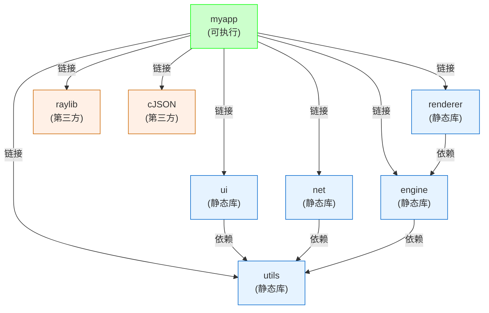
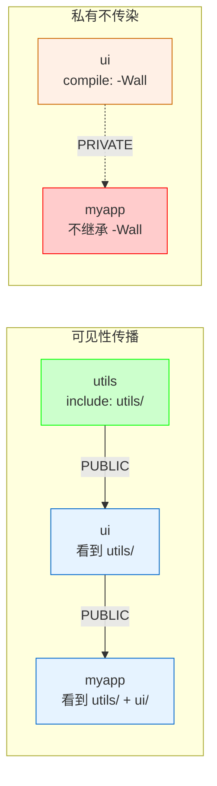

@[TOC](本文目录)

---

> 🎯 **工具链通关系列第 2 篇** · 承接 [一张图看懂 C/C++ 从源码到可执行](https://blog.csdn.net/ysu_0314/article/details/164325297?sharetype=blogdetail&sharerId=164325297&sharerefer=PC&sharesource=ysu_0314&spm=1011.2480.3001.8118)，本篇讲 CMake 进阶。
> 📖 **相关文章**：[Qt Creator 极简安装与 CMake 配置指南](https://blog.csdn.net/ysu_0314/article/details/162047492?spm=1001.2014.3001.5501)

---

# 🔧 工具链通关 02：CMake 进阶 —— 当你项目超过 100 个文件时怎么写

---

> "CMake 不就是 cmake_minimum_required + add_executable 吗？"
> "那你项目有 3 个模块、2 个第三方库、跨 3 个平台呢？"
> "……我把所有 .c 文件列在 add_executable 里？"
> "120 个文件名？"

**小项目 CMake 随便写。但当文件超过 100 个、有多个模块和第三方依赖时，CMakeLists 的写法决定了编译速度、可维护性和跨平台能力。**

---

## 📐 1. 目标依赖树：CMake 的核心心智模型

### 1.1 新手写法 vs 进阶写法

```cmake
# ❌ 新手写法：一个 CMakeLists 全搞定
add_executable(myapp
    src/main.c src/engine.c src/renderer.c src/game.c
    src/ui/button.c src/ui/menu.c src/ui/dialog.c
    src/net/client.c src/net/server.c
    src/utils/string.c src/utils/file.c src/utils/math.c
    # ... 还有 90 个 ...
)
target_include_directories(myapp PRIVATE
    src/ src/engine src/renderer src/ui src/net src/utils
    third_party/raylib/include third_party/cJSON
)
target_link_libraries(myapp raylib cJSON)
```

**问题**：改一个 `button.c`，全部 120 个文件重编。

```cmake
# ✅ 进阶写法：拆成多个 target
add_library(engine     STATIC src/engine/*.c)
add_library(renderer   STATIC src/renderer/*.c)
add_library(ui         STATIC src/ui/*.c)
add_library(net        STATIC src/net/*.c)
add_library(utils      STATIC src/utils/*.c)

add_executable(myapp src/main.c)
target_link_libraries(myapp PRIVATE engine renderer ui net utils raylib cJSON)
```

**效果**：改 `button.c` 只重编 `ui` 库 + 链接，30 秒搞定。

### 1.2 依赖树可视化



> 🎯 **CMake 的核心是 target，不是文件。** 每个 target 是一个编译单元，有自己的 include 路径、编译选项、依赖关系。改一个 target 的文件，不会触发其他 target 重编。

---

## 📁 2. 多模块项目结构

### 2.1 目录布局

```
myapp/
├── CMakeLists.txt              ← 顶层
├── cmake/                      ← CMake 模块
│   ├── FindRaylib.cmake        ← 自定义 find_package
│   └── Platform.cmake          ← 平台检测
├── src/
│   ├── main.c
│   └── CMakeLists.txt          ← 可执行 target
├── engine/
│   ├── engine.c engine.h
│   └── CMakeLists.txt          ← engine 静态库
├── renderer/
│   ├── renderer.c renderer.h
│   └── CMakeLists.txt          ← renderer 静态库
├── ui/
│   ├── button.c menu.c
│   └── CMakeLists.txt          ← ui 静态库
├── third_party/
│   ├── raylib/
│   └── cJSON/
└── tests/
    ├── test_engine.cpp
    └── CMakeLists.txt          ← Google Test
```

### 2.2 顶层 CMakeLists.txt

```cmake
cmake_minimum_required(VERSION 3.16)
project(MyApp C CXX)

set(CMAKE_C_STANDARD 11)
set(CMAKE_CXX_STANDARD 17)

# 选项
option(BUILD_TESTS "Build unit tests" ON)
option(USE_RAYLIB  "Use Raylib renderer" ON)

# 平台检测
include(cmake/Platform.cmake)

# 第三方库
add_subdirectory(third_party/raylib)
add_subdirectory(third_party/cJSON)

# 项目模块
add_subdirectory(utils)
add_subdirectory(engine)
add_subdirectory(renderer)
add_subdirectory(ui)
add_subdirectory(net)
add_subdirectory(src)

# 测试
if(BUILD_TESTS)
    enable_testing()
    add_subdirectory(tests)
endif()
```

### 2.3 模块级 CMakeLists.txt（以 ui 为例）

```cmake
# ui/CMakeLists.txt
add_library(ui STATIC
    button.c
    menu.c
    dialog.c
    theme.c
)

target_include_directories(ui PUBLIC
    ${CMAKE_CURRENT_SOURCE_DIR}   # ui/ 目录本身
)

target_link_libraries(ui PUBLIC
    utils                          # ui 依赖 utils
)

# 只对 ui 开启的编译选项
if(MSVC)
    target_compile_options(ui PRIVATE /W4)
else()
    target_compile_options(ui PRIVATE -Wall -Wextra)
endif()
```

> 💡 **PUBLIC vs PRIVATE vs INTERFACE**：
> - `PUBLIC`：自己用 + 依赖者也用（ui 用 utils，ui 的使用者也要看到 utils 的头文件）
> - `PRIVATE`：自己用，依赖者不用（ui 的编译选项不传染给 myapp）
> - `INTERFACE`：自己不用，依赖者用（头文件库常用）



---

## 🔍 3. find_package 实战

### 3.1 find_package 做了什么

```cmake
find_package(Raylib REQUIRED)
# 找到后提供：
#   Raylib_INCLUDE_DIRS  - 头文件路径
#   Raylib_LIBRARIES     - 库文件路径
#   Raylib_FOUND         - 是否找到
```

### 3.2 三种情况

| 情况 | find_package 行为 | 你要做的 |
|:-----|:-------------------|:---------|
| 库装在系统里 | 自动找到 | 直接用 |
| 库在项目里（add_subdirectory） | 不需要 find_package | target_link_libraries 直接引用 |
| 库在自定义路径 | 需要写 FindXxx.cmake | 放 cmake/ 目录，设 CMAKE_MODULE_PATH |

### 3.3 自定义 FindRaylib.cmake

```cmake
# cmake/FindRaylib.cmake
find_path(RAYLIB_INCLUDE_DIR
    NAMES raylib.h
    PATHS ${CMAKE_SOURCE_DIR}/third_party/raylib/include
          /usr/include
          /usr/local/include
)

find_library(RAYLIB_LIBRARY
    NAMES raylib libraylib
    PATHS ${CMAKE_SOURCE_DIR}/third_party/raylib/lib
          /usr/lib
          /usr/local/lib
)

include(FindPackageHandleStandardArgs)
find_package_handle_standard_args(Raylib
    REQUIRED_VARS RAYLIB_LIBRARY RAYLIB_INCLUDE_DIR
)

if(Raylib_FOUND)
    set(Raylib_INCLUDE_DIRS ${RAYLIB_INCLUDE_DIR})
    set(Raylib_LIBRARIES ${RAYLIB_LIBRARY})
    message(STATUS "Raylib found: ${RAYLIB_LIBRARY}")
endif()

mark_as_advanced(RAYLIB_INCLUDE_DIR RAYLIB_LIBRARY)
```

```cmake
# 顶层 CMakeLists.txt
list(APPEND CMAKE_MODULE_PATH ${CMAKE_SOURCE_DIR}/cmake)
find_package(Raylib REQUIRED)
```

---

## 🎯 4. 生成器表达式

### 4.1 什么是生成器表达式

```cmake
# 普通写法：只能选一个
if(MSVC)
    target_compile_options(myapp PRIVATE /W4)
else()
    target_compile_options(myapp PRIVATE -Wall)
endif()

# 生成器表达式：一条搞定
target_compile_options(myapp PRIVATE
    $<$<C_COMPILER_ID:MSVC>:/W4>
    $<$<C_COMPILER_ID:GNU,Clang>:-Wall -Wextra>
)
```

### 4.2 常用生成器表达式

| 表达式 | 含义 | 示例 |
|:-------|:-----|:-----|
| `$<CONFIG:Debug>` | Debug 构建时为 1 | `$<$<CONFIG:Debug>:-O0 -g>` |
| `$<PLATFORM_ID:Windows>` | Windows 平台时为 1 | `$<$<PLATFORM_ID:Windows>:-lws2_32>` |
| `$<C_COMPILER_ID:GNU>` | GCC 编译器时为 1 | `$<$<C_COMPILER_ID:GNU>:-Wall>` |
| `$<TARGET_FILE:myapp>` | myapp 的输出文件路径 | 用于 post-build 复制 |
| `$<BOOL:${USE_RAYLIB}>` | 变量为真时为 1 | 条件链接 |

### 4.3 实战：按配置和平台自动调整

```cmake
target_compile_options(myapp PRIVATE
    # Debug: 关优化，开调试
    $<$<CONFIG:Debug>:-O0 -g3 -DDEBUG>
    # Release: 开优化
    $<$<CONFIG:Release>:-O2 -DNDEBUG>
    # GCC/Clang 专属
    $<$<C_COMPILER_ID:GNU,Clang>:-Wall -Wextra -Wpedantic>
    # MSVC 专属
    $<$<C_COMPILER_ID:MSVC>:/W4 /permissive->
)

target_link_libraries(myapp PRIVATE
    raylib
    cJSON
    # Windows 需要额外链接 winsock
    $<$<PLATFORM_ID:Windows>:ws2_32>
    # Linux 需要链接 pthread
    $<$<PLATFORM_ID:Linux>:pthread>
)

# 编译后自动复制 DLL
add_custom_command(TARGET myapp POST_BUILD
    COMMAND ${CMAKE_COMMAND} -E copy_if_different
    $<TARGET_FILE:raylib>
    $<TARGET_FILE_DIR:myapp>
)
```

---

## 🧪 5. 测试集成

```cmake
# tests/CMakeLists.txt
find_package(GTest REQUIRED)

add_executable(run_tests
    test_engine.cpp
    test_renderer.cpp
    test_ui.cpp
)

target_link_libraries(run_tests PRIVATE
    engine renderer ui
    GTest::gtest_main
)

# 注册测试
include(GoogleTest)
gtest_discover_tests(run_tests)

# 自定义测试：冒烟测试
add_test(NAME smoke_test
    COMMAND myapp --run-smoke-test
)
```

```bash
# 运行测试
cmake --build build
cd build && ctest --output-on-failure
```

---

## 📊 6. 编译速度优化

| 优化手段 | 效果 | 做法 |
|:---------|:-----|:-----|
| **拆 target** | 改一个文件不重编全部 | 每个模块一个 add_library |
| **ccache** | 未改动的文件跳过编译 | `set(CMAKE_C_COMPILER_LAUNCHER ccache)` |
| **Ninja 生成器** | 比 Make 快 3-5 倍 | `cmake -G Ninja` |
| ** unity build** | 减少 I/O | `set(CMAKE_UNITY_BUILD ON)` |
| **PCH 预编译头** | 加速头文件多的项目 | `target_precompile_headers(myapp PRIVATE pch.h)` |

```cmake
# 开启 ccache（Linux/macOS）
find_program(CCACHE_FOUND ccache)
if(CCACHE_FOUND)
    set(CMAKE_C_COMPILER_LAUNCHER ccache)
    set(CMAKE_CXX_COMPILER_LAUNCHER ccache)
endif()

# 预编译头
target_precompile_headers(myapp PRIVATE
    <stdio.h> <stdlib.h> <string.h>
    "engine.h" "renderer.h"
)
```

> 🐛 **Unity build 注意**：合并多个 .c 文件编译时，如果有==同名静态函数==或==同名 typedef==，会冲突。遇到就给那个 target 关掉：`set_target_properties(ui PROPERTIES UNITY_BUILD OFF)`

---

## 💡 7. 五条 CMake 进阶心法

> **① target 是核心，不是文件**
> 把项目拆成多个 target（库），每个 target 独立编译。改一个只重编一个。

> **② PUBLIC/PRIVATE/INTERFACE 是传染控制**
> include 路径用 PUBLIC 传播，编译选项用 PRIVATE 不传播。搞混了就是"为什么 myapp 编译时看到了 ui 的内部头文件"。

> **③ find_package 优先，add_subdirectory 兜底**
> 系统装了就 find_package，没装就在 third_party 里 add_subdirectory。不要手动写 include 路径和 link 路径。

> **④ 生成器表达式替代 if-else**
> 平台/编译器/配置相关的差异，用 `$<...>` 一行搞定，比 if-else 更清晰且支持多配置生成器（如 Visual Studio）。

> **⑤ ccache + Ninja 是提速利器**
> ccache 让二次编译快 10 倍，Ninja 让依赖解析快 5 倍。两个一起用，120 文件项目增量编译 < 5 秒。

---

## 🔜 系列结语

> 工具链通关系列到此暂告一段落。核心内容：四阶段编译（01）+ CMake 进阶（02）。
> 后续可能补充：GDB 调试技巧、性能分析（perf/Valgrind）等。

---

## 📚 工具链通关系列目录

| # | 标题 | 状态 |
|---|------|:----:|
| 01 | [一张图看懂 C/C++ 从源码到可执行](https://blog.csdn.net/ysu_0314/article/details/164325297?sharetype=blogdetail&sharerId=164325297&sharerefer=PC&sharesource=ysu_0314&spm=1011.2480.3001.8118) | ✅ 已发布 |
| 02 | **CMake 进阶：超 100 个文件怎么写** ← 本文 | ✅ 已发布 |

---

> 👍 **如果你觉得有帮助，点赞 + 收藏 + 关注，三连支持作者继续写下去 🚀**
