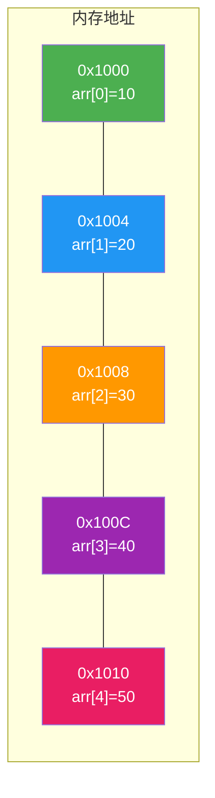
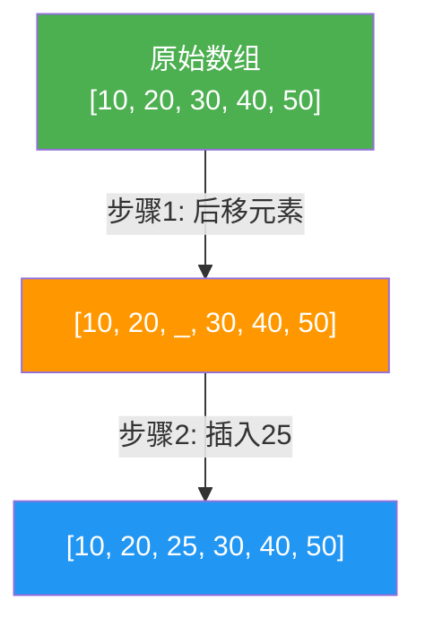
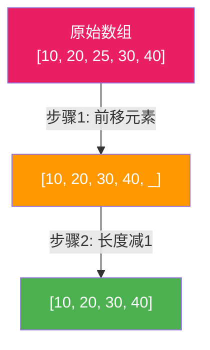
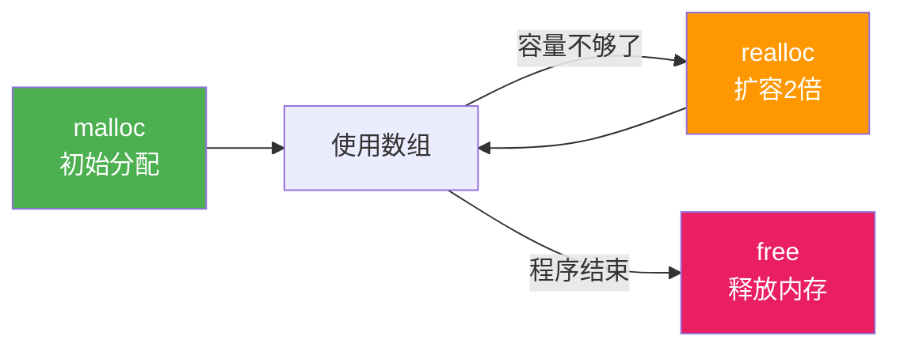

@[TOC](C语言数据结构系列：数组篇)

# C语言数据结构系列（一）：数组——从入门到精通

> 🎯 **本篇目标**：全面掌握C语言数组，理解内存布局，掌握基本操作，为后续数据结构学习打下坚实基础！

---

## 一、前言

哈喽各位小伙伴们！👋

在学习数据结构之前，我们先来聊聊最基础的——**数组**。

想象一下，如果你要记录一个班50个同学的成绩：
- **没有数组**：你需要定义50个变量 `score1, score2, ... score50` 😫
- **使用数组**：一个变量搞定 `int scores[50]` ✅

数组就像一栋**学生公寓**，里面住着一群**数据类型相同**的"好朋友"，你只要知道**门牌号（下标）**，就能快速找到对应的小伙伴！

接下来，就让我们一起推开数组公寓的大门，把它里里外外都搞明白！ 🏠

---

## 二、数组的基本概念

### 2.1 什么是数组？

> **数组（Array）** 是一组 **相同类型** 数据的 **连续存储** 集合。

简单来说：
- 🏠 公寓里住的都是同一种类型的人（比如都是int类型）
- 📍 他们住在连续的房间（内存连续）
- 🔢 每个房间都有门牌号（下标从0开始）

### 2.2 数组的三要素

| 要素 | 说明 | 示例 |
|:----:|:----:|:----:|
| **数组名** | 代表首地址的常量 | `arr` |
| **下标/索引** | 元素的位置，**从0开始** | `arr[0]` ~ `arr[n-1]` |
| **长度** | 元素的个数 | `n` |

> ⚠️ **注意**：下标从0开始！这是新手最容易犯错的地方！

---

## 三、一维数组的创建和初始化

### 3.1 数组创建

```c
// 语法
数据类型 数组名[数组大小];

// 示例
int arr[5];        // 创建一个可存放5个int的数组
char str[10];      // 创建一个可存放10个char的数组
double scores[30]; // 创建一个可存放30个double的数组
```

**参数说明：**
- `数据类型`：数组中存放数据的类型
- `数组名`：给数组起的名字
- `[数组大小]`：数组能存放多少个元素

### 3.2 数组初始化

创建数组就像盖好一栋空公寓，但里面可能住着"随机怪客"（垃圾值） 😱

所以最好在创建时就让小伙伴们"拎包入住"——也就是**初始化**！

```c
// 1. 完全初始化 - 所有房间都安排好人
int arr1[5] = {1, 2, 3, 4, 5};

// 2. 部分初始化 - 只安排部分房间，剩下的自动入住0号房客
int arr2[5] = {1, 2};  // 结果：{1, 2, 0, 0, 0}

// 3. 自动推断长度 - 看你安排了多少人，自动建多大公寓
int arr3[] = {1, 2, 3};  // 长度为3

// 4. 全部初始化为0
int arr4[5] = {0};

// 5. 字符数组（字符串）
char str[] = "Hello";  // 自动加'\0'，长度为6
```

### 3.3 数组的类型

数组也是有类型的！去掉数组名，剩下的就是它的类型：

```c
int arr[5];     // 类型是 int [5]
char str[10];   // 类型是 char [10]
```

---

## 四、数组在内存中的存储

### 4.1 内存是连续的

数组在内存中是**连续存储**的，就像一排**连体婴**，手拉手站得整整齐齐！ 👫👫

```c
int arr[5] = {10, 20, 30, 40, 50};
// 假设 arr 的首地址是 0x1000，int 占 4 字节
```

**内存示意图：**



### 4.2 地址计算公式

$$
\text{arr}[i]\text{的地址} = \text{首地址} + i \times \text{sizeof(元素类型)}
$$

**这就是为什么数组支持 O(1) 随机访问——直接算出地址，一步到位！** 🚀

### 4.3 验证内存布局

让我们用代码验证一下：

```c
#include <stdio.h>

int main() {
    int arr[5] = {10, 20, 30, 40, 50};
    
    printf("数组首地址: %p\n", arr);
    for (int i = 0; i < 5; i++) {
        printf("arr[%d] = %d, 地址: %p\n", 
               i, arr[i], &arr[i]);
    }
    return 0;
}
```

**运行结果：**
```
数组首地址: 0x7ffd5e8a3c40
arr[0] = 10, 地址: 0x7ffd5e8a3c40
arr[1] = 20, 地址: 0x7ffd5e8a3c44  // 每次+4（int占4字节）
arr[2] = 30, 地址: 0x7ffd5e8a3c48
arr[3] = 40, 地址: 0x7ffd5e8a3c4c
arr[4] = 50, 地址: 0x7ffd5e8a3c50
```

看到了吗？地址确实是连续递增的！🎯

---

## 五、数组的基本操作

### 5.1 遍历打印

遍历就是把公寓里的每个房间都访问一遍！

```c
#include <stdio.h>

int main() {
    int arr[] = {10, 20, 30, 40, 50};
    int len = sizeof(arr) / sizeof(arr[0]);  // 计算数组长度
    
    printf("数组内容: ");
    for (int i = 0; i < len; i++) {
        printf("%d ", arr[i]);
    }
    return 0;
}
```

### 5.2 查找元素

在数组中查找一个元素，就像在公寓里找人一样！

**方法1：顺序查找**（一个一个房间敲门问）

```c
// 查找值为target的元素，返回下标，未找到返回-1
int search(int arr[], int len, int target) {
    for (int i = 0; i < len; i++) {
        if (arr[i] == target)
            return i;  // 找到了！
    }
    return -1;  // 找遍了都没有
}
```

**时间复杂度：O(n)** - 最坏情况要找遍所有房间

### 5.3 插入元素

在指定位置插入新元素，就像在公寓里插入新住户，后面的人都要往后挪！ 🚶

**过程演示：**



**代码实现：**

```c
void insert(int arr[], int *len, int pos, int value) {
    // 1. 检查位置是否合法
    if (pos < 0 || pos > *len) {
        printf("位置无效！\n");
        return;
    }
    
    // 2. 从后往前，元素依次后移
    for (int i = *len; i > pos; i--) {
        arr[i] = arr[i - 1];
    }
    
    // 3. 插入新元素
    arr[pos] = value;
    
    // 4. 长度+1
    (*len)++;
}
```

**时间复杂度：O(n)** - 最坏情况要移动所有元素

### 5.4 删除元素

删除元素就像公寓里有人搬走，后面的人都要往前挪！ 🚶‍♂️

**过程演示：**



**代码实现：**

```c
void delete(int arr[], int *len, int pos) {
    // 1. 检查位置是否合法
    if (pos < 0 || pos >= *len) {
        printf("位置无效！\n");
        return;
    }
    
    // 2. 从前往后，元素依次前移
    for (int i = pos; i < *len - 1; i++) {
        arr[i] = arr[i + 1];
    }
    
    // 3. 长度-1
    (*len)--;
}
```

**时间复杂度：O(n)** - 最坏情况要移动所有元素

---

## 六、完整示例代码

下面是一个完整的数组操作示例，包含增删改查：

```c
#include <stdio.h>

#define MAX_SIZE 100  // 数组最大容量

// 打印数组
void printArray(int arr[], int len) {
    printf("[");
    for (int i = 0; i < len; i++) {
        printf("%d", arr[i]);
        if (i < len - 1) printf(", ");
    }
    printf("]\n");
}

// 查找元素
int search(int arr[], int len, int target) {
    for (int i = 0; i < len; i++) {
        if (arr[i] == target) return i;
    }
    return -1;
}

// 插入元素
void insert(int arr[], int *len, int pos, int value) {
    if (pos < 0 || pos > *len || *len >= MAX_SIZE) return;
    for (int i = *len; i > pos; i--) {
        arr[i] = arr[i - 1];
    }
    arr[pos] = value;
    (*len)++;
}

// 删除元素
void delete(int arr[], int *len, int pos) {
    if (pos < 0 || pos >= *len) return;
    for (int i = pos; i < *len - 1; i++) {
        arr[i] = arr[i + 1];
    }
    (*len)--;
}

// 修改元素
void update(int arr[], int len, int pos, int newValue) {
    if (pos >= 0 && pos < len) {
        arr[pos] = newValue;
    }
}

int main() {
    int arr[MAX_SIZE] = {10, 20, 30, 40, 50};
    int len = 5;
    
    printf("===== 数组操作演示 =====\n");
    
    printf("初始数组: ");
    printArray(arr, len);
    
    // 查找
    int pos = search(arr, len, 30);
    printf("\n查找30: 下标=%d\n", pos);
    
    // 插入
    insert(arr, &len, 2, 25);
    printf("在位置2插入25后: ");
    printArray(arr, len);
    
    // 修改
    update(arr, len, 0, 100);
    printf("将位置0改为100后: ");
    printArray(arr, len);
    
    // 删除
    delete(arr, &len, 3);
    printf("删除位置3后: ");
    printArray(arr, len);
    
    return 0;
}
```

**运行结果：**
```
===== 数组操作演示 =====
初始数组: [10, 20, 30, 40, 50]

查找30: 下标=2
在位置2插入25后: [10, 20, 25, 30, 40, 50]
将位置0改为100后: [100, 20, 25, 30, 40, 50]
删除位置3后: [100, 20, 25, 40, 50]
```

---

## 七、sizeof计算数组长度

如何知道数组里住了多少"房客"？用 `sizeof` 这个"数人头神器"！ 🧮

**魔法公式：**

```c
数组长度 = sizeof(数组名) / sizeof(数组[0])
```

**示例：**

```c
int arr[] = {1, 2, 3, 4, 5};
int len = sizeof(arr) / sizeof(arr[0]);  // 结果为5
```

**原理：**
- `sizeof(arr)` = 整个数组占用的字节数（20字节）
- `sizeof(arr[0])` = 单个元素占用的字节数（4字节）
- 20 / 4 = 5 个元素

---

## 八、动态数组（进阶）

C语言原生数组长度是固定的，创建时就要确定大小。如果我想实现一个**可自动扩容**的数组怎么办？

### 8.1 动态数组的思路



### 8.2 动态数组结构体

```c
#include <stdio.h>
#include <stdlib.h>

// 动态数组结构体
typedef struct {
    int *data;      // 指向数组的指针
    int size;       // 当前元素个数
    int capacity;   // 数组容量
} DynamicArray;

// 创建动态数组
DynamicArray* createArray(int initialCapacity) {
    DynamicArray *arr = (DynamicArray*)malloc(sizeof(DynamicArray));
    arr->data = (int*)malloc(initialCapacity * sizeof(int));
    arr->size = 0;
    arr->capacity = initialCapacity;
    return arr;
}
```

### 8.3 扩容机制

```c
// 扩容（核心操作）
void expand(DynamicArray *arr) {
    int newCapacity = arr->capacity * 2;  // 容量翻倍
    int *newData = (int*)realloc(arr->data, newCapacity * sizeof(int));
    
    if (newData == NULL) {
        printf("扩容失败！\n");
        return;
    }
    
    arr->data = newData;
    arr->capacity = newCapacity;
    printf("📈 扩容成功: %d -> %d\n", arr->capacity / 2, newCapacity);
}
```

### 8.4 添加元素

```c
// 添加元素
void add(DynamicArray *arr, int value) {
    if (arr->size >= arr->capacity) {
        expand(arr);  // 容量不足时扩容
    }
    arr->data[arr->size++] = value;
}

// 打印数组
void printArray(DynamicArray *arr) {
    printf("[");
    for (int i = 0; i < arr->size; i++) {
        printf("%d", arr->data[i]);
        if (i < arr->size - 1) printf(", ");
    }
    printf("] (size=%d, capacity=%d)\n", arr->size, arr->capacity);
}

// 释放内存
void freeArray(DynamicArray *arr) {
    free(arr->data);
    free(arr);
}
```

### 8.5 测试动态数组

```c
int main() {
    DynamicArray *arr = createArray(2);  // 初始容量为2
    
    printf("===== 动态数组演示 =====\n");
    for (int i = 1; i <= 8; i++) {
        add(arr, i * 10);
        printArray(arr);
    }
    
    freeArray(arr);
    return 0;
}
```

**运行结果：**
```
===== 动态数组演示 =====
[10, 20] (size=2, capacity=2)
📈 扩容成功: 2 -> 4
[10, 20, 30] (size=3, capacity=4)
[10, 20, 30, 40] (size=4, capacity=4)
📈 扩容成功: 4 -> 8
[10, 20, 30, 40, 50] (size=5, capacity=8)
[10, 20, 30, 40, 50, 60] (size=6, capacity=8)
[10, 20, 30, 40, 50, 60, 70] (size=7, capacity=8)
[10, 20, 30, 40, 50, 60, 70, 80] (size=8, capacity=8)
```

看到了吗？容量不够时自动扩容，完美！✨

---

## 九、复杂度总结

| 操作 | 时间复杂度 | 说明 |
|:----:|:----------:|:----:|
| 访问 `arr[i]` | **O(1)** | 随机访问，一步到位 |
| 查找（无序） | O(n) | 需要遍历 |
| 查找（有序） | O(log n) | 二分查找 |
| 插入（尾部） | **O(1)** | 无需移动 |
| 插入（头部/中间） | O(n) | 需要移动元素 |
| 删除（尾部） | **O(1)** | 无需移动 |
| 删除（头部/中间） | O(n) | 需要移动元素 |

**数组的优缺点：**

| 优点 | 缺点 |
|:----:|:----:|
| 随机访问快 O(1) | 插入删除慢 O(n) |
| 内存紧凑，缓存友好 | 大小固定（静态数组） |
| 无需额外指针开销 | 可能浪费空间 |

---

## 十、数组 vs 链表（预告）

| 特性 | 数组 | 链表 |
|:----:|:----:|:----:|
| 存储方式 | 连续 | 离散 |
| 访问方式 | 随机访问 O(1) | 顺序访问 O(n) |
| 大小 | 固定 | 动态 |
| 插入/删除 | 慢 O(n) | 快 O(1) |
| 内存利用 | 可能浪费 | 精确分配 |

> 💡 **下一篇我们将详细讲解链表，敬请期待！**

---

## 十一、常见应用场景

1. **存储批量数据** 📊
   - 学生成绩、温度记录、股票价格

2. **其他数据结构的基础** 🏗️
   - 栈、队列、堆的底层实现

3. **哈希表的桶** 🪣
   - 解决冲突的链地址法

4. **矩阵运算** 📐
   - 二维数组表示矩阵

5. **字符串处理** 📝
   - 字符数组存储字符串

---

## 十二、练习题 🎯

### 🏠 基础题

**题目1：反转数组**

编写一个函数，将数组元素反转。

```c
// 示例
输入: [1, 2, 3, 4, 5]
输出: [5, 4, 3, 2, 1]
```

**提示：** 使用双指针，一个从前往后，一个从后往前，交换元素。

---

**题目2：求最大值**

找出数组中的最大元素及其下标。

```c
// 示例
输入: [3, 7, 2, 9, 5]
输出: 最大值=9, 下标=3
```

---

**题目3：删除重复元素**

移除有序数组中的重复元素，返回新长度。

```c
// 示例
输入: [1, 1, 2, 3, 3]
输出: 新长度=3, 数组变为[1, 2, 3]
```

### 💪 进阶题

**题目4：合并两个有序数组**

将两个有序数组合并为一个有序数组。

---

**题目5：实现支持动态扩容的栈**

利用动态数组实现一个栈结构！（下篇预告）

---

## 十三、总结

今天我们学习了数组这个最基础的数据结构：

✅ **数组是什么**：相同类型数据的连续存储集合

✅ **内存布局**：连续存储，支持随机访问

✅ **基本操作**：遍历、查找、插入、删除

✅ **动态数组**：使用 malloc/realloc 实现可扩容

✅ **复杂度分析**：访问O(1)，插入删除O(n)

**记住这几个关键点：**
1. 下标从0开始
2. 内存连续存储
3. 随机访问O(1)
4. 插入删除需要移动元素

---

## 十四、下篇预告

下一篇我们将学习 **栈（Stack）**——后进先出的数据结构！


栈就是基于数组实现的经典数据结构之一，让我们拭目以待！🚀

---

> 💡 **最后的小建议**：数组虽然是最基础的，但也是最重要的！建议大家亲手敲一遍代码，特别是动态数组部分，对理解内存管理很有帮助！

**觉得有帮助就点赞+收藏+关注吧！** 👍

有问题欢迎在评论区留言讨论～ 💬
