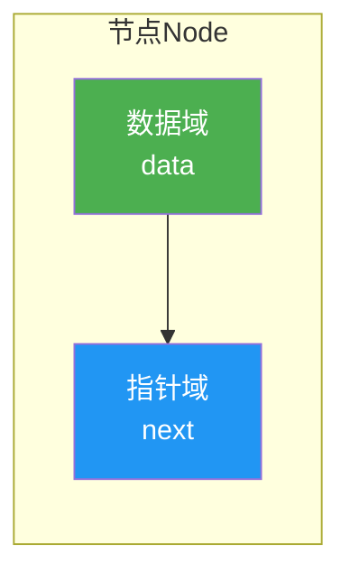
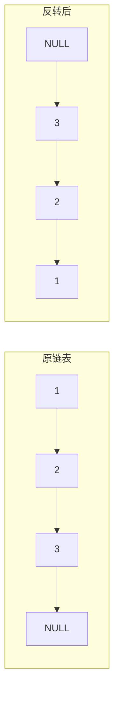

@[TOC](C语言数据结构系列：链表篇)

# C语言数据结构系列（二）：单链表——完全指南

> 🎯 **本篇目标**：深入理解链表的概念，掌握单链表的增删改查，学会链表的各种经典操作！

---

## 一、前言

哈喽小伙伴们！👋

上一篇我们学习了数组，它虽然随机访问很快，但有个致命缺点——**大小固定**！想要增删元素还需要移动大量数据，太麻烦了！😫

今天我们要学习的**链表**，就像一列**火车**🚆，每节车厢（节点）可以随时挂载或脱钩，完美解决了数组的痛点！


让我们开始今天的学习吧！ 🚀

---

## 二、链表的基本概念

### 2.1 什么是链表？

> **链表（Linked List）** 是一种**非连续**存储的线性数据结构，由若干**节点**组成，每个节点包含**数据域**和**指针域**。

简单来说：
- 🚂 每个节点就像一节火车车厢
- 🔗 指针就是连接车厢的挂钩
- 📍 不需要连续的内存，可以分散在各处

### 2.2 数组 vs 链表

| 特性 | 数组 | 链表 |
|:----:|:----:|:----:|
| 存储方式 | 连续 | 非连续 |
| 大小 | 固定 | 动态 |
| 访问方式 | 随机访问 O(1) | 顺序访问 O(n) |
| 插入/删除 | 慢 O(n) | 快 O(1) |
| 内存利用 | 可能浪费 | 按需分配 |

### 2.3 节点的结构

每个节点包含两部分：



**C语言结构体定义：**

```c
// 链表节点的结构体
typedef struct Node {
    int data;           // 数据域：存放数据
    struct Node *next;  // 指针域：指向下一个节点
} Node;
```

> 💡 **小贴士**：为什么是 `struct Node *next` 而不是 `Node *next`？
> 因为在结构体内部，类型名还没定义完成，必须用 `struct Node`！

---

## 三、链表的基本操作

### 3.1 创建节点

```c
// 创建一个新节点
Node* createNode(int value) {
    Node *newNode = (Node*)malloc(sizeof(Node));
    if (newNode == NULL) {
        printf("内存分配失败！\n");
        return NULL;
    }
    newNode->data = value;
    newNode->next = NULL;
    return newNode;
}
```

### 3.2 头插法插入

> 💡 **头插法**：新节点总是插入到链表头部，就像在火车头前面加一节新车厢！


**代码实现：**

```c
// 头插法：在链表头部插入新节点
void insertAtHead(Node **head, int value) {
    Node *newNode = createNode(value);
    newNode->next = *head;  // 新节点指向原头节点
    *head = newNode;        // 更新头指针
}
```

### 3.3 尾插法插入

> 💡 **尾插法**：新节点插入到链表尾部，就像在火车尾部挂一节新车厢！


**代码实现：**

```c
// 尾插法：在链表尾部插入新节点
void insertAtTail(Node **head, int value) {
    Node *newNode = createNode(value);
    
    // 如果链表为空，新节点就是头节点
    if (*head == NULL) {
        *head = newNode;
        return;
    }
    
    // 找到最后一个节点
    Node *current = *head;
    while (current->next != NULL) {
        current = current->next;
    }
    
    current->next = newNode;  // 尾节点指向新节点
}
```

### 3.4 指定位置插入

在第 `pos` 个位置插入新节点：


**代码实现：**

```c
// 在指定位置插入
void insertAtPos(Node **head, int pos, int value) {
    if (pos < 0) {
        printf("位置无效！\n");
        return;
    }
    
    // 如果在头部插入
    if (pos == 0) {
        insertAtHead(head, value);
        return;
    }
    
    // 找到插入位置的前一个节点
    Node *current = *head;
    for (int i = 0; i < pos - 1 && current != NULL; i++) {
        current = current->next;
    }
    
    // 位置超出链表长度
    if (current == NULL) {
        printf("位置超出链表长度！\n");
        return;
    }
    
    Node *newNode = createNode(value);
    newNode->next = current->next;
    current->next = newNode;
}
```

### 3.5 删除节点

删除指定值的节点：


**代码实现：**

```c
// 删除指定值的节点
void deleteNode(Node **head, int value) {
    // 链表为空
    if (*head == NULL) {
        printf("链表为空！\n");
        return;
    }
    
    // 如果要删除的是头节点
    if ((*head)->data == value) {
        Node *temp = *head;
        *head = (*head)->next;
        free(temp);
        return;
    }
    
    // 查找要删除节点的前一个节点
    Node *current = *head;
    while (current->next != NULL && current->next->data != value) {
        current = current->next;
    }
    
    // 没找到
    if (current->next == NULL) {
        printf("未找到值为%d的节点！\n", value);
        return;
    }
    
    // 删除节点
    Node *temp = current->next;
    current->next = temp->next;
    free(temp);
}
```

### 3.6 查找节点

```c
// 查找节点，返回节点指针
Node* search(Node *head, int value) {
    Node *current = head;
    while (current != NULL) {
        if (current->data == value)
            return current;
        current = current->next;
    }
    return NULL;  // 未找到
}
```

### 3.7 打印链表

```c
// 打印链表
void printList(Node *head) {
    Node *current = head;
    while (current != NULL) {
        printf("%d", current->data);
        if (current->next != NULL)
            printf(" -> ");
        current = current->next;
    }
    printf(" -> NULL\n");
}
```

### 3.8 释放链表

```c
// 释放整个链表
void freeList(Node **head) {
    Node *current = *head;
    while (current != NULL) {
        Node *temp = current;
        current = current->next;
        free(temp);
    }
    *head = NULL;
}
```

---

## 四、完整示例代码

```c
#include <stdio.h>
#include <stdlib.h>

typedef struct Node {
    int data;
    struct Node *next;
} Node;

// 创建节点
Node* createNode(int value) {
    Node *newNode = (Node*)malloc(sizeof(Node));
    newNode->data = value;
    newNode->next = NULL;
    return newNode;
}

// 头插法
void insertAtHead(Node **head, int value) {
    Node *newNode = createNode(value);
    newNode->next = *head;
    *head = newNode;
}

// 尾插法
void insertAtTail(Node **head, int value) {
    Node *newNode = createNode(value);
    if (*head == NULL) {
        *head = newNode;
        return;
    }
    Node *current = *head;
    while (current->next != NULL) {
        current = current->next;
    }
    current->next = newNode;
}

// 指定位置插入
void insertAtPos(Node **head, int pos, int value) {
    if (pos == 0) {
        insertAtHead(head, value);
        return;
    }
    Node *current = *head;
    for (int i = 0; i < pos - 1 && current != NULL; i++) {
        current = current->next;
    }
    if (current == NULL) {
        printf("位置无效！\n");
        return;
    }
    Node *newNode = createNode(value);
    newNode->next = current->next;
    current->next = newNode;
}

// 删除节点
void deleteNode(Node **head, int value) {
    if (*head == NULL) return;
    
    if ((*head)->data == value) {
        Node *temp = *head;
        *head = (*head)->next;
        free(temp);
        return;
    }
    
    Node *current = *head;
    while (current->next != NULL && current->next->data != value) {
        current = current->next;
    }
    if (current->next != NULL) {
        Node *temp = current->next;
        current->next = temp->next;
        free(temp);
    }
}

// 查找
Node* search(Node *head, int value) {
    Node *current = head;
    while (current != NULL) {
        if (current->data == value)
            return current;
        current = current->next;
    }
    return NULL;
}

// 打印链表
void printList(Node *head) {
    Node *current = head;
    while (current != NULL) {
        printf("%d", current->data);
        if (current->next) printf(" -> ");
        current = current->next;
    }
    printf(" -> NULL\n");
}

// 释放链表
void freeList(Node **head) {
    Node *current = *head;
    while (current != NULL) {
        Node *temp = current;
        current = current->next;
        free(temp);
    }
    *head = NULL;
}

int main() {
    Node *head = NULL;
    
    printf("===== 单链表操作演示 =====\n\n");
    
    // 尾插法插入
    printf("尾插法插入 10, 20, 30, 40:\n");
    insertAtTail(&head, 10);
    insertAtTail(&head, 20);
    insertAtTail(&head, 30);
    insertAtTail(&head, 40);
    printList(head);
    
    // 头插法插入
    printf("\n头插法插入 5:\n");
    insertAtHead(&head, 5);
    printList(head);
    
    // 指定位置插入
    printf("\n在位置2插入 25:\n");
    insertAtPos(&head, 2, 25);
    printList(head);
    
    // 查找
    printf("\n查找元素 25:\n");
    Node *found = search(head, 25);
    if (found)
        printf("找到了！值为: %d\n", found->data);
    else
        printf("未找到！\n");
    
    // 删除
    printf("\n删除元素 30:\n");
    deleteNode(&head, 30);
    printList(head);
    
    // 释放
    freeList(&head);
    
    return 0;
}
```

**运行结果：**
```
===== 单链表操作演示 =====

尾插法插入 10, 20, 30, 40:
10 -> 20 -> 30 -> 40 -> NULL

头插法插入 5:
5 -> 10 -> 20 -> 30 -> 40 -> NULL

在位置2插入 25:
5 -> 10 -> 25 -> 20 -> 30 -> 40 -> NULL

查找元素 25:
找到了！值为: 25

删除元素 30:
5 -> 10 -> 25 -> 20 -> 40 -> NULL
```

---

## 五、经典链表问题

### 5.1 反转链表

> 💡 **思路**：使用三个指针，逐个改变节点指向



**代码实现：**

```c
// 反转链表
Node* reverseList(Node *head) {
    Node *prev = NULL;      // 前一个节点
    Node *current = head;   // 当前节点
    Node *next = NULL;      // 下一个节点
    
    while (current != NULL) {
        next = current->next;  // 保存下一个节点
        current->next = prev;  // 反转指向
        prev = current;        // prev前移
        current = next;        // current前移
    }
    
    return prev;  // prev就是新的头节点
}
```

**图解过程：**


### 5.2 求链表长度

```c
int getLength(Node *head) {
    int count = 0;
    Node *current = head;
    while (current != NULL) {
        count++;
        current = current->next;
    }
    return count;
}
```

### 5.3 找中间节点

> 💡 **思路**：快慢指针，快指针走两步，慢指针走一步

```c
Node* findMiddle(Node *head) {
    Node *slow = head;
    Node *fast = head;
    
    while (fast != NULL && fast->next != NULL) {
        slow = slow->next;
        fast = fast->next->next;
    }
    
    return slow;
}
```

### 5.4 判断是否有环

```c
bool hasCycle(Node *head) {
    Node *slow = head;
    Node *fast = head;
    
    while (fast != NULL && fast->next != NULL) {
        slow = slow->next;
        fast = fast->next->next;
        
        if (slow == fast)
            return true;
    }
    
    return false;
}
```

---

## 六、复杂度总结

| 操作 | 时间复杂度 | 说明 |
|:----:|:----------:|:----:|
| 头插法 | **O(1)** | 直接插入 |
| 尾插法 | O(n) | 需要遍历到最后 |
| 指定位置插入 | O(n) | 需要找到位置 |
| 删除 | O(n) | 需要查找 |
| 查找 | O(n) | 需要遍历 |
| 访问（按值） | O(n) | 不支持随机访问 |

**对比数组：**

| 操作 | 数组 | 链表 |
|:----:|:----:|:----:|
| 随机访问 | O(1) ✅ | O(n) ❌ |
| 头部插入 | O(n) ❌ | O(1) ✅ |
| 尾部插入 | O(1) ✅ | O(n)* |
| 中间插入 | O(n) | O(1)** |

*不考虑遍历时间
**已知插入位置的情况下

---

## 七、链表的应用场景

1. **实现栈和队列** 📚
   - 栈的push/pop操作

2. **哈希表的链地址法** 🪣
   - 解决哈希冲突

3. **图的邻接表** 🗺️
   - 存储图的边

4. **多项式运算** 📐
   - 表示多项式

5. **内存管理** 💾
   - 空闲内存块管理

---

## 八、练习题 🎯

### 🏠 基础题

**题目1：合并两个有序链表**

将两个有序链表合并为一个新的有序链表。

```c
// 示例
链表1: 1 -> 3 -> 5
链表2: 2 -> 4 -> 6
结果: 1 -> 2 -> 3 -> 4 -> 5 -> 6
```

---

**题目2：删除倒数第N个节点**

```c
// 示例
链表: 1 -> 2 -> 3 -> 4 -> 5
删除倒数第2个节点
结果: 1 -> 2 -> 3 -> 5
```

---

### 💪 进阶题

**题目3：环形链表II**

找到环的入口节点。

**题目4：合并K个有序链表**

---

## 九、总结

今天我们深入学习了单链表：

✅ **链表概念**：非连续存储，通过指针连接

✅ **节点结构**：数据域 + 指针域

✅ **基本操作**：头插、尾插、指定位置插入、删除、查找

✅ **经典问题**：反转、求长度、找中间节点、判断环

✅ **复杂度分析**：插入删除O(1)，访问O(n)

**记住：**
1. 链表是动态数据结构
2. 插入删除效率高
3. 不支持随机访问
4. 注意内存管理（malloc/free）

---

## 十、下篇预告

下一篇我们将学习 **双链表和循环链表**——更强大的链表变体！


双链表可以双向遍历，循环链表首尾相连，让我们拭目待！ 🚀

---

> 💡 **学习建议**：链表是数据结构的基础中的基础，一定要多画图理解指针的变化过程！

**觉得有帮助就点赞+收藏+关注吧！** 👍

有问题欢迎在评论区留言～ 💬
