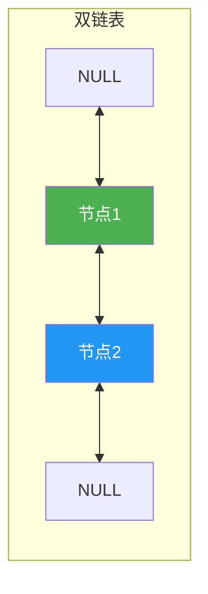
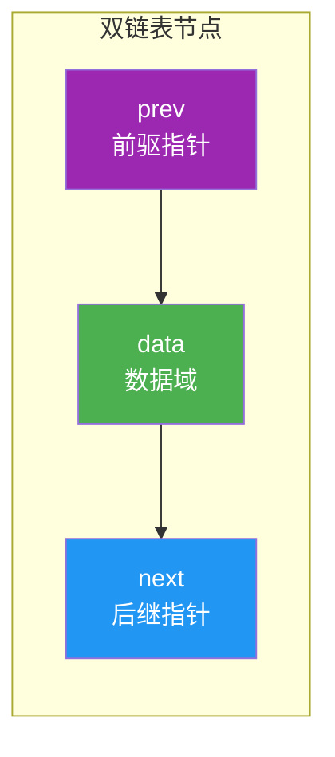
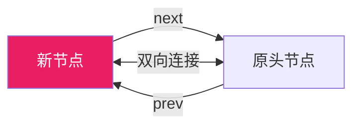
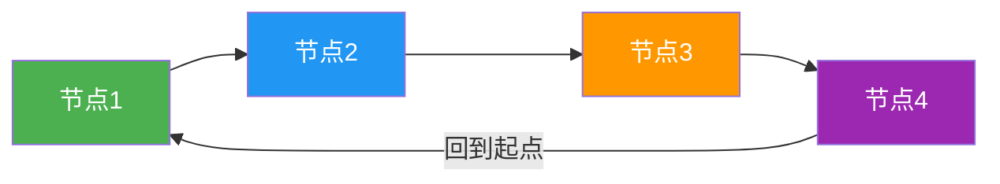
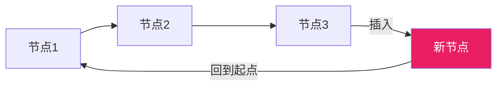
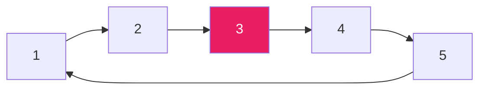
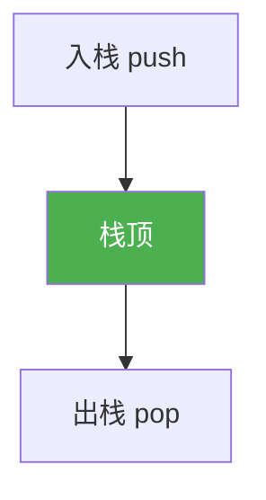

@[TOC](C语言数据结构系列：双链表与循环链表篇)

# C语言数据结构系列（三）：双链表与循环链表

> 🎯 **本篇目标**：掌握双链表和循环链表的概念与实现，理解它们相比单链表的优势！

---

## 一、前言

哈喽小伙伴们！👋

上一篇我们学习了单链表，它只能**单向遍历**，想要找前一个节点还得从头开始找，太不方便了！😫

今天我们来学习两个链表的"进化版"：
- **双链表**：可以**双向**行走，前进后退都很方便！
- **循环链表**：首尾相连，形成一个**闭环**，适合约瑟夫等问题！



让我们开始今天的学习吧！ 🚀

---

## 二、双链表

### 2.1 什么是双链表？

> **双链表（Doubly Linked List）** 每个节点包含**三个域**：前驱指针、数据域、后继指针。

就像一列**双向火车**🚆：
- 每节车厢可以往前走，也可以往后走
- 每节车厢都知道自己的前一节和后一节是谁

### 2.2 节点结构



**C语言结构体定义：**

```c
// 双链表节点结构体
typedef struct DNode {
    int data;               // 数据域
    struct DNode *prev;     // 前驱指针
    struct DNode *next;     // 后继指针
} DNode;
```

### 2.3 双链表 vs 单链表

| 特性 | 单链表 | 双链表 |
|:----:|:----:|:----:|
| 指针数 | 1个(next) | 2个(prev, next) |
| 遍历方向 | 单向 | 双向 |
| 查找前驱 | O(n) | O(1) |
| 空间开销 | 较小 | 较大 |
| 插入删除 | 需知道前驱 | 直接操作 |

### 2.4 双链表的基本操作

#### 创建节点

```c
DNode* createDNode(int value) {
    DNode *newNode = (DNode*)malloc(sizeof(DNode));
    newNode->data = value;
    newNode->prev = NULL;
    newNode->next = NULL;
    return newNode;
}
```

#### 头插法



```c
void insertAtHead(DNode **head, int value) {
    DNode *newNode = createDNode(value);
    
    if (*head != NULL) {
        newNode->next = *head;
        (*head)->prev = newNode;
    }
    
    *head = newNode;
}
```

#### 尾插法

```c
void insertAtTail(DNode **head, int value) {
    DNode *newNode = createDNode(value);
    
    if (*head == NULL) {
        *head = newNode;
        return;
    }
    
    DNode *current = *head;
    while (current->next != NULL) {
        current = current->next;
    }
    
    current->next = newNode;
    newNode->prev = current;
}
```

#### 指定位置插入

```c
void insertAtPos(DNode **head, int pos, int value) {
    if (pos == 0) {
        insertAtHead(head, value);
        return;
    }
    
    DNode *current = *head;
    for (int i = 0; i < pos && current != NULL; i++) {
        current = current->next;
    }
    
    if (current == NULL) {
        printf("位置无效！\n");
        return;
    }
    
    DNode *newNode = createDNode(value);
    newNode->prev = current->prev;
    newNode->next = current;
    current->prev->next = newNode;
    current->prev = newNode;
}
```

#### 删除节点

```c
void deleteNode(DNode **head, int value) {
    if (*head == NULL) return;
    
    DNode *current = *head;
    
    // 找到要删除的节点
    while (current != NULL && current->data != value) {
        current = current->next;
    }
    
    if (current == NULL) {
        printf("未找到值为%d的节点！\n", value);
        return;
    }
    
    // 如果是头节点
    if (current->prev == NULL) {
        *head = current->next;
        if (*head != NULL)
            (*head)->prev = NULL;
    } else {
        current->prev->next = current->next;
        if (current->next != NULL)
            current->next->prev = current->prev;
    }
    
    free(current);
}
```

#### 反向打印

双链表的独特优势——可以从后往前打印！

```c
void printReverse(DNode *head) {
    if (head == NULL) return;
    
    // 先走到最后
    DNode *current = head;
    while (current->next != NULL) {
        current = current->next;
    }
    
    // 从后往前打印
    while (current != NULL) {
        printf("%d", current->data);
        if (current->prev) printf(" <- ");
        current = current->prev;
    }
    printf("\n");
}
```

### 2.5 完整示例

```c
#include <stdio.h>
#include <stdlib.h>

typedef struct DNode {
    int data;
    struct DNode *prev;
    struct DNode *next;
} DNode;

DNode* createDNode(int value) {
    DNode *newNode = (DNode*)malloc(sizeof(DNode));
    newNode->data = value;
    newNode->prev = NULL;
    newNode->next = NULL;
    return newNode;
}

void insertAtHead(DNode **head, int value) {
    DNode *newNode = createDNode(value);
    if (*head != NULL) {
        newNode->next = *head;
        (*head)->prev = newNode;
    }
    *head = newNode;
}

void insertAtTail(DNode **head, int value) {
    DNode *newNode = createDNode(value);
    if (*head == NULL) {
        *head = newNode;
        return;
    }
    DNode *current = *head;
    while (current->next != NULL) {
        current = current->next;
    }
    current->next = newNode;
    newNode->prev = current;
}

void deleteNode(DNode **head, int value) {
    if (*head == NULL) return;
    
    DNode *current = *head;
    while (current != NULL && current->data != value) {
        current = current->next;
    }
    
    if (current == NULL) return;
    
    if (current->prev == NULL) {
        *head = current->next;
        if (*head) (*head)->prev = NULL;
    } else {
        current->prev->next = current->next;
        if (current->next) current->next->prev = current->prev;
    }
    free(current);
}

void printList(DNode *head) {
    DNode *current = head;
    while (current != NULL) {
        printf("%d", current->data);
        if (current->next) printf(" <-> ");
        current = current->next;
    }
    printf("\n");
}

void printReverse(DNode *head) {
    if (head == NULL) return;
    DNode *current = head;
    while (current->next != NULL) current = current->next;
    while (current != NULL) {
        printf("%d", current->data);
        if (current->prev) printf(" <-> ");
        current = current->prev;
    }
    printf("\n");
}

void freeList(DNode **head) {
    DNode *current = *head;
    while (current != NULL) {
        DNode *temp = current;
        current = current->next;
        free(temp);
    }
    *head = NULL;
}

int main() {
    DNode *head = NULL;
    
    printf("===== 双链表演示 =====\n\n");
    
    insertAtTail(&head, 10);
    insertAtTail(&head, 20);
    insertAtTail(&head, 30);
    insertAtHead(&head, 5);
    
    printf("正向打印: ");
    printList(head);
    
    printf("反向打印: ");
    printReverse(head);
    
    printf("\n删除元素20后:\n");
    deleteNode(&head, 20);
    printf("正向打印: ");
    printList(head);
    
    freeList(&head);
    return 0;
}
```

**运行结果：**
```
===== 双链表演示 =====

正向打印: 5 <-> 10 <-> 20 <-> 30
反向打印: 30 <-> 20 <-> 10 <-> 5

删除元素20后:
正向打印: 5 <-> 10 <-> 30
```

---

## 三、循环链表

### 3.1 什么是循环链表？

> **循环链表（Circular Linked List）** 是一种首尾相接的链表，最后一个节点的next指向第一个节点，形成一个闭环！

就像一个**旋转木马**🎠：
- 没有起点也没有终点
- 可以一直循环下去
- 适合处理约瑟夫问题、循环队列等



### 3.2 循环链表 vs 普通链表

| 特性 | 普通链表 | 循环链表 |
|:----:|:----:|:----:|
| 尾节点next | NULL | 指向头节点 |
| 遍历结束条件 | current == NULL | current->next == head |
| 形成结构 | 线性 | 环形 |

### 3.3 循环链表的基本操作

#### 创建节点

```c
CLNode* createCLNode(int value) {
    CLNode *newNode = (CLNode*)malloc(sizeof(CLNode));
    newNode->data = value;
    newNode->next = NULL;
    return newNode;
}
```

#### 尾插法



```c
void insertAtTail(CLNode **head, int value) {
    CLNode *newNode = createCLNode(value);
    
    if (*head == NULL) {
        *head = newNode;
        newNode->next = *head;  // 指向自己
        return;
    }
    
    CLNode *current = *head;
    while (current->next != *head) {
        current = current->next;
    }
    
    current->next = newNode;
    newNode->next = *head;  // 新节点指向头节点
}
```

#### 打印循环链表

```c
void printList(CLNode *head) {
    if (head == NULL) return;
    
    CLNode *current = head;
    do {
        printf("%d", current->data);
        if (current->next != head) printf(" -> ");
        current = current->next;
    } while (current != head);
    printf(" (回到%d)\n", head->data);
}
```

#### 删除节点

```c
void deleteNode(CLNode **head, int value) {
    if (*head == NULL) return;
    
    CLNode *current = *head;
    CLNode *prev = NULL;
    
    // 找到要删除的节点
    do {
        if (current->data == value) break;
        prev = current;
        current = current->next;
    } while (current != *head);
    
    // 没找到
    if (current->data != value) {
        printf("未找到值为%d的节点！\n", value);
        return;
    }
    
    // 只有一个节点
    if (current->next == current) {
        *head = NULL;
    } else {
        if (current == *head) {
            *head = current->next;
        }
        prev->next = current->next;
    }
    
    free(current);
}
```

### 3.4 约瑟夫问题（经典应用）

> 💡 **问题描述**：n个人围成一圈，从第一个人开始报数，报到m的人出圈，求出圈顺序。



**代码实现：**

```c
void josephus(int n, int m) {
    // 创建循环链表
    CLNode *head = NULL;
    for (int i = n; i >= 1; i--) {
        insertAtTail(&head, i);
    }
    
    printf("出圈顺序: ");
    
    // 从第一个人开始，报数m-1次后删除
    CLNode *current = head;
    CLNode *prev = NULL;
    
    while (current->next != current) {
        // 报数m-1次
        for (int i = 1; i < m; i++) {
            prev = current;
            current = current->next;
        }
        
        printf("%d ", current->data);
        
        // 删除当前节点
        prev->next = current->next;
        free(current);
        current = prev->next;
    }
    
    printf("%d\n", current->data);  // 最后一个
    free(current);
}
```

**测试：**

```c
int main() {
    printf("===== 约瑟夫问题 =====\n");
    printf("n=5, m=3\n");
    josephus(5, 3);
    return 0;
}
```

**运行结果：**
```
===== 约瑟夫问题 =====
n=5, m=3
出圈顺序: 3 1 5 2 4
```

---

## 四、双向循环链表

> 💡 **双向循环链表**：结合双链表和循环链表的优点，既可以双向遍历，又可以循环！

### 4.1 节点结构

```c
typedef struct DCNode {
    int data;
    struct DCNode *prev;
    struct DCNode *next;
} DCNode;
```

### 4.2 创建和插入

```c
DCNode* createDCNode(int value) {
    DCNode *newNode = (DCNode*)malloc(sizeof(DCNode));
    newNode->data = value;
    newNode->prev = NULL;
    newNode->next = NULL;
    return newNode;
}

void insertAtTail(DCNode **head, int value) {
    DCNode *newNode = createDCNode(value);
    
    if (*head == NULL) {
        *head = newNode;
        newNode->prev = newNode;
        newNode->next = newNode;
        return;
    }
    
    DCNode *tail = (*head)->prev;
    
    tail->next = newNode;
    newNode->prev = tail;
    newNode->next = *head;
    (*head)->prev = newNode;
}
```

### 4.3 打印

```c
void printList(DCNode *head) {
    if (head == NULL) return;
    
    DCNode *current = head;
    do {
        printf("%d", current->data);
        if (current->next != head) printf(" <-> ");
        current = current->next;
    } while (current != head);
    printf("\n");
}
```

---

## 五、复杂度对比

| 操作 | 单链表 | 双链表 | 循环链表 |
|:----:|:----:|:----:|:----:|
| 头插法 | O(1) | O(1) | O(1) |
| 尾插法 | O(n) | O(n) | O(1)* |
| 删除已知节点 | O(n) | O(1) | O(n) |
| 查找前驱 | O(n) | O(1) | O(n) |
| 向前遍历 | ❌ | ✅ | ✅ |

*已知尾指针的情况下

---

## 六、应用场景

### 双链表的应用

1. **浏览器的前进/后退** 🔙
   - 每个页面是一个节点，prev指向前一页，next指向后一页

2. **音乐播放器** 🎵
   - 上一首/下一首功能

3. **LRU缓存** 💾
   - 最近最少使用算法

### 循环链表的应用

1. **约瑟夫问题** 👥
   - 多人围成一圈报数

2. **轮询调度** ⏰
   - 操作系统的时间片轮转

3. **循环队列** 🔄
   - 打印任务队列

4. **音乐播放循环** 🔁
   - 单曲循环、列表循环

---

## 七、练习题 🎯

### 🏠 基础题

**题目1：合并两个有序双链表**

将两个有序双链表合并为一个新的有序双链表。

---

**题目2：判断回文链表**

判断一个链表是否是回文链表（正读反读都一样）。

```c
// 示例
1 -> 2 -> 2 -> 1  // 是回文
1 -> 2 -> 3 -> 4  // 不是回文
```

**提示**：可以使用快慢指针找到中间，然后反转后半部分比较。

---

### 💪 进阶题

**题目3：LRU缓存实现**

使用双向链表实现一个LRU缓存。

**题目4：约瑟夫变体**

n个人围成一圈，每个人有不同的权重，权重大的可以跳过多次。

---

## 八、总结

今天我们学习了两种链表的变体：

✅ **双链表**：
- 每个节点有prev和next两个指针
- 可以双向遍历
- 删除已知节点O(1)
- 空间开销稍大

✅ **循环链表**：
- 尾节点指向头节点，形成闭环
- 适合处理循环问题
- 约瑟夫问题的经典解法

✅ **双向循环链表**：
- 结合两者优点
- Linux内核链表就是这种结构

**选择建议：**
- 需要双向遍历 → 双链表
- 需要循环操作 → 循环链表
- 需要两者兼备 → 双向循环链表

---

## 九、下篇预告

下一篇我们将学习 **栈（Stack）**——后进先出的数据结构！



栈可以用数组或链表实现，让我们拭目以待！ 🚀

---

> 💡 **学习建议**：双链表操作时要特别注意指针的指向，建议画图理解！

**觉得有帮助就点赞+收藏+关注吧！** 👍

有问题欢迎在评论区留言～ 💬
