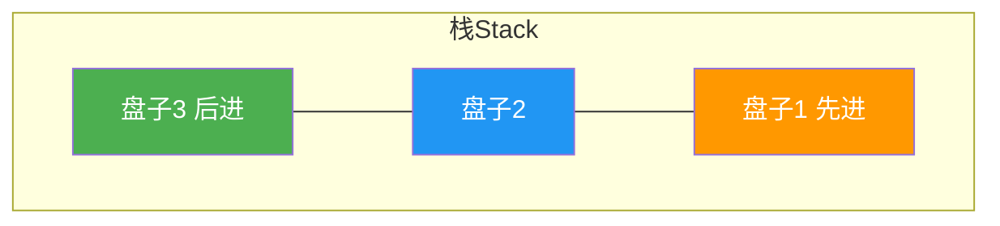
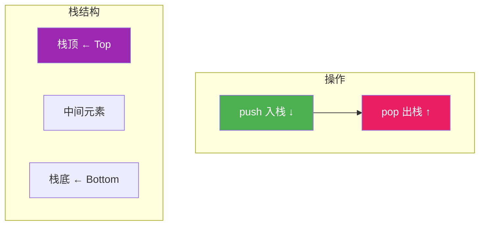
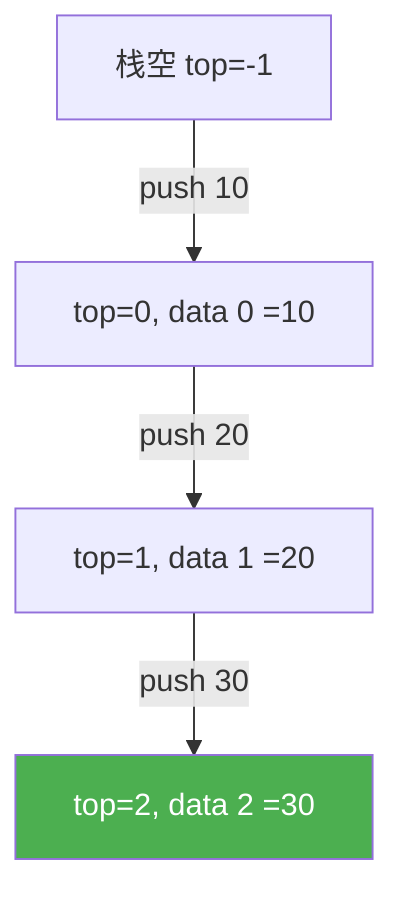
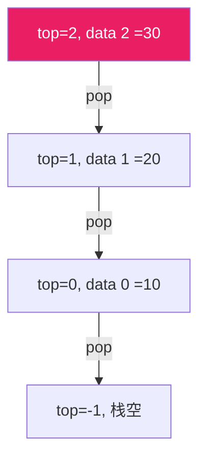
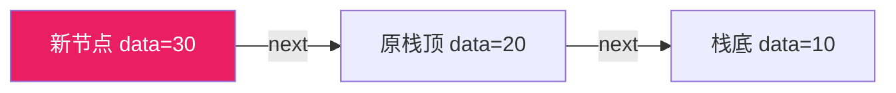
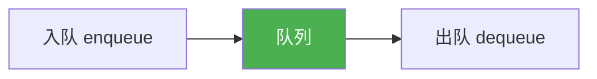

@[TOC](C语言数据结构系列：栈篇)

# C语言数据结构系列（四）：栈——后进先出的奥秘

> 🎯 **本篇目标**：理解栈的概念，掌握顺序栈和链栈的实现，学会栈的经典应用！

---

## 一、前言

哈喽小伙伴们！👋

想象一下你玩过的**叠盘子**游戏：新盘子总是放在最上面，取盘子也只能从最上面取。这就是我们今天要学习的**栈（Stack）**！



栈是**后进先出（LIFO）** 的数据结构，在计算机科学中应用非常广泛！

让我们开始今天的学习吧！ 🚀

---

## 二、栈的基本概念

### 2.1 什么是栈？

> **栈（Stack）** 是一种只能在一端进行插入和删除操作的**线性数据结构**。

关键特点：
- 📍 **栈顶（Top）**：允许操作的一端
- 📍 **栈底（Bottom）**：不允许操作的一端
- 🚫 **后进先出（LIFO）**：最后入栈的元素最先出栈

### 2.2 栈的图解



### 2.3 栈的两种实现方式

| 方式 | 底层结构 | 优点 | 缺点 |
|:----:|:----:|:----:|:----:|
| 顺序栈 | 数组 | 实现简单，效率高 | 大小固定，可能溢出 |
| 链栈 | 链表 | 大小灵活，无溢出 | 额外指针开销 |

---

## 三、顺序栈（数组实现）

### 3.1 栈结构定义

```c
#define MAX_SIZE 100

typedef struct {
    int data[MAX_SIZE];  // 数组存储栈元素
    int top;             // 栈顶指针
} Stack;
```

**top的含义：**
- `top = -1`：空栈
- `top = 0`：只有一个元素
- `top = MAX_SIZE - 1`：栈满

### 3.2 基本操作

#### 初始化

```c
void initStack(Stack *s) {
    s->top = -1;  // 空栈
}
```

#### 判断空栈

```c
bool isEmpty(Stack *s) {
    return s->top == -1;
}
```

#### 判断栈满

```c
bool isFull(Stack *s) {
    return s->top == MAX_SIZE - 1;
}
```

#### 入栈（push）



```c
bool push(Stack *s, int value) {
    if (isFull(s)) {
        printf("栈满，无法入栈！\n");
        return false;
    }
    s->data[++s->top] = value;
    return true;
}
```

#### 出栈（pop）



```c
bool pop(Stack *s, int *value) {
    if (isEmpty(s)) {
        printf("栈空，无法出栈！\n");
        return false;
    }
    *value = s->data[s->top--];
    return true;
}
```

#### 查看栈顶

```c
bool peek(Stack *s, int *value) {
    if (isEmpty(s)) {
        printf("栈空！\n");
        return false;
    }
    *value = s->data[s->top];
    return true;
}
```

### 3.3 完整示例

```c
#include <stdio.h>
#include <stdlib.h>
#include <stdbool.h>

#define MAX_SIZE 100

typedef struct {
    int data[MAX_SIZE];
    int top;
} Stack;

void initStack(Stack *s) {
    s->top = -1;
}

bool isEmpty(Stack *s) {
    return s->top == -1;
}

bool isFull(Stack *s) {
    return s->top == MAX_SIZE - 1;
}

bool push(Stack *s, int value) {
    if (isFull(s)) {
        printf("栈满！\n");
        return false;
    }
    s->data[++s->top] = value;
    printf("入栈: %d\n", value);
    return true;
}

bool pop(Stack *s, int *value) {
    if (isEmpty(s)) {
        printf("栈空！\n");
        return false;
    }
    *value = s->data[s->top--];
    printf("出栈: %d\n", *value);
    return true;
}

bool peek(Stack *s, int *value) {
    if (isEmpty(s)) return false;
    *value = s->data[s->top];
    return true;
}

void printStack(Stack *s) {
    printf("栈内容: ");
    for (int i = s->top; i >= 0; i--) {
        printf("%d", s->data[i]);
        if (i > 0) printf(" <- ");
    }
    printf(" <- 栈底\n");
}

int main() {
    Stack s;
    initStack(&s);
    
    printf("===== 顺序栈演示 =====\n\n");
    
    push(&s, 10);
    push(&s, 20);
    push(&s, 30);
    push(&s, 40);
    
    printStack(&s);
    
    int value;
    peek(&s, &value);
    printf("\n栈顶元素: %d\n", value);
    
    pop(&s, &value);
    pop(&s, &value);
    
    printStack(&s);
    
    return 0;
}
```

**运行结果：**
```
===== 顺序栈演示 =====

入栈: 10
入栈: 20
入栈: 30
入栈: 40
栈内容: 40 <- 30 <- 20 <- 10 <- 栈底

栈顶元素: 40
出栈: 40
出栈: 30
栈内容: 20 <- 10 <- 栈底
```

---

## 四、链栈（链表实现）

### 4.1 栈结构定义

```c
typedef struct StackNode {
    int data;
    struct StackNode *next;
} StackNode;

typedef struct {
    StackNode *top;  // 栈顶指针
    int size;        // 栈大小
} LinkStack;
```

### 4.2 基本操作

#### 初始化

```c
void initStack(LinkStack *s) {
    s->top = NULL;
    s->size = 0;
}
```

#### 入栈



```c
void push(LinkStack *s, int value) {
    StackNode *newNode = (StackNode*)malloc(sizeof(StackNode));
    newNode->data = value;
    newNode->next = s->top;
    s->top = newNode;
    s->size++;
}
```

#### 出栈

```c
bool pop(LinkStack *s, int *value) {
    if (s->top == NULL) {
        printf("栈空！\n");
        return false;
    }
    
    StackNode *temp = s->top;
    *value = temp->data;
    s->top = temp->next;
    free(temp);
    s->size--;
    return true;
}
```

#### 打印和释放

```c
void printStack(LinkStack *s) {
    StackNode *current = s->top;
    printf("栈内容: ");
    while (current != NULL) {
        printf("%d", current->data);
        if (current->next) printf(" <- ");
        current = current->next;
    }
    printf("\n");
}

void freeStack(LinkStack *s) {
    StackNode *current = s->top;
    while (current != NULL) {
        StackNode *temp = current;
        current = current->next;
        free(temp);
    }
    s->top = NULL;
    s->size = 0;
}
```

---

## 五、栈的经典应用

### 5.1 括号匹配

> 💡 **问题**：给定一个只包含 `'('`, `')'`, `'{'`, `'}'`, `'['`, `']'` 的字符串，判断字符串是否有效。

```c
bool isValid(char *s) {
    Stack stack;
    initStack(&stack);
    
    while (*s) {
        if (*s == '(' || *s == '[' || *s == '{') {
            push(&stack, *s);
        } else {
            if (isEmpty(&stack)) return false;
            
            int top;
            peek(&stack, &top);
            
            if ((*s == ')' && top == '(') ||
                (*s == ']' && top == '[') ||
                (*s == '}' && top == '{')) {
                pop(&stack, &top);
            } else {
                return false;
            }
        }
        s++;
    }
    
    return isEmpty(&stack);
}
```

**测试：**

```c
int main() {
    char *test1 = "({[]})";
    char *test2 = "({[})";
    
    printf("\"%s\" 是否有效: %s\n", test1, isValid(test1) ? "是" : "否");
    printf("\"%s\" 是否有效: %s\n", test2, isValid(test2) ? "是" : "否");
    
    return 0;
}
```

**输出：**
```
"({[]})" 是否有效: 是
"({[})" 是否有效: 否
```

### 5.2 表达式求值

> 💡 **问题**：计算后缀表达式的值（如 `3 4 + 5 *` = 35）

```c
int evaluatePostfix(char *expression) {
    Stack stack;
    initStack(&stack);
    
    while (*expression) {
        if (*expression >= '0' && *expression <= '9') {
            push(&stack, *expression - '0');
        } else if (*expression == '+' || *expression == '-' ||
                   *expression == '*' || *expression == '/') {
            int b, a;
            pop(&stack, &b);
            pop(&stack, &a);
            
            switch (*expression) {
                case '+': push(&stack, a + b); break;
                case '-': push(&stack, a - b); break;
                case '*': push(&stack, a * b); break;
                case '/': push(&stack, a / b); break;
            }
        }
        expression++;
    }
    
    int result;
    peek(&stack, &result);
    return result;
}
```

### 5.3 浏览器的前进后退

```c
typedef struct {
    Stack back;    // 后退栈
    Stack forward; // 前进栈
    char *currentPage;
} Browser;

void visit(Browser *b, char *url) {
    push(&b->back, (int)b->currentPage);
    b->currentPage = url;
    // 清空前进栈
    while (!isEmpty(&b->forward)) {
        int temp;
        pop(&b->forward, &temp);
    }
}

char* goBack(Browser *b) {
    if (isEmpty(&b->back)) return NULL;
    push(&b->forward, (int)b->currentPage);
    int prev;
    pop(&b->back, &prev);
    b->currentPage = (char*)prev;
    return b->currentPage;
}

char* goForward(Browser *b) {
    if (isEmpty(&b->forward)) return NULL;
    push(&b->back, (int)b->currentPage);
    int next;
    pop(&b->forward, &next);
    b->currentPage = (char*)next;
    return b->currentPage;
}
```

### 5.4 十进制转二进制

```c
void decimalToBinary(int n) {
    Stack s;
    initStack(&s);
    
    if (n == 0) {
        printf("0");
        return;
    }
    
    while (n > 0) {
        push(&s, n % 2);
        n /= 2;
    }
    
    printf("二进制: ");
    int value;
    while (!isEmpty(&s)) {
        pop(&s, &value);
        printf("%d", value);
    }
    printf("\n");
}
```

**测试：**

```c
int main() {
    decimalToBinary(10);  // 1010
    decimalToBinary(255); // 11111111
    return 0;
}
```

### 5.5 迷宫问题

```c
// 使用栈实现迷宫求解
typedef struct {
    int x, y;
} Point;

bool solveMaze(int maze[][N], int startX, int startY) {
    Stack path;
    initStack(&path);
    
    Point start = {startX, startY};
    push(&path, start.x * N + start.y);
    maze[startX][startY] = 2;  // 标记已访问
    
    while (!isEmpty(&path)) {
        int pos;
        peek(&path, &pos);
        int x = pos / N, y = pos % N;
        
        // 找到出口
        if (x == N-1 && y == N-1) return true;
        
        // 尝试四个方向
        int dx[] = {0, 0, 1, -1};
        int dy[] = {1, -1, 0, 0};
        bool found = false;
        
        for (int i = 0; i < 4; i++) {
            int nx = x + dx[i], ny = y + dy[i];
            if (nx >= 0 && nx < N && ny >= 0 && ny < N &&
                maze[nx][ny] == 0) {
                maze[nx][ny] = 2;
                Point p = {nx, ny};
                push(&path, p.x * N + p.y);
                found = true;
                break;
            }
        }
        
        if (!found) {
            int temp;
            pop(&path, &temp);
            maze[x][y] = 3;  // 标记死路
        }
    }
    
    return false;
}
```

---

## 六、两个栈实现队列

> 💡 **思路**：用两个栈，一个用于入队，一个用于出队

```c
typedef struct {
    Stack stack1;  // 入队栈
    Stack stack2;  // 出队栈
} Queue;

void initQueue(Queue *q) {
    initStack(&q->stack1);
    initStack(&q->stack2);
}

void enqueue(Queue *q, int value) {
    push(&q->stack1, value);
}

bool dequeue(Queue *q, int *value) {
    if (isEmpty(&q->stack2)) {
        if (isEmpty(&q->stack1)) {
            return false;
        }
        // 将stack1的元素倒入stack2
        while (!isEmpty(&q->stack1)) {
            int temp;
            pop(&q->stack1, &temp);
            push(&q->stack2, temp);
        }
    }
    return pop(&q->stack2, value);
}
```

---

## 七、复杂度总结

| 操作 | 顺序栈 | 链栈 |
|:----:|:----:|:----:|
| 入栈 | O(1) | O(1) |
| 出栈 | O(1) | O(1) |
| 查看栈顶 | O(1) | O(1) |
| 判断空 | O(1) | O(1) |
| 空间复杂度 | O(n) 固定 | O(n) 动态 |

**栈的特点：**
- ✅ 入栈出栈都是O(1)
- ✅ 不需要移动元素
- ❌ 只能访问栈顶
- ❌ 不支持随机访问

---

## 八、应用场景

1. **函数调用栈** 📞
   - 函数调用和返回

2. **表达式求值** 🔢
   - 中缀转后缀、后缀求值

3. **括号匹配** 🎯
   - 编译器语法检查

4. **浏览器历史** 🔙
   - 前进后退功能

5. **撤销操作** ↩️
   - 编辑器的Ctrl+Z

6. **深度优先搜索** 🌲
   - 图和树的遍历

7. **内存管理** 💾
   - 局部变量存储

---

## 九、练习题 🎯

### 🏠 基础题

**题目1：最小栈**

设计一个支持push、pop、top操作，并能在常数时间内检索最小元素的栈。

```c
typedef struct {
    Stack data;    // 数据栈
    Stack min;     // 最小栈
} MinStack;
```

---

**题目2：栈的压入弹出序列**

根据入栈序列判断出栈序列是否合法。

---

### 💪 进阶题

**题目3：逆波兰表达式求值**

**题目4：基本计算器**

实现一个基本的计算器，支持加减乘除和括号。

---

## 十、总结

今天我们学习了栈这个重要的数据结构：

✅ **栈的概念**：后进先出（LIFO）

✅ **两种实现**：顺序栈（数组）、链栈（链表）

✅ **基本操作**：push、pop、peek、isEmpty

✅ **经典应用**：
- 括号匹配
- 表达式求值
- 浏览器前进后退
- 十进制转二进制

✅ **栈的特点**：
- 入栈出栈O(1)
- 只能访问栈顶
- 适合LIFO场景

**记住：**
- 顺序栈注意判满
- 链栈注意内存释放
- 栈的核心是LIFO思想

---

## 十一、下篇预告

下一篇我们将学习 **队列（Queue）**——先进先出的数据结构！



栈是LIFO，队列是FIFO，它们是数据结构中的一对好兄弟！

---

> 💡 **学习建议**：栈的实现相对简单，但应用很广泛，多做练习题加深理解！

**觉得有帮助就点赞+收藏+关注吧！** 👍

有问题欢迎在评论区留言～ 💬
