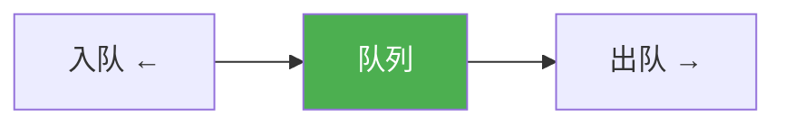
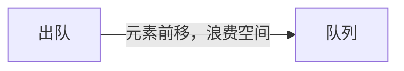
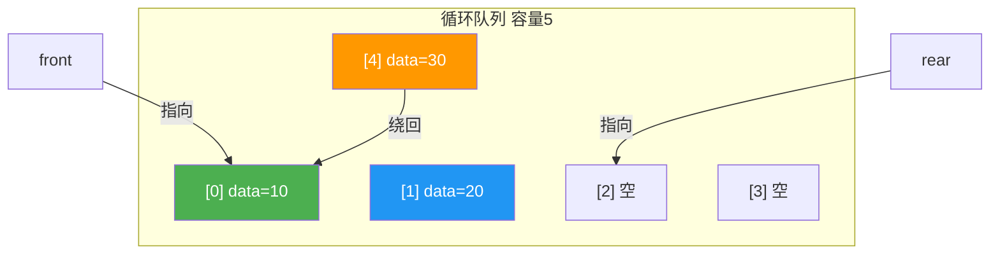

@[TOC](C语言数据结构系列：队列篇)

# C语言数据结构系列（五）：队列——先进先出的艺术

> 🎯 **本篇目标**：理解队列的概念，掌握循环队列和链式队列的实现，学会队列的经典应用！

---

## 一、前言

哈喽小伙伴们！👋

上一篇我们学习了栈（LIFO），今天我们来学习它的"兄弟"——**队列（Queue）**！

想象一下你在**排队买奶茶**🧋：
- 新来的人要排到**队尾**
- 排在**队头**的人先买
- **先来先服务**，非常公平！

这就是队列的**先进先出（FIFO）** 原则！



让我们开始今天的学习吧！ 🚀

---

## 二、队列的基本概念

### 2.1 什么是队列？

> **队列（Queue）** 是一种只在**一端插入**（队尾），在**另一端删除**（队头）的**线性数据结构**。

关键特点：
- 📍 **队头（Front）**：删除元素的一端
- 📍 **队尾（Rear）**：插入元素的一端
- 🚶 **先进先出（FIFO）**：先入队的元素先出队

### 2.2 队列的图解


### 2.3 队列的两种实现方式

| 方式 | 底层结构 | 优点 | 缺点 |
|:----:|:----:|:----:|:----:|
| 循环队列 | 数组 | 无内存开销 | 大小固定 |
| 链式队列 | 链表 | 大小灵活 | 额外指针开销 |

---

## 三、循环队列（数组实现）

### 3.1 为什么需要循环队列？

普通的数组队列有个问题：**假溢出**！



每次出队都要移动所有元素，太麻烦！**循环队列**让队尾可以"绕回"数组开头！

### 3.2 循环队列结构

```c
#define MAX_SIZE 100

typedef struct {
    int data[MAX_SIZE];
    int front;  // 队头
    int rear;   // 队尾的下一个位置
} CircularQueue;
```

### 3.3 循环队列图解



### 3.4 关键公式

```
队列长度 = (rear - front + MAX_SIZE) % MAX_SIZE
队满条件：(rear + 1) % MAX_SIZE == front
队空条件：front == rear
```

> 💡 **为什么浪费一个空间？** 为了区分队满和队空！

### 3.5 基本操作

#### 初始化

```c
void initQueue(CircularQueue *q) {
    q->front = 0;
    q->rear = 0;
}
```

#### 判断空队列

```c
bool isEmpty(CircularQueue *q) {
    return q->front == q->rear;
}
```

#### 判断队满

```c
bool isFull(CircularQueue *q) {
    return (q->rear + 1) % MAX_SIZE == q->front;
}
```

#### 入队

```c
bool enqueue(CircularQueue *q, int value) {
    if (isFull(q)) {
        printf("队满，无法入队！\n");
        return false;
    }
    q->data[q->rear] = value;
    q->rear = (q->rear + 1) % MAX_SIZE;
    return true;
}
```

#### 出队

```c
bool dequeue(CircularQueue *q, int *value) {
    if (isEmpty(q)) {
        printf("队空，无法出队！\n");
        return false;
    }
    *value = q->data[q->front];
    q->front = (q->front + 1) % MAX_SIZE;
    return true;
}
```

#### 获取队列长度

```c
int queueLength(CircularQueue *q) {
    return (q->rear - q->front + MAX_SIZE) % MAX_SIZE;
}
```

### 3.6 完整示例

```c
#include <stdio.h>
#include <stdlib.h>
#include <stdbool.h>

#define MAX_SIZE 5  // 队列实际只能存4个元素

typedef struct {
    int data[MAX_SIZE];
    int front;
    int rear;
} CircularQueue;

void initQueue(CircularQueue *q) {
    q->front = 0;
    q->rear = 0;
}

bool isEmpty(CircularQueue *q) {
    return q->front == q->rear;
}

bool isFull(CircularQueue *q) {
    return (q->rear + 1) % MAX_SIZE == q->front;
}

bool enqueue(CircularQueue *q, int value) {
    if (isFull(q)) {
        printf("队满！\n");
        return false;
    }
    q->data[q->rear] = value;
    q->rear = (q->rear + 1) % MAX_SIZE;
    printf("入队: %d\n", value);
    return true;
}

bool dequeue(CircularQueue *q, int *value) {
    if (isEmpty(q)) {
        printf("队空！\n");
        return false;
    }
    *value = q->data[q->front];
    q->front = (q->front + 1) % MAX_SIZE;
    printf("出队: %d\n", *value);
    return true;
}

int queueLength(CircularQueue *q) {
    return (q->rear - q->front + MAX_SIZE) % MAX_SIZE;
}

void printQueue(CircularQueue *q) {
    printf("队列内容: ");
    int i = q->front;
    while (i != q->rear) {
        printf("%d ", q->data[i]);
        i = (i + 1) % MAX_SIZE;
    }
    printf("(长度: %d)\n", queueLength(q));
}

int main() {
    CircularQueue q;
    initQueue(&q);
    
    printf("===== 循环队列演示 =====\n\n");
    
    enqueue(&q, 10);
    enqueue(&q, 20);
    enqueue(&q, 30);
    printQueue(&q);
    
    int value;
    dequeue(&q, &value);
    dequeue(&q, &value);
    printQueue(&q);
    
    enqueue(&q, 40);
    enqueue(&q, 50);
    enqueue(&q, 60);
    printQueue(&q);
    
    return 0;
}
```

**运行结果：**
```
===== 循环队列演示 =====

入队: 10
入队: 20
入队: 30
队列内容: 10 20 30 (长度: 3)

出队: 10
出队: 20
队列内容: 30 (长度: 1)

入队: 40
入队: 50
入队: 60
队列内容: 30 40 50 60 (长度: 4)
```

---

## 四、链式队列（链表实现）

### 4.1 结构定义

```c
typedef struct QueueNode {
    int data;
    struct QueueNode *next;
} QueueNode;

typedef struct {
    QueueNode *front;  // 队头
    QueueNode *rear;   // 队尾
    int size;
} LinkQueue;
```

### 4.2 基本操作

#### 初始化

```c
void initQueue(LinkQueue *q) {
    q->front = NULL;
    q->rear = NULL;
    q->size = 0;
}
```

#### 入队


```c
void enqueue(LinkQueue *q, int value) {
    QueueNode *newNode = (QueueNode*)malloc(sizeof(QueueNode));
    newNode->data = value;
    newNode->next = NULL;
    
    if (q->rear == NULL) {
        q->front = newNode;
        q->rear = newNode;
    } else {
        q->rear->next = newNode;
        q->rear = newNode;
    }
    q->size++;
}
```

#### 出队

```c
bool dequeue(LinkQueue *q, int *value) {
    if (q->front == NULL) {
        printf("队空！\n");
        return false;
    }
    
    QueueNode *temp = q->front;
    *value = temp->data;
    q->front = temp->next;
    
    if (q->front == NULL) {
        q->rear = NULL;
    }
    
    free(temp);
    q->size--;
    return true;
}
```

#### 打印和释放

```c
void printQueue(LinkQueue *q) {
    QueueNode *current = q->front;
    printf("队列: ");
    while (current != NULL) {
        printf("%d", current->data);
        if (current->next) printf(" <- ");
        current = current->next;
    }
    printf(" (长度: %d)\n", q->size);
}

void freeQueue(LinkQueue *q) {
    QueueNode *current = q->front;
    while (current != NULL) {
        QueueNode *temp = current;
        current = current->next;
        free(temp);
    }
    q->front = NULL;
    q->rear = NULL;
    q->size = 0;
}
```

### 4.3 完整示例

```c
#include <stdio.h>
#include <stdlib.h>
#include <stdbool.h>

typedef struct QueueNode {
    int data;
    struct QueueNode *next;
} QueueNode;

typedef struct {
    QueueNode *front;
    QueueNode *rear;
    int size;
} LinkQueue;

void initQueue(LinkQueue *q) {
    q->front = NULL;
    q->rear = NULL;
    q->size = 0;
}

void enqueue(LinkQueue *q, int value) {
    QueueNode *newNode = (QueueNode*)malloc(sizeof(QueueNode));
    newNode->data = value;
    newNode->next = NULL;
    
    if (q->rear == NULL) {
        q->front = newNode;
        q->rear = newNode;
    } else {
        q->rear->next = newNode;
        q->rear = newNode;
    }
    q->size++;
    printf("入队: %d\n", value);
}

bool dequeue(LinkQueue *q, int *value) {
    if (q->front == NULL) {
        printf("队空！\n");
        return false;
    }
    
    QueueNode *temp = q->front;
    *value = temp->data;
    q->front = temp->next;
    
    if (q->front == NULL) q->rear = NULL;
    
    free(temp);
    q->size--;
    printf("出队: %d\n", *value);
    return true;
}

void printQueue(LinkQueue *q) {
    QueueNode *current = q->front;
    printf("队列: ");
    while (current) {
        printf("%d", current->data);
        if (current->next) printf(" <- ");
        current = current->next;
    }
    printf(" (长度: %d)\n", q->size);
}

void freeQueue(LinkQueue *q) {
    QueueNode *current = q->front;
    while (current) {
        QueueNode *temp = current;
        current = current->next;
        free(temp);
    }
    q->front = NULL;
    q->rear = NULL;
}

int main() {
    LinkQueue q;
    initQueue(&q);
    
    printf("===== 链式队列演示 =====\n\n");
    
    enqueue(&q, 10);
    enqueue(&q, 20);
    enqueue(&q, 30);
    printQueue(&q);
    
    int value;
    dequeue(&q, &value);
    dequeue(&q, &value);
    printQueue(&q);
    
    enqueue(&q, 40);
    enqueue(&q, 50);
    printQueue(&q);
    
    freeQueue(&q);
    return 0;
}
```

---

## 五、队列的经典应用

### 5.1 BFS（广度优先搜索）

> 💡 **思路**：用队列存储待访问的节点

```c
// 图的BFS遍历
void bfs(int graph[][MAX], int start, int n) {
    bool visited[MAX] = {false};
    LinkQueue q;
    initQueue(&q);
    
    printf("BFS: ");
    visited[start] = true;
    enqueue(&q, start);
    
    while (q.front != NULL) {
        int node;
        dequeue(&q, &node);
        printf("%d ", node);
        
        for (int i = 0; i < n; i++) {
            if (graph[node][i] && !visited[i]) {
                visited[i] = true;
                enqueue(&q, i);
            }
        }
    }
    printf("\n");
}
```

### 5.2 层序遍历二叉树

```c
// 二叉树层序遍历
void levelOrder(TreeNode *root) {
    if (root == NULL) return;
    
    LinkQueue q;
    initQueue(&q);
    enqueue(&q, (int)root);
    
    while (q.front != NULL) {
        TreeNode *node;
        dequeue(&q, (int*)&node);
        printf("%d ", node->val);
        
        if (node->left) enqueue(&q, (int)node->left);
        if (node->right) enqueue(&q, (int)node->right);
    }
}
```

### 5.3 滑动窗口最大值

> 💡 **思路**：使用双端队列维护窗口内的最大值

```c
// 使用普通队列实现
void maxSlidingWindow(int nums[], int n, int k) {
    LinkQueue q;
    initQueue(&q);
    
    printf("滑动窗口最大值: ");
    for (int i = 0; i < n; i++) {
        // 移除不在窗口内的元素
        while (!isEmpty(&q) && q.front->data <= i - k) {
            int temp;
            dequeue(&q, &temp);
        }
        
        // 移除比当前元素小的元素
        while (!isEmpty(&q) && nums[q.rear->data] <= nums[i]) {
            int temp;
            dequeue(&q, &temp);
        }
        
        enqueue(&q, i);
        
        if (i >= k - 1) {
            printf("%d ", nums[q.front->data]);
        }
    }
    printf("\n");
}
```

### 5.4 生产者消费者模型

```c
#define BUFFER_SIZE 10

typedef struct {
    int buffer[BUFFER_SIZE];
    int in;     // 生产者位置
    int out;    // 消费者位置
    int count;  // 缓冲区产品数
} Buffer;

// 生产者
void produce(Buffer *buf, int item) {
    while (buf->count == BUFFER_SIZE);  // 缓冲区满，等待
    
    buf->buffer[buf->in] = item;
    buf->in = (buf->in + 1) % BUFFER_SIZE;
    buf->count++;
}

// 消费者
int consume(Buffer *buf) {
    while (buf->count == 0);  // 缓冲区空，等待
    
    int item = buf->buffer[buf->out];
    buf->out = (buf->out + 1) % BUFFER_SIZE;
    buf->count--;
    return item;
}
```

### 5.5 栈实现队列

```c
typedef struct {
    Stack stackIn;   // 入队栈
    Stack stackOut;  // 出队栈
} QueueByStack;

void enqueue(QueueByStack *q, int value) {
    push(&q->stackIn, value);
}

bool dequeue(QueueByStack *q, int *value) {
    if (isEmpty(&q->stackOut)) {
        if (isEmpty(&q->stackIn)) return false;
        
        while (!isEmpty(&q->stackIn)) {
            int temp;
            pop(&q->stackIn, &temp);
            push(&q->stackOut, temp);
        }
    }
    return pop(&q->stackOut, value);
}
```

---

## 六、队列实现队列（循环）

```c
typedef struct {
    int *data;
    int front;
    int rear;
    int capacity;
} MyQueue;

MyQueue* myQueueCreate(int maxSize) {
    MyQueue *q = (MyQueue*)malloc(sizeof(MyQueue));
    q->data = (int*)malloc(maxSize * sizeof(int));
    q->front = 0;
    q->rear = 0;
    q->capacity = maxSize + 1;
    return q;
}

void myQueuePush(MyQueue *q, int x) {
    q->data[q->rear] = x;
    q->rear = (q->rear + 1) % q->capacity;
}

int myQueuePop(MyQueue *q) {
    int val = q->data[q->front];
    q->front = (q->front + 1) % q->capacity;
    return val;
}

int myQueueFront(MyQueue *q) {
    return q->data[q->front];
}

bool myQueueEmpty(MyQueue *q) {
    return q->front == q->rear;
}
```

---

## 七、复杂度总结

| 操作 | 循环队列 | 链式队列 |
|:----:|:----:|:----:|
| 入队 | O(1) | O(1) |
| 出队 | O(1) | O(1) |
| 查看队头 | O(1) | O(1) |
| 判断空 | O(1) | O(1) |
| 空间复杂度 | O(n) 固定 | O(n) 动态 |

**栈 vs 队列：**

| 特性 | 栈 | 队列 |
|:----:|:----:|:----:|
| 原则 | LIFO | FIFO |
| 插入 | 栈顶 push | 队尾 enqueue |
| 删除 | 栈顶 pop | 队头 dequeue |
| 应用 | 递归、DFS | BFS、缓冲 |

---

## 八、应用场景

1. **BFS（广度优先搜索）** 🌳
   - 图和树的层序遍历

2. **缓冲区** 📦
   - 打印队列、消息队列

3. **操作系统** 💻
   - 进程调度、任务队列

4. **网络** 🌐
   - 数据包缓冲、路由转发

5. **生产者消费者** 🏭
   - 解耦生产与消费

6. **滑动窗口** 📊
   - 最大值/最小值问题

7. **排队系统** 🧋
   - 银行排队、外卖调度

---

## 九、练习题 🎯

### 🏠 基础题

**题目1：用队列实现栈**

```c
typedef struct {
    Queue q1;
    Queue q2;
} MyStack;
```

---

**题目2：设计循环队列**

实现一个循环队列，支持各种操作。

---

### 💪 进阶题

**题目3：滑动窗口最大值**

给定数组和窗口大小k，求每个窗口的最大值。

```c
// 示例
输入: nums = [1,3,-1,-3,5,3,6,7], k = 3
输出: [3,3,5,5,6,7]
```

---

**题目4：任务调度**

实现一个任务调度器，支持优先级队列。

---

## 十、总结

今天我们学习了队列这个重要的数据结构：

✅ **队列概念**：先进先出（FIFO）

✅ **两种实现**：循环队列（数组）、链式队列（链表）

✅ **基本操作**：enqueue、dequeue、front、isEmpty

✅ **循环队列公式**：
- 长度：`(rear - front + MAX) % MAX`
- 队满：`(rear + 1) % MAX == front`

✅ **经典应用**：
- BFS广度优先搜索
- 层序遍历二叉树
- 滑动窗口
- 生产者消费者模型

**记住：**
- 循环队列浪费一个空间区分满和空
- 链式队列更灵活但有额外开销
- 队列的核心是FIFO思想

---

## 十一、下篇预告

下一篇我们将学习 **串（字符串）** 的处理，特别是 **KMP算法** 这个经典！


字符串处理是面试常考题，让我们拭目以待！ 🚀

---

> 💡 **学习建议**：队列和栈是数据结构的基础，务必熟练掌握！

**觉得有帮助就点赞+收藏+关注吧！** 👍

有问题欢迎在评论区留言～ 💬
