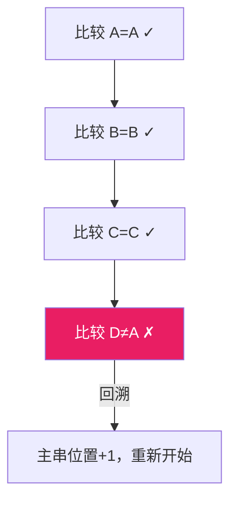
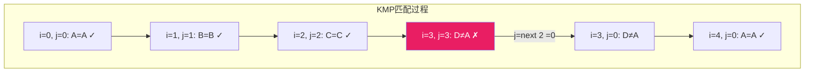
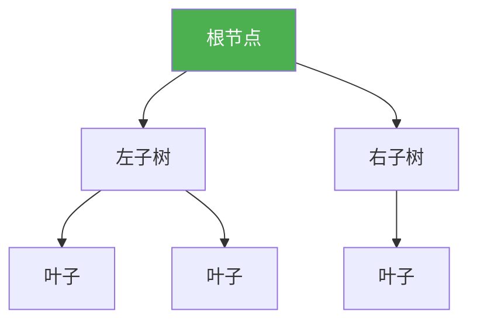

@[TOC](C语言数据结构系列：串与KMP篇)

# C语言数据结构系列（六）：串——字符串处理全攻略

> 🎯 **本篇目标**：掌握字符串的基本操作，理解KMP算法的原理与实现！

---

## 一、前言

哈喽小伙伴们！👋

字符串是我们编程中用得最多的数据结构之一！但是你真的会高效地处理字符串吗？

今天我们来学习：
- 字符串的基本概念
- **朴素模式匹配算法**
- **KMP算法**——面试必考的经典！


让我们开始今天的学习吧！ 🚀

---

## 二、串的基本概念

### 2.1 什么是串？

> **串（String）** 是由**零个或多个字符**组成的有限序列，也称为**字符串**。

```c
// C语言中的字符串
char str1[] = "Hello";
char str2[] = {'H', 'e', 'l', 'l', 'o', '\0'};  // 手动加结束符
char str3[10] = "Hello";  // 剩余位置自动补'\0'
```

### 2.2 串的存储方式

| 方式 | 说明 | 示例 |
|:----:|:----:|:----:|
| 定长数组 | 编译时确定大小 | `char str[10]` |
| 动态分配 | 运行时确定大小 | `char *str = malloc(...)` |
| 指向字符串字面量 | 指向常量区 | `char *str = "Hello"` |

### 2.3 串的基本操作

| 操作 | 说明 | 复杂度 |
|:----:|:----:|:----:|
| `strlen` | 求长度 | O(n) |
| `strcpy` | 复制 | O(n) |
| `strcat` | 连接 | O(n) |
| `strcmp` | 比较 | O(n) |
| `strstr` | 查找子串 | O(n*m) |

---

## 三、朴素模式匹配算法

### 3.1 什么是模式匹配？

> **模式匹配**：在主串（文本串）中查找模式串（子串）第一次出现的位置。

**示例：**
```
主串:    ABCABCDAB
模式串:  ABCD
结果:    位置3
```

### 3.2 朴素算法思路

> 💡 **暴力匹配**：逐个字符比较，不匹配就回溯！



### 3.3 朴素算法代码

```c
// 朴素模式匹配
int naiveSearch(char *text, char *pattern) {
    int n = strlen(text);
    int m = strlen(pattern);
    
    for (int i = 0; i <= n - m; i++) {
        int j = 0;
        while (j < m && text[i + j] == pattern[j]) {
            j++;
        }
        if (j == m) {
            return i;  // 找到了
        }
    }
    return -1;  // 未找到
}
```

### 3.4 朴素算法的问题

**最坏情况**：每次都在最后一个字符失败

```
主串:    AAAAAB
模式串:  AAAB
比较次数: O(n*m)
```

需要一种更高效的算法——**KMP**！

---

## 四、KMP算法

### 4.1 KMP的核心思想

> 💡 **KMP（Knuth-Morris-Pratt）**：利用已匹配的信息，避免不必要的回溯！

**关键**：当字符不匹配时，根据模式串本身的性质，决定主串指针如何移动。

### 4.2 next数组

`next[j]` 表示模式串 `P[0...j-1]` 中，最长相等前后缀的长度。

**什么是前后缀？**

```
字符串: ABCAB
前缀: A, AB, ABC, ABCA
后缀: B, AB, CAB, BCAB
最长相等前后缀: AB (长度2)
所以 next[4] = 2
```

### 4.3 next数组计算

```c
void computeNext(char *pattern, int *next) {
    int m = strlen(pattern);
    next[0] = 0;
    
    int len = 0;  // 当前最长前后缀长度
    int i = 1;
    
    while (i < m) {
        if (pattern[i] == pattern[len]) {
            len++;
            next[i] = len;
            i++;
        } else {
            if (len != 0) {
                len = next[len - 1];  // 回退
            } else {
                next[i] = 0;
                i++;
            }
        }
    }
}
```

### 4.4 KMP搜索算法

```c
int kmpSearch(char *text, char *pattern) {
    int n = strlen(text);
    int m = strlen(pattern);
    
    int *next = (int*)malloc(m * sizeof(int));
    computeNext(pattern, next);
    
    int i = 0;  // text指针
    int j = 0;  // pattern指针
    
    while (i < n) {
        if (text[i] == pattern[j]) {
            i++;
            j++;
        }
        
        if (j == m) {
            free(next);
            return i - j;  // 找到匹配
        } else if (i < n && text[i] != pattern[j]) {
            if (j != 0) {
                j = next[j - 1];  // 关键：不回溯i，只移动j
            } else {
                i++;
            }
        }
    }
    
    free(next);
    return -1;  // 未找到
}
```

### 4.5 KMP图解



### 4.6 next数组示例

```
模式串: A B A B C
下标:   0 1 2 3 4
next:   0 0 1 2 0
```

**计算过程：**
- `next[0] = 0`
- `i=1, B≠A, next[1] = 0`
- `i=2, A=A, next[2] = 1`
- `i=3, B=B, next[3] = 2`
- `i=4, C≠A, 回退到next[1]=0, next[4] = 0`

### 4.7 完整示例

```c
#include <stdio.h>
#include <stdlib.h>
#include <string.h>

void computeNext(char *pattern, int *next) {
    int m = strlen(pattern);
    next[0] = 0;
    int len = 0, i = 1;
    
    while (i < m) {
        if (pattern[i] == pattern[len]) {
            len++;
            next[i] = len;
            i++;
        } else if (len != 0) {
            len = next[len - 1];
        } else {
            next[i] = 0;
            i++;
        }
    }
}

int kmpSearch(char *text, char *pattern) {
    int n = strlen(text);
    int m = strlen(pattern);
    int *next = (int*)malloc(m * sizeof(int));
    
    computeNext(pattern, next);
    
    printf("next数组: ");
    for (int i = 0; i < m; i++) {
        printf("%d ", next[i]);
    }
    printf("\n");
    
    int i = 0, j = 0;
    while (i < n) {
        if (text[i] == pattern[j]) {
            i++;
            j++;
        }
        if (j == m) {
            free(next);
            return i - j;
        } else if (i < n && text[i] != pattern[j]) {
            if (j != 0) j = next[j - 1];
            else i++;
        }
    }
    
    free(next);
    return -1;
}

int main() {
    char text[] = "ABABDABACDABABCABAB";
    char pattern[] = "ABABCABAB";
    
    printf("===== KMP算法演示 =====\n\n");
    printf("主串: %s\n", text);
    printf("模式串: %s\n\n", pattern);
    
    int pos = kmpSearch(text, pattern);
    
    if (pos != -1) {
        printf("\n找到匹配！位置: %d\n", pos);
    } else {
        printf("\n未找到匹配！\n");
    }
    
    return 0;
}
```

**运行结果：**
```
===== KMP算法演示 =====

主串: ABABDABACDABABCABAB
模式串: ABABCABAB

next数组: 0 0 1 2 0 1 2 3 4

找到匹配！位置: 10
```

---

## 五、next数组优化

### 5.1 问题

有些情况下next数组还可以优化，避免多余比较。

```
模式串: AAAAB
next:   0 1 2 3 0
优化后: 0 0 0 0 0
```

### 5.2 优化代码

```c
void computeNextVal(char *pattern, int *next) {
    int m = strlen(pattern);
    next[0] = 0;
    int len = 0, i = 1;
    
    while (i < m) {
        if (pattern[i] == pattern[len]) {
            len++;
            // 优化点：如果下一位也相同，继续回退
            if (pattern[i] != pattern[len]) {
                next[i] = len;
            } else {
                next[i] = next[len - 1];
            }
            i++;
        } else if (len != 0) {
            len = next[len - 1];
        } else {
            next[i] = 0;
            i++;
        }
    }
}
```

---

## 六、其他字符串算法

### 6.1 Rabin-Karp算法

> 💡 使用**哈希值**快速比较，避免逐字符比较

```c
#define BASE 256
#define MOD 101

int rabinKarp(char *text, char *pattern) {
    int n = strlen(text), m = strlen(pattern);
    int h = 1;
    int pHash = 0, tHash = 0;
    
    // 计算 h = BASE^(m-1) % MOD
    for (int i = 0; i < m - 1; i++) {
        h = (h * BASE) % MOD;
    }
    
    // 计算初始哈希值
    for (int i = 0; i < m; i++) {
        pHash = (BASE * pHash + pattern[i]) % MOD;
        tHash = (BASE * tHash + text[i]) % MOD;
    }
    
    // 滑动窗口
    for (int i = 0; i <= n - m; i++) {
        if (pHash == tHash) {
            // 哈希值相同，逐字符验证
            int j;
            for (j = 0; j < m; j++) {
                if (text[i + j] != pattern[j]) break;
            }
            if (j == m) return i;
        }
        
        // 计算下一个窗口的哈希值
        if (i < n - m) {
            tHash = (BASE * (tHash - text[i] * h) + text[i + m]) % MOD;
            if (tHash < 0) tHash += MOD;
        }
    }
    
    return -1;
}
```

### 6.2 Boyer-Moore算法

> 💡 从右往左比较，使用坏字符和好后缀规则

```c
// 简化版BM算法
int boyerMoore(char *text, char *pattern) {
    int n = strlen(text), m = strlen(pattern);
    int badChar[256];
    
    // 预处理坏字符
    for (int i = 0; i < 256; i++) badChar[i] = -1;
    for (int i = 0; i < m; i++) {
        badChar[pattern[i]] = i;
    }
    
    int s = 0;  // 模式串移动位置
    while (s <= n - m) {
        int j = m - 1;
        
        while (j >= 0 && pattern[j] == text[s + j]) {
            j--;
        }
        
        if (j < 0) {
            return s;
            // s += (s + m < n) ? m - badChar[text[s + m]] : 1;
        } else {
            s += 1;
            // s += max(1, j - badChar[text[s + j]]);
        }
    }
    
    return -1;
}
```

### 6.3 字符串哈希

```c
// 常用字符串哈希函数
unsigned int hash1(char *str) {
    unsigned int hash = 0;
    while (*str) {
        hash = hash * 131 + (*str++);
    }
    return hash;
}

// BKDR哈希
unsigned int hash2(char *str) {
    unsigned int seed = 131;
    unsigned int hash = 0;
    while (*str) {
        hash = hash * seed + (*str++);
    }
    return hash;
}
```

---

## 七、复杂度对比

| 算法 | 预处理 | 匹配 | 空间 |
|:----:|:----:|:----:|:----:|
| 朴素算法 | 无 | O(n*m) | O(1) |
| KMP | O(m) | O(n) | O(m) |
| Rabin-Karp | O(m) | O(n)* | O(1) |
| Boyer-Moore | O(m+σ) | O(n/m)** | O(σ) |

*平均情况，最坏O(n*m)
**最好情况

---

## 八、应用场景

1. **文本搜索** 🔍
   - 查找关键词

2. **代码编辑器** 📝
   - Ctrl+F查找替换

3. **生物信息学** 🧬
   - DNA序列匹配

4. **网络安全** 🔒
   - 入侵检测、病毒扫描

5. **数据压缩** 📦
   - LZ77/LZ78算法

6. **拼写检查** ✏️
   - 编辑距离计算

---

## 九、练习题 🎯

### 🏠 基础题

**题目1：实现strStr()**

实现 `strstr()` 函数，返回子串首次出现的位置。

```c
// LeetCode 28
int strStr(char * haystack, char * needle);
```

---

**题目2：重复的子字符串**

判断字符串是否由子串重复多次构成。

```c
// 示例
"abcabc" -> true (由"abc"重复2次)
"abcabd" -> false
```

---

### 💪 进阶题

**题目3：最长公共前缀**

```c
// 示例
["flower", "flow", "flight"] -> "fl"
```

---

**题目4：字符串转换整数 (atoi)**

实现 `atoi()` 函数。

---

## 十、总结

今天我们学习了字符串处理的重要知识：

✅ **串的基本概念**：字符序列，以'\0'结尾

✅ **朴素匹配**：暴力比较，O(n*m)

✅ **KMP算法**：
- 核心：利用已匹配信息
- next数组：记录最长相等前后缀
- 时间复杂度：O(n+m)

✅ **其他算法**：Rabin-Karp、Boyer-Moore

**KMP的关键点：**
1. next数组的含义
2. 不匹配时如何移动
3. 主串指针不回溯

---

## 十一、下篇预告

下一篇我们将进入 **树** 的世界，学习 **二叉树** 的概念和存储！



树是数据结构中最重要的内容之一，让我们拭目以待！ 🚀

---

> 💡 **学习建议**：KMP算法需要反复理解，建议手写一遍next数组的计算过程！

**觉得有帮助就点赞+收藏+关注吧！** 👍

有问题欢迎在评论区留言～ 💬
