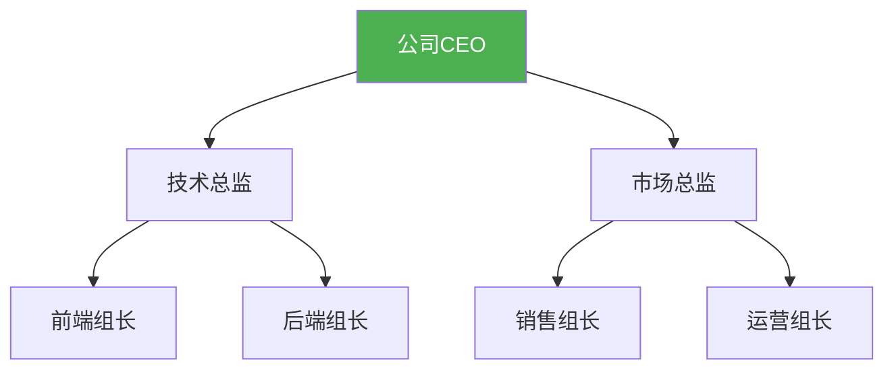
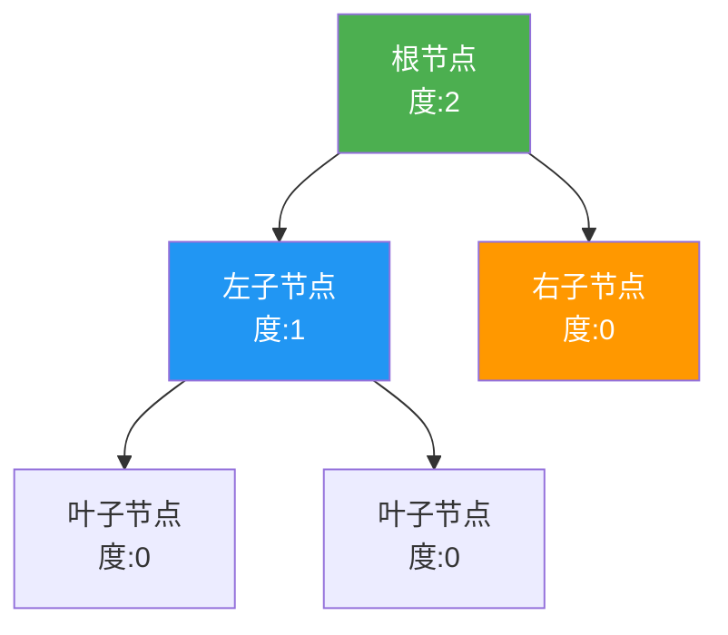
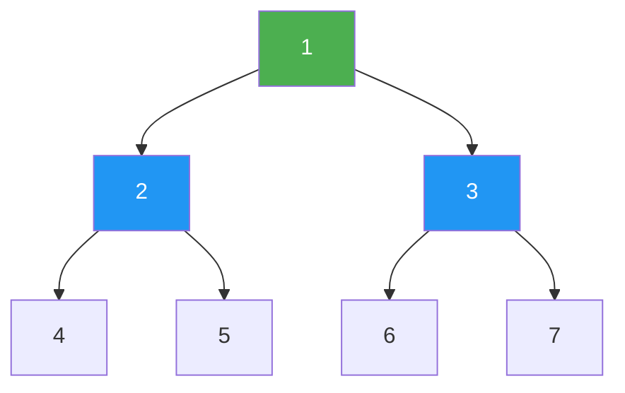
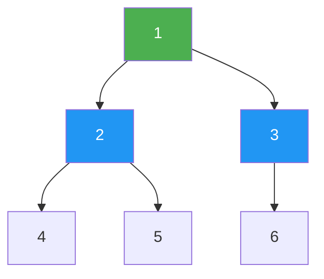
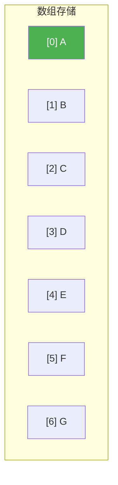
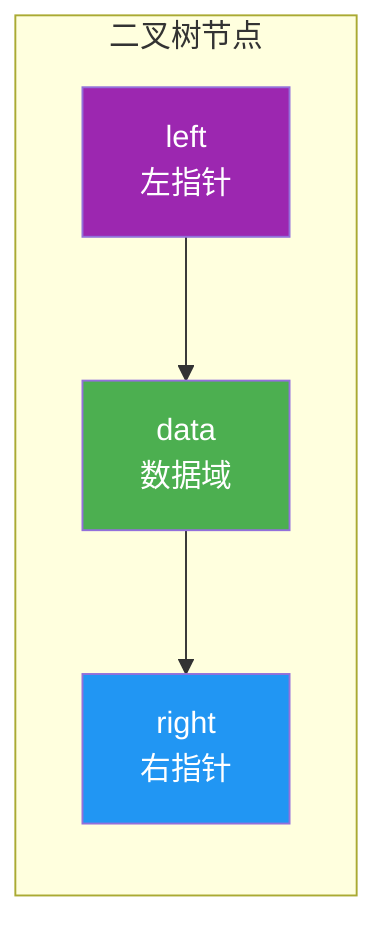
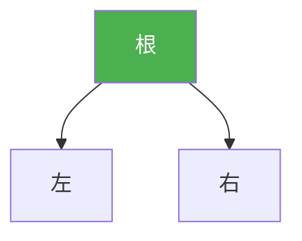

@[TOC](C语言数据结构系列：二叉树篇)

# C语言数据结构系列（七）：二叉树入门——概念与存储

> 🎯 **本篇目标**：理解二叉树的概念、性质，掌握二叉树的两种存储方式！

---

## 一、前言

哈喽小伙伴们！👋

今天我们进入**树**的世界！树是一种非常重要的非线性数据结构，而**二叉树**是最基础也最常见的树。

为什么树这么重要？因为现实世界中很多东西都是"树形"的：
- 📂 文件系统
- 🏢 公司组织架构
- 🌳 家族族谱
- 🌐 DOM树



让我们开始今天的学习吧！ 🚀

---

## 二、树的基本概念

### 2.1 什么是树？

> **树（Tree）** 是由 `n` 个节点组成的**有限集合**，它有一个**根节点**，其余节点分成若干个互不相交的子集（子树）。

关键特点：
- 🌲 **根节点（Root）**：没有父节点的节点
- 🌿 **叶子节点（Leaf）**：没有子节点的节点
- 🔗 **边（Edge）**：连接节点的线
- 📏 **层次（Level）**：根为第0层（或第1层）

### 2.2 树的术语

| 术语 | 说明 | 示例 |
|:----:|:----:|:----:|
| 节点的度 | 子节点个数 | CEO的度为2 |
| 树的度 | 所有节点度的最大值 | 这棵树度为2 |
| 深度/高度 | 最大层次数 | 深度为3 |
| 子树 | 节点及其后代 | 技术总监的子树 |
| 兄弟 | 同父节点 | 前端和后端是兄弟 |

### 2.3 二叉树的定义

> **二叉树（Binary Tree）** 是每个节点**最多有两个子节点**的树结构。



**二叉树的特点：**
- 每个节点最多有两个孩子（左孩子、右孩子）
- 有左右之分（有序树）
- 可以是空树

---

## 三、特殊的二叉树

### 3.1 满二叉树

> **满二叉树**：除叶子节点外，每个节点都有两个孩子。



**性质：**
- 深度为k的满二叉树有 `2^k - 1` 个节点
- 第i层有 `2^(i-1)` 个节点

### 3.2 完全二叉树

> **完全二叉树**：除最后一层外，其余层都是满的，最后一层从左到右连续。



### 3.3 二叉排序树

> **二叉排序树（BST）**：左子树所有节点值 < 根节点值 < 右子树所有节点值

### 3.4 平衡二叉树

> **平衡二叉树（AVL）**：任何节点的左右子树高度差不超过1

---

## 四、二叉树的性质

### 4.1 重要性质

1. **第i层最多有** `2^(i-1)` **个节点**（i≥1）

2. **深度为k的二叉树最多有** `2^k - 1` **个节点**

3. **叶子节点数 = 度为2的节点数 + 1**
   $$n_0 = n_2 + 1$$

4. **完全二叉树的节点编号规则**
   - 父节点：`i`
   - 左孩子：`2i`
   - 右孩子：`2i + 1`
   - 父节点：`i/2`（向下取整）

### 4.2 性质3的证明

```
设 n0 = 叶子节点数（度为0）
    n1 = 度为1的节点数
    n2 = 度为2的节点数
    
总节点数：n = n0 + n1 + n2

边数 = 总节点数 - 1（除根外每个节点有一条边）
     = n1 + 2*n2

所以：n0 + n1 + n2 - 1 = n1 + 2*n2
     => n0 = n2 + 1
```

---

## 五、二叉树的存储方式

### 5.1 顺序存储（数组）

> 💡 适用于**完全二叉树**，用数组下标表示节点关系

```c
#define MAX_SIZE 100

typedef struct {
    char data[MAX_SIZE];
    int size;
} SeqTree;
```

**存储规则：**
```
节点i的左孩子：2*i + 1
节点i的右孩子：2*i + 2
节点i的父节点：(i-1) / 2
```

**图解：**



```
树结构：
      A
     / \
    B   C
   / \ / \
  D  E F  G

数组：[A, B, C, D, E, F, G]
下标： 0  1  2  3  4  5  6
```

**缺点**：非完全二叉树会浪费空间！

### 5.2 链式存储（指针）

> 💡 最常用的方式，适合所有二叉树

```c
// 二叉树节点结构体
typedef struct TreeNode {
    char data;
    struct TreeNode *left;
    struct TreeNode *right;
} TreeNode;
```

**节点结构：**



### 5.3 两种存储方式对比

| 特性 | 顺序存储 | 链式存储 |
|:----:|:----:|:----:|
| 空间 | 可能浪费 | 按需分配 |
| 适用 | 完全二叉树 | 所有二叉树 |
| 访问孩子 | O(1) 下标计算 | O(1) 指针访问 |
| 灵活性 | 低 | 高 |

---

## 六、创建二叉树

### 6.1 递归创建

```c
#include <stdio.h>
#include <stdlib.h>

typedef struct TreeNode {
    char data;
    struct TreeNode *left;
    struct TreeNode *right;
} TreeNode;

// 创建新节点
TreeNode* createNode(char data) {
    TreeNode *node = (TreeNode*)malloc(sizeof(TreeNode));
    node->data = data;
    node->left = NULL;
    node->right = NULL;
    return node;
}

// 手动构建二叉树
TreeNode* buildTree() {
    TreeNode *A = createNode('A');
    TreeNode *B = createNode('B');
    TreeNode *C = createNode('C');
    TreeNode *D = createNode('D');
    TreeNode *E = createNode('E');
    TreeNode *F = createNode('F');
    TreeNode *G = createNode('G');
    
    A->left = B;
    A->right = C;
    B->left = D;
    B->right = E;
    C->left = F;
    C->right = G;
    
    return A;
}
```

### 6.2 前序遍历创建

```c
// 前序遍历创建二叉树（输入格式：ABDE##F##CG###）
TreeNode* createByPreorder(char *str, int *index) {
    if (str[*index] == '#' || str[*index] == '\0') {
        (*index)++;
        return NULL;
    }
    
    TreeNode *node = createNode(str[*index]);
    (*index)++;
    
    node->left = createByPreorder(str, index);
    node->right = createByPreorder(str, index);
    
    return node;
}
```

### 6.3 完整示例

```c
#include <stdio.h>
#include <stdlib.h>

typedef struct TreeNode {
    char data;
    struct TreeNode *left;
    struct TreeNode *right;
} TreeNode;

TreeNode* createNode(char data) {
    TreeNode *node = (TreeNode*)malloc(sizeof(TreeNode));
    node->data = data;
    node->left = NULL;
    node->right = NULL;
    return node;
}

TreeNode* buildTree() {
    TreeNode *A = createNode('A');
    TreeNode *B = createNode('B');
    TreeNode *C = createNode('C');
    TreeNode *D = createNode('D');
    TreeNode *E = createNode('E');
    TreeNode *F = createNode('F');
    TreeNode *G = createNode('G');
    
    A->left = B;
    A->right = C;
    B->left = D;
    B->right = E;
    C->left = F;
    C->right = G;
    
    return A;
}

void preOrder(TreeNode *root) {
    if (root == NULL) return;
    printf("%c ", root->data);
    preOrder(root->left);
    preOrder(root->right);
}

void inOrder(TreeNode *root) {
    if (root == NULL) return;
    inOrder(root->left);
    printf("%c ", root->data);
    inOrder(root->right);
}

void postOrder(TreeNode *root) {
    if (root == NULL) return;
    postOrder(root->left);
    postOrder(root->right);
    printf("%c ", root->data);
}

int treeHeight(TreeNode *root) {
    if (root == NULL) return 0;
    int left = treeHeight(root->left);
    int right = treeHeight(root->right);
    return (left > right ? left : right) + 1;
}

int nodeCount(TreeNode *root) {
    if (root == NULL) return 0;
    return 1 + nodeCount(root->left) + nodeCount(root->right);
}

void freeTree(TreeNode *root) {
    if (root == NULL) return;
    freeTree(root->left);
    freeTree(root->right);
    free(root);
}

int main() {
    TreeNode *root = buildTree();
    
    printf("===== 二叉树操作演示 =====\n\n");
    printf("树结构:\n");
    printf("      A\n");
    printf("     / \\\n");
    printf("    B   C\n");
    printf("   / \\ / \\\n");
    printf("  D  E F  G\n\n");
    
    printf("前序遍历: ");
    preOrder(root);
    printf("\n");
    
    printf("中序遍历: ");
    inOrder(root);
    printf("\n");
    
    printf("后序遍历: ");
    postOrder(root);
    printf("\n");
    
    printf("\n树的高度: %d\n", treeHeight(root));
    printf("节点个数: %d\n", nodeCount(root));
    
    freeTree(root);
    return 0;
}
```

**运行结果：**
```
===== 二叉树操作演示 =====

树结构:
      A
     / \
    B   C
   / \ / \
  D  E F  G

前序遍历: A B D E C F G
中序遍历: D B E A F C G
后序遍历: D E B F G C A

树的高度: 3
节点个数: 7
```

---

## 七、二叉树的遍历（预告）

| 遍历方式 | 顺序 | 记忆口诀 |
|:----:|:----:|:----:|
| 前序 | 根→左→右 | 根左右 |
| 中序 | 左→根→右 | 左根右 |
| 后序 | 左→右→根 | 左右根 |
| 层序 | 逐层从左到右 | BFS |

**下一篇将详细讲解各种遍历！**

---

## 八、复杂度分析

| 操作 | 顺序存储 | 链式存储 |
|:----:|:----:|:----:|
| 创建 | O(n) | O(n) |
| 遍历 | O(n) | O(n) |
| 查找 | O(n) | O(n) |
| 空间 | O(2^h)* | O(n) |

*h为树的高度，最坏情况

---

## 九、应用场景

1. **文件系统** 📂
   - 目录结构

2. **数据库索引** 🗃️
   - B树、B+树

3. **编译器** ⚙️
   - 语法树

4. **哈夫曼编码** 📊
   - 数据压缩

5. **堆** 📈
   - 优先队列

6. **二叉搜索树** 🔍
   - 高效查找

---

## 十、练习题 🎯

### 🏠 基础题

**题目1：计算二叉树节点数**

```c
int countNodes(TreeNode* root);
```

---

**题目2：判断是否对称**

判断二叉树是否是自身镜像。

---

### 💪 进阶题

**题目3：从前序和中序遍历构建二叉树**

```c
// 示例
前序: [3,9,20,15,7]
中序: [9,3,15,20,7]
```

---

**题目4：最大深度**

```c
// LeetCode 104
int maxDepth(TreeNode* root);
```

---

## 十一、总结

今天我们学习了二叉树的基础知识：

✅ **树的概念**：节点的有限集合，有层次结构

✅ **二叉树**：每个节点最多两个孩子

✅ **特殊二叉树**：满二叉树、完全二叉树、BST、AVL

✅ **重要性质**：n0 = n2 + 1

✅ **存储方式**：
- 顺序存储（数组）：适合完全二叉树
- 链式存储（指针）：最常用

✅ **节点编号**：父i，左2i，右2i+1

**记住：**
- 二叉树是树的基础
- 链式存储最常用
- 递归是处理树的利器

---

## 十二、下篇预告

下一篇我们将深入学习 **二叉树的四种遍历方式**！



前序、中序、后序、层序，每种遍历都有什么用？让我们拭目以待！ 🚀

---

> 💡 **学习建议**：画图理解遍历顺序，手动模拟递归过程！

**觉得有帮助就点赞+收藏+关注吧！** 👍

有问题欢迎在评论区留言～ 💬
