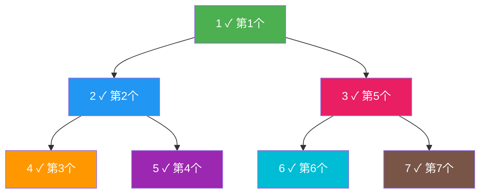
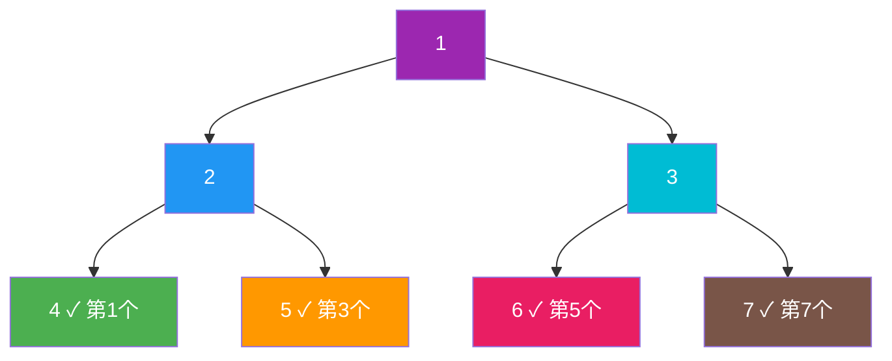
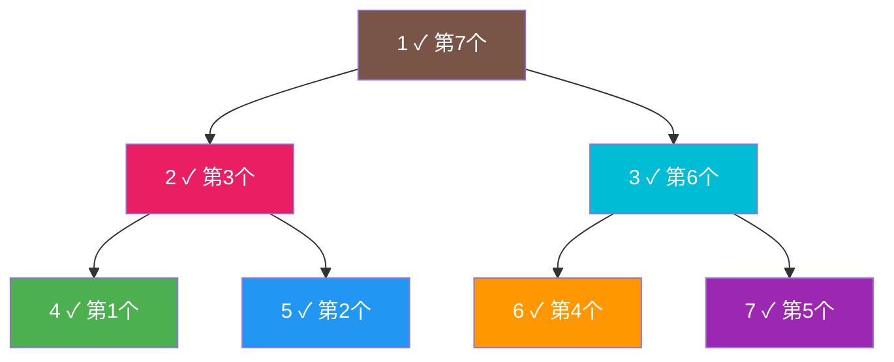
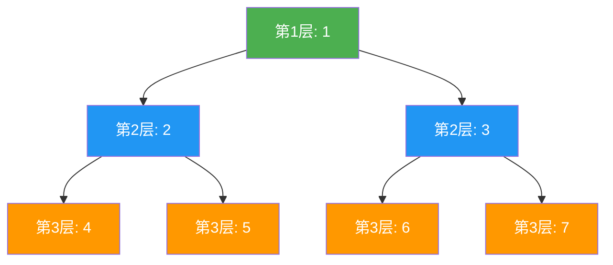
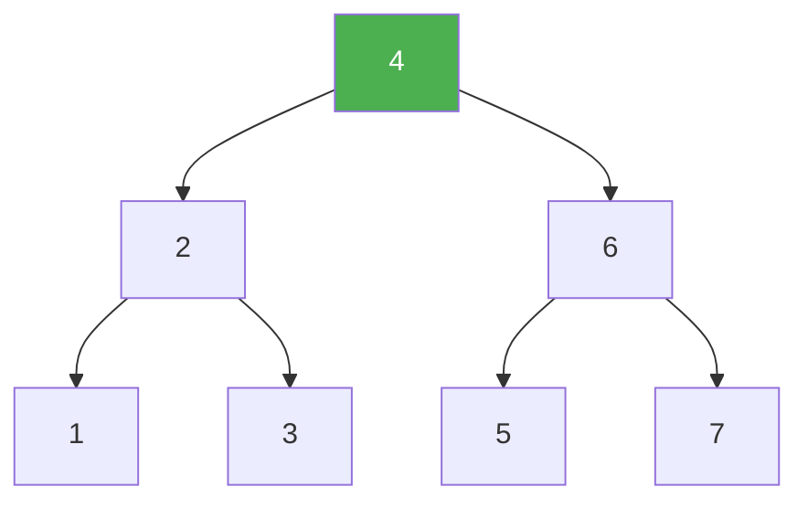

@[TOC](C语言数据结构系列：二叉树遍历篇)

# C语言数据结构系列（八）：二叉树遍历——四种方式详解

> 🎯 **本篇目标**：深入理解二叉树的四种遍历方式，学会根据遍历序列构建二叉树！

---

## 一、前言

哈喽小伙伴们！👋

上一篇我们学习了二叉树的基本概念，今天我们来深入学习**遍历**！

遍历就是"把所有节点都访问一遍"，但是访问的顺序不同，就会产生不同的遍历结果。


让我们开始今天的学习吧！ 🚀

---

## 二、前序遍历

### 2.1 定义

> **前序遍历（Pre-order）**：**根 → 左 → 右**
> 
> 先访问根节点，再递归左子树，最后递归右子树

### 2.2 图解



### 2.3 代码实现

```c
void preOrder(TreeNode *root) {
    if (root == NULL) return;
    
    printf("%c ", root->data);  // 访问根
    preOrder(root->left);        // 遍历左
    preOrder(root->right);       // 遍历右
}
```

### 2.4 非递归实现（栈）

```c
void preOrderIterative(TreeNode *root) {
    if (root == NULL) return;
    
    Stack s;
    initStack(&s);
    push(&s, root);
    
    while (!isEmpty(&s)) {
        TreeNode *node;
        pop(&s, (int*)&node);
        printf("%c ", node->data);
        
        if (node->right) push(&s, node->right);
        if (node->left) push(&s, node->left);
    }
}
```

### 2.5 遍历序列

```
树结构：
      1
     / \
    2   3
   / \ / \
  4  5 6  7

前序遍历: 1 2 4 5 3 6 7
```

---

## 三、中序遍历

### 3.1 定义

> **中序遍历（In-order）**：**左 → 根 → 右**
> 
> 先递归左子树，再访问根节点，最后递归右子树

### 3.2 图解



### 3.3 代码实现

```c
void inOrder(TreeNode *root) {
    if (root == NULL) return;
    
    inOrder(root->left);         // 遍历左
    printf("%c ", root->data);   // 访问根
    inOrder(root->right);        // 遍历右
}
```

### 3.4 非递归实现（栈）

```c
void inOrderIterative(TreeNode *root) {
    Stack s;
    initStack(&s);
    TreeNode *current = root;
    
    while (current != NULL || !isEmpty(&s)) {
        while (current != NULL) {
            push(&s, current);
            current = current->left;
        }
        
        TreeNode *node;
        pop(&s, (int*)&node);
        printf("%c ", node->data);
        
        current = node->right;
    }
}
```

### 3.5 重要性质

> 💡 **二叉搜索树的中序遍历结果是有序的！**

```
BST：
      4
     / \
    2   6
   / \ / \
  1  3 5  7

中序遍历: 1 2 3 4 5 6 7  (升序！)
```

### 3.6 遍历序列

```
树结构：
      1
     / \
    2   3
   / \ / \
  4  5 6  7

中序遍历: 4 2 5 1 6 3 7
```

---

## 四、后序遍历

### 4.1 定义

> **后序遍历（Post-order）**：**左 → 右 → 根**
> 
> 先递归左子树，再递归右子树，最后访问根节点

### 4.2 图解



### 4.3 代码实现

```c
void postOrder(TreeNode *root) {
    if (root == NULL) return;
    
    postOrder(root->left);       // 遍历左
    postOrder(root->right);      // 遍历右
    printf("%c ", root->data);   // 访问根
}
```

### 4.4 非递归实现（双栈）

```c
void postOrderIterative(TreeNode *root) {
    if (root == NULL) return;
    
    Stack s1, s2;
    initStack(&s1);
    initStack(&s2);
    push(&s1, root);
    
    while (!isEmpty(&s1)) {
        TreeNode *node;
        pop(&s1, (int*)&node);
        push(&s2, node);
        
        if (node->left) push(&s1, node->left);
        if (node->right) push(&s1, node->right);
    }
    
    while (!isEmpty(&s2)) {
        TreeNode *node;
        pop(&s2, (int*)&node);
        printf("%c ", node->data);
    }
}
```

### 4.5 应用场景

- **删除二叉树**：先删孩子再删根
- **计算目录大小**：先算子目录再算父目录
- **表达式求值**：后缀表达式

### 4.6 遍历序列

```
树结构：
      1
     / \
    2   3
   / \ / \
  4  5 6  7

后序遍历: 4 5 2 6 7 3 1
```

---

## 五、层序遍历

### 5.1 定义

> **层序遍历（Level-order）**：按层从上到下，每层从左到右访问
> 
> 使用**队列**实现（BFS）

### 5.2 图解



### 5.3 代码实现（队列）

```c
void levelOrder(TreeNode *root) {
    if (root == NULL) return;
    
    Queue q;
    initQueue(&q);
    enqueue(&q, root);
    
    while (!isEmpty(&q)) {
        TreeNode *node;
        dequeue(&q, (int*)&node);
        printf("%c ", node->data);
        
        if (node->left) enqueue(&q, node->left);
        if (node->right) enqueue(&q, node->right);
    }
}
```

### 5.4 分层打印

```c
void levelOrderPrint(TreeNode *root) {
    if (root == NULL) return;
    
    Queue q;
    initQueue(&q);
    enqueue(&q, root);
    
    int level = 1;
    while (!isEmpty(&q)) {
        printf("第%d层: ", level);
        int size = q.size;  // 当前层的节点数
        
        for (int i = 0; i < size; i++) {
            TreeNode *node;
            dequeue(&q, (int*)&node);
            printf("%c ", node->data);
            
            if (node->left) enqueue(&q, node->left);
            if (node->right) enqueue(&q, node->right);
        }
        printf("\n");
        level++;
    }
}
```

### 5.5 遍历序列

```
树结构：
      1
     / \
    2   3
   / \ / \
  4  5 6  7

层序遍历: 1 2 3 4 5 6 7
```

---

## 六、根据遍历序列构建二叉树

### 6.1 前序 + 中序

> 💡 **思路**：前序第一个是根，在中序中找到根的位置，划分左右子树

```c
TreeNode* buildTree(int *preorder, int *inorder, int preStart, int preEnd, 
                    int inStart, int inEnd) {
    if (preStart > preEnd) return NULL;
    
    // 前序第一个是根
    int rootVal = preorder[preStart];
    TreeNode *root = createNode(rootVal);
    
    // 在中序中找到根的位置
    int rootIndex;
    for (rootIndex = inStart; rootIndex <= inEnd; rootIndex++) {
        if (inorder[rootIndex] == rootVal) break;
    }
    
    // 左子树节点数
    int leftSize = rootIndex - inStart;
    
    // 递归构建
    root->left = buildTree(preorder, inorder, 
                           preStart + 1, preStart + leftSize,
                           inStart, rootIndex - 1);
    root->right = buildTree(preorder, inorder,
                            preStart + leftSize + 1, preEnd,
                            rootIndex + 1, inEnd);
    
    return root;
}
```

### 6.2 后序 + 中序

> 💡 **思路**：后序最后一个是根

```c
TreeNode* buildTree(int *postorder, int *inorder, int postStart, int postEnd,
                    int inStart, int inEnd) {
    if (postStart > postEnd) return NULL;
    
    int rootVal = postorder[postEnd];
    TreeNode *root = createNode(rootVal);
    
    int rootIndex;
    for (rootIndex = inStart; rootIndex <= inEnd; rootIndex++) {
        if (inorder[rootIndex] == rootVal) break;
    }
    
    int leftSize = rootIndex - inStart;
    
    root->left = buildTree(postorder, inorder,
                           postStart, postStart + leftSize - 1,
                           inStart, rootIndex - 1);
    root->right = buildTree(postorder, inorder,
                            postStart + leftSize, postEnd - 1,
                            rootIndex + 1, inEnd);
    
    return root;
}
```

### 6.3 示例

```
前序: [1, 2, 4, 5, 3, 6, 7]
中序: [4, 2, 5, 1, 6, 3, 7]

构建过程：
1. 前序第一个1是根
2. 中序中1的位置是3，左边[4,2,5]是左子树，右边[6,3,7]是右子树
3. 递归处理左子树和右子树
```

---

## 七、完整示例代码

```c
#include <stdio.h>
#include <stdlib.h>

#define MAX_SIZE 100

typedef struct TreeNode {
    char data;
    struct TreeNode *left;
    struct TreeNode *right;
} TreeNode;

// 栈
typedef struct {
    TreeNode *data[MAX_SIZE];
    int top;
} Stack;

void initStack(Stack *s) { s->top = -1; }
int isEmpty(Stack *s) { return s->top == -1; }
void push(Stack *s, TreeNode *node) { s->data[++s->top] = node; }
TreeNode* pop(Stack *s) { return s->data[s->top--]; }

// 队列
typedef struct {
    TreeNode *data[MAX_SIZE];
    int front, rear;
} Queue;

void initQueue(Queue *q) { q->front = 0; q->rear = 0; }
int isEmpty(Queue *q) { return q->front == q->rear; }
void enqueue(Queue *q, TreeNode *node) { q->data[q->rear++] = node; }
TreeNode* dequeue(Queue *q) { return q->data[q->front++]; }

// 创建节点
TreeNode* createNode(char data) {
    TreeNode *node = (TreeNode*)malloc(sizeof(TreeNode));
    node->data = data;
    node->left = NULL;
    node->right = NULL;
    return node;
}

// 构建二叉树
TreeNode* buildTree() {
    TreeNode *A = createNode('A');
    TreeNode *B = createNode('B');
    TreeNode *C = createNode('C');
    TreeNode *D = createNode('D');
    TreeNode *E = createNode('E');
    TreeNode *F = createNode('F');
    TreeNode *G = createNode('G');
    
    A->left = B; A->right = C;
    B->left = D; B->right = E;
    C->left = F; C->right = G;
    
    return A;
}

// 前序遍历（递归）
void preOrder(TreeNode *root) {
    if (root == NULL) return;
    printf("%c ", root->data);
    preOrder(root->left);
    preOrder(root->right);
}

// 中序遍历（递归）
void inOrder(TreeNode *root) {
    if (root == NULL) return;
    inOrder(root->left);
    printf("%c ", root->data);
    inOrder(root->right);
}

// 后序遍历（递归）
void postOrder(TreeNode *root) {
    if (root == NULL) return;
    postOrder(root->left);
    postOrder(root->right);
    printf("%c ", root->data);
}

// 层序遍历（队列）
void levelOrder(TreeNode *root) {
    if (root == NULL) return;
    Queue q;
    initQueue(&q);
    enqueue(&q, root);
    
    while (!isEmpty(&q)) {
        TreeNode *node = dequeue(&q);
        printf("%c ", node->data);
        if (node->left) enqueue(&q, node->left);
        if (node->right) enqueue(&q, node->right);
    }
}

// 非递归前序
void preOrderIterative(TreeNode *root) {
    Stack s;
    initStack(&s);
    push(&s, root);
    
    while (!isEmpty(&s)) {
        TreeNode *node = pop(&s);
        printf("%c ", node->data);
        if (node->right) push(&s, node->right);
        if (node->left) push(&s, node->left);
    }
}

// 非递归中序
void inOrderIterative(TreeNode *root) {
    Stack s;
    initStack(&s);
    TreeNode *current = root;
    
    while (current || !isEmpty(&s)) {
        while (current) {
            push(&s, current);
            current = current->left;
        }
        TreeNode *node = pop(&s);
        printf("%c ", node->data);
        current = node->right;
    }
}

int main() {
    TreeNode *root = buildTree();
    
    printf("===== 二叉树遍历演示 =====\n\n");
    printf("树结构:\n");
    printf("      A\n");
    printf("     / \\\n");
    printf("    B   C\n");
    printf("   / \\ / \\\n");
    printf("  D  E F  G\n\n");
    
    printf("前序遍历(递归): ");
    preOrder(root);
    printf("\n");
    
    printf("前序遍历(栈):   ");
    preOrderIterative(root);
    printf("\n\n");
    
    printf("中序遍历(递归): ");
    inOrder(root);
    printf("\n");
    
    printf("中序遍历(栈):   ");
    inOrderIterative(root);
    printf("\n\n");
    
    printf("后序遍历(递归): ");
    postOrder(root);
    printf("\n\n");
    
    printf("层序遍历(队列): ");
    levelOrder(root);
    printf("\n");
    
    return 0;
}
```

---

## 八、遍历总结

| 遍历方式 | 顺序 | 用途 |
|:----:|:----:|:----:|
| 前序 | 根→左→右 | 复制二叉树、前缀表达式 |
| 中序 | 左→根→右 | BST有序输出 |
| 后序 | 左→右→根 | 删除树、后缀表达式 |
| 层序 | 逐层BFS | 最短路径、层序处理 |

**如何记忆：**
- 前序：**根**在前
- 中序：**根**在中
- 后序：**根**在后

---

## 九、练习题 🎯

### 🏠 基础题

**题目1：前序遍历求叶子数**

```c
int countLeaves(TreeNode *root) {
    if (root == NULL) return 0;
    if (root->left == NULL && root->right == NULL) return 1;
    return countLeaves(root->left) + countLeaves(root->right);
}
```

---

**题目2：交换二叉树的左右子树**

```c
void mirror(TreeNode *root) {
    if (root == NULL) return;
    TreeNode *temp = root->left;
    root->left = root->right;
    root->right = temp;
    mirror(root->left);
    mirror(root->right);
}
```

---

### 💪 进阶题

**题目3：从前序和中序构建二叉树**

LeetCode 105

---

**题目4：验证二叉搜索树**

LeetCode 98

---

## 十、总结

今天我们深入学习了二叉树的四种遍历：

✅ **前序遍历**：根→左→右，用于复制树

✅ **中序遍历**：左→根→右，BST有序输出

✅ **后序遍历**：左→右→根，用于删除树

✅ **层序遍历**：BFS，使用队列

✅ **构建二叉树**：前序+中序 或 后序+中序

**关键点：**
- 递归实现简洁
- 非递归需要栈/队列
- 中序遍历BST是有序的
- 遍历序列不能唯一确定二叉树（需要两个遍历）

---

## 十一、下篇预告

下一篇我们将学习 **二叉搜索树（BST）**——高效的查找数据结构！



BST让查找效率提升到O(logn)，让我们拭目以待！ 🚀

---

> 💡 **学习建议**：遍历是树的基础，一定要熟练掌握！

**觉得有帮助就点赞+收藏+关注吧！** 👍

有问题欢迎在评论区留言～ 💬
