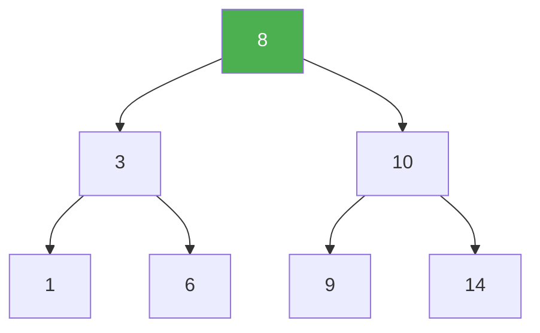
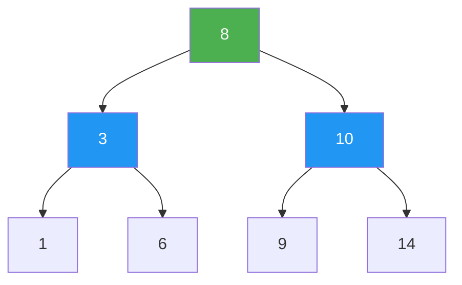
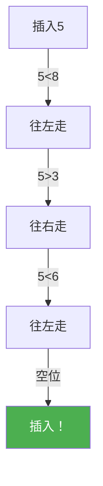
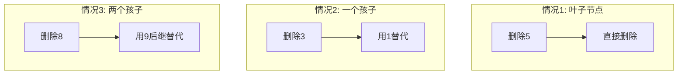
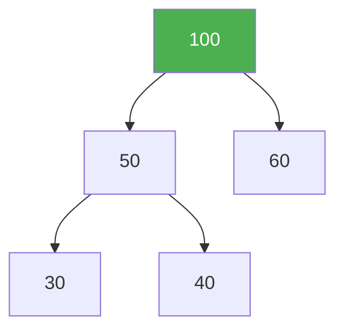

@[TOC](C语言数据结构系列：二叉搜索树篇)

# C语言数据结构系列（九）：二叉搜索树——高效查找

> 🎯 **本篇目标**：理解二叉搜索树的性质，掌握增删改查操作，分析时间复杂度！

---

## 一、前言

哈喽小伙伴们！👋

上一篇我们学习了二叉树的遍历，今天我们来学习一个非常实用的数据结构——**二叉搜索树（BST）**！

还记得数组和链表的查找吗？都是O(n)！而BST可以做到**O(logn)**！



让我们开始今天的学习吧！ 🚀

---

## 二、BST的基本概念

### 2.1 什么是二叉搜索树？

> **二叉搜索树（Binary Search Tree）**：对于树中任意节点，其**左子树所有节点值 < 节点值 < 右子树所有节点值**。

关键特点：
- 🔍 左子树所有节点 < 根节点
- 🔍 右子树所有节点 > 根节点
- 🎯 中序遍历结果是**有序**的

### 2.2 BST vs 普通二叉树

| 特性 | 普通二叉树 | BST |
|:----:|:----:|:----:|
| 节点顺序 | 无要求 | 左<根<右 |
| 查找 | O(n) | O(logn) |
| 中序遍历 | 无序 | 有序 |

### 2.3 BST的图解



```
中序遍历: 1 3 6 8 9 10 14  (有序！)
```

---

## 三、BST的结构定义

```c
// BST节点结构体
typedef struct BSTNode {
    int data;
    struct BSTNode *left;
    struct BSTNode *right;
} BSTNode;

// 创建新节点
BSTNode* createNode(int value) {
    BSTNode *node = (BSTNode*)malloc(sizeof(BSTNode));
    node->data = value;
    node->left = NULL;
    node->right = NULL;
    return node;
}
```

---

## 四、BST的基本操作

### 4.1 插入操作

> 💡 **思路**：从根开始比较，小于往左走，大于往右走



**代码实现：**

```c
BSTNode* insert(BSTNode *root, int value) {
    if (root == NULL) {
        return createNode(value);
    }
    
    if (value < root->data) {
        root->left = insert(root->left, value);
    } else if (value > root->data) {
        root->right = insert(root->right, value);
    }
    // 如果value == root->data，不重复插入
    
    return root;
}
```

**非递归版本：**

```c
void insertIterative(BSTNode **root, int value) {
    BSTNode *newNode = createNode(value);
    
    if (*root == NULL) {
        *root = newNode;
        return;
    }
    
    BSTNode *current = *root;
    BSTNode *parent = NULL;
    
    while (current != NULL) {
        parent = current;
        if (value < current->data) {
            current = current->left;
        } else if (value > current->data) {
            current = current->right;
        } else {
            free(newNode);
            return;
        }
    }
    
    if (value < parent->data) {
        parent->left = newNode;
    } else {
        parent->right = newNode;
    }
}
```

### 4.2 查找操作

> 💡 **思路**：和插入一样，比较后决定往左还是往右

```c
BSTNode* search(BSTNode *root, int value) {
    if (root == NULL || root->data == value) {
        return root;
    }
    
    if (value < root->data) {
        return search(root->left, value);
    } else {
        return search(root->right, value);
    }
}
```

**非递归版本：**

```c
BSTNode* searchIterative(BSTNode *root, int value) {
    while (root != NULL && root->data != value) {
        if (value < root->data) {
            root = root->left;
        } else {
            root = root->right;
        }
    }
    return root;
}
```

### 4.3 查找最小值

```c
BSTNode* findMin(BSTNode *root) {
    if (root == NULL) return NULL;
    
    while (root->left != NULL) {
        root = root->left;
    }
    return root;
}
```

### 4.4 查找最大值

```c
BSTNode* findMax(BSTNode *root) {
    if (root == NULL) return NULL;
    
    while (root->right != NULL) {
        root = root->right;
    }
    return root;
}
```

### 4.5 删除操作（最复杂！）

> 💡 **三种情况**：
> 1. 叶子节点：直接删除
> 2. 只有一个孩子：用孩子替代
> 3. 有两个孩子：用后继（或前驱）替代

**图解三种情况：**



**代码实现：**

```c
BSTNode* delete(BSTNode *root, int value) {
    if (root == NULL) return NULL;
    
    if (value < root->data) {
        root->left = delete(root->left, value);
    } else if (value > root->data) {
        root->right = delete(root->right, value);
    } else {
        // 找到要删除的节点
        
        // 情况1: 叶子节点
        if (root->left == NULL && root->right == NULL) {
            free(root);
            return NULL;
        }
        
        // 情况2: 只有一个孩子
        if (root->left == NULL) {
            BSTNode *temp = root->right;
            free(root);
            return temp;
        }
        if (root->right == NULL) {
            BSTNode *temp = root->left;
            free(root);
            return temp;
        }
        
        // 情况3: 有两个孩子
        // 找后继（右子树的最小值）
        BSTNode *successor = findMin(root->right);
        root->data = successor->data;
        root->right = delete(root->right, successor->data);
    }
    
    return root;
}
```

---

## 五、完整示例代码

```c
#include <stdio.h>
#include <stdlib.h>

typedef struct BSTNode {
    int data;
    struct BSTNode *left;
    struct BSTNode *right;
} BSTNode;

BSTNode* createNode(int value) {
    BSTNode *node = (BSTNode*)malloc(sizeof(BSTNode));
    node->data = value;
    node->left = NULL;
    node->right = NULL;
    return node;
}

BSTNode* insert(BSTNode *root, int value) {
    if (root == NULL) return createNode(value);
    if (value < root->data)
        root->left = insert(root->left, value);
    else if (value > root->data)
        root->right = insert(root->right, value);
    return root;
}

BSTNode* search(BSTNode *root, int value) {
    if (root == NULL || root->data == value) return root;
    if (value < root->data) return search(root->left, value);
    return search(root->right, value);
}

BSTNode* findMin(BSTNode *root) {
    while (root->left) root = root->left;
    return root;
}

BSTNode* delete(BSTNode *root, int value) {
    if (root == NULL) return NULL;
    
    if (value < root->data)
        root->left = delete(root->left, value);
    else if (value > root->data)
        root->right = delete(root->right, value);
    else {
        if (root->left == NULL) {
            BSTNode *temp = root->right;
            free(root);
            return temp;
        }
        if (root->right == NULL) {
            BSTNode *temp = root->left;
            free(root);
            return temp;
        }
        BSTNode *successor = findMin(root->right);
        root->data = successor->data;
        root->right = delete(root->right, successor->data);
    }
    return root;
}

void inOrder(BSTNode *root) {
    if (root == NULL) return;
    inOrder(root->left);
    printf("%d ", root->data);
    inOrder(root->right);
}

void freeTree(BSTNode *root) {
    if (root == NULL) return;
    freeTree(root->left);
    freeTree(root->right);
    free(root);
}

int main() {
    BSTNode *root = NULL;
    
    printf("===== BST操作演示 =====\n\n");
    
    // 插入
    int values[] = {8, 3, 10, 1, 6, 14, 4, 7, 13};
    int n = sizeof(values) / sizeof(values[0]);
    
    printf("插入元素: ");
    for (int i = 0; i < n; i++) {
        printf("%d ", values[i]);
        root = insert(root, values[i]);
    }
    printf("\n");
    
    printf("中序遍历: ");
    inOrder(root);
    printf("\n\n");
    
    // 查找
    int target = 6;
    BSTNode *found = search(root, target);
    if (found)
        printf("找到 %d\n", target);
    else
        printf("未找到 %d\n", target);
    
    // 最小值
    BSTNode *minNode = findMin(root);
    printf("最小值: %d\n", minNode->data);
    
    // 删除
    printf("\n删除 3 后: ");
    root = delete(root, 3);
    inOrder(root);
    printf("\n");
    
    freeTree(root);
    return 0;
}
```

**运行结果：**
```
===== BST操作演示 =====

插入元素: 8 3 10 1 6 14 4 7 13
中序遍历: 1 3 4 6 7 8 10 13 14

找到 6
最小值: 1

删除 3 后: 1 4 6 7 8 10 13 14
```

---

## 六、BST的优缺点

### 6.1 优点

| 优点 | 说明 |
|:----:|:----:|
| 查找快 | O(logn) |
| 有序 | 中序遍历有序 |
| 动态 | 支持动态插入删除 |

### 6.2 缺点

| 缺点 | 说明 |
|:----:|:----:|
| 可能退化 | 插入有序数据退化为链表 |
| 不平衡 | 可能变成斜树 |

### 6.3 退化问题

```
插入 1, 2, 3, 4, 5（有序）：
    1
     \
      2
       \
        3
         \
          4
           \
            5

退化为链表，查找变O(n)！
```

**解决方案**：平衡二叉树（AVL、红黑树）

---

## 七、复杂度分析

| 操作 | 平均 | 最坏（退化） |
|:----:|:----:|:----:|
| 插入 | O(logn) | O(n) |
| 查找 | O(logn) | O(n) |
| 删除 | O(logn) | O(n) |
| 中序遍历 | O(n) | O(n) |

---

## 八、应用场景

1. **数据库索引** 🗃️
   - 快速查找记录

2. **文件系统目录** 📂
   - 有序存储

3. **内存管理** 💾
   - 空闲块管理

4. **字典/字典树** 📖
   - 单词查找

5. **优先队列基础** 📊
   - 堆是特殊BST

---

## 九、练习题 🎯

### 🏠 基础题

**题目1：验证BST**

判断一棵二叉树是否是有效的BST。

```c
bool isValidBST(TreeNode* root);
```

---

**题目2：BST的最近公共祖先**

```c
TreeNode* lowestCommonAncestor(TreeNode* root, TreeNode* p, TreeNode* q);
```

---

### 💪 进阶题

**题目3：将BST转为平衡BST**

---

**题目4：第K小元素**

```c
// LeetCode 230
int kthSmallest(TreeNode* root, int k);
```

---

## 十、总结

今天我们学习了二叉搜索树：

✅ **BST性质**：左 < 根 < 右

✅ **基本操作**：
- 插入：O(logn)
- 查找：O(logn)
- 删除：三种情况

✅ **优点**：查找高效，有序

✅ **缺点**：可能退化为链表

✅ **改进**：AVL树、红黑树

**关键点：**
- 中序遍历是有序的
- 删除要处理三种情况
- 有序输入会导致退化

---

## 十一、下篇预告

下一篇我们将学习 **堆（Heap）**——一种特殊的完全二叉树，用于实现优先队列！



堆是堆排序和TopK问题的基础，让我们拭目以待！ 🚀

---

> 💡 **学习建议**：BST的删除操作比较复杂，建议画图理解！

**觉得有帮助就点赞+收藏+关注吧！** 👍

有问题欢迎在评论区留言～ 💬
