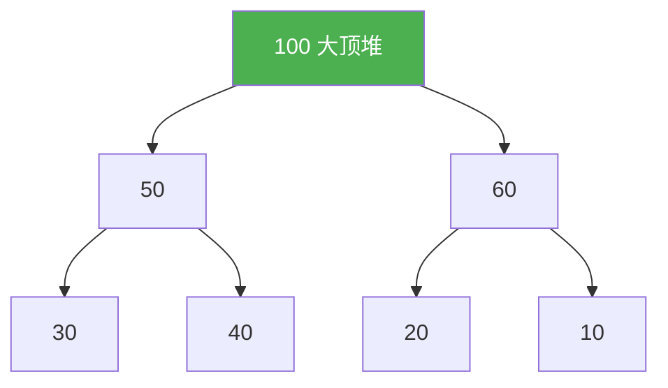
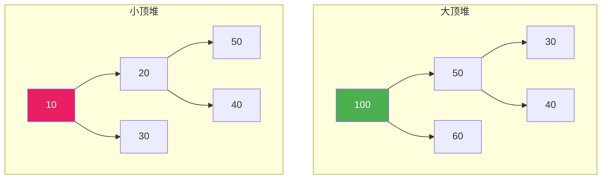
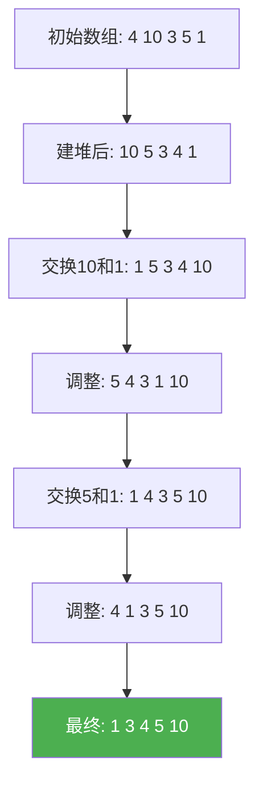
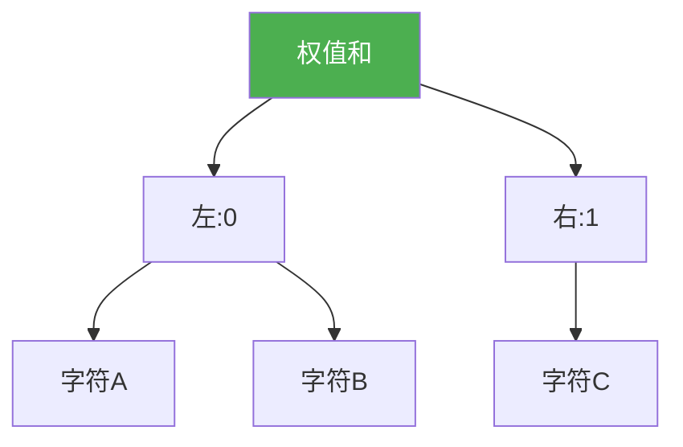

@[TOC](C语言数据结构系列：堆篇)

# C语言数据结构系列（十）：堆——优先队列的实现

> 🎯 **本篇目标**：理解堆的概念，掌握大顶堆和小顶堆的实现，学会堆排序！

---

## 一、前言

哈喽小伙伴们！👋

今天我们来学习**堆（Heap）**——一种特殊的完全二叉树！

堆有什么用？
- 🏆 **TopK问题**：找最大/最小的K个元素
- 📊 **堆排序**：O(nlogn)的排序算法
- 📱 **优先队列**：紧急任务优先处理



让我们开始今天的学习吧！ 🚀

---

## 二、堆的基本概念

### 2.1 什么是堆？

> **堆（Heap）** 是一种**完全二叉树**，分为：
> - **大顶堆**：每个节点 ≥ 其子节点
> - **小顶堆**：每个节点 ≤ 其子节点

**完全二叉树**：除最后一层外，其余层都是满的，最后一层从左到右连续。

### 2.2 大顶堆 vs 小顶堆



| 类型 | 性质 | 应用 |
|:----:|:----:|:----:|
| 大顶堆 | 父 ≥ 子 | 求最大值 |
| 小顶堆 | 父 ≤ 子 | 求最小值、TopK |

### 2.3 堆的存储

> 💡 堆用**数组**存储，通过下标计算父子关系！

```
树结构：
      100 (0)
     /    \
   50 (1)  60 (2)
   / \     / \
 30(3) 40(4) 20(5) 10(6)

数组：[100, 50, 60, 30, 40, 20, 10]
下标：  0   1   2   3   4   5   6
```

**节点关系公式：**
```
节点i的左孩子：2*i + 1
节点i的右孩子：2*i + 2
节点i的父节点：(i-1) / 2
```

---

## 三、堆的结构定义

```c
#define MAX_SIZE 100

typedef struct {
    int data[MAX_SIZE];
    int size;
} MaxHeap;

typedef struct {
    int data[MAX_SIZE];
    int size;
} MinHeap;
```

---

## 四、大顶堆的实现

### 4.1 向上调整（插入用）

> 💡 新节点放在末尾，与父节点比较，如果比父大就交换

```c
void heapifyUp(MaxHeap *heap, int index) {
    while (index > 0) {
        int parent = (index - 1) / 2;
        if (heap->data[index] > heap->data[parent]) {
            // 交换
            int temp = heap->data[index];
            heap->data[index] = heap->data[parent];
            heap->data[parent] = temp;
            index = parent;
        } else {
            break;
        }
    }
}
```

### 4.2 向下调整（删除用）

> 💡 根节点删除后，末尾元素放到根，与较大的子节点比较交换

```c
void heapifyDown(MaxHeap *heap, int index) {
    int largest = index;
    int left = 2 * index + 1;
    int right = 2 * index + 2;
    
    if (left < heap->size && heap->data[left] > heap->data[largest]) {
        largest = left;
    }
    if (right < heap->size && heap->data[right] > heap->data[largest]) {
        largest = right;
    }
    
    if (largest != index) {
        int temp = heap->data[index];
        heap->data[index] = heap->data[largest];
        heap->data[largest] = temp;
        heapifyDown(heap, largest);
    }
}
```

### 4.3 插入

```c
void insert(MaxHeap *heap, int value) {
    if (heap->size >= MAX_SIZE) {
        printf("堆满！\n");
        return;
    }
    heap->data[heap->size] = value;
    heap->size++;
    heapifyUp(heap, heap->size - 1);
}
```

### 4.4 删除堆顶

```c
int extractMax(MaxHeap *heap) {
    if (heap->size == 0) {
        printf("堆空！\n");
        return -1;
    }
    
    int max = heap->data[0];
    heap->data[0] = heap->data[heap->size - 1];
    heap->size--;
    heapifyDown(heap, 0);
    
    return max;
}
```

### 4.5 查看堆顶

```c
int peek(MaxHeap *heap) {
    if (heap->size == 0) return -1;
    return heap->data[0];
}
```

### 4.6 建堆

> 💡 从最后一个非叶子节点开始，依次向下调整

```c
void buildMaxHeap(MaxHeap *heap) {
    for (int i = heap->size / 2 - 1; i >= 0; i--) {
        heapifyDown(heap, i);
    }
}
```

### 4.7 完整示例

```c
#include <stdio.h>
#include <stdlib.h>

#define MAX_SIZE 100

typedef struct {
    int data[MAX_SIZE];
    int size;
} MaxHeap;

void heapifyUp(MaxHeap *heap, int index) {
    while (index > 0) {
        int parent = (index - 1) / 2;
        if (heap->data[index] > heap->data[parent]) {
            int temp = heap->data[index];
            heap->data[index] = heap->data[parent];
            heap->data[parent] = temp;
            index = parent;
        } else {
            break;
        }
    }
}

void heapifyDown(MaxHeap *heap, int index) {
    int largest = index;
    int left = 2 * index + 1;
    int right = 2 * index + 2;
    
    if (left < heap->size && heap->data[left] > heap->data[largest])
        largest = left;
    if (right < heap->size && heap->data[right] > heap->data[largest])
        largest = right;
    
    if (largest != index) {
        int temp = heap->data[index];
        heap->data[index] = heap->data[largest];
        heap->data[largest] = temp;
        heapifyDown(heap, largest);
    }
}

void insert(MaxHeap *heap, int value) {
    if (heap->size >= MAX_SIZE) return;
    heap->data[heap->size] = value;
    heap->size++;
    heapifyUp(heap, heap->size - 1);
}

int extractMax(MaxHeap *heap) {
    if (heap->size == 0) return -1;
    int max = heap->data[0];
    heap->data[0] = heap->data[heap->size - 1];
    heap->size--;
    heapifyDown(heap, 0);
    return max;
}

void printHeap(MaxHeap *heap) {
    printf("堆: ");
    for (int i = 0; i < heap->size; i++) {
        printf("%d ", heap->data[i]);
    }
    printf("\n");
}

int main() {
    MaxHeap heap = {.size = 0};
    
    printf("===== 大顶堆演示 =====\n\n");
    
    int values[] = {4, 10, 3, 5, 1, 8, 7, 2, 9, 6};
    int n = sizeof(values) / sizeof(values[0]);
    
    printf("插入: ");
    for (int i = 0; i < n; i++) {
        printf("%d ", values[i]);
        insert(&heap, values[i]);
    }
    printf("\n");
    
    printHeap(&heap);
    printf("\n堆顶: %d\n", peek(&heap));
    
    printf("\n依次弹出: ");
    while (heap.size > 0) {
        printf("%d ", extractMax(&heap));
    }
    printf("\n");
    
    return 0;
}
```

**运行结果：**
```
===== 大顶堆演示 =====

插入: 4 10 3 5 1 8 7 2 9 6
堆: 10 9 8 5 6 3 7 2 4 1

堆顶: 10

依次弹出: 10 9 8 7 6 5 4 3 2 1
```

---

## 五、小顶堆的实现

> 💡 只需改变比较方向即可

```c
void heapifyUpMin(MinHeap *heap, int index) {
    while (index > 0) {
        int parent = (index - 1) / 2;
        if (heap->data[index] < heap->data[parent]) {
            int temp = heap->data[index];
            heap->data[index] = heap->data[parent];
            heap->data[parent] = temp;
            index = parent;
        } else {
            break;
        }
    }
}

void heapifyDownMin(MinHeap *heap, int index) {
    int smallest = index;
    int left = 2 * index + 1;
    int right = 2 * index + 2;
    
    if (left < heap->size && heap->data[left] < heap->data[smallest])
        smallest = left;
    if (right < heap->size && heap->data[right] < heap->data[smallest])
        smallest = right;
    
    if (smallest != index) {
        int temp = heap->data[index];
        heap->data[index] = heap->data[smallest];
        heap->data[smallest] = temp;
        heapifyDownMin(heap, smallest);
    }
}
```

---

## 六、堆排序

> 💡 **思路**：建大顶堆，依次弹出堆顶就是有序序列！

```c
void heapSort(int arr[], int n) {
    // 建大顶堆
    for (int i = n / 2 - 1; i >= 0; i--) {
        // 向下调整
        int index = i;
        while (1) {
            int largest = index;
            int left = 2 * index + 1;
            int right = 2 * index + 2;
            
            if (left < n && arr[left] > arr[largest]) largest = left;
            if (right < n && arr[right] > arr[largest]) largest = right;
            
            if (largest != index) {
                int temp = arr[index];
                arr[index] = arr[largest];
                arr[largest] = temp;
                index = largest;
            } else {
                break;
            }
        }
    }
    
    // 逐个弹出堆顶
    for (int i = n - 1; i > 0; i--) {
        // 交换堆顶和末尾
        int temp = arr[0];
        arr[0] = arr[i];
        arr[i] = temp;
        
        // 调整堆
        int index = 0;
        while (1) {
            int largest = index;
            int left = 2 * index + 1;
            int right = 2 * index + 2;
            
            if (left < i && arr[left] > arr[largest]) largest = left;
            if (right < i && arr[right] > arr[largest]) largest = right;
            
            if (largest != index) {
                temp = arr[index];
                arr[index] = arr[largest];
                arr[largest] = temp;
                index = largest;
            } else {
                break;
            }
        }
    }
}
```

### 图解堆排序



---

## 七、TopK问题

> 💡 **问题**：找出数组中最大/最小的K个元素

### 方法1：小顶堆（找最大的K个）

```c
void topK(int arr[], int n, int k) {
    // 建小顶堆，大小为k
    MinHeap heap = {.size = 0};
    
    for (int i = 0; i < n; i++) {
        if (heap.size < k) {
            insert(&heap, arr[i]);
        } else if (arr[i] > heap.data[0]) {
            heap.data[0] = arr[i];
            heapifyDownMin(&heap, 0);
        }
    }
    
    printf("最大的%d个元素: ", k);
    for (int i = 0; i < heap.size; i++) {
        printf("%d ", heap.data[i]);
    }
    printf("\n");
}
```

### 方法2：大顶堆（找最小的K个）

```c
void topKMin(int arr[], int n, int k) {
    MaxHeap heap = {.size = 0};
    
    for (int i = 0; i < n; i++) {
        if (heap.size < k) {
            insert(&heap, arr[i]);
        } else if (arr[i] < heap.data[0]) {
            heap.data[0] = arr[i];
            heapifyDown(&heap, 0);
        }
    }
    
    printf("最小的%d个元素: ", k);
    for (int i = 0; i < heap.size; i++) {
        printf("%d ", heap.data[i]);
    }
    printf("\n");
}
```

---

## 八、优先队列

> 💡 **优先队列**：优先级高的先出队

```c
typedef MaxHeap PriorityQueue;

void enqueue(PriorityQueue *pq, int value, int priority) {
    insert(pq, priority);  // 这里简化为value=priority
}

int dequeue(PriorityQueue *pq) {
    return extractMax(pq);
}
```

---

## 九、复杂度分析

| 操作 | 时间复杂度 | 说明 |
|:----:|:----:|:----:|
| 插入 | O(logn) | 向上调整 |
| 删除堆顶 | O(logn) | 向下调整 |
| 建堆 | O(n) | 从最后一个非叶子开始 |
| 堆排序 | O(nlogn) | n次删除 |
| 查看堆顶 | O(1) | 直接访问 |

---

## 十、应用场景

1. **TopK问题** 🏆
   - 找最大/最小的K个

2. **堆排序** 📊
   - O(nlogn)排序

3. **优先队列** 📱
   - 任务调度

4. **合并K个有序链表** 🔗
   - 使用小顶堆

5. **中位数维护** 📈
   - 大顶堆+小顶堆

6. **Dijkstra最短路径** 🗺️
   - 优先访问最近节点

---

## 十一、练习题 🎯

### 🏠 基础题

**题目1：数据流的中位数**

设计一个数据结构，支持添加数字和获取中位数。

---

**题目2：第K大元素**

```c
// LeetCode 215
int findKthLargest(int* nums, int numsSize, int k);
```

---

### 💪 进阶题

**题目3：合并K个有序链表**

**题目4：丑数**

---

## 十二、总结

今天我们学习了堆这个重要的数据结构：

✅ **堆的概念**：完全二叉树，父≥子（大顶堆）或父≤子（小顶堆）

✅ **存储方式**：数组，下标计算父子关系

✅ **核心操作**：向上调整、向下调整

✅ **堆排序**：建堆 + 逐个弹出

✅ **TopK问题**：使用堆高效解决

**关键点：**
- 大顶堆：父 ≥ 子
- 小顶堆：父 ≤ 子
- 插入：放到末尾，向上调整
- 删除：末尾放到根，向下调整

---

## 十三、下篇预告

下一篇我们将学习 **哈夫曼树**——最优二叉树，用于数据压缩！



哈夫曼编码是文件压缩的基础，让我们拭目以待！ 🚀

---

> 💡 **学习建议**：堆的操作重点理解向上和向下调整！

**觉得有帮助就点赞+收藏+关注吧！** 👍

有问题欢迎在评论区留言～ 💬
