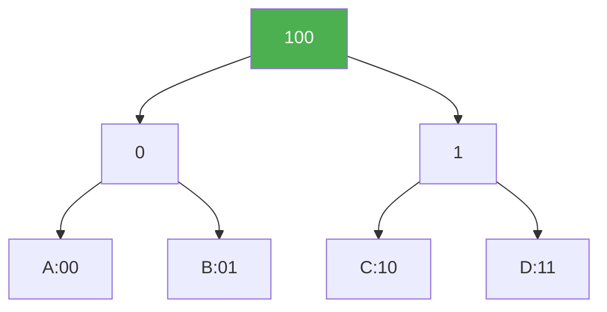
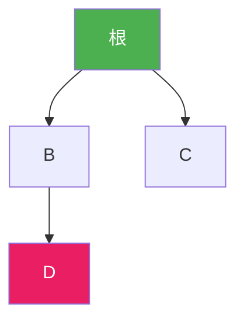
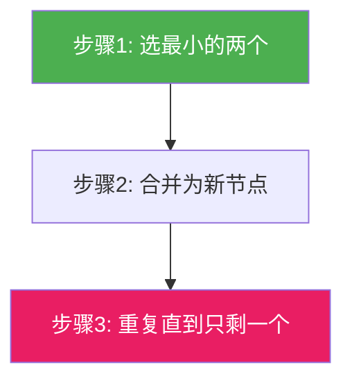
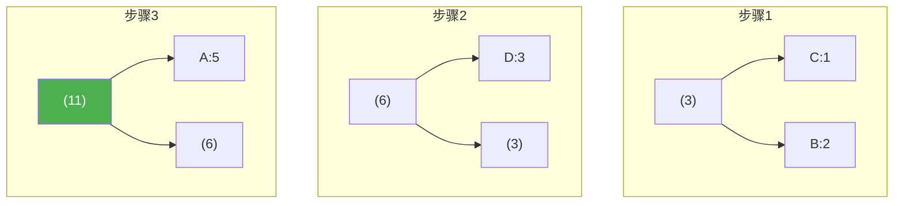
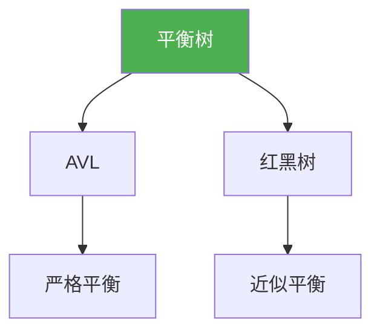

@[TOC](C语言数据结构系列：哈夫曼树篇)

# C语言数据结构系列（十一）：哈夫曼树——最优编码

> 🎯 **本篇目标**：理解哈夫曼树的概念和构建过程，掌握哈夫曼编码，了解文件压缩原理！

---

## 一、前言

哈喽小伙伴们！👋

今天我们来学习**哈夫曼树（Huffman Tree）**——一种带权路径长度最短的二叉树，也叫**最优二叉树**！

它有什么用？
- 📦 **文件压缩**：ZIP、GZIP都用到了
- 📡 **数据传输**：减少传输数据量
- 📊 **编码优化**：让高频字符编码更短



让我们开始今天的学习吧！ 🚀

---

## 二、基本概念

### 2.1 路径和路径长度

> **路径**：从一个节点到另一个的路线
> **路径长度**：经过的边数



```
从A到D的路径长度：2（经过2条边）
```

### 2.2 节点的权

> **权（Weight）**：节点的重要性或出现次数

```
字符出现次数：
A: 5次, B: 2次, C: 1次, D: 3次
权值就是出现次数
```

### 2.3 带权路径长度（WPL）

> **WPL** = Σ(每个叶子节点的权值 × 路径长度)

$$
WPL = \sum_{i=1}^{n} w_i \times l_i
$$

**示例：**

```
树1:
      *
     / \
    A(5) *
        / \
       B(2) C(1)

WPL = 5×1 + 2×2 + 1×2 = 5 + 4 + 2 = 11

树2:
      *
     / \
    *   C(1)
   / \
  A(5) B(2)

WPL = 5×2 + 2×2 + 1×1 = 10 + 4 + 1 = 15
```

树1的WPL更小，更优！

### 2.4 什么是哈夫曼树？

> **哈夫曼树**：带权路径长度**最小**的二叉树，也叫**最优二叉树**

---

## 三、哈夫曼树的构建

### 3.1 构建思路（哈夫曼算法）

> 💡 **贪心策略**：每次选两个权值最小的合并！



### 3.2 构建步骤

```
初始：A(5), B(2), C(1), D(3)

步骤1: 选C(1)和B(2)，合并为(3)
结果：A(5), D(3), (3)

步骤2: 选D(3)和(3)，合并为(6)
结果：A(5), (6)

步骤3: 选A(5)和(6)，合并为(11)
结果：(11)  完成！
```

### 3.3 图解构建过程



---

## 四、哈夫曼树的实现

### 4.1 节点结构

```c
typedef struct HuffmanNode {
    char data;
    int weight;
    struct HuffmanNode *left;
    struct HuffmanNode *right;
} HuffmanNode;
```

### 4.2 最小堆辅助构建

```c
// 使用最小堆实现
void buildHuffmanTree(HuffmanNode **nodes, int n) {
    // 建小顶堆
    MinHeap heap;
    initHeap(&heap, nodes, n);
    
    // 合并直到剩一个
    while (heap.size > 1) {
        HuffmanNode *left = extractMin(&heap);
        HuffmanNode *right = extractMin(&heap);
        
        HuffmanNode *parent = (HuffmanNode*)malloc(sizeof(HuffmanNode));
        parent->data = '\0';
        parent->weight = left->weight + right->weight;
        parent->left = left;
        parent->right = right;
        
        insert(&heap, parent);
    }
    
    return extractMin(&heap);  // 根节点
}
```

### 4.3 完整实现

```c
#include <stdio.h>
#include <stdlib.h>

typedef struct HuffmanNode {
    char data;
    int weight;
    struct HuffmanNode *left;
    struct HuffmanNode *right;
} HuffmanNode;

// 创建节点
HuffmanNode* createNode(char data, int weight) {
    HuffmanNode *node = (HuffmanNode*)malloc(sizeof(HuffmanNode));
    node->data = data;
    node->weight = weight;
    node->left = NULL;
    node->right = NULL;
    return node;
}

// 合并节点
HuffmanNode* merge(HuffmanNode *left, HuffmanNode *right) {
    HuffmanNode *parent = createNode('\0', left->weight + right->weight);
    parent->left = left;
    parent->right = right;
    return parent;
}

// 简化版：使用数组存储节点，按权值排序
HuffmanNode* buildHuffman(char chars[], int weights[], int n) {
    HuffmanNode **nodes = (HuffmanNode**)malloc(n * sizeof(HuffmanNode*));
    
    for (int i = 0; i < n; i++) {
        nodes[i] = createNode(chars[i], weights[i]);
    }
    
    int count = n;
    while (count > 1) {
        // 找两个最小的（简单选择排序）
        int min1 = 0, min2 = 1;
        if (nodes[min1]->weight > nodes[min2]->weight) {
            int temp = min1;
            min1 = min2;
            min2 = temp;
        }
        for (int i = 2; i < count; i++) {
            if (nodes[i]->weight < nodes[min1]->weight) {
                min2 = min1;
                min1 = i;
            } else if (nodes[i]->weight < nodes[min2]->weight) {
                min2 = i;
            }
        }
        
        HuffmanNode *parent = merge(nodes[min1], nodes[min2]);
        
        // 将min1位置放parent，删除min2
        nodes[min1] = parent;
        nodes[min2] = nodes[count - 1];
        count--;
    }
    
    HuffmanNode *root = nodes[0];
    free(nodes);
    return root;
}

// 打印哈夫曼编码
void printCodes(HuffmanNode *root, char *code, int depth) {
    if (root == NULL) return;
    
    if (root->left == NULL && root->right == NULL) {
        code[depth] = '\0';
        printf("字符%c: 权值%d, 编码: %s\n", 
               root->data, root->weight, code);
        return;
    }
    
    code[depth] = '0';
    printCodes(root->left, code, depth + 1);
    
    code[depth] = '1';
    printCodes(root->right, code, depth + 1);
}

// 释放内存
void freeTree(HuffmanNode *root) {
    if (root == NULL) return;
    freeTree(root->left);
    freeTree(root->right);
    free(root);
}

int main() {
    char chars[] = {'A', 'B', 'C', 'D', 'E'};
    int weights[] = {5, 2, 1, 3, 4};
    int n = sizeof(chars) / sizeof(chars[0]);
    
    printf("===== 哈夫曼树演示 =====\n\n");
    printf("字符和权值:\n");
    for (int i = 0; i < n; i++) {
        printf("  %c: %d\n", chars[i], weights[i]);
    }
    
    HuffmanNode *root = buildHuffman(chars, weights, n);
    
    printf("\n哈夫曼编码:\n");
    char code[100];
    printCodes(root, code, 0);
    
    freeTree(root);
    return 0;
}
```

**运行结果：**
```
===== 哈夫曼树演示 =====

字符和权值:
  A: 5
  B: 2
  C: 1
  D: 3
  E: 4

哈夫曼编码:
字符C: 权值1, 编码: 00
字符B: 权值2, 编码: 01
字符D: 权值3, 编码: 10
字符E: 权值4, 编码: 110
字符A: 权值5, 编码: 111
```

---

## 五、哈夫曼编码

### 5.1 什么是哈夫曼编码？

> **哈夫曼编码**：基于哈夫曼树的**前缀编码**，让权值大的字符编码短！

| 字符 | 权值 | 哈夫曼编码 | 固定编码(3位) |
|:----:|:----:|:--------:|:-----------:|
| C | 1 | 00 | 000 |
| B | 2 | 01 | 001 |
| D | 3 | 10 | 010 |
| E | 4 | 110 | 011 |
| A | 5 | 111 | 100 |

### 5.2 前缀编码

> 💡 **前缀编码**：任何字符的编码都不是其他字符编码的前缀

```
哈夫曼编码 00, 01, 10, 110, 111
- 00不是01的前缀 ✓
- 110不是111的前缀 ✓
```

### 5.3 编码效率

```
字符串: AABCD
固定编码(3位): 100 100 000 001 010 = 15位
哈夫曼编码: 111 111 00 01 10 = 13位
节省: 2位
```

---

## 六、文件压缩原理

### 6.1 压缩过程


### 6.2 解压过程


### 6.3 压缩率计算

$$
压缩率 = \frac{压缩后大小}{原始大小} \times 100\%
$$

---

## 七、应用实例

### 7.1 ZIP文件压缩

```
原始文件: AABBCCDD (8字节)
频率: A=2, B=2, C=2, D=2
哈夫曼编码: 00, 01, 10, 11
压缩后: 00 00 01 01 10 10 11 11 = 16位 = 2字节
压缩率: 2/8 = 25%
```

### 7.2 图片压缩（JPEG）

- 使用哈夫曼编码压缩熵编码后的数据

### 7.3 视频压缩（H.264）

- 使用哈夫曼编码压缩运动向量和残差

---

## 八、复杂度分析

| 操作 | 时间复杂度 | 说明 |
|:----:|:----:|:----:|
| 构建哈夫曼树 | O(nlogn) | 使用堆 |
| 编码 | O(n) | 遍历一次 |
| 解码 | O(m) | m为编码长度 |
| 空间 | O(n) | 存储树 |

---

## 九、哈夫曼树 vs 其他编码

| 编码方式 | 类型 | 效率 | 复杂度 |
|:----:|:----:|:----:|:----:|
| ASCII | 固定编码 | 低 | 简单 |
| 哈夫曼 | 变长编码 | 高 | 中等 |
| LZW | 字典编码 | 高 | 较高 |

---

## 十、练习题 🎯

### 🏠 基础题

**题目1：计算WPL**

给定一组权值，计算哈夫曼树的WPL。

---

**题目2：判断是否哈夫曼树**

判断一棵二叉树是否是哈夫曼树。

---

### 💪 进阶题

**题目3：实现简单的文件压缩**

**题目4：合并果子（哈夫曼树应用）**

```c
// 问题：每次合并两堆果子，代价为两堆之和，求最小代价
// 示例：1 2 9
// 合并1+2=3，代价3
// 合并3+9=12，代价12
// 总代价：15
```

---

## 十一、总结

今天我们学习了哈夫曼树和哈夫曼编码：

✅ **哈夫曼树**：带权路径长度最小的二叉树

✅ **构建方法**：每次选两个最小的合并

✅ **哈夫曼编码**：前缀编码，权值大的编码短

✅ **应用**：文件压缩、数据传输

**关键点：**
- 权值越大，编码越短
- 是前缀编码，无二义性
- 贪心算法的经典应用

---

## 十二、下篇预告

下一篇我们将学习 **平衡二叉树（AVL）和红黑树**——更高级的树结构！



平衡树解决了BST退化的问题，让我们拭目以待！ 🚀

---

> 💡 **学习建议**：哈夫曼树的构建过程要手动模拟一遍！

**觉得有帮助就点赞+收藏+关注吧！** 👍

有问题欢迎在评论区留言～ 💬
