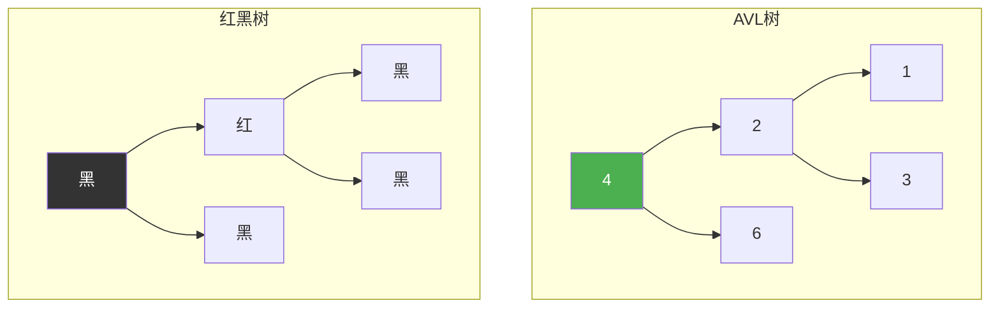
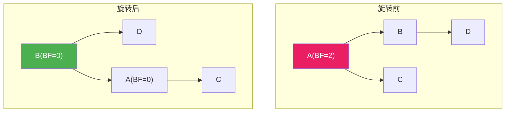
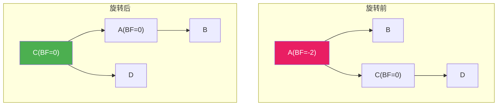
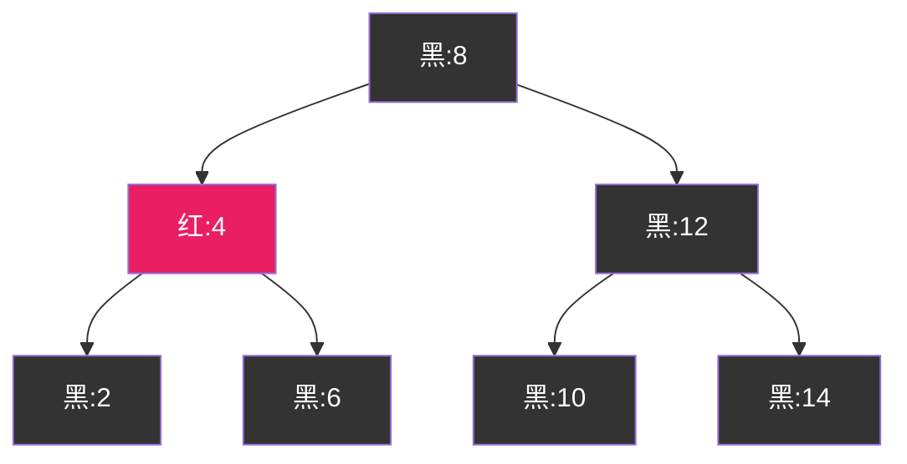
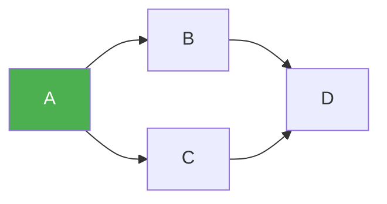

@[TOC](C语言数据结构系列：平衡二叉树篇)

# C语言数据结构系列（十二）：平衡二叉树——AVL与红黑树

> 🎯 **本篇目标**：理解AVL树和红黑树的原理，掌握旋转操作，了解它们的应用！

---

## 一、前言

哈喽小伙伴们！👋

还记得BST可能退化成链表吗？今天我们来学习**平衡二叉树**，解决这个问题！

两种常见的平衡树：
- **AVL树**：严格平衡，查找更快
- **红黑树**：近似平衡，插入删除更快



让我们开始今天的学习吧！ 🚀

---

## 二、AVL树

### 2.1 什么是AVL树？

> **AVL树**：任意节点的左右子树**高度差不超过1**的BST

关键特点：
- ⚖️ 严格平衡：|左高 - 右高| ≤ 1
- 🔍 查找效率：O(logn)
- ⚠️ 插入/删除可能破坏平衡，需要**旋转**

### 2.2 平衡因子

> **平衡因子（BF）**：左子树高度 - 右子树高度

$$
BF = height(left) - height(right)
$$

AVL树要求所有节点的BF ∈ {-1, 0, 1}

### 2.3 失衡的四种情况

| 类型 | 描述 | 解决方案 |
|:----:|:----:|:----:|
| LL型 | 左左失衡 | 右旋 |
| RR型 | 右右失衡 | 左旋 |
| LR型 | 左右失衡 | 先左旋再右旋 |
| RL型 | 右左失衡 | 先右旋再左旋 |

---

## 三、AVL树的旋转

### 3.1 右旋（LL型）

> 💡 **场景**：在左子树的左子树插入，导致失衡



**代码：**

```c
// 右旋
AVLNode* rightRotate(AVLNode *A) {
    AVLNode *B = A->left;
    A->left = B->right;
    B->right = A;
    
    // 更新高度
    A->height = max(getHeight(A->left), getHeight(A->right)) + 1;
    B->height = max(getHeight(B->left), getHeight(B->right)) + 1;
    
    return B;
}
```

### 3.2 左旋（RR型）

> 💡 **场景**：在右子树的右子树插入，导致失衡



**代码：**

```c
// 左旋
AVLNode* leftRotate(AVLNode *A) {
    AVLNode *B = A->right;
    A->right = B->left;
    B->left = A;
    
    A->height = max(getHeight(A->left), getHeight(A->right)) + 1;
    B->height = max(getHeight(B->left), getHeight(B->right)) + 1;
    
    return B;
}
```

### 3.3 先左旋再右旋（LR型）

> 💡 **场景**：在左子树的右子树插入

```
步骤1: 对左子树左旋
步骤2: 对根右旋
```

### 3.4 先右旋再左旋（RL型）

> 💡 **场景**：在右子树的左子树插入

```
步骤1: 对右子树右旋
步骤2: 对根左旋
```

---

## 四、AVL树的实现

```c
#include <stdio.h>
#include <stdlib.h>

typedef struct AVLNode {
    int data;
    struct AVLNode *left;
    struct AVLNode *right;
    int height;
} AVLNode;

int getHeight(AVLNode *node) {
    return node ? node->height : 0;
}

int max(int a, int b) {
    return a > b ? a : b;
}

AVLNode* createNode(int data) {
    AVLNode *node = (AVLNode*)malloc(sizeof(AVLNode));
    node->data = data;
    node->left = NULL;
    node->right = NULL;
    node->height = 1;
    return node;
}

int getBalance(AVLNode *node) {
    return node ? getHeight(node->left) - getHeight(node->right) : 0;
}

AVLNode* rightRotate(AVLNode *y) {
    AVLNode *x = y->left;
    AVLNode *T2 = x->right;
    
    x->right = y;
    y->left = T2;
    
    y->height = max(getHeight(y->left), getHeight(y->right)) + 1;
    x->height = max(getHeight(x->left), getHeight(x->right)) + 1;
    
    return x;
}

AVLNode* leftRotate(AVLNode *x) {
    AVLNode *y = x->right;
    AVLNode *T2 = y->left;
    
    y->left = x;
    x->right = T2;
    
    x->height = max(getHeight(x->left), getHeight(x->right)) + 1;
    y->height = max(getHeight(y->left), getHeight(y->right)) + 1;
    
    return y;
}

AVLNode* insert(AVLNode *node, int data) {
    if (node == NULL) return createNode(data);
    
    if (data < node->data)
        node->left = insert(node->left, data);
    else if (data > node->data)
        node->right = insert(node->right, data);
    else
        return node;
    
    node->height = 1 + max(getHeight(node->left), getHeight(node->right));
    
    int balance = getBalance(node);
    
    // LL
    if (balance > 1 && data < node->left->data)
        return rightRotate(node);
    
    // RR
    if (balance < -1 && data > node->right->data)
        return leftRotate(node);
    
    // LR
    if (balance > 1 && data > node->left->data) {
        node->left = leftRotate(node->left);
        return rightRotate(node);
    }
    
    // RL
    if (balance < -1 && data < node->right->data) {
        node->right = rightRotate(node->right);
        return leftRotate(node);
    }
    
    return node;
}

void inOrder(AVLNode *root) {
    if (root == NULL) return;
    inOrder(root->left);
    printf("%d(bf=%d) ", root->data, getBalance(root));
    inOrder(root->right);
}

void freeTree(AVLNode *root) {
    if (root == NULL) return;
    freeTree(root->left);
    freeTree(root->right);
    free(root);
}

int main() {
    AVLNode *root = NULL;
    
    printf("===== AVL树演示 =====\n\n");
    
    int values[] = {9, 5, 10, 3, 6, 11, 2, 4, 1};
    int n = sizeof(values) / sizeof(values[0]);
    
    for (int i = 0; i < n; i++) {
        root = insert(root, values[i]);
        printf("插入%d: ", values[i]);
        inOrder(root);
        printf("\n");
    }
    
    freeTree(root);
    return 0;
}
```

---

## 五、红黑树

### 5.1 什么是红黑树？

> **红黑树**：一种自平衡BST，通过颜色标记和规则保持近似平衡

### 5.2 红黑树的性质

1. 每个节点是**红色**或**黑色**
2. 根节点是**黑色**
3. 叶子节点（NIL）是**黑色**
4. 红色节点的子节点必须是**黑色**（不能有连续红）
5. 从任一节点到叶子的所有路径，**黑色节点数相同**



### 5.3 红黑树 vs AVL树

| 特性 | AVL树 | 红黑树 |
|:----:|:----:|:----:|
| 平衡条件 | 严格（BF≤1） | 近似（5条性质） |
| 查找 | 更快 | 稍慢 |
| 插入/删除 | 旋转多 | 旋转少 |
| 应用 | 查找密集 | 插入删除密集 |

### 5.4 红黑树的变色和旋转

**插入时的修复：**

| 情况 | 描述 | 操作 |
|:----:|:----:|:----:|
| 1 | 叔叔是红色 | 变色 |
| 2 | 叔叔是黑色，自己是右孩子 | 旋转 |
| 3 | 叔叔是黑色，自己是左孩子 | 旋转+变色 |

---

## 六、红黑树的实现（简化版）

```c
typedef enum { RED, BLACK } Color;

typedef struct RBNode {
    int data;
    Color color;
    struct RBNode *left, *right, *parent;
} RBNode;

typedef struct {
    RBNode *root;
    RBNode *NIL;
} RBTree;

// 创建节点
RBNode* createRBNode(RBTree *tree, int data) {
    RBNode *node = (RBNode*)malloc(sizeof(RBNode));
    node->data = data;
    node->color = RED;
    node->left = tree->NIL;
    node->right = tree->NIL;
    node->parent = tree->NIL;
    return node;
}

// 左旋
void leftRotate(RBTree *tree, RBNode *x) {
    RBNode *y = x->right;
    x->right = y->left;
    
    if (y->left != tree->NIL)
        y->left->parent = x;
    
    y->parent = x->parent;
    
    if (x->parent == tree->NIL)
        tree->root = y;
    else if (x == x->parent->left)
        x->parent->left = y;
    else
        x->parent->right = y;
    
    y->left = x;
    x->parent = y;
}

// 右旋
void rightRotate(RBTree *tree, RBNode *y) {
    RBNode *x = y->left;
    y->left = x->right;
    
    if (x->right != tree->NIL)
        x->right->parent = y;
    
    x->parent = y->parent;
    
    if (y->parent == tree->NIL)
        tree->root = x;
    else if (y == y->parent->left)
        y->parent->left = x;
    else
        y->parent->right = x;
    
    x->right = y;
    y->parent = x;
}

// 插入修复
void insertFixup(RBTree *tree, RBNode *z) {
    while (z->parent->color == RED) {
        if (z->parent == z->parent->parent->left) {
            RBNode *y = z->parent->parent->right;
            
            if (y->color == RED) {
                // 情况1: 叔叔是红色
                z->parent->color = BLACK;
                y->color = BLACK;
                z->parent->parent->color = RED;
                z = z->parent->parent;
            } else {
                if (z == z->parent->right) {
                    // 情况2: 自己是右孩子
                    z = z->parent;
                    leftRotate(tree, z);
                }
                // 情况3: 自己是左孩子
                z->parent->color = BLACK;
                z->parent->parent->color = RED;
                rightRotate(tree, z->parent->parent);
            }
        } else {
            // 对称情况
            RBNode *y = z->parent->parent->left;
            
            if (y->color == RED) {
                z->parent->color = BLACK;
                y->color = BLACK;
                z->parent->parent->color = RED;
                z = z->parent->parent;
            } else {
                if (z == z->parent->left) {
                    z = z->parent;
                    rightRotate(tree, z);
                }
                z->parent->color = BLACK;
                z->parent->parent->color = RED;
                leftRotate(tree, z->parent->parent);
            }
        }
    }
    tree->root->color = BLACK;
}

// 插入
void rbInsert(RBTree *tree, int data) {
    RBNode *z = createRBNode(tree, data);
    RBNode *y = tree->NIL;
    RBNode *x = tree->root;
    
    while (x != tree->NIL) {
        y = x;
        if (z->data < x->data)
            x = x->left;
        else
            x = x->right;
    }
    
    z->parent = y;
    
    if (y == tree->NIL)
        tree->root = z;
    else if (z->data < y->data)
        y->left = z;
    else
        y->right = z;
    
    insertFixup(tree, z);
}
```

---

## 七、应用场景

### AVL树应用

1. **数据库索引** 🗃️
   - 频繁查找

2. **内存中的有序数据** 💾
   - 需要快速查找

### 红黑树应用

1. **C++ STL的map/set** 📦
   - 底层实现

2. **Java的TreeMap/TreeSet** ☕
   - 底层实现

3. **Linux内核** 🐧
   - 进程调度、内存管理

4. **epoll的fd管理** 📡
   - 高效事件驱动

---

## 八、复杂度对比

| 操作 | BST（退化） | AVL树 | 红黑树 |
|:----:|:----:|:----:|:----:|
| 查找 | O(n) | O(logn) | O(logn) |
| 插入 | O(n) | O(logn) | O(logn) |
| 删除 | O(n) | O(logn) | O(logn) |
| 旋转次数（插入） | - | 最多2次 | 最多2次 |
| 旋转次数（删除） | - | O(logn) | 最多3次 |

---

## 九、练习题 🎯

### 🏠 基础题

**题目1：验证AVL树**

判断一棵二叉树是否是AVL树。

```c
bool isBalanced(TreeNode* root);
```

---

**题目2：将BST转为AVL树**

---

### 💪 进阶题

**题目3：实现红黑树的删除操作**

**题目4：数据流的中位数（使用平衡树）**

---

## 十、总结

今天我们学习了两种平衡二叉树：

✅ **AVL树**：
- 严格平衡（BF≤1）
- 查找更快
- 插入删除旋转多

✅ **红黑树**：
- 近似平衡（5条性质）
- 插入删除更快
- 应用更广泛

✅ **旋转操作**：
- 左旋：处理RR型
- 右旋：处理LL型
- 双旋：处理LR/RL型

**选择建议：**
- 查找密集 → AVL树
- 插入删除密集 → 红黑树
- 通用场景 → 红黑树

---

## 十一、下篇预告

下一篇我们将进入 **图** 的世界，学习图的存储和表示！



图是数据结构中表示关系的利器，让我们拭目以待！ 🚀

---

> 💡 **学习建议**：旋转操作需要画图理解，建议手动模拟！

**觉得有帮助就点赞+收藏+关注吧！** 👍

有问题欢迎在评论区留言～ 💬
