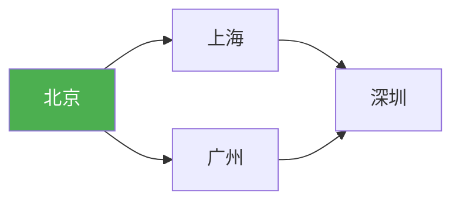
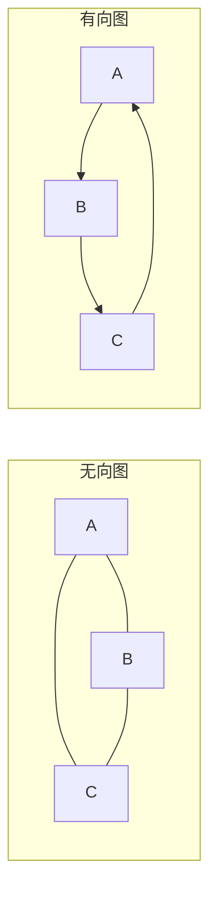
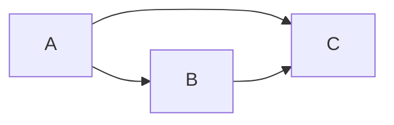

@[TOC](C语言数据结构系列：图基础篇)

# C语言数据结构系列（十三）：图的基础——存储与表示

> 🎯 **本篇目标**：理解图的概念，掌握邻接矩阵和邻接表两种存储方式！

---

## 一、前言

哈喽小伙伴们！👋

今天我们进入**图（Graph）**的世界！图是最复杂的数据结构，可以表示各种**关系**：

- 🗺️ 地图导航
- 👥 社交网络
- 🌐 互联网
- 📊 依赖关系



让我们开始今天的学习吧！ 🚀

---

## 二、图的基本概念

### 2.1 什么是图？

> **图（Graph）** 由**顶点（Vertex）** 和**边（Edge）** 组成，表示多对多的关系。

### 2.2 图的术语

| 术语 | 说明 | 示例 |
|:----:|:----:|:----:|
| 顶点 | 节点 | 城市 |
| 边 | 连接关系 | 道路 |
| 有向图 | 边有方向 | 微博关注 |
| 无向图 | 边无方向 | 微信好友 |
| 带权图 | 边有权值 | 距离/费用 |
| 完全图 | 任意两点都有边 | - |
| 连通图 | 任意两点可达 | - |

### 2.3 图的类型



---

## 三、邻接矩阵

### 3.1 什么是邻接矩阵？

> 💡 用**二维数组**表示图，`matrix[i][j]=1` 表示i和j有边

```c
#define MAX_VERTEX 100

typedef struct {
    char vexs[MAX_VERTEX];     // 顶点表
    int arc[MAX_VERTEX][MAX_VERTEX];  // 邻接矩阵
    int vexNum, arcNum;
} MGraph;
```

### 3.2 图解



**邻接矩阵：**
```
   A  B  C
A [0, 1, 1]
B [1, 0, 1]
C [1, 1, 0]
```

### 3.3 创建图

```c
void createGraph(MGraph *G, char vexs[], int n, int edges[][2], int m) {
    G->vexNum = n;
    G->arcNum = m;
    
    // 初始化顶点
    for (int i = 0; i < n; i++) {
        G->vexs[i] = vexs[i];
    }
    
    // 初始化矩阵
    for (int i = 0; i < n; i++) {
        for (int j = 0; j < n; j++) {
            G->arc[i][j] = 0;
        }
    }
    
    // 填充边
    for (int i = 0; i < m; i++) {
        int v1 = edges[i][0];
        int v2 = edges[i][1];
        G->arc[v1][v2] = 1;
        G->arc[v2][v1] = 1;  // 无向图
    }
}
```

### 3.4 优缺点

| 优点 | 缺点 |
|:----:|:----:|
| 实现简单 | 空间O(V²) |
| 查询快O(1) | 稀疏图浪费空间 |
| 适合稠密图 | - |

---

## 四、邻接表

### 4.1 什么是邻接表？

> 💡 用**链表**存储每个顶点的邻接点，节省稀疏图的空间

```c
typedef struct ArcNode {
    int adjvex;
    struct ArcNode *next;
} ArcNode;

typedef struct {
    char data;
    ArcNode *first;
} VNode;

typedef struct {
    VNode vertices[MAX_VERTEX];
    int vexNum, arcNum;
} ALGraph;
```

### 4.2 图解

```
图：
A -- B
A -- C
B -- C

邻接表：
A -> B -> C -> NULL
B -> A -> C -> NULL
C -> A -> B -> NULL
```

### 4.3 创建图

```c
void createGraph(ALGraph *G, char vexs[], int n, int edges[][2], int m) {
    G->vexNum = n;
    G->arcNum = m;
    
    for (int i = 0; i < n; i++) {
        G->vertices[i].data = vexs[i];
        G->vertices[i].first = NULL;
    }
    
    for (int i = 0; i < m; i++) {
        int v1 = edges[i][0];
        int v2 = edges[i][1];
        
        ArcNode *node = (ArcNode*)malloc(sizeof(ArcNode));
        node->adjvex = v2;
        node->next = G->vertices[v1].first;
        G->vertices[v1].first = node;
        
        node = (ArcNode*)malloc(sizeof(ArcNode));
        node->adjvex = v1;
        node->next = G->vertices[v2].first;
        G->vertices[v2].first = node;
    }
}
```

### 4.4 优缺点

| 优点 | 缺点 |
|:----:|:----:|
| 空间O(V+E) | 查询慢O(度) |
| 适合稀疏图 | 实现稍复杂 |
| 节省空间 | - |

---

## 五、两种存储方式对比

| 特性 | 邻接矩阵 | 邻接表 |
|:----:|:----:|:----:|
| 空间 | O(V²) | O(V+E) |
| 查询边 | O(1) | O(度) |
| 遍历邻接点 | O(V) | O(度) |
| 适用场景 | 稠密图 | 稀疏图 |

---

## 六、完整示例

```c
#include <stdio.h>
#include <stdlib.h>
#include <stdbool.h>

#define MAX_VERTEX 100

// 邻接矩阵
typedef struct {
    char vexs[MAX_VERTEX];
    int arc[MAX_VERTEX][MAX_VERTEX];
    int vexNum, arcNum;
} MGraph;

// 邻接表
typedef struct ArcNode {
    int adjvex;
    struct ArcNode *next;
} ArcNode;

typedef struct {
    char data;
    ArcNode *first;
} VNode;

typedef struct {
    VNode vertices[MAX_VERTEX];
    int vexNum, arcNum;
} ALGraph;

// 查找顶点下标
int locateVex(MGraph *G, char v) {
    for (int i = 0; i < G->vexNum; i++) {
        if (G->vexs[i] == v) return i;
    }
    return -1;
}

// 创建无向图（邻接矩阵）
void createMGraph(MGraph *G) {
    printf("输入顶点数和边数: ");
    scanf("%d %d", &G->vexNum, &G->arcNum);
    
    printf("输入顶点: ");
    for (int i = 0; i < G->vexNum; i++) {
        scanf(" %c", &G->vexs[i]);
    }
    
    for (int i = 0; i < G->vexNum; i++) {
        for (int j = 0; j < G->vexNum; j++) {
            G->arc[i][j] = 0;
        }
    }
    
    printf("输入边（如 AB）:\n");
    for (int i = 0; i < G->arcNum; i++) {
        char v1, v2;
        scanf(" %c%c", &v1, &v2);
        int i1 = locateVex(G, v1);
        int i2 = locateVex(G, v2);
        G->arc[i1][i2] = 1;
        G->arc[i2][i1] = 1;
    }
}

// 打印邻接矩阵
void printMGraph(MGraph *G) {
    printf("\n邻接矩阵:\n  ");
    for (int i = 0; i < G->vexNum; i++) {
        printf("%c ", G->vexs[i]);
    }
    printf("\n");
    for (int i = 0; i < G->vexNum; i++) {
        printf("%c ", G->vexs[i]);
        for (int j = 0; j < G->vexNum; j++) {
            printf("%d ", G->arc[i][j]);
        }
        printf("\n");
    }
}

// 打印邻接表
void printALGraph(ALGraph *G) {
    printf("\n邻接表:\n");
    for (int i = 0; i < G->vexNum; i++) {
        printf("%c -> ", G->vertices[i].data);
        ArcNode *p = G->vertices[i].first;
        while (p) {
            printf("%d ", p->adjvex);
            p = p->next;
        }
        printf("\n");
    }
}

int main() {
    MGraph G;
    createMGraph(&G);
    printMGraph(&G);
    return 0;
}
```

---

## 七、应用

1. **社交网络** 👥
   - 好友关系

2. **地图导航** 🗺️
   - 路线规划

3. **编译器依赖** ⚙️
   - 拓扑排序

4. **网络路由** 🌐
   - 最短路径

---

## 八、下篇预告

下一篇我们将学习 **图的遍历：DFS与BFS**！


---

> 💡 **学习建议**：图的存储方式要根据稀疏/稠密选择！

**觉得有帮助就点赞+收藏+关注吧！** 👍
