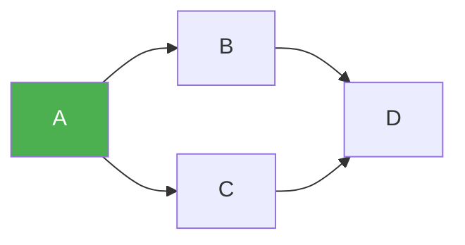
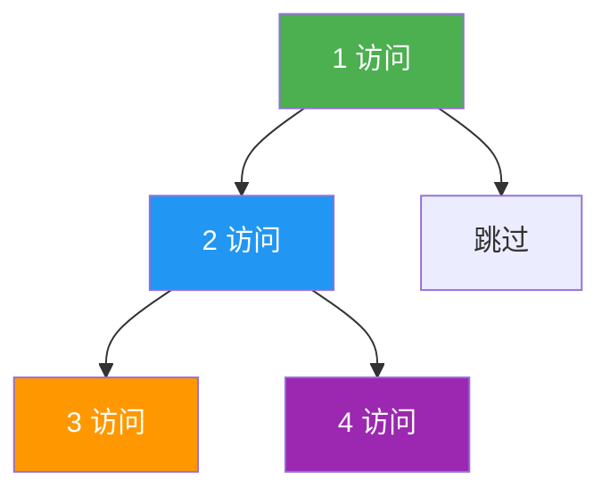
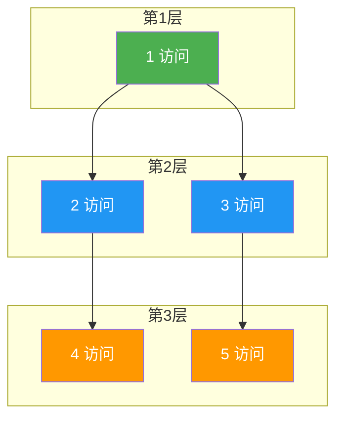

@[TOC](C语言数据结构系列：图遍历篇)

# C语言数据结构系列（十四）：图的遍历——DFS与BFS

> 🎯 **本篇目标**：掌握深度优先搜索（DFS）和广度优先搜索（BFS）！

---

## 一、前言

哈喽小伙伴们！👋

今天我们来学习图的两种遍历方式：**DFS**和**BFS**！

- 🏊 **DFS（深度优先）**：一条路走到黑，走不通再回头
- 🚶 **BFS（广度优先）**：一层一层往外找



---

## 二、DFS（深度优先搜索）

### 2.1 思路

> 💡 像**走迷宫**，一条路走到头，走不通再回头试其他路

使用**栈**（或递归）实现

### 2.2 图解



### 2.3 代码实现

```c
bool visited[MAX_VERTEX];

// 递归实现
void DFS(ALGraph *G, int v) {
    visited[v] = true;
    printf("%c ", G->vertices[v].data);
    
    ArcNode *p = G->vertices[v].first;
    while (p) {
        if (!visited[p->adjvex]) {
            DFS(G, p->adjvex);
        }
        p = p->next;
    }
}

// 非递归实现（栈）
void DFSIterative(ALGraph *G, int start) {
    Stack s;
    initStack(&s);
    
    push(&s, start);
    
    while (!isEmpty(&s)) {
        int v = pop(&s);
        if (visited[v]) continue;
        
        visited[v] = true;
        printf("%c ", G->vertices[v].data);
        
        ArcNode *p = G->vertices[v].first;
        while (p) {
            if (!visited[p->adjvex]) {
                push(&s, p->adjvex);
            }
            p = p->next;
        }
    }
}

// 遍历整个图
void DFSTraverse(ALGraph *G) {
    for (int i = 0; i < G->vexNum; i++) {
        visited[i] = false;
    }
    
    for (int i = 0; i < G->vexNum; i++) {
        if (!visited[i]) {
            DFS(G, i);
        }
    }
}
```

---

## 三、BFS（广度优先搜索）

### 3.1 思路

> 💡 像**水波纹**，从起点开始，一层一层往外扩散

使用**队列**实现

### 3.2 图解



### 3.3 代码实现

```c
void BFS(ALGraph *G, int start) {
    bool visited[MAX_VERTEX] = {false};
    Queue q;
    initQueue(&q);
    
    visited[start] = true;
    enqueue(&q, start);
    
    while (!isEmpty(&q)) {
        int v = dequeue(&q);
        printf("%c ", G->vertices[v].data);
        
        ArcNode *p = G->vertices[v].first;
        while (p) {
            if (!visited[p->adjvex]) {
                visited[p->adjvex] = true;
                enqueue(&q, p->adjvex);
            }
            p = p->next;
        }
    }
}
```

---

## 四、DFS vs BFS

| 特性 | DFS | BFS |
|:----:|:----:|:----:|
| 数据结构 | 栈/递归 | 队列 |
| 空间 | O(V) | O(V) |
| 最短路径 | ❌ | ✅ |
| 适用场景 | 连通分量 | 最短路径 |

---

## 五、应用

| DFS应用 | BFS应用 |
|:----:|:----:|
| 拓扑排序 | 最短路径（无权图） |
| 连通分量 | 层序遍历 |
| 回溯算法 | 社交网络好友 |
| 检测环 | 广告推送 |

---

## 六、练习题

**题目1：岛屿数量**

```c
// LeetCode 200
int numIslands(char** grid, int gridSize, int* gridColSize);
```

**题目2：克隆图**

**题目3：单词接龙**

---

## 七、下篇预告

下一篇我们将学习 **最小生成树：Prim与Kruskal**！

---

> 💡 DFS和BFS是图论的基础，务必熟练掌握！👍
