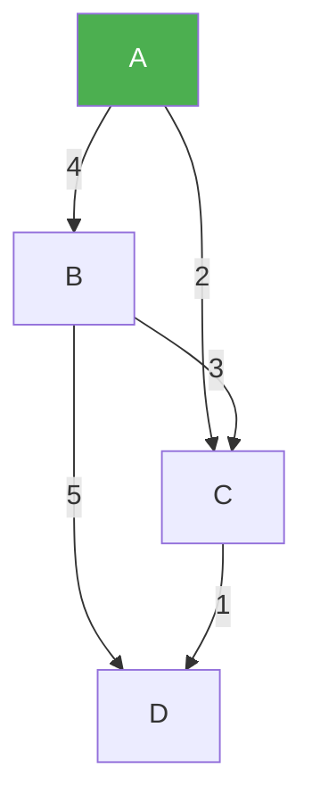
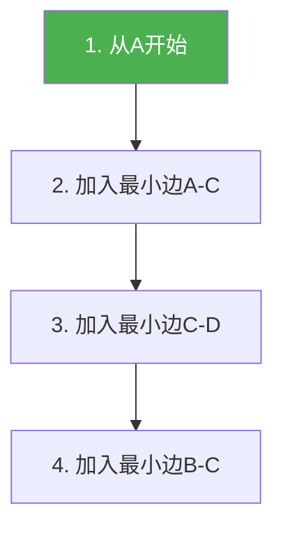
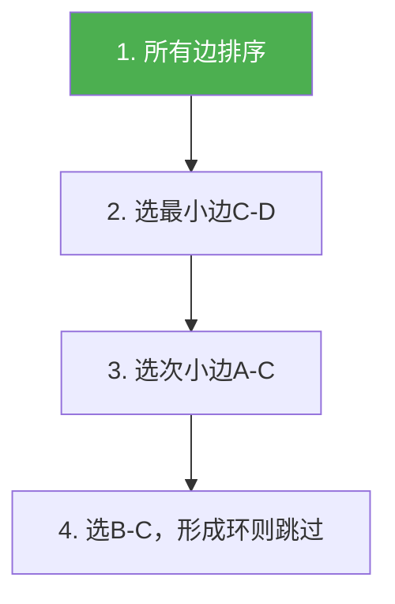

@[TOC](C语言数据结构系列：最小生成树篇)

# C语言数据结构系列（十五）：最小生成树——Prim与Kruskal

> 🎯 **本篇目标**：理解最小生成树概念，掌握Prim和Kruskal算法！

---

## 一、前言

哈喽小伙伴们！👋

今天我们来学习**最小生成树（MST）**——用最少的边连接所有顶点！

应用场景：
- 🔌 电网设计
- 🛣️ 公路规划
- 🌐 网络布线

---

## 二、基本概念

### 2.1 什么是生成树？

> **生成树**：包含图中所有顶点的**无环连通子图**

### 2.2 什么是最小生成树？

> **最小生成树**：边权值之和**最小**的生成树



MST：A-C(2), C-D(1), B-C(3) = 总权值6

---

## 三、Prim算法

### 3.1 思想

> 💡 **从点出发**：从一个顶点开始，每次加入权值最小的边

### 3.2 步骤



### 3.3 代码实现

```c
#define INF 99999

void prim(int graph[][MAX], int n) {
    int key[MAX];      // 到生成树的最小距离
    bool inMST[MAX];   // 是否在MST中
    int parent[MAX];   // 父节点
    
    for (int i = 0; i < n; i++) {
        key[i] = INF;
        inMST[i] = false;
        parent[i] = -1;
    }
    
    key[0] = 0;  // 从顶点0开始
    
    for (int count = 0; count < n - 1; count++) {
        // 找key最小且不在MST中的顶点
        int u = -1;
        for (int v = 0; v < n; v++) {
            if (!inMST[v] && (u == -1 || key[v] < key[u])) {
                u = v;
            }
        }
        
        inMST[u] = true;
        
        // 更新邻接顶点的key
        for (int v = 0; v < n; v++) {
            if (graph[u][v] && !inMST[v] && graph[u][v] < key[v]) {
                key[v] = graph[u][v];
                parent[v] = u;
            }
        }
    }
    
    printf("Prim MST:\n");
    for (int i = 1; i < n; i++) {
        printf("%c - %c : %d\n", parent[i] + 'A', i + 'A', key[i]);
    }
}
```

---

## 四、Kruskal算法

### 4.1 思想

> 💡 **从边出发**：按权值排序，依次加入不形成环的边

使用**并查集**检测环

### 4.2 步骤



### 4.3 代码实现

```c
typedef struct {
    int u, v, weight;
} Edge;

int parent[MAX];
int rank[MAX];

void initUnionFind(int n) {
    for (int i = 0; i < n; i++) {
        parent[i] = i;
        rank[i] = 0;
    }
}

int find(int x) {
    if (parent[x] != x) {
        parent[x] = find(parent[x]);
    }
    return parent[x];
}

bool union(int x, int y) {
    int px = find(x), py = find(y);
    if (px == py) return false;
    if (rank[px] < rank[py]) parent[px] = py;
    else if (rank[px] > rank[py]) parent[py] = px;
    else { parent[py] = px; rank[px]++; }
    return true;
}

int cmp(const void *a, const void *b) {
    return ((Edge*)a)->weight - ((Edge*)b)->weight;
}

void kruskal(Edge edges[], int edgeNum, int n) {
    qsort(edges, edgeNum, sizeof(Edge), cmp);
    initUnionFind(n);
    
    printf("Kruskal MST:\n");
    int count = 0;
    for (int i = 0; i < edgeNum && count < n - 1; i++) {
        if (union(edges[i].u, edges[i].v)) {
            printf("%c - %c : %d\n", 
                   edges[i].u + 'A', edges[i].v + 'A', edges[i].weight);
            count++;
        }
    }
}
```

---

## 五、Prim vs Kruskal

| 特性 | Prim | Kruskal |
|:----:|:----:|:----:|
| 思想 | 从点出发 | 从边出发 |
| 时间 | O(V²) | O(ElogE) |
| 适用 | 稠密图 | 稀疏图 |
| 数据结构 | 数组 | 并查集 |

---

## 六、应用

1. **电网设计** ⚡
   - 最低成本连接所有城市

2. **网络布线** 🌐
   - 最少网线连接所有电脑

3. **聚类分析** 📊
   - 去掉最大边实现K类聚类

---

## 七、下篇预告

下一篇我们将学习 **最短路径：Dijkstra与Floyd**！

---

> 💡 Prim适合稠密图，Kruskal适合稀疏图！👍
