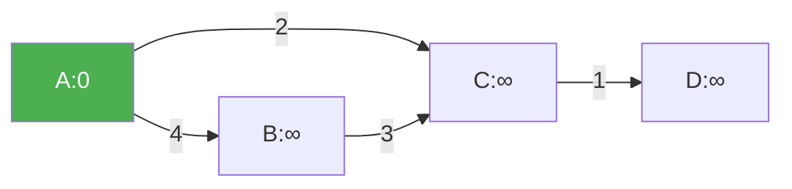

@[TOC](C语言数据结构系列：最短路径篇)

# C语言数据结构系列（十六）：最短路径——Dijkstra与Floyd

> 🎯 **本篇目标**：掌握Dijkstra单源最短路和Floyd多源最短路算法！

---

## 一、前言

哈喽小伙伴们！👋

今天我们来学习**最短路径**——导航软件的核心算法！

- 🗺️ **Dijkstra**：从一个点到其他所有点的最短路
- 🌐 **Floyd**：任意两点之间的最短路

---

## 二、Dijkstra算法

### 2.1 思想

> 💡 **贪心**：每次选择距离最近的未访问顶点

### 2.2 图解



### 2.3 代码实现

```c
#define INF 99999

void dijkstra(int graph[][MAX], int n, int start) {
    int dist[MAX];
    bool visited[MAX] = {false};
    int prev[MAX];
    
    for (int i = 0; i < n; i++) {
        dist[i] = graph[start][i];
        prev[i] = (dist[i] < INF && i != start) ? start : -1;
    }
    dist[start] = 0;
    visited[start] = true;
    
    for (int count = 1; count < n; count++) {
        int u = -1;
        for (int v = 0; v < n; v++) {
            if (!visited[v] && (u == -1 || dist[v] < dist[u])) {
                u = v;
            }
        }
        
        if (u == -1 || dist[u] == INF) break;
        visited[u] = true;
        
        for (int v = 0; v < n; v++) {
            if (!visited[v] && dist[u] + graph[u][v] < dist[v]) {
                dist[v] = dist[u] + graph[u][v];
                prev[v] = u;
            }
        }
    }
    
    printf("从%c出发的最短距离:\n", start + 'A');
    for (int i = 0; i < n; i++) {
        printf("到%c: %d\n", i + 'A', dist[i]);
    }
}
```

---

## 三、Floyd算法

### 3.1 思想

> 💡 **动态规划**：三重循环，逐步更新最短路径

### 3.2 代码实现

```c
void floyd(int graph[][MAX], int n) {
    int dist[MAX][MAX];
    
    // 初始化
    for (int i = 0; i < n; i++) {
        for (int j = 0; j < n; j++) {
            dist[i][j] = graph[i][j];
        }
    }
    
    // 三重循环
    for (int k = 0; k < n; k++) {
        for (int i = 0; i < n; i++) {
            for (int j = 0; j < n; j++) {
                if (dist[i][k] + dist[k][j] < dist[i][j]) {
                    dist[i][j] = dist[i][k] + dist[k][j];
                }
            }
        }
    }
    
    printf("任意两点最短距离:\n");
    for (int i = 0; i < n; i++) {
        for (int j = 0; j < n; j++) {
            printf("%d ", dist[i][j]);
        }
        printf("\n");
    }
}
```

---

## 四、Dijkstra vs Floyd

| 特性 | Dijkstra | Floyd |
|:----:|:----:|:----:|
| 时间 | O(V²) | O(V³) |
| 用途 | 单源最短路 | 全源最短路 |
| 负权边 | ❌ | ❌ |
| 空间 | O(V) | O(V²) |

---

## 五、应用

1. **导航软件** 🗺️
2. **网络路由** 🌐
3. **游戏AI寻路** 🎮

---

## 六、下篇预告

下一篇我们将学习 **拓扑排序与关键路径**！

---

> 💡 Dijkstra不能处理负权边！👍
