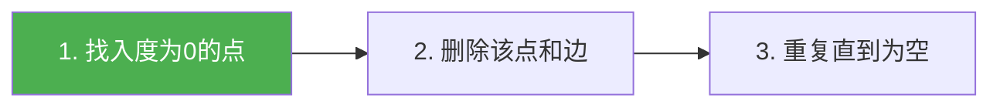

@[TOC](C语言数据结构系列：拓扑排序篇)

# C语言数据结构系列（十七）：拓扑排序与关键路径

> 🎯 **本篇目标**：理解拓扑排序和关键路径的概念与实现！

---

## 一、前言

哈喽小伙伴们！👋

今天我们来学习**拓扑排序**——用于**任务调度**和**依赖关系**处理！

应用：
- 📦 软件包依赖
- 📚 课程先修关系
- ⚙️ 编译顺序

---

## 二、拓扑排序

### 2.1 什么是拓扑排序？

> **拓扑排序**：将有向无环图（DAG）的顶点排成线性序列，使得对于每条边(u,v)，u都在v前面

### 2.2 步骤（BFS实现）



### 2.3 代码实现

```c
void topologicalSort(ALGraph *G) {
    int inDegree[MAX_VERTEX] = {0};
    Queue q;
    initQueue(&q);
    
    // 计算入度
    for (int i = 0; i < G->vexNum; i++) {
        ArcNode *p = G->vertices[i].first;
        while (p) {
            inDegree[p->adjvex]++;
            p = p->next;
        }
    }
    
    // 入度为0的入队
    for (int i = 0; i < G->vexNum; i++) {
        if (inDegree[i] == 0) {
            enqueue(&q, i);
        }
    }
    
    int count = 0;
    printf("拓扑排序: ");
    while (!isEmpty(&q)) {
        int v = dequeue(&q);
        printf("%c ", G->vertices[v].data);
        count++;
        
        ArcNode *p = G->vertices[v].first;
        while (p) {
            inDegree[p->adjvex]--;
            if (inDegree[p->adjvex] == 0) {
                enqueue(&q, p->adjvex);
            }
            p = p->next;
        }
    }
    printf("\n");
    
    if (count != G->vexNum) {
        printf("存在环！\n");
    }
}
```

---

## 三、关键路径

### 3.1 什么是关键路径？

> **关键路径**：从起点到终点的**最长路径**，决定项目最短完成时间

### 3.2 AOE网

- **顶点**：事件
- **边**：活动，权值为持续时间

### 3.3 求解步骤

1. 拓扑排序求最早开始时间(ve)
2. 逆拓扑排序求最迟开始时间(vl)
3. 计算活动的最早/最迟时间
4. 关键活动（最早=最迟的活动）

---

## 四、应用

1. **任务调度** 📋
2. **课程安排** 📚
3. **编译顺序** ⚙️
4. **项目管理** 📊

---

## 五、下篇预告

下一篇我们将进入 **排序算法** 篇章，先学习 **冒泡排序和选择排序**！

---

> 💡 拓扑排序可以检测DAG中是否有环！👍
