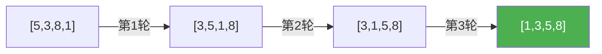
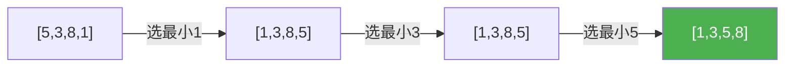

@[TOC](C语言数据结构系列：排序基础篇)

# C语言数据结构系列（十八）：排序基础——冒泡与选择

> 🎯 **本篇目标**：掌握冒泡排序和选择排序的原理与实现！

---

## 一、前言

哈喽小伙伴们！👋

今天我们开始学习**排序算法**！先来两个最基础的：

- 🫧 **冒泡排序**：相邻比较，大的往后冒
- 👆 **选择排序**：每次选最小的放前面

---

## 二、冒泡排序

### 2.1 思想

> 💡 相邻元素比较，如果逆序就交换，每轮把最大的"冒泡"到最后

### 2.2 图解



### 2.3 代码实现

```c
void bubbleSort(int arr[], int n) {
    for (int i = 0; i < n - 1; i++) {
        bool swapped = false;
        for (int j = 0; j < n - 1 - i; j++) {
            if (arr[j] > arr[j + 1]) {
                int temp = arr[j];
                arr[j] = arr[j + 1];
                arr[j + 1] = temp;
                swapped = true;
            }
        }
        if (!swapped) break;  // 优化：没有交换说明已有序
    }
}
```

---

## 三、选择排序

### 3.1 思想

> 💡 每次从未排序部分选最小的，放到已排序部分末尾

### 3.2 图解



### 3.3 代码实现

```c
void selectionSort(int arr[], int n) {
    for (int i = 0; i < n - 1; i++) {
        int minIdx = i;
        for (int j = i + 1; j < n; j++) {
            if (arr[j] < arr[minIdx]) {
                minIdx = j;
            }
        }
        if (minIdx != i) {
            int temp = arr[i];
            arr[i] = arr[minIdx];
            arr[minIdx] = temp;
        }
    }
}
```

---

## 四、复杂度对比

| 算法 | 最好 | 最坏 | 平均 | 空间 | 稳定性 |
|:----:|:----:|:----:|:----:|:----:|:----:|
| 冒泡 | O(n) | O(n²) | O(n²) | O(1) | ✅ |
| 选择 | O(n²) | O(n²) | O(n²) | O(1) | ❌ |

**稳定性**：相同值的元素排序后相对位置不变

---

## 五、下篇预告

下一篇我们将学习 **插入排序和希尔排序**！

---

> 💡 冒泡可以提前终止，选择不行！👍
