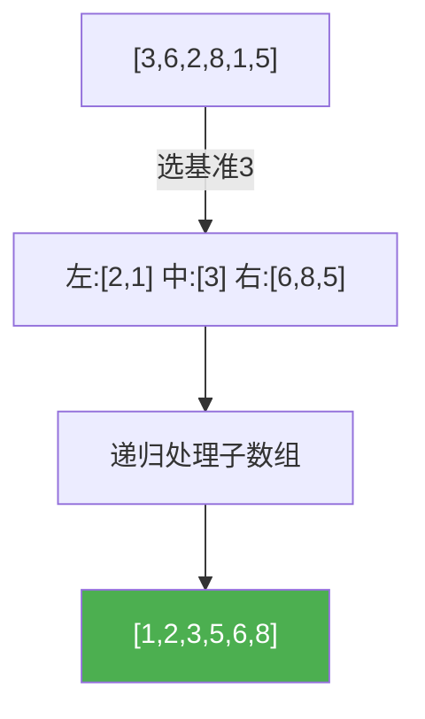

@[TOC](C语言数据结构系列：快速排序篇)

# C语言数据结构系列（二十）：快速排序——分治经典

> 🎯 **本篇目标**：掌握快速排序的原理与实现！

---

## 一、前言

哈喽小伙伴们！👋

今天我们来学习**快速排序（Quick Sort）**——实际应用中最快的排序算法之一！

---

## 二、快速排序

### 2.1 思想

> 💡 **分治法**：选一个基准，比它小的放左边，大的放右边，递归处理

### 2.2 图解



### 2.3 代码实现

```c
int partition(int arr[], int low, int high) {
    int pivot = arr[low];
    while (low < high) {
        while (low < high && arr[high] >= pivot) high--;
        arr[low] = arr[high];
        while (low < high && arr[low] <= pivot) low++;
        arr[high] = arr[low];
    }
    arr[low] = pivot;
    return low;
}

void quickSort(int arr[], int low, int high) {
    if (low < high) {
        int pos = partition(arr, low, high);
        quickSort(arr, low, pos - 1);
        quickSort(arr, pos + 1, high);
    }
}
```

---

## 三、复杂度分析

| 情况 | 时间 | 说明 |
|:----:|:----:|:----:|
| 最好 | O(nlogn) | 均匀划分 |
| 最坏 | O(n²) | 已有序 |
| 平均 | O(nlogn) | - |

**优化**：随机选基准、三数取中

---

## 四、应用

1. **C库qsort** 📦
2. **数据库排序** 🗃️
3. **第K大/小元素** 🔢

---

## 五、下篇预告

下一篇我们将学习 **归并排序**——稳定高效的排序！

---

> 💡 快排是不稳定的，但实际最快！👍
