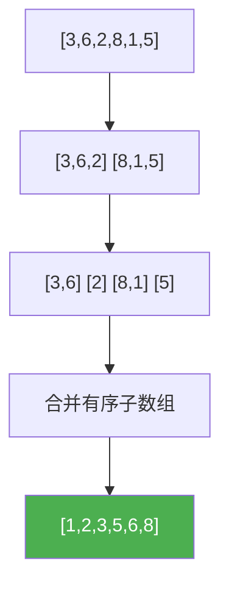

@[TOC](C语言数据结构系列：归并排序篇)

# C语言数据结构系列（二十一）：归并排序——稳定高效

> 🎯 **本篇目标**：掌握归并排序的原理与实现！

---

## 一、前言

哈喽小伙伴们！👋

今天我们来学习**归并排序（Merge Sort）**——一种**稳定**的O(nlogn)排序！

---

## 二、归并排序

### 2.1 思想

> 💡 **分治法**：分成两半排序，再合并两个有序数组

### 2.2 图解



### 2.3 代码实现

```c
void merge(int arr[], int left, int mid, int right) {
    int n1 = mid - left + 1;
    int n2 = right - mid;
    int *L = (int*)malloc(n1 * sizeof(int));
    int *R = (int*)malloc(n2 * sizeof(int));
    
    for (int i = 0; i < n1; i++) L[i] = arr[left + i];
    for (int j = 0; j < n2; j++) R[j] = arr[mid + 1 + j];
    
    int i = 0, j = 0, k = left;
    while (i < n1 && j < n2) {
        if (L[i] <= R[j])
            arr[k++] = L[i++];
        else
            arr[k++] = R[j++];
    }
    while (i < n1) arr[k++] = L[i++];
    while (j < n2) arr[k++] = R[j++];
    
    free(L);
    free(R);
}

void mergeSort(int arr[], int left, int right) {
    if (left < right) {
        int mid = left + (right - left) / 2;
        mergeSort(arr, left, mid);
        mergeSort(arr, mid + 1, right);
        merge(arr, left, mid, right);
    }
}
```

---

## 三、复杂度分析

| 情况 | 时间 | 空间 | 稳定性 |
|:----:|:----:|:----:|:----:|
| 所有 | O(nlogn) | O(n) | ✅ |

---

## 四、应用

1. **外部排序** 💾
2. **链表排序** 🔗
3. **逆序对计数** 🔢

---

## 五、下篇预告

下一篇我们将学习 **堆排序**！

---

> 💡 归并是稳定的，适合外部排序！👍
