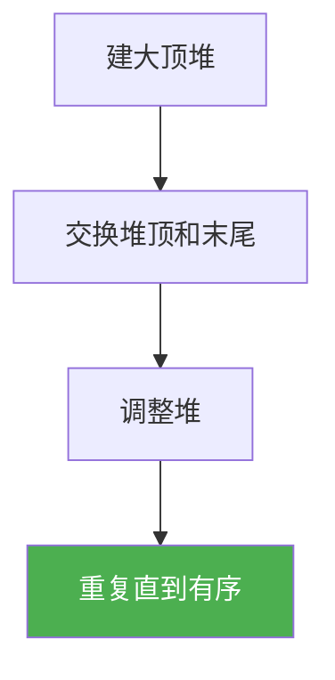

@[TOC](C语言数据结构系列：堆排序篇)

# C语言数据结构系列（二十二）：堆排序——原地排序

> 🎯 **本篇目标**：掌握堆排序的原理与实现！

---

## 一、前言

哈喽小伙伴们！👋

今天我们来学习**堆排序（Heap Sort）**——利用堆结构进行排序！

---

## 二、堆排序

### 2.1 思想

> 💡 **建大顶堆**，然后依次将堆顶（最大值）与末尾交换

### 2.2 步骤



### 2.3 代码实现

```c
void heapify(int arr[], int n, int i) {
    int largest = i;
    int left = 2 * i + 1;
    int right = 2 * i + 2;
    
    if (left < n && arr[left] > arr[largest])
        largest = left;
    if (right < n && arr[right] > arr[largest])
        largest = right;
    
    if (largest != i) {
        int temp = arr[i];
        arr[i] = arr[largest];
        arr[largest] = temp;
        heapify(arr, n, largest);
    }
}

void heapSort(int arr[], int n) {
    for (int i = n / 2 - 1; i >= 0; i--)
        heapify(arr, n, i);
    
    for (int i = n - 1; i > 0; i--) {
        int temp = arr[0];
        arr[0] = arr[i];
        arr[i] = temp;
        heapify(arr, i, 0);
    }
}
```

---

## 三、复杂度分析

| 时间 | 空间 | 稳定性 |
|:----:|:----:|:----:|
| O(nlogn) | O(1) | ❌ |

---

## 四、下篇预告

下一篇我们将学习 **非比较排序：计数、基数、桶**！

---

> 💡 堆排序是原地排序，不需要额外空间！👍
