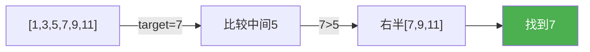

@[TOC](C语言数据结构系列：查找算法篇)

# C语言数据结构系列（二十四）：查找算法——从顺序到二分

> 🎯 **本篇目标**：掌握顺序查找、二分查找及其变体！

---

## 一、前言

哈喽小伙伴们！👋

今天我们来学习**查找算法**——从最简单的顺序查找到高效的二分查找！

---

## 二、顺序查找

### 2.1 思想

> 💡 从头到尾逐个比较

### 2.2 代码实现

```c
int sequentialSearch(int arr[], int n, int target) {
    for (int i = 0; i < n; i++) {
        if (arr[i] == target) return i;
    }
    return -1;
}
```

**时间：O(n)**

---

## 三、二分查找

### 3.1 思想

> 💡 **有序数组**中，每次排除一半

### 3.2 图解



### 3.3 代码实现

```c
int binarySearch(int arr[], int n, int target) {
    int left = 0, right = n - 1;
    
    while (left <= right) {
        int mid = left + (right - left) / 2;
        if (arr[mid] == target)
            return mid;
        else if (arr[mid] < target)
            left = mid + 1;
        else
            right = mid - 1;
    }
    
    return -1;
}
```

### 3.4 递归实现

```c
int binarySearchRecursive(int arr[], int left, int right, int target) {
    if (left > right) return -1;
    
    int mid = left + (right - left) / 2;
    if (arr[mid] == target) return mid;
    else if (arr[mid] < target)
        return binarySearchRecursive(arr, mid + 1, right, target);
    else
        return binarySearchRecursive(arr, left, mid - 1, target);
}
```

**时间：O(logn)**

---

## 四、二分查找变体

### 4.1 查找第一个等于目标的位置

```c
int searchFirst(int arr[], int n, int target) {
    int left = 0, right = n - 1, result = -1;
    while (left <= right) {
        int mid = left + (right - left) / 2;
        if (arr[mid] == target) {
            result = mid;
            right = mid - 1;  // 继续往左找
        } else if (arr[mid] < target)
            left = mid + 1;
        else
            right = mid - 1;
    }
    return result;
}
```

### 4.2 查找最后一个等于目标的位置

```c
int searchLast(int arr[], int n, int target) {
    int left = 0, right = n - 1, result = -1;
    while (left <= right) {
        int mid = left + (right - left) / 2;
        if (arr[mid] == target) {
            result = mid;
            left = mid + 1;  // 继续往右找
        } else if (arr[mid] < target)
            left = mid + 1;
        else
            right = mid - 1;
    }
    return result;
}
```

### 4.3 查找第一个大于等于目标的位置

```c
int searchLowerBound(int arr[], int n, int target) {
    int left = 0, right = n - 1;
    while (left <= right) {
        int mid = left + (right - left) / 2;
        if (arr[mid] >= target) {
            right = mid - 1;
        } else {
            left = mid + 1;
        }
    }
    return left;
}
```

---

## 五、复杂度对比

| 算法 | 时间 | 适用 |
|:----:|:----:|:----:|
| 顺序查找 | O(n) | 无序数组 |
| 二分查找 | O(logn) | 有序数组 |

---

## 六、应用

1. **数据库索引** 🗃️
2. **字典查找** 📖
3. **调试断点** 🐛

---

## 七、下篇预告

下一篇我们将学习 **哈希表——O(1)查找的秘密**！

---

> 💡 二分查找必须在有序数组上！👍
